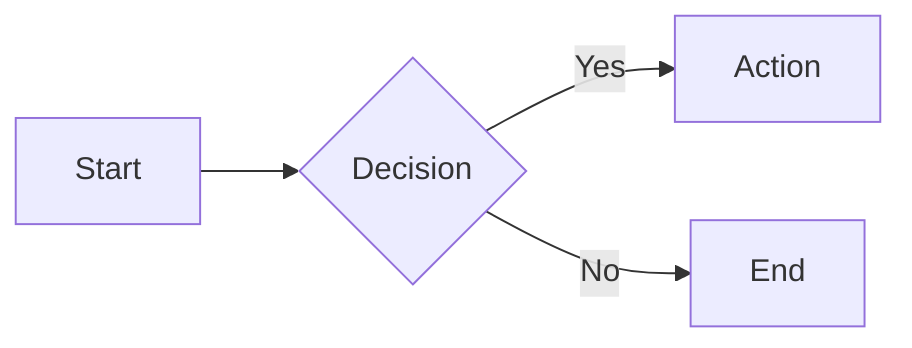

# MDX Features Reference

This document covers all available MDX components and markdown features for writing documentation.

## Table of Contents

* [Standard Markdown](#standard-markdown)
* [GitHub Flavored Markdown (GFM)](#github-flavored-markdown-gfm)
* [Headings](#headings)
* [Code Blocks](#code-blocks)
* [CodeGroup](#codegroup)
* [Callout](#callout)
* [Card](#card)
* [Tabs](#tabs)
* [Steps](#steps)
* [Accordion](#accordion)
* [Markdown (Includes)](#markdown-includes)
* [Icon](#icon)
* [Images](#images)
* [Mermaid Diagrams](#mermaid-diagrams)

***

## Standard Markdown

All standard markdown syntax is supported:

* **Bold** (`**bold**`)
* *Italic* (`_italic_`)
* `Inline code` (`` `code` ``)
* [Links](#) (`[text](url)`)
* Images (``)
* Blockquotes (`> quote`)
* Ordered and unordered lists
* Horizontal rules (`---`)

## GitHub Flavored Markdown (GFM)

The following GFM extensions are enabled via `remark-gfm`:

### Tables

```md
| Feature   | Supported |
| --------- | --------- |
| Tables    | Yes       |
| Alignment | Yes       |
```

Tables are automatically wrapped in a scrollable container for responsiveness.

### Strikethrough

```md
~~deleted text~~
```

### Task Lists

<!-- prettier-ignore -->
```md
* \[x] Completed task
* \[ ] Incomplete task
```

### Autolinks

URLs and email addresses are automatically converted to links.

***

## Headings

Headings (`h1`-`h3`) are automatically enhanced with:

* **Anchor IDs** generated from the heading text (via `github-slugger`)
* **Copy-link buttons** that appear on hover, allowing users to copy a direct link to the section

```md
# Heading 1

## Heading 2

### Heading 3
```

Headings also populate the **Table of Contents** sidebar automatically.

***

## Code Blocks

Fenced code blocks support syntax highlighting via [rehype-pretty-code](https://rehype-pretty-code.netlify.app/) (powered by Shiki) with dual light/dark themes.

````md
```javascript
const greeting = "Hello, world!";
console.log(greeting);
```
````

### Supported features

* **Language label** displayed in the code block header
* **Copy button** auto-attached to each code block
* **Line numbers** shown for non-shell languages
* **Shell prompt styling** for `sh`, `bash`, `zsh`, and `terminal` languages (displays `$` prompt, no line numbers)
* **Line highlighting** to emphasize specific lines

### Line Highlighting

Highlight specific lines or ranges by adding line numbers in curly braces after the language:

````md
```ts {1,12-13}
const x = 1;
// lines 12-13 would be highlighted
```
````

### Titles

You can add a title to a code block using a comment on the first line:

````md
```javascript title="example.js"
const x = 1;
```
````

***

## CodeGroup

Groups multiple code blocks into a tabbed interface. Also available as `CodeBlocks`.

### Usage

````md
<CodeGroup>

```javascript
console.log("JavaScript");
```

```python
print("Python")
```

```ruby
puts "Ruby"
```

</CodeGroup>
````

The tab labels are derived from the code block language. Each tab includes a copy button.

***

## Callout

Styled alert boxes for highlighting important information.

### Props

| Prop     | Type     | Default  | Description                                                              |
| -------- | -------- | -------- | ------------------------------------------------------------------------ |
| `title`  | `string` | -        | Optional title displayed in bold above the content                       |
| `icon`   | `string` | -        | Override the default icon (uses Icon component sprite IDs)               |
| `intent` | `string` | `"info"` | Visual style variant (see below)                                         |

### Intent variants

| Intent    | Default Icon | Use Case                     |
| --------- | ------------ | ---------------------------- |
| `info`    | info-circle  | General information          |
| `warning` | bell         | Cautions and warnings        |
| `success` | circle-check | Success messages             |
| `error`   | exclamation  | Error alerts                 |
| `note`    | map-pin      | Side notes                   |
| `launch`  | rocket       | New features / announcements |
| `tip`     | star         | Helpful tips                 |
| `check`   | check        | Requirements met             |

### Usage

```md
<Callout intent="info" title="Good to know">
  This is an informational callout.
</Callout>
```

### Shorthand variants

Each intent has a standalone component so you don't need to pass the `intent` prop:

```md
<Info title="Good to know">Informational content.</Info>

<Warning>Be careful with this operation.</Warning>

<Success>Operation completed successfully.</Success>

<Error>Something went wrong.</Error>

<Note>A side note for context.</Note>

<Tip>Here's a useful tip.</Tip>

<Check>All requirements met.</Check>

<Launch>New feature available!</Launch>
```

***

## Card

Flexible card component for linking to other pages or displaying grouped content.

### Props

| Prop            | Type                                | Default | Description                                  |
| --------------- | ----------------------------------- | ------- | -------------------------------------------- |
| `title`         | `string`                            | -       | Card title                                   |
| `icon`          | `string`                            | -       | Icon sprite ID displayed alongside the title |
| `href`          | `string`                            | -       | Makes the card a clickable link              |
| `iconPosition`  | `"top" \| "left"`                   | `"top"` | Position of the icon relative to content     |
| `iconSize`      | `4-24`                              | `8`     | Icon size (Tailwind spacing scale)           |
| `src`           | `string`                            | -       | Image URL for the card                       |
| `imagePosition` | `"top" \| "left" \| "right" \| "bottom"` | `"top"` | Position of the image                        |
| `imageWidth`    | `string`                            | -       | Override image width                         |
| `imageHeight`   | `string`                            | -       | Override image height                        |

### Usage

```md
<Card title="Getting Started" icon="rocket" href="/docs/getting-started">
  Learn how to set up your project.
</Card>
```

### CardGroup

Wraps multiple cards in a responsive grid layout.

| Prop   | Type            | Default | Description                  |
| ------ | --------------- | ------- | ---------------------------- |
| `cols` | `1 \| 2 \| 3 \| 4` | `2`     | Number of columns in the grid |

```md
<CardGroup cols={3}>
  <Card title="Quickstart" icon="bolt" href="/quickstart">
    Get up and running in minutes.
  </Card>
  <Card title="API Reference" icon="code" href="/api">
    Explore the full API.
  </Card>
  <Card title="Examples" icon="book-open" href="/examples">
    Browse example projects.
  </Card>
</CardGroup>
```

***

## Tabs

Tabbed content switcher for organizing related content.

### Tab Props

| Prop    | Type     | Required | Description     |
| ------- | -------- | -------- | --------------- |
| `title` | `string` | Yes      | Label for the tab button |

### Usage

````md
<Tabs>
  <Tab title="npm">
    ```bash
    npm install my-package
    ```
  </Tab>
  <Tab title="yarn">
    ```bash
    yarn add my-package
    ```
  </Tab>
  <Tab title="pnpm">
    ```bash
    pnpm add my-package
    ```
  </Tab>
</Tabs>
````

> **Note:** `Tabs`/`Tab` is for general content. Use `CodeGroup` when you only need to switch between code blocks.

***

## Steps

Numbered step-by-step instructions with a vertical connecting line.

### Step Props

| Prop    | Type     | Default | Description                                                  |
| ------- | -------- | ------- | ------------------------------------------------------------ |
| `title` | `string` | -       | Step heading (rendered as h2)                                |
| `id`    | `string` | -       | Custom anchor ID (auto-generated from title if not provided) |

Steps are automatically numbered and appear in the Table of Contents.

### Usage

`````md
<Steps>
  <Step title="Install the SDK">
    Install the package from npm:

````
```bash
npm install @alchemy/sdk
```
````

  </Step>
  <Step title="Initialize the client">
    Create a new instance:

````
```javascript
import { Alchemy } from "@alchemy/sdk";
const alchemy = new Alchemy({ apiKey: "your-api-key" });
```
````

  </Step>
  <Step title="Make your first request">
    Fetch the latest block number:

````
```javascript
const blockNumber = await alchemy.core.getBlockNumber();
console.log(blockNumber);
```
````

  </Step>
</Steps>
`````

***

## Accordion

Collapsible content sections using the HTML `<details>` element.

### Accordion Props

| Prop          | Type      | Default | Description                         |
| ------------- | --------- | ------- | ----------------------------------- |
| `title`       | `string`  | **Required** | Text displayed in the summary row |
| `defaultOpen` | `boolean` | `false` | Whether the accordion starts open  |
| `id`          | `string`  | -       | Optional anchor ID                 |

### Usage

```md
<Accordion title="How do I reset my API key?">
  Navigate to your dashboard, click **Settings**, then **API Keys**, and select **Regenerate**.
</Accordion>
```

### AccordionGroup

Wraps multiple accordions into a visually grouped container with shared borders.

```md
<AccordionGroup>
  <Accordion title="What chains are supported?">
    We support Ethereum, Polygon, Arbitrum, Optimism, and more.
  </Accordion>
  <Accordion title="Is there a free tier?">
    Yes, the free tier includes 300M compute units per month.
  </Accordion>
  <Accordion title="How do I upgrade my plan?">
    Visit the billing page in your dashboard.
  </Accordion>
</AccordionGroup>
```

***

## Markdown (Includes)

Include reusable MDX snippets from other files. Paths are resolved relative to the current file.

### Props

| Prop  | Type     | Required | Description                        |
| ----- | -------- | -------- | ---------------------------------- |
| `src` | `string` | Yes      | Relative path to the MDX file      |

### Usage

```md
<Markdown src="./shared/authentication.mdx" />
<Markdown src="../../snippets/rate-limits.mdx" />
```

> **Note:** This is a server-only component. The included file is fetched and rendered at build time.

***

## Icon

Renders an icon from the [sprite sheet](https://www.alchemy.com/docs/icons/sprites.svg). Supports FontAwesome-style names for backwards compatibility.

### Props

| Prop   | Type     | Default | Description                              |
| ------ | -------- | ------- | ---------------------------------------- |
| `icon` | `string` | **Required** | Icon sprite ID or FontAwesome name  |
| `size` | `number` | `4`     | Size in Tailwind spacing scale (4 = 16px, 8 = 32px, 12 = 48px, etc.) |

### Usage

```md
<Icon icon="rocket" size={6} />
<Icon icon="code" />
```

***

## Images

Standard markdown images are automatically optimized:

```md

```

### Automatic enhancements

* Converted to Next.js `Image` component for optimization
* Dimensions are probed and injected automatically
* First image on the page is marked as priority (eager loading)
* SVGs use native `` tags (no optimization needed)
* Lazy loaded by default

***

## Mermaid Diagrams

Create diagrams using [Mermaid](https://mermaid.js.org/) syntax in fenced code blocks.

````md

````

Mermaid diagrams are rendered server-side as SVGs. If rendering fails, a graceful fallback is shown. All standard Mermaid diagram types are supported (flowcharts, sequence diagrams, class diagrams, etc.).

***

## StickyTable

Wraps a standard markdown table with sticky column headers for large data sets. Use this when you have long tables that benefit from vertical scrolling while keeping headers visible.

### Usage

```md
<StickyTable>

| Method | Endpoint | Description | Auth Required |
| ------ | -------- | ----------- | ------------- |
| GET    | /users   | List users  | Yes           |
| POST   | /users   | Create user | Yes           |

</StickyTable>
```
