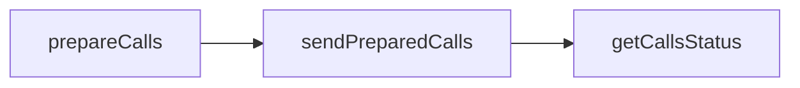

We'll demonstrate how to use the [`wallet_prepareCalls`](/docs/wallets/api/smart-wallets/wallet-api-endpoints/wallet-api-endpoints/wallet-prepare-calls), [`wallet_sendPreparedCalls`](/docs/wallets/api/smart-wallets/wallet-api-endpoints/wallet-api-endpoints/wallet-send-prepared-calls), and [`wallet_getCallsStatus`](/docs/wallets/api/smart-wallets/wallet-api-endpoints/wallet-api-endpoints/wallet-get-calls-status) endpoints.

<Info>
  For a complete working example with bash scripts using [jq](https://jqlang.org/) and [foundry](https://getfoundry.sh/) for signing, see [Send Transactions](/wallets/transactions/send-transactions).
</Info>



### 1. Prepare Calls

Use your signer address directly as the `from` field to enable [EIP-7702](/wallets/transactions/using-eip-7702) by default. The signer can be any Ethereum wallet key.

```bash
curl --request POST \
    --url https://api.g.alchemy.com/v2/API_KEY \
    --header 'accept: application/json' \
    --header 'content-type: application/json' \
    --data '
{
    "id": 1,
    "jsonrpc": "2.0",
    "method": "wallet_prepareCalls",
    "params": [
        {
            "capabilities": {
                "paymasterService": {
                    "policyId": "GAS_MANAGER_POLICY_ID"
                }
            },
            "calls": [
                {
                    "to": "0x0000000000000000000000000000000000000000"
                }
            ],
            "from": "0xSIGNER_ADDRESS",
            "chainId": "0xCHAIN_ID"
        }
    ]
}
'
```

If the account hasn't been delegated yet, the response type will be `array` containing both an EIP-7702 authorization and a user operation:

```json
{
    "type": "array",
    "data": [
        {
            "type": "eip-7702-authorization",
            "data": {...authorizationData},
            "chainId": "0xCHAIN_ID",
            "signatureRequest": {
                "type": "eth_signAuthorization",
                "rawPayload": "0xAUTH_PAYLOAD_TO_SIGN"
            }
        },
        {
            "type": "user-operation-v070",
            "data": {...useropRequest},
            "chainId": "0xCHAIN_ID",
            "signatureRequest": {
                "type": "personal_sign",
                "data": {
                    "raw": "0xHASH_TO_SIGN"
                },
                "rawPayload": "0xRAW_PAYLOAD_TO_SIGN"
            }
        }
    ]
}
```

On subsequent transactions (after the account is delegated), the response will be a single user operation:

```json
{
    "type": "user-operation-v070",
    "data": {...useropRequest},
    "chainId": "0xCHAIN_ID",
    "signatureRequest": {
        "type": "personal_sign",
        "data": {
            "raw": "0xHASH_TO_SIGN"
        },
        "rawPayload": "0xRAW_PAYLOAD_TO_SIGN"
    }
}
```

### 2. Sign the Signature Request(s)

Sign the returned signature request(s) using your signer key.

**If the account isn't delegated yet (array response):** Sign both the EIP-7702 authorization and the user operation. The authorization only needs to be signed once to delegate your account.

**Once delegated:** Sign only the user operation.

If using an Alchemy Signer, you can learn how to stamp the request on the frontend [here](/docs/reference/how-to-stamp-requests). When using the Alchemy Signer, it's easiest to sign the `signatureRequest.rawPayload` directly.

If you are using a library such as Viem that supports the `personal_sign` method, you should use that to sign the user operation hash (since the `signatureRequest.type` is `"personal_sign"`).

### 3. Send the Prepared Calls!

With the signature(s) from step 2 and the data from step 1, you're good to send the call!

**If the account isn't delegated yet (array response):**

```bash
curl --request POST \
    --url https://api.g.alchemy.com/v2/API_KEY \
    --header 'accept: application/json' \
    --header 'content-type: application/json' \
    --data '
{
    "id": 1,
    "jsonrpc": "2.0",
    "method": "wallet_sendPreparedCalls",
    "params": [
        {
            "type": "array",
            "data": [
                {
                    "type": "eip-7702-authorization",
                    "data": {...authorizationData},
                    "chainId": "0xCHAIN_ID",
                    "signature": {
                        "type": "secp256k1",
                        "data": "0xAUTH_SIGNATURE"
                    }
                },
                {
                    "type": "user-operation-v070",
                    "data": {...useropRequest},
                    "chainId": "0xCHAIN_ID",
                    "signature": {
                        "type": "secp256k1",
                        "data": "0xUSEROP_SIGNATURE"
                    }
                }
            ]
        }
    ]
}
'
```

**Once delegated:**

```bash
curl --request POST \
    --url https://api.g.alchemy.com/v2/API_KEY \
    --header 'accept: application/json' \
    --header 'content-type: application/json' \
    --data '
{
    "id": 1,
    "jsonrpc": "2.0",
    "method": "wallet_sendPreparedCalls",
    "params": [
        {
            "type": "user-operation-v070",
            "data": {...useropRequest},
            "chainId": "0xCHAIN_ID",
            "signature": {
                "type": "secp256k1",
                "data": "0xUSEROP_SIGNATURE"
            }
        }
    ]
}
'
```

This will return the call ID!

### 4. Check The Calls Status

Now you can simply call `wallet_getCallsStatus` to check the status of the calls. A “pending” state (1xx status codes) is expected for some time before the transition to “confirmed,” so this endpoint should be polled while the status is pending. If the call does not progress, refer to the [retry guide](/wallets/transactions/retry-transactions).

```bash
curl --request POST \
    --url https://api.g.alchemy.com/v2/API_KEY \
    --header 'accept: application/json' \
    --header 'content-type: application/json' \
    --data '
{
    "id": 1,
    "jsonrpc": "2.0",
    "method": "wallet_getCallsStatus",
    "params": [
        "0xCALL_ID"
    ]
}
'
```

See [here](/docs/wallets/api/smart-wallets/wallet-api-endpoints/wallet-api-endpoints/wallet-get-calls-status) for all of the possible results.
