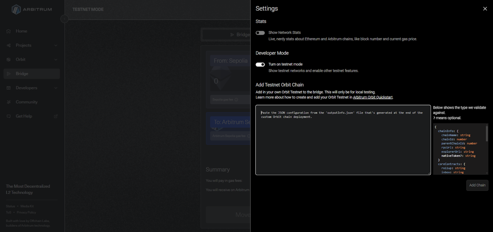
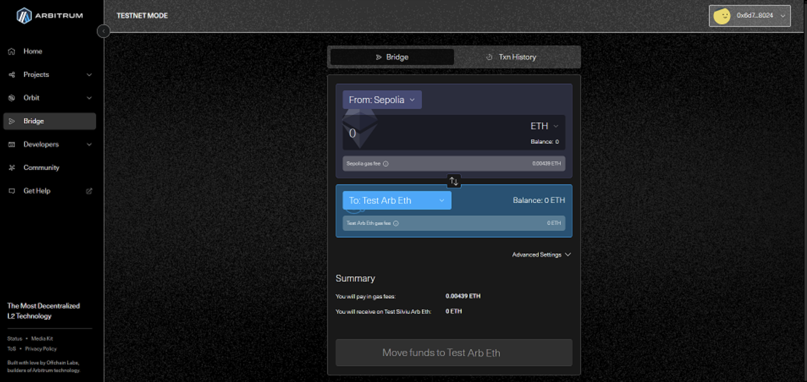

# OP Stack

To bridge funds using **OP Stack**, follow these steps:

1. **Select Sepolia Network in MetaMask**

   * Ensure that your MetaMask wallet is connected to the **Sepolia Test Network**

2. **Send Tokens to the Bridge Address**

   * Obtain the **bridge contract address** for your OP Stack devnet from the **Alchemy Rollup page**

     * Log in to your Alchemy account
     * Go to the Rollups page from the Chain section
     * Access or create your OP Stack rollup
     * Copy the Bridge Address

   * Send **ETH** or **ERC-20 tokens** from Ethereum (Sepolia) to the bridge address

***

# Arbitrum Orbit

To bridge funds using **Arbitrum Orbit**, follow these steps:

1. **Obtain the Configuration File**

   * Download the configuration file from the **Alchemy Rollup page**

     * Log in to your Alchemy account
     * Go to the Rollups page from the Chain section
     * Access or create your Arbitrum Orbit rollup
     * Click on the View Bridge Config button
     * Copy the configuration

2. **Visit the Arbitrum Bridge**

   * Navigate to the official Arbitrum bridge at [https://bridge.arbitrum.io/](https://bridge.arbitrum.io/)

3. **Connect Your Wallet**

   * Open your **MetaMask** wallet and connect it to the bridge

4. **Enable Developer Mode**

   * Go to **Settings** from the top-right corner
   * On the **Developer** section, enable **Testnet Mode**

5. **Import the Configuration File**

* Paste the configuration file details into the bridge interface
* Click **Add Chain** to register your custom rollup network

6. **Bridge Funds**

* In the **bridge interface**, select your custom rollup chain
* Move funds from **Ethereum (L1)** to your **Arbitrum Rollup (L2)**

