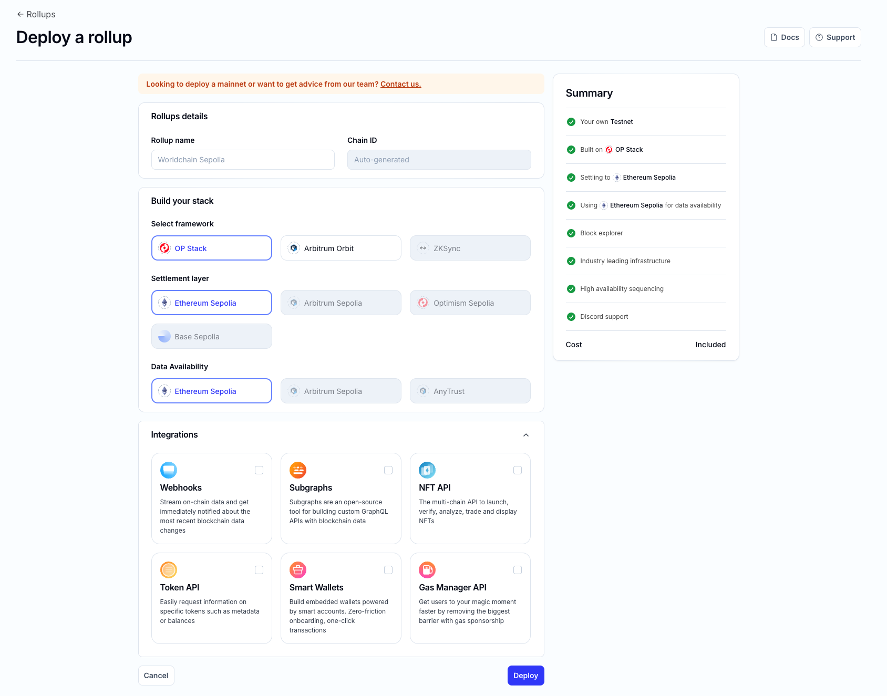

# Quickstart: Deploy a Rollup

This guide will help you deploy a testnet rollup using the Alchemy Rollups dashboard. Follow these steps to launch your own Layer-2 blockchain quickly.

## Prerequisites

* An active paid Alchemy account.

## Steps to Deploy a Testnet

1. **Open the Deployment Page:** Navigate to the Rollups section in your Alchemy dashboard and click on "Create a testnet"

2. **Rollup Name:** Enter a unique name for your rollup. This name will be used in the dashboard and as a subdomain for RPC endpoints.

3. **Framework Selection:** Choose a rollup framework from the available options:

   * Optimism OP Stack
   * Arbitrum Nitro (Orbit)
   * zkSync (ZK Stack)

4. **Settlement Layer:** Select the Layer-1 blockchain for posting data, such as Ethereum’s testnet.

5. **Data Availability:** Choose your preferred data availability option:

   * Ethereum (default)
   * External data availability

6. **Configuration:** Set basic parameters:

   * **Network Type:** Select Testnet.
   * **Chain ID:** Auto-generated for you with self-serve creation.
   * **Integrations**: Select the developer tools you want installed on your rollup.

7. **Review and Deploy:** Review your settings and click "Deploy Rollup." The system will initialize the necessary infrastructure.

8. **Deployment Complete:** Once deployment is complete, your new rollup will be visible in the dashboard with an RPC URL, Bridge UI, and Block Explorer link.

Congratulations! Your testnet rollup is now live. Next, learn how to connect to it and interact with the blockchain.
