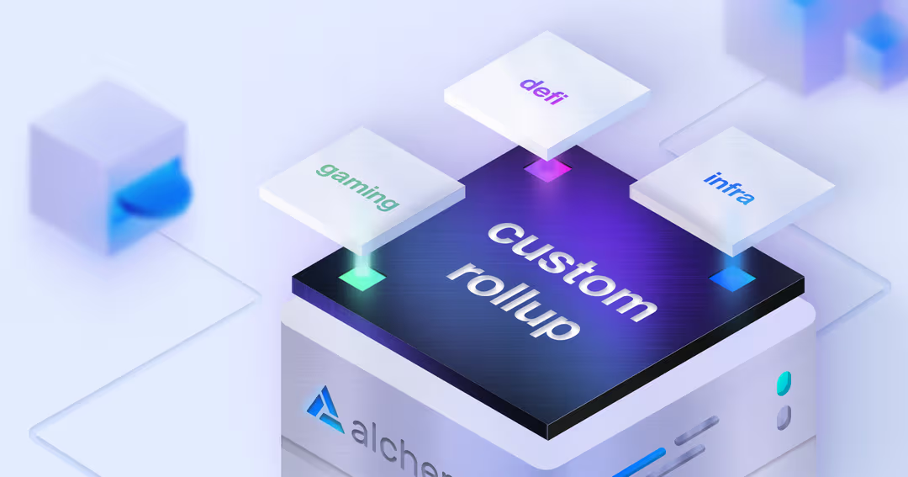

# Introduction to Alchemy Rollups

Launching a rollup helps you make more money by unlocking new revenue streams, enabling novel use cases, and providing a better user experience.

Alchemy Rollups helps you run a dedicated rollup with full control over transaction speed, cost, and functionality.

***

## Why a rollup?

### 🚄 Faster, More Reliable Transactions

* **Speed & Predictability:** With a dedicated chain, transactions are processed quickly and reliably. Unlike crowded public networks that can lead to slow confirmations, rising fees, and unpredictable processing times, your own rollup ensures a smoother experience.

### 🆕 Unlock Novel Use Cases

* **Tailored Functionality:** When you control your chain, you can customize its behavior to suit your specific needs. This flexibility enables innovative integrations—like linking on-chain identities with external verification systems—to power entirely new applications.

### 💸 Make Money

* **Revenue Streams:** Operators earn revenue from transaction fees and potential MEV opportunities. Additionally, by using a native gas token on your chain, you can create intrinsic value and boost your token’s utility.

### ✂️ Save Money

* **Cost Efficiency:** Running your own dedicated blockspace can dramatically lower gas fees. Instead of competing with high fees on popular L1s or shared L2s, you can optimize costs for both you and your users.

## Why Alchemy Rollups?

**TLDR:** Alchemy is your best partner for scaling to millions, reducing technical and financial risk through integrated developer tools and built-in distribution.

### For Everyone

* **Integrated Developer Tools:** Ship products faster with instant RPCs, APIs, and wallets. Save months of engineering time and bypass lengthy business development cycles.
* **Reliability:** Enjoy a platform with 99.99% uptime, protecting you from revenue loss and reducing engineering overhead.

### For Ecosystem Chains

* **Instant Access to Developers:** Gain immediate reach to a vast network of developers, from independent projects to major protocols, ensuring your chain is noticed from Day 1.

### For Enterprises

* **White-Glove Customization & Support:** Benefit from deep technical onboarding, customized solutions (such as alternative data availability layers or unique precompiles), and 24/7 support from our experienced engineering team.

With Alchemy Rollups, you gain a partner who not only provides the technology to launch your own chain but also helps you unlock new opportunities—whether through cost savings, new revenue models, or innovative use cases.

# Looking for an enterprise-grade chain?

Get in touch with us directly:

Email: [\[email protected\]](/cdn-cgi/l/email-protection#83e9ecede2f7ebe2edc3e2efe0ebe6eefaade0ecee) Telegram: @jkau15
