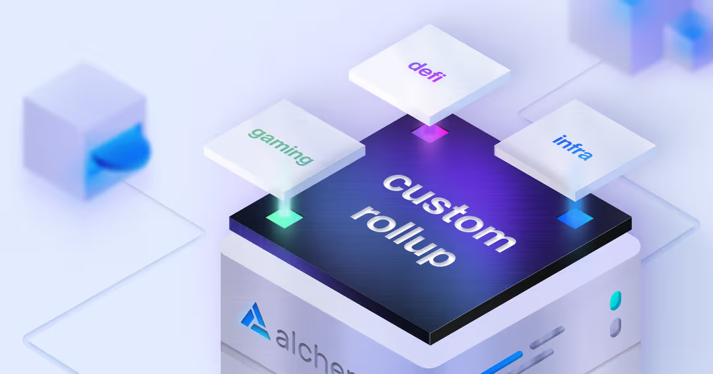

# Intro

Alchemy Rollups helps you run a dedicated rollup with full control over transaction speed, cost, and functionality. Alchemy Rollups supports both Optimistic Rollups and Zero-Knowledge (ZK) Rollups.

Before diving in, it’s important to understand what rollups are and the two primary types available:

# What is a Rollup?

A rollup is a blockchain solution that processes transactions off the main chain while using a Layer-1 blockchain for security. Instead of processing each transaction on the main chain, rollups batch transactions together and post a summary or proof to the Layer-1 network. This approach reduces fees and increases throughput while maintaining the security of the main chain.

## Optimistic vs. ZK Rollups

**Optimistic Rollups:**

* Assume transactions are valid by default.
* Use a challenge period to allow for fraud proofs in case of invalid transactions.
* Typically have a delay for finality due to the challenge period.
* Provide strong security guarantees through economic incentives.

**Zero-Knowledge (ZK) Rollups:**

* Generate a cryptographic proof for each batch of transactions.
* Allow for near-instant finality since there’s no challenge period.
* Offer even greater scalability by reducing the amount of data posted to Layer-1.
* Can be more complex to implement due to the proof generation process.

**Launching a rollup helps you make more money by unlocking new revenue streams, enabling novel use cases, and providing a better user experience.**

# Why a Rollup?

### 🚄 Faster, More Reliable Transactions

* **Speed & Predictability:** With a dedicated chain, transactions are processed quickly and reliably. Unlike crowded public networks that can lead to slow confirmations, rising fees, and unpredictable processing times, your own rollup ensures a smoother experience.

### 🆕 Unlock Novel Use Cases

* **Tailored Functionality:** When you control your chain, you can customize its behavior to suit your specific needs. This flexibility enables innovative integrations—like linking on-chain identities with external verification systems—to power entirely new applications.

### 💸 Make Money

* **Revenue Streams:** Operators earn revenue from transaction fees and potential MEV opportunities. Additionally, by using a native gas token on your chain, you can create intrinsic value and boost your token’s utility.

### ✂️ Save Money

* **Cost Efficiency:** Running your own dedicated blockspace can dramatically lower gas fees. Instead of competing with high fees on popular L1s or shared L2s, you can optimize costs for both you and your users.

## Why Alchemy Rollups?

**TLDR:** Alchemy is your best partner for scaling to millions, reducing technical and financial risk through integrated developer tools and built-in distribution.

### For Everyone

* **Integrated Developer Tools:** Ship products faster with instant RPCs, APIs, and wallets. Save months of engineering time and bypass lengthy business development cycles.
* **Reliability:** Enjoy a platform with 99.99% uptime, protecting you from revenue loss and reducing engineering overhead.

### For Ecosystem Chains

* **Instant Access to Developers:** Gain immediate reach to a vast network of developers, from independent projects to major protocols, ensuring your chain is noticed from Day 1.

### For Enterprises

* **White-Glove Customization & Support:** Benefit from deep technical onboarding, customized solutions (such as alternative data availability layers or unique precompiles), and 24/7 support from our experienced engineering team.

With Alchemy Rollups, you gain a partner who not only provides the technology to launch your own chain but also helps you unlock new opportunities—whether through cost savings, new revenue models, or innovative use cases.

# Supported Frameworks

<CardGroup cols={2}>
  <Card title="Arbitrum Orbit" icon={} href="/reference/supported-stacks">
    View Arbitrum Orbit rollup framework.
  </Card>

  <Card title="OP Stack" icon={} href="/reference/supported-stacks">
    View OP Stack rollup framework.
  </Card>

  <Card title="ZKSync Stack" icon={} href="/reference/supported-stacks">
    View ZKSync Stack rollup framework.
  </Card>
</CardGroup>

# Looking for an enterprise-grade chain?

Get in touch with us directly:

Reach out through the [Rollups Contact Page](https://www.alchemy.com/contact-sales-rollups), email Isaac at isaac@alchemy, or message him on Telegram: @pileofscraps
