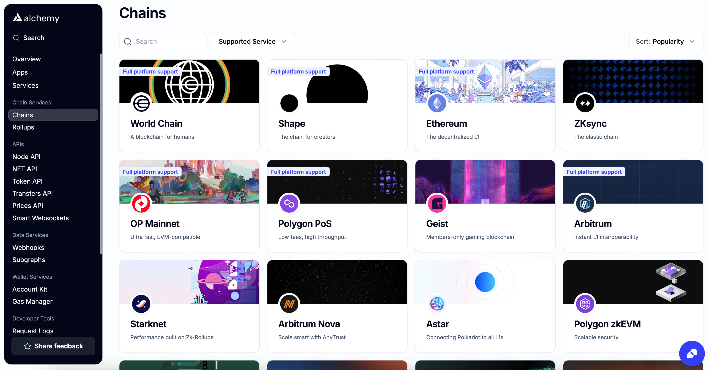

With our Simulation APIs, you can know the exact impact of a transaction ***before*** it hits the blockchain.

The Transaction Simulation APIs can help prevent unwanted hacks or theft, so you know exactly what a transaction will do by simulating it before you approve it in your wallet. This means identifying exactly what assets will be transferred, what logs will be emitted, what internal calls will be made, etc., before it even happens.

**[Asset Changes](/reference/alchemy-simulateassetchanges)** Simulates a transaction and returns a full list of asset changes.

**[Execution Simulation](/reference/alchemy-simulateexecution)** Simulates a transaction and returns decoded execution traces and decoded logs.

**[Bundle Simulation](/reference/simulation-bundle)** Simulate multiple transactions sequentially.

<Info>
  Check the [Chains](https://dashboard.alchemy.com/chains) page for details about product and chain support!

  
</Info>

For practical examples of these APIs you can check out the [Transaction Simulation examples](/reference/simulation-examples) page and for frequently asked questions you can check out the [Transaction Simulation FAQ](/reference/simulation-faqs) page.
