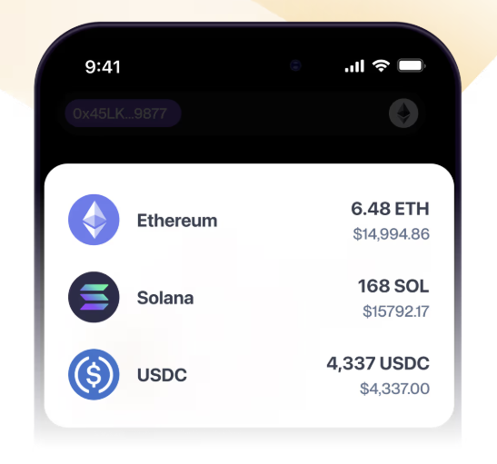
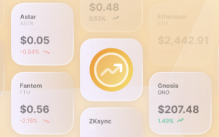
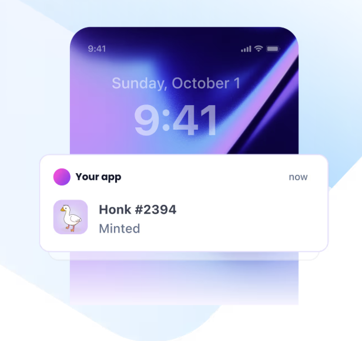
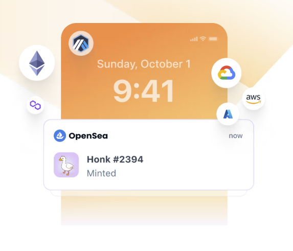
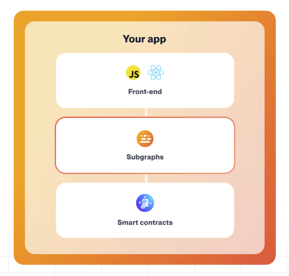
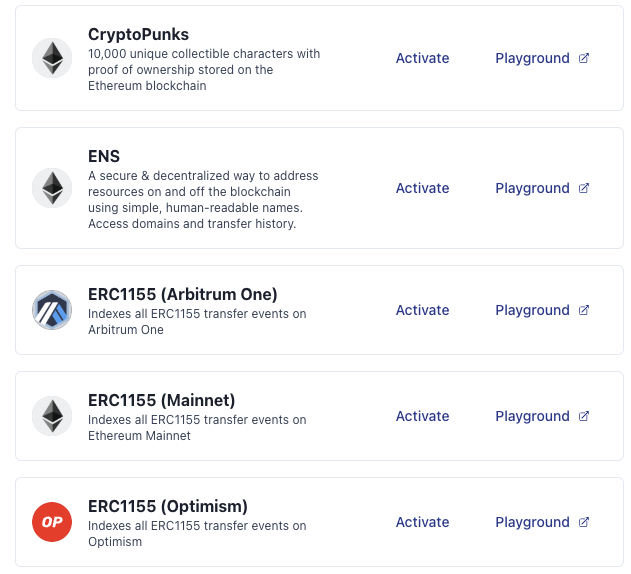

## **Pull complete token data, identify NFTs, speed up your app, and operate at scale**

Use Data APIs to easily retrieve any token data, understand and query your users' NFTs, and jumpstart your indexed data.

| [**Token APIs**](/reference/token-api-quickstart)                                                                                                | [**NFT APIs**](/reference/nft-api-quickstart)                                                                                                             | [**Prices APIs**](/reference/prices-api-quickstart)                                                                                                           |
| ------------------------------------------------------------------------------------------------------------------------------------------------ | --------------------------------------------------------------------------------------------------------------------------------------------------------- | ------------------------------------------------------------------------------------------------------------------------------------------------------------- |
|                              |                                       |                                           |
| **Ideal for:** Multi-chain token experiences, balance indexing  **How it works:** Simply call an API to return multi-chain and complete token data | **Ideal for:** NFT drops, token gating, analytics, wallets, marketplaces  **How it works:** Simply call an API to return multi-chain and complete NFT data. | **Ideal for:** Multi-chain token experiences, trading apps, wallets  **How it works:** Simply call an API to return multi-chain and complete token prices data. |

## Move faster with Alchemy Webhooks

Use Webhooks to build fast and reliable push notifications, create alerts on any on-chain activity, and save millions on excessive RPC calls.

| [**Webhooks**](/reference/notify-api-quickstart)                                                                                          | [**Custom Webhooks**](/reference/custom-webhooks-quickstart)                                                                                                         |
| ----------------------------------------------------------------------------------------------------------------------------------------- | -------------------------------------------------------------------------------------------------------------------------------------------------------------------- |
|                       |                                                  |
| **Ideal for:** Push notifications, wallets, consumer facing apps  **How it works:** Define your Webhook and start receiving relevant events | **Ideal for:** Infinite customization, specific data needs, multi-chain apps  **How it works:** Customize your event to your exact needs and immediately receive them. |

## Ship lightning fast with Subgraphs

Leverage Alchemy Subgraphs to ship features as soon as possible, simplify your infrastructure, and not worry about scaling.

| [**Subgraphs**](/reference/subgraphs-quickstart)                                                                                                                            | [**Community**](/reference/community-subgraphs)                                                                                                   |
| --------------------------------------------------------------------------------------------------------------------------------------------------------------------------- | ------------------------------------------------------------------------------------------------------------------------------------------------- |
|                                                         |                               |
| **Ideal for:** Scaling existing Subgraphs, moving quickly with Subgraph indexing  **How it works:** Define your Subgraph, let Alchemy handle the infra, and query via GraphQL | **Ideal for:** Immediate data querying, common use-cases  **How it works:** Select a community Subgraph and immediately start querying via GraphQL. |
