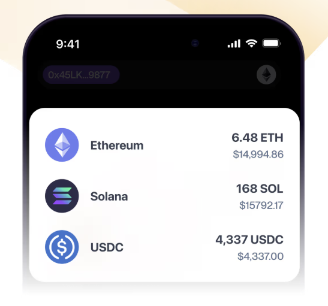
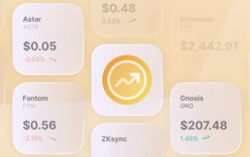
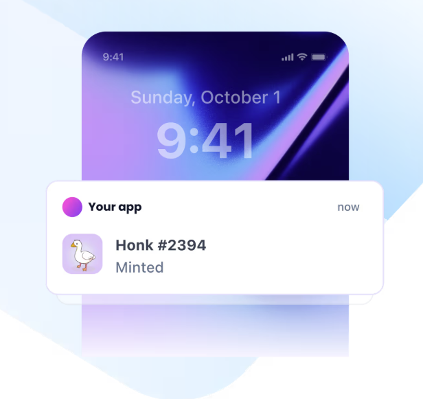
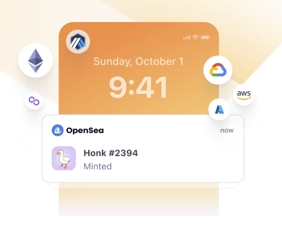

## Intro

The Data API gives you fast, reliable access to blockchain data without the need to run your own indexing infrastructure. Whether you're building wallets, NFT platforms, analytics dashboards, or DeFi apps, the Data API saves you time and engineering costs by offering pre-transformed, production-ready data.

# Components of Data API

* [NFT API](https://www.alchemy.com/docs/reference/nft-api-quickstart): query NFTs by owner, collection, floor price, and more.
* [Transfers API](https://www.alchemy.com/docs/reference/transfers-api-quickstart): fetch historical token and NFT transfers for any address without running your own indexer.
* [Token API](https://www.alchemy.com/docs/reference/token-api-quickstart): get token balances, metadata, and ownership details.
* [Webhooks](https://www.alchemy.com/docs/reference/notify-api-quickstart): subscribe to on-chain events like transfers, transactions, and balance changes.
* [Portfolio APIs](https://www.alchemy.com/docs/reference/portfolio-apis): build a complete portfolio view of a user’s wallet, across tokens and NFTs.
* [Prices API](https://www.alchemy.com/docs/reference/prices-api-quickstart): access real-time and historical prices for tokens.
* [Simulation APIs](https://www.alchemy.com/docs/reference/simulation): simulate a transaction and see its potential effects before you send it.

# When Should I Use the Data API?

Use the Data API if:

* You need pre-indexed blockchain data without running your own nodes or infrastructure.
* You want to read user portfolios, token balances, transfer history, or NFT data.
* You're sending transactions and **not** using Alchemy's Smart Wallets.
  * If you are using our wallets, check out the Wallet API, which supports:
    * `sendUserOp`
    * `estimateUserOpGas`
    * and more account abstraction features
* You want to simulate or estimate transaction outcomes before sending them.
* You need to track wallet or contract activity with push notifications via Webhooks.

# Data API Reference Tables

### Token, NFT, Prices APIs

| [**Token APIs**](/reference/token-api-quickstart)                                                                                                | [**NFT APIs**](/reference/nft-api-quickstart)                                                                                                             | [**Prices APIs**](/reference/prices-api-quickstart)                                                                                                           |
| ------------------------------------------------------------------------------------------------------------------------------------------------ | --------------------------------------------------------------------------------------------------------------------------------------------------------- | ------------------------------------------------------------------------------------------------------------------------------------------------------------- |
|                              |                                       |                                           |
| **Ideal for:** Multi-chain token experiences, balance indexing  **How it works:** Simply call an API to return multi-chain and complete token data | **Ideal for:** NFT drops, token gating, analytics, wallets, marketplaces  **How it works:** Simply call an API to return multi-chain and complete NFT data. | **Ideal for:** Multi-chain token experiences, trading apps, wallets  **How it works:** Simply call an API to return multi-chain and complete token prices data. |

### Webhooks

| [**Webhooks**](/reference/notify-api-quickstart)                                                                                          | [**Custom Webhooks**](/reference/custom-webhooks-quickstart)                                                                                                         |
| ----------------------------------------------------------------------------------------------------------------------------------------- | -------------------------------------------------------------------------------------------------------------------------------------------------------------------- |
|                       |                                                  |
| **Ideal for:** Push notifications, wallets, consumer facing apps  **How it works:** Define your Webhook and start receiving relevant events | **Ideal for:** Infinite customization, specific data needs, multi-chain apps  **How it works:** Customize your event to your exact needs and immediately receive them. |

# Data API Use Cases

### 1. Developer Tooling & Debugging

Perfect for advanced dev environments, simulation dashboards and infra teams

* Use endpoints like:
  * `debug_traceTransaction`
  * `debug_getRawTrace`

### 2. Help Users *Write* Transactions

Ideal for apps that generate transactions on behalf of users

#### Common Use Cases

* ERC-20 swaps
* NFT purchases and listings
* Wallets that send tokens or interact with contracts
* Portfolio apps that need to simulate or batch transactions

### 3. Help Users *Read* Transactions

#### Common Use Cases

* Wallets and portfolio trackers
* Token/NFT ownership queries
* Historical transfers and analytics dashboards
* Price feeds and on-chain trends
* Pre-indexed data to power all your frontend and backend logic.
* Use endpoints like:
  * `getNftsForOwner` - Retrieves all NFTs currently owned by a specified address.
  * `alchemy_getTokenBalances` - Returns ERC-20 token balances for a given address.
  * `alchemy_getAssetTransfers` - Easily fetch historical transactions for any address across Ethereum and supported L2s including Polygon, Arbitrum, and Optimism.

# Summary

The Data API is specifically meant to do the heavy lifting so that you can focus on your product needs.

We are not just the data provider, but also the infra layer behind the biggest names in web3. Alchemy is set apart by:

* **Battle-tested scale**: powering millions of wallets, swaps, and NFT marketplaces — from Fortune 500s to weekend and hackathon builders.
* **Multi-chain support**: Ethereum, Base, Polygon, Arbitrum, Optimism, and dozens of other chains supported out of the box.
