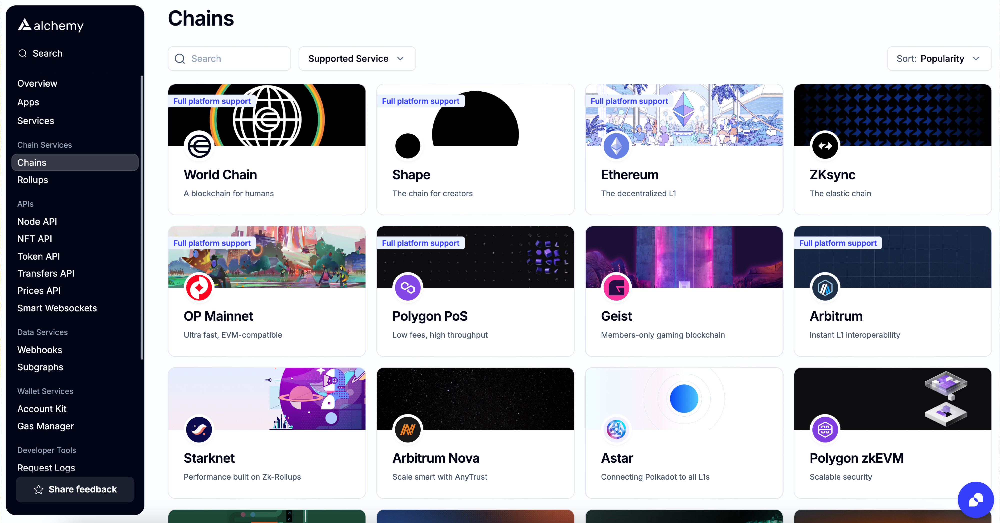

<Info>
  Check the [Chains](https://dashboard.alchemy.com/chains) page for details about product and chain support!

  
</Info>

# NFT Ownership Endpoints

| **Endpoint**                                                   | **What to use it for**                                                                               |
| -------------------------------------------------------------- | ---------------------------------------------------------------------------------------------------- |
| [getNFTsForOwner](/reference/getnftsforowner-v3)               | Retrieve the NFTs owned by a wallet address                                                          |
| [getOwnersForNFT](/reference/getownersfornft-v3)               | Retrieve the owners of a given token                                                                 |
| [getOwnersForContract](/reference/getownersforcontract-v3)     | Retrieve all the owners for a given NFT contract, including snapshotting owners at any block number. |
| [isHolderOfContract](/reference/isholderofcontract-v3)         | Check whether a given wallet owns any NFT in a collection                                            |
| [getContractsForOwner](/reference/getcontractsforowner-v3)     | Retrieve the list of NFT contracts from which a wallet address owns one or more tokens.              |
| [getCollectionsForOwner](/reference/getcollectionsforowner-v3) | Gets all NFT collections held by an owner address.                                                   |
| [NFT Activity Webhook](/reference/nft-activity-webhook)        | Receiving real-time updates for NFT Transfers and NFT mints                                          |

# NFT Metadata Endpoints

| **Endpoint**                                                            | **What to use it for**                                                                    |
| ----------------------------------------------------------------------- | ----------------------------------------------------------------------------------------- |
| [getNFTsForContract](/reference/getnftsforcontract-v3)                  | Retrieve all the NFTs for a given contract or collection                                  |
| [getNFTMetadata](/reference/getnftmetadata-v3)                          | Retrieve the metadata associated with a given NFT i.e. a specific tokenId                 |
| [getNFTMetadataBatch](/reference/getnftmetadatabatch-v3)                | Retrieve the metadata associated with several NFTs across collections in a single request |
| [getContractMetadata](/reference/getcontractmetadata-v3)                | Retrieve the metadata associated with a given contract or collection                      |
| [getContractMetadataBatch](/reference/getcontractmetadatabatch-v3)      | Retrieve contract metadata for several different contracts in a single request            |
| [computeRarity](/reference/computerarity-v3)                            | Compute the rarity of each attribute of an NFT.                                           |
| [invalidateContract](/reference/invalidatecontract-v3)                  | Triggers metadata refresh for an NFT collection/refreshes stale metadata after a reveal   |
| [refreshNftMetadata](/reference/refreshnftmetadata-v3)                  | Submit a request that Alchemy refresh the cached NFT metadata for a particular token.     |
| [summarizeNFTAttributes](/reference/summarizenftattributes-v3)          | Generate a summary of attribute prevalence for an NFT collection.                         |
| [searchContractMetadata](/reference/searchcontractmetadata)             | Search the metadata across contracts for specific keywords                                |
| [NFT Metadata Updates Webhook](/reference/nft-metadata-updates-webhook) | Receiving real-time updates for NFT metadata changes                                      |

# NFT Spam Endpoints

| **Endpoint**                                       | **What to use it for**                                       |
| -------------------------------------------------- | ------------------------------------------------------------ |
| [getSpamContracts](/reference/getspamcontracts-v3) | Retrieve a list of contracts marked as spam                  |
| [isSpamContract](/reference/isspamcontract-v3)     | Returns whether a specific contract is marked as spam or not |
| [isAirdropNFT](/reference/isairdropnft-v3)         | Returns whether a token is marked as an airdrop or not       |
| [reportSpam](/reference/reportspam-v3)             | Report a contract if you think its spam                      |

# NFT Sales Endpoints

| **Endpoint**                                 | **What to use it for**                                      |
| -------------------------------------------- | ----------------------------------------------------------- |
| [getFloorPrice](/reference/getfloorprice-v3) | Retrieve the floor price of a NFT collection by marketplace |
| [getNFTSales](/reference/getnftsales-v3)     | Retrieve NFT sales data across marketplaces                 |
