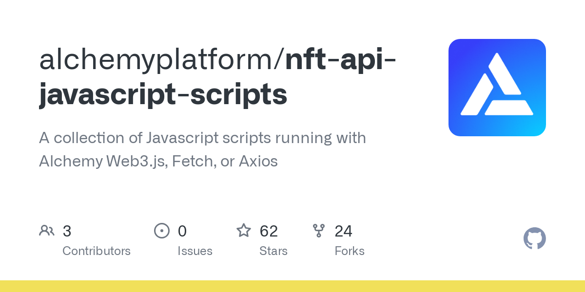

## What can I make with the NFT API?

Using the Alchemy NFT API lets you fetch and display NFTs for your users, making it easy to build all kinds of NFT projects. 

Tell us on [Twitter](https://twitter.com/Alchemy) what you're trying to build!

## What do NFT API requests look like?

We've compiled some super easy to use, copy-and-paste code snippets 😇

You can check out the rest of our docs for more in-depth documentation about our endpoints, but for a quick walkthrough with some sample code ready to run, start with this GitHub repository:

## What types of NFTs are supported?

All NFTs made with the ERC721 and ERC1155 standards are supported by the NFT API. At the moment, we support a select number of tokens like CryptoPunks and CryptoKitties that pre-date the existence of standardized NFT contracts.

Alchemy is actively working on adding support for as many blockchains / NFT standards as we can. If you find that NFTs are missing in wallets you are calling, please provide details about the missing NFT over email: support@alchemy.com

## How does Alchemy determine NFT Standard i.e. if a collection is `ERC721` or `ERC1155` ?

First, we collect the following data (each of which is an eth\_call):

* Does the contract have any code associated with it, i.e. is it even a contract at all?
* Does the contract support the `erc721` interface?
* Does the contract support the `erc1155` interface?
* Does the contract have any `erc721` transfers?
* Does the contract have any `erc1155` transfers?

After we've collected the data, we have some simple code to determine token standard

1. If a contract looks like it supports both the `erc721` and `erc1155` standards, we return a token type of `erc721`
2. We first query `supportsInterface` and then query `hasTransfers`. The standards are pretty clear that the contract should return `true` for a `supportsInterface` call, so we look at that first.
3. Finally, we have two token types: `NotAContract` and `NoSupportedNFTStandard`. These token types communicate that we are, in fact, aware of the contract and we are telling you that it is not an NFT contract.

## How does NFT Metadata Work?

The primary object within the Alchemy NFT API is the **NFT asset**, which is an on-chain item that lives on the blockchain. Within each NFT, there can be many different fields that describe its on-presence.

### General Metadata Structure

|                    |                                                                                                                                                                                                                                                                   |
| ------------------ | ----------------------------------------------------------------------------------------------------------------------------------------------------------------------------------------------------------------------------------------------------------------- |
| `image`            | A URL to the NFT asset image. Can be standard URLs pointing to images on conventional servers, [IPFS](https://github.com/ipfs/is-ipfs), or [Arweave](https://www.arweave.org/). Most types of images (SVGs, PNGs, JPEGs, etc.) are supported by NFT marketplaces. |
| `external_url`     | The image URL that appears alongside the asset image on NFT platforms. It tends to be the full-size, highest resolution media file.                                                                                                                               |
| `background_color` | Background color of the NFT item. Usually must be defined as a six-character hexadecimal.                                                                                                                                                                         |
| `name`             | Name of the NFT asset.                                                                                                                                                                                                                                            |
| `description`      | A human-readable description of the NFT asset. (Markdown is supported/rendered on OpenSea and other NFT platforms)                                                                                                                                                |
| `attributes`       | The traits/attributes/characteristics for each NFT asset.                                                                                                                                                                                                         |

<Info>
  Not all metadata fields may be filled out by the NFT creator. NFTs can be published on-chain without these fields and still conform to the `ERC721/ERC1155` standards.
</Info>

## What are Gateway vs. Raw URIs?

Gateways are an important part of NFT infrastructure. Behind the scenes, they allow users to access IPFS content without running an IPFS node. With a gateway provider, a third-party service downloads data off of IPFS nodes and then serves it whenever requested.

NFT creators/developers can also "pin" their content, effectively caching and storing it on gateway nodes/servers. This ensures that the content is always available online.

While NFT gateway and raw URIs tend to be pointed at the same links, gateway URIs generally offer better performance.

## What is the difference between `getNFTsForOwner` & `getNFTMetadata`?

`getNFTsForOwner` is most commonly used when querying all NFTs owned by an address. By default, it will return both NFTs and any associated metadata per asset in the response. Common use cases include dashboards/wallets for viewing NFT assets held by a particular address.

`getNFTMetadata` is more specific and is used for querying the metadata of a single NFT. Common use cases include NFT rarity tools and NFT searching applications.

## How are NFTs Classified as "Spam"?

Given a contract address, we look at a few things:

1. If this contract is ERC721, does this contract egregiously break the ERC721 standard? i.e., Does it have a lot of duplicate tokens.
2. If this contract is ERC721, does it have any transfer during which it broke the ERC721 standard? i.e. It transferred a token to more than one recipient.
3. Does this contract mint tokens mostly to honeypots? Honeypots are popular addresses like `vitalik.eth`
4. Does this contract egregiously lie about its own total supply? i.e. running `totalSupply()` on the contract is vastly different from the empirical number of tokens in circulation.

If any of these are satisfied, we will mark an NFT as spam.

## How can I understand why a particular NFT collection is marked as "Spam"?

The response object of Alchemy's `getNFTs` method contains a field called `classifications` inside `spamInfo`. This field is a list of tags, each of which map to a reason why the NFT was considered spam.

The tags are one of the below :-

1. **Erc721TooManyOwners**: A single token in the ERC721 collection has been transferred to multiple owners indicating fraudulent transfers
2. **Erc721TooManyTokens**: This collection has a lot of duplicate tokens indicating spammy behaviour
3. **Erc721DishonestTotalSupply** : The contract lies about its own token supply. Running `totalSupply()` on the contract is vastly different from the empirical number of tokens in circulation.
4. **MostlyHoneyPotOwners** : Most or all of the owners of the NFT collection are Honeypots i.e. popular addresses like `vitalik.eth`. So these are probably unwarranted airdrops.
5. **OwnedByMostHoneyPots** : A significant chunk of the usual Honeypot addresses own this collection. Again signifying unwarranted airdrops.

## How often is the floor price updated for `getFloorPrice`?

Floor price is queried per collection at request time and cached for 5 minutes. After that the floor price is refreshed by a best-effort fetch from the marketplace. The `retrievedAt` field is the timestamp of when the collection floor price was last updated for a marketplace.

## Why does the `getFloorPrice` endpoint return slightly older floor price?

The cache for the getFloorPrice function is only refreshed every 15 mins. So if your transaction has happened in the last 15 mins, you might want to wait to get the data.

# NFT Images and Media FAQ

## Why does Alchemy Cache NFT Media?

While NFT media is traditionally served from IPFS/third-party servers, developers often face slow loading times and timeout errors when using these endpoints. Alchemy solves this problem by caching NFT images and serving up NFT URLs from our own cache.

## How do I use Alchemy-hosted NFT media?

Where available, Alchemy will replace the default `gateway` field of the NFT `media` object with the Alchemy NFT-CDN URL.

Alchemy-hosted NFT Asset

Third-party hosted NFT Asset

Here's an example of a BAYC NFT asset cached by Alchemy: [https://nft-cdn.alchemy.com/eth-mainnet/d9d674adddb2da8fcbcdb0230ca1da3d](https://nft-cdn.alchemy.com/eth-mainnet/d9d674adddb2da8fcbcdb0230ca1da3d)

## Why did my request not return a cached media url?

We're actively working on expanding coverage of Alchemy-hosted NFT endpoints. Feel free to reach out to us over email: support@alchemy.com

## Which media URL should I use to get the NFT image?

When displaying the media associated with an NFT, it is recommended to use the `media.gateway` URL as the preferred media URL. If this URL is not available, fall back to `media.raw`. If neither is available, use `metadata.image`.

## How does image resizing work?

Currently, NFT assets are now stored on Alchemy's cloud/CDN (nft-cdn.alchemy.com). We only use Cloudinary for transformations (like resizing, image format conversion, etc.).

Since we automatically generate thumbnails for a cached asset in the payload response, we recommend users use that.

However, we still enable resizing, but not by default. For example, if you take a BAYC stored on our CDN [https://nft-cdn.alchemy.com/eth-mainnet/d9d674adddb2da8fcbcdb0230ca1da3d](https://nft-cdn.alchemy.com/eth-mainnet/d9d674adddb2da8fcbcdb0230ca1da3d).

**Base Cloudinary URL:** The thumbnail will be located at a corresponding Cloudinary URL with the same hash: [https://res.cloudinary.com/alchemyapi/image/upload/thumbnail/eth-mainnet/d9d674adddb2da8fcbcdb0230ca1da3d](https://res.cloudinary.com/alchemyapi/image/upload/thumbnail/eth-mainnet/d9d674adddb2da8fcbcdb0230ca1da3d). Developers can then request resized images for thumbnails, smartphones, tablets, and/or laptop viewing, you can manipulate the URL to include height/width like before:

**Base Cloudinary URL with Width & Height Values:** [https://res.cloudinary.com/alchemyapi/image/upload/w\_400,h\_400/thumbnail/eth-mainnet/d9d674adddb2da8fcbcdb0230ca1da3d](https://res.cloudinary.com/alchemyapi/image/upload/w_400,h_400/thumbnail/eth-mainnet/d9d674adddb2da8fcbcdb0230ca1da3d)

Note that this resizes the thumbnail version.

<Info>
  Developers can use any combination of width and height pixel values to create the desired aspect ratio for visual displays.
</Info>

Here's an example of a resized BAYC NFT asset cached by Alchemy: [https://res.cloudinary.com/alchemyapi/image/upload/w\_400,h\_400/thumbnail/eth-mainnet/d9d674adddb2da8fcbcdb0230ca1da3d](https://res.cloudinary.com/alchemyapi/image/upload/w_400,h_400/thumbnail/eth-mainnet/d9d674adddb2da8fcbcdb0230ca1da3d)

## How can I get PNG Images instead of SVG when using Alchemy's APIs?

By default Alchemy API returns the same image format as is in the metadata. Sometimes that means SVG images. In case you want to obtain the PNG format for those images instead, you can replace the string `/thumbnail` with `/convert-png` in the thumbnail URL value.

Example: If the thumbnail URL is `https://res.cloudinary.com/alchemyapi/image/upload/thumbnail/eth-mainnet/<hash>`, you should replace it with `https://res.cloudinary.com/alchemyapi/image/upload/convert-png/eth-mainnet/<hash>` to get the PNG image

## How can I resize a thumbnail and maintain the original resolution and aspect ratio?

In case you want to resize the media, you can make alterations to the original thumbnail URL or image URL to get the new URL that will return you a resized thumbnail with maintained aspect ratio.

Example: If the thumbnail URL is `https://res.cloudinary.com/alchemyapi/image/upload/thumbnail/eth-mainnet/<hash>`, you should replace it with `https://res.cloudinary.com/alchemyapi/image/upload/w_256/scaled/eth-mainnet/<hash>` to get the resized image with width 256 and same aspect ratio

# Handling NFT API Errors

While we work to ensure that every NFT's metadata is returned when requested from the API, there are various reasons why we may not able to fulfill your request.

<Info>
  If present, errors in metadata fulfillment will appear in the `error` field of the response payload.
</Info>

The following is a list of errors which are "retryable" — requests that receive these errors have a strong chance of succeeding on a repeated attempt:

* Token uri responded with a non 200 response code
* Throttled token uri
* IPFS gateway timed out
* Centralized gateway timed out, try again with a higher tokenUri timeout
* ArWeave gateway timed out
* Internal service

Below are more detailed breakdowns of what many of our errors mean and how to approach them.

## Token does not exist

> [Composer Example](https://eth-mainnet.g.alchemy.com/demo/v1/getNFTMetadata?contractAddress=0x60e4d786628fea6478f785a6d7e704777c86a7c6\&tokenId=2079999) Contract Address = 0x60e4d786628fea6478f785a6d7e704777c86a7c6 Token ID = 2079999

### Why?

In order to fetch the metadata for a given NFT, we call one of two potential methods on the contract with the token ID as the input. For ERC721 contracts, we call the `tokenURI` method. For ERC1155 contracts, we call `uri`. These two methods take in a token ID and return a uri which points to the metadata for that token ID.

If we pass a token ID into the method that the contract does not recognize, we will get one of several errors that each mean that the token does not exist. Essentially, the contract does not recognize the token ID that you provided.

[See the specific error for the example above via Etherscan's contract interface.](https://etherscan.io/address/0x60e4d786628fea6478f785a6d7e704777c86a7c6#readContract)

The contract throws an exception on etherscan

### Next Steps

More often than not, a contract will return a "token does not exist" error when the token is *not yet minted*. It's important to note that the token ID may, however, exist at a later date once it is minted. If you are confident that the token ID you provided *should* exist, you can retry your query at a later date. Once the token has been minted and recognized by our service, your request may succeed. Note that some contracts do return un-minted tokens, so this error message is not to be used as an indicator for whether a token has been minted yet.

The second most common reason for a "token does not exist" error is that the token truly does not exist! For older contracts that have been completely minted, this error should be trusted. Repeated attempts at finding metadata will fail simply because it does not exist!

## Malformed token URI

> [Composer Example](https://eth-mainnet.g.alchemy.com/demo/v1/getNFTMetadata?contractAddress=0xbfde6246df72d3ca86419628cac46a9d2b60393c\&tokenId=14506)
>
> Contract Address: 0xbfde6246df72d3ca86419628cac46a9d2b60393c Token ID: 14506

### Why?

Once we know where an NFT's metadata is stored (by calling `tokenURI` or `uri` on the contract as described above), we visit the resulting website in order to access the metadata. However, if the website that is returned by `tokenURI` or `uri` is malformed, then we cannot visit it and return this error instead. By "malformed" we mean any website that cannot be visited. In the example above (click on it to see) you can see that the `tokenUri.raw` field is an empty string. That is because the `tokenURI` method of that contract returned an empty string instead of a valid website.

You can see the empty response in etherscan's contract interface here: [https://etherscan.io/address/0xbfde6246df72d3ca86419628cac46a9d2b60393c#readContract](https://etherscan.io/address/0xbfde6246df72d3ca86419628cac46a9d2b60393c#readContract)

The contract returns a malformed URI on etherscan

### Next Steps

Unfortunately, there isn't much you can do here. If you are the project owner or you happen to know a special URI that Alchemy should return for a contract that is *not* included in the `tokenURI` or `uri` methods, then let us know!

## Failed to get token uri

> [Composer Example](https://eth-mainnet.g.alchemy.com/demo/v1/getNFTMetadata?contractAddress=0xffdf17652cca46eb98a214cb3e413c8661241e49\&tokenId=7818) Contract Address: 0xffdf17652cca46eb98a214cb3e413c8661241e49
>
> Token ID: 7818

### Why?

In the "token does not exist" section we talked about how a contract can throw an exception when we ask for the `tokenURI`. If the exception indicates that the token does not exist, then we return the "token does not exist" error. If the exception is *any other type* then we return the generic "Failed to get token uri" error.

You can see the specific error for the example above in etherscan's contract interface here: [https://etherscan.io/address/0xffdf17652cca46eb98a214cb3e413c8661241e49#readContract](https://etherscan.io/address/0xffdf17652cca46eb98a214cb3e413c8661241e49#readContract)

The contract throws an exception on etherscan

### Next Steps

Unfortunately, there isn't much you can do if the contract doesn't properly return a token URI. It is *possible* that there was a transient error running an eth\_call on our nodes, but it's pretty unlikely. Feel free to retry the request!

## Token URI responded with a non-200 response code

> [Composer Example](https://eth-mainnet.g.alchemy.com/demo/v1/getNFTMetadata?contractAddress=0x909899c5dbb5002610dd8543b6f638be56e3b17e\&tokenId=955) Contract Address: 0x909899c5dbb5002610dd8543b6f638be56e3b17e
>
> Token ID: 955

**Why?**

In the section above we talked about how we get the URI where the NFT metadata lives. Once we have the URI, we then attempt to visit it in order to access the metadata. If the URI responds with anything other than a `2xx` response code, like for instance a 502 Bad Gateway (the [PlasmaBear](https://plasmabears.com/api/nft/getMeta/955) contract above is an example) then we return this error.

### Next Steps

In this case, it is *possible* that retrying the request can succeed. If the contract's metadata website is down for some transient reason then a retry could work. A more common case is that the website may be rate-limiting Alchemy servers and returning `4xx`. We are working on infrastructure to reduce the occurrence of this error. In the meantime, we suggest retries with a reasonable backoff strategy.

## Throttled token URI

### Why?

If a token URI containing metadata responds to our retrieval attempts with a "429 Too Many Requests," the site is informing us that we have requested metadata too often. When this happens, we will not visit the website again in order to release the "rate limit" that they have put on us. During this "waiting period," requesting NFT metadata for that same asset requires hitting that website and, therefore, we will temporarily block the request.

### Next Steps

In this case, you should retry your request after a variable number of seconds. (We suggest waiting at least 10 seconds) If you continue to be throttled, increase the waiting period a bit longer after each retry.

## Contract does not have any code

**Why?**

Not all addresses are token contracts! If you send us an address for which there is no contract code then we return this error. In order to determine if the address is a contract, we call `eth_getCode` on the address.

**Next steps**

You should not retry this request. Perhaps you are accessing the contract on the wrong network. For instance, you might want to find the contract on Polygon rather than Ethereum.

## Contract returned a broken token URI, do not retry

### Why?

This occurs when the `tokenUri` associated with the NFT does not respond to the web request at the time the request was made. This can happen for many reasons including the url not existing, being deprecated, or lacking DNS set up.

This can also happen if the content length of the response is larger than 30 000 bytes.

### Next steps

There is a chance that the URL gets fixed, in which case retrying the request will return the updated `tokenUri` if the URL has been updated in time. Otherwise, the URL may be permanently dead.

## Bad Token URI

### Why?

This error occurs when Alchemy has tried to fetch data from a `tokenUri` multiple times but the fetch query always either times out or returns unrecoverable errors repeatedly. This can happen due to multiple reasons including the server being unreachable or lacking DNS set up.

### Next steps

This is often an issue with the NFT project itself and it may be worth checking if the corresponding NFT project is still alive or dead. In case it is still alive, we recommend you report the issue to the NFT project and ask them to update the `tokenUri` returned by their smart contract.
