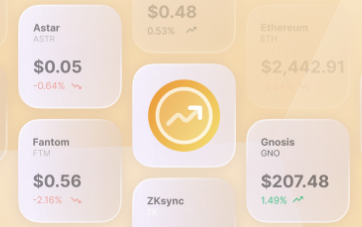

Portfolio APIs include *everything* you need to build a view of a user's assets: fungibles, NFTs, and their transactions.

## **Why Portfolio APIs?**

* ⛓️ **Multi-Chain**: All Portfolio APIs are multi-chain - get all of the data you need in a single API request, instead of having to parallelize dozens of calls across different networks.
* 💪 **Powerful**: Use powerful APIs that allow you to query for the metadata that you need (e.g. cached images, token metadata, prices) within the same API call.
* 📈**Constantly Improving**: These APIs are continuously improving, based on customer feedback.
* 🪨 **Long Term Partners**: We have 7+ years of experience supporting the largest customers that are onchain and will be around to support you for the long term.
* ⛰️**Scalable**: These APIs power some of the biggest Wallets in the space - rest easy knowing that we can scale with you.

| [**Get Tokens By Wallet**](/reference/get-tokens-by-address)                                                                              | [**NFTs By Wallet**](/reference/get-nfts-by-address)                                                                                                      | [Transaction History](/reference/get-transaction-history-by-address)                                                                        |
| ----------------------------------------------------------------------------------------------------------------------------------------- | --------------------------------------------------------------------------------------------------------------------------------------------------------- | ------------------------------------------------------------------------------------------------------------------------------------------- |
|                       |                                       |                         |
| **Ideal for:** Multi-chain token experiences, balance indexing**How it works:** Simply call an API to get balances, metadata, and prices. | **Ideal for:** NFT drops, token gating, analytics, wallets, marketplaces**How it works:** Simply call an API to return multi-chain and complete NFT data. | **Ideal for:** Wallets**How it works:** Simply call an API to return get all transactions across different networks for a set of addresses. |

## Feedback?

Get in touch with us directly:

**Email**: data-services-product@alchemy.com
