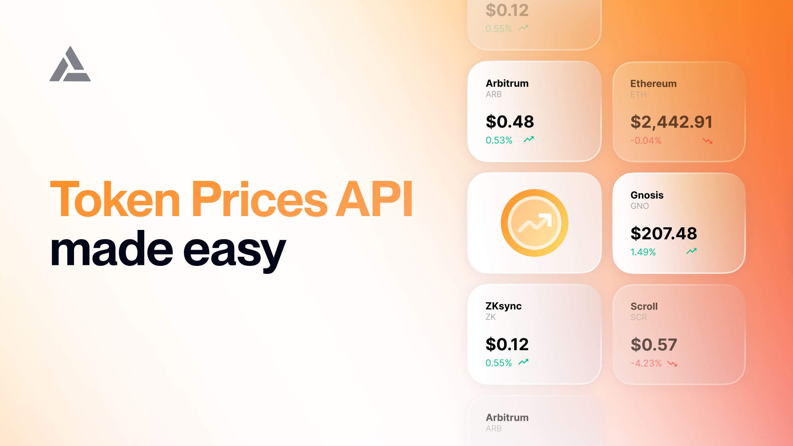

This guide will help you fetch token prices via the Prices API.

Whether you're building a DeFi protocol, portfolio tracker, or analytics tool, the Prices API provides simple endpoints for current and historical prices.

***

# Endpoints

The Prices API includes the following REST endpoints:

| **Endpoint**                                                                     | **How It Works**                                                                          | **When to Use**                                                                                       |
| -------------------------------------------------------------------------------- | ----------------------------------------------------------------------------------------- | ----------------------------------------------------------------------------------------------------- |
| [Token Prices By Symbol](/reference/get-token-prices-by-symbol)                  | Combines prices from centralized (CEX) and decentralized (DEX) exchanges for each symbol. | Use this when you need a current price overview of a token across all supported chains and exchanges. |
| [Token Prices By Address](/reference/get-token-prices-by-address)                | Combines prices from DEXes for each contract address and network.                         | Use this when you need the current price of a specific token on a particular blockchain network.      |
| [Historical Prices By Symbol Or Address](/reference/get-historical-token-prices) | Fetches past price data by symbol or address.                                             | Use this when you require historical price data for creating charts or performing analysis.           |

***

# Getting Started

## Via Alchemy SDK

The [Alchemy SDK](https://github.com/alchemyplatform/alchemy-sdk-js) provides a convenient and fully featured way to interact with Alchemy’s APIs, including the Prices API.

### Installation

Install the `alchemy-sdk` package using `npm` or `yarn`:

<CodeGroup>
  ```shell npm
  npm install alchemy-sdk
  ```

  ```shell yarn
  yarn add alchemy-sdk
  ```
</CodeGroup>

### Usage

Create a new JavaScript file (e.g., `prices-alchemy-sdk-script.js`) and add one of the following snippets depending on which endpoint you want to call.

<CodeGroup>
  ```js By Symbol
  // prices-alchemy-sdk-script.js
  import { Alchemy } from "alchemy-sdk";

  // Replace with your Alchemy API key:
  const apiKey = "demo";

  const alchemy = new Alchemy({ apiKey });

  // Define the symbols you want to fetch prices for.
  const symbols = ["ETH", "BTC", "USDT"];

  alchemy.prices.getTokenPriceBySymbol(symbols)
    .then(data => {
      console.log("Token Prices By Symbol:");
      console.log(JSON.stringify(data, null, 2));
    })
    .catch(error => console.error("Error:", error));
  ```

  ```js By Address
  // prices-alchemy-sdk-script.js
  import { Alchemy } from "alchemy-sdk";

  // Replace with your Alchemy API key:
  const apiKey = "demo";

  const alchemy = new Alchemy({ apiKey });

  // Define the network and contract addresses you want to fetch prices for.
  const addresses = [
    {
      network: "eth-mainnet",
      address: "0xa0b86991c6218b36c1d19d4a2e9eb0ce3606eb48" // USDC
    },
    {
      network: "eth-mainnet",
      address: "0xdac17f958d2ee523a2206206994597c13d831ec7" // USDT
    }
  ];

  alchemy.prices.getTokenPriceByAddress(addresses)
    .then(data => {
      console.log("Token Prices By Address:");
      console.log(JSON.stringify(data, null, 2));
    })
    .catch(error => console.error("Error:", error));
  ```
</CodeGroup>

### Running the Script

Execute the script from your command line:

<CodeGroup>
  ```bash bash
  node prices-alchemy-sdk-script.js
  ```
</CodeGroup>

**Expected Output:**

<CodeGroup>
  ```json json
  {
    "data": [
      {
        "symbol": "ETH",
        "prices": [
          {
            "currency": "USD",
            "value": "3000.00",
            "lastUpdatedAt": "2024-04-27T12:34:56Z"
          }
        ],
        "error": null
      },
      {
        "symbol": "BTC",
        "prices": [
          {
            "currency": "USD",
            "value": "45000.00",
            "lastUpdatedAt": "2024-04-27T12:34:56Z"
          }
        ],
        "error": null
      },
      {
        "symbol": "USDT",
        "prices": [
          {
            "currency": "USD",
            "value": "1.00",
            "lastUpdatedAt": "2024-04-27T12:34:56Z"
          }
        ],
        "error": null
      }
    ]
  }
  ```
</CodeGroup>

## Via Node Fetch

`node-fetch` is a lightweight option for making HTTP requests with Javascript.

### Installation

Install the `node-fetch` package using `npm` or `yarn`:

<CodeGroup>
  ```shell npm
  npm install node-fetch
  ```

  ```shell yarn
  yarn add node-fetch
  ```
</CodeGroup>

### Usage

Create a new JavaScript file (e.g., `prices-fetch-script.js`) and add the following code.

<CodeGroup>
  ```js By Symbol
  // prices-fetch-script.js
  import fetch from 'node-fetch';

  // Replace with your Alchemy API key:
  const apiKey = "YOUR_ALCHEMY_API_KEY";
  const fetchURL = `https://api.g.alchemy.com/prices/v1/${apiKey}/tokens/by-symbol`;

  // Define the symbols you want to fetch prices for.
  const symbols = ["ETH", "BTC", "USDT"];

  const params = new URLSearchParams();
  symbols.forEach(symbol => params.append('symbols', symbol));

  const urlWithParams = `${fetchURL}?${params.toString()}`;

  const requestOptions = {
    method: 'GET',
    headers: {
      'Content-Type': 'application/json',
    },
  };

  fetch(urlWithParams, requestOptions)
    .then(response => response.json())
    .then(data => {
      console.log("Token Prices By Symbol:");
      console.log(JSON.stringify(data, null, 2));
    })
    .catch(error => console.error('Error:', error));
  ```

  ```js By Address
  // prices-fetch-script.js
  import fetch from 'node-fetch';

  // Replace with your Alchemy API key:
  const apiKey = "YOUR_ALCHEMY_API_KEY";
  const fetchURL = `https://api.g.alchemy.com/prices/v1/${apiKey}/tokens/by-address`;

  // Define the network and contract addresses you want to fetch prices for.
  const requestBody = {
    addresses: [
      {
        network: "eth-mainnet",
        address: "0xa0b86991c6218b36c1d19d4a2e9eb0ce3606eb48" // USDC
      },
      {
        network: "eth-mainnet",
        address: "0xdac17f958d2ee523a2206206994597c13d831ec7" // USDT
      }
    ]
  };

  const requestOptions = {
    method: 'POST',
    headers: {
      'Content-Type': 'application/json',
      'Authorization': `Bearer ${apiKey}`,
    },
    body: JSON.stringify(requestBody),
  };

  fetch(fetchURL, requestOptions)
    .then(response => response.json())
    .then(data => {
      console.log("Token Prices By Address:");
      console.log(JSON.stringify(data, null, 2));
    })
    .catch(error => console.error('Error:', error));
  ```
</CodeGroup>

### Running the Script

Execute the script from your command line:

<CodeGroup>
  ```bash bash
  node prices-fetch-script.js
  ```
</CodeGroup>

**Expected Output:**

<CodeGroup>
  ```json json
  {
    "data": [
      {
        "symbol": "ETH",
        "prices": [
          {
            "currency": "USD",
            "value": "3000.00",
            "lastUpdatedAt": "2024-04-27T12:34:56Z"
          }
        ],
        "error": null},
      {
        "symbol": "BTC",
        "prices": [
          {
            "currency": "USD",
            "value": "45000.00",
            "lastUpdatedAt": "2024-04-27T12:34:56Z"
          }
        ],
        "error": null},
      {
        "symbol": "USDT",
        "prices": [
          {
            "currency": "USD",
            "value": "1.00",
            "lastUpdatedAt": "2024-04-27T12:34:56Z"
          }
        ],
        "error": null}
    ]
  }
  ```
</CodeGroup>

***

# API Reference

For more details on the available Prices API methods, check out the docs:

[](https://docs.alchemy.com/reference/prices-api)

[docs.alchemy.com](https://docs.alchemy.com/reference/prices-api)

[Prices API Endpoints](https://docs.alchemy.com/reference/prices-api)
