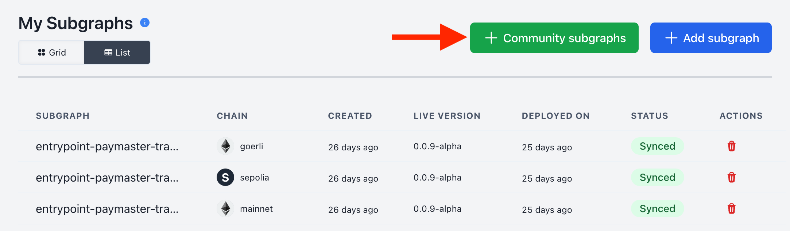

Community subgraphs are subgraphs managed by Alchemy. These subgraphs provide APIs for popular protocols such as Compound and protocol-agnostic APIs such as token ownership. Anyone with an Alchemy account can query them without writing or deploying subgraphs.

# Querying community subgraphs

Community subgraphs can be activated for querying from the subgraph dashboard.

Browse any available subgraph, test queries on it a dedicated playground, and activate it to add the subgraph to your dashboard.

Community subgraphs are available for querying as soon as they’re activated. Each has its own dedicated page in your dashboard, just like subgraphs you deploy yourself.

# Versioning & updates

Alchemy may deploy multiple versions for some Community subgraphs over time to keep them up to date and fix any bugs. **We always recommend querying the live version endpoint for these subgraphs** — this is the most up-to-date version endorsed by our team.

For backwards compatibility, any updates that involve breaking schema changes will be represented as an entirely new subgraph rather than a new version.

# Request new community subgraphs

If there's a popular subgraph you or other projects may be interested in querying, please drop a suggestion [here](https://alchemyapi.typeform.com/to/iKz79hB2).

# Billing

Activated community subgraphs will not count towards stored entities, updated entities, deployments, or subgraphs.

\*\*Only queries made to Community subgraphs will count towards billing.

# Managed by Alchemy

Alchemy is responsible for ensuring these subgraphs stay syncing and have correct data.

However, since these subgraphs are not written by Alchemy, they may have occasionally have bugs. **Our team will monitor for these issues and attempt to fix them, but if you discover a bug please reach out to our team at support@alchemy.com!**
