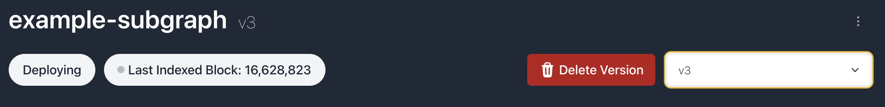

# Subgraph deletion

You can delete a subgraph from the settings tab of the subgraph page.

# Subgraph version deletion

To delete a subgraph version, first navigate to a subgraph version. You should see a button next to the version dropdown.

Note: We only allow deletion of non-live subgraph versions.



## API endpoint

You can also delete a version via an API call:

<CodeGroup>
  ```bash bash
  curl -X DELETE https://subgraphs.alchemy.com/api/subgraphs/<ORGANIZATION>/<SUBGRAPH_NAME>/<VERSION_NAME>/delete \
      -H 'x-api-key: <DEPLOY_KEY>'
  ```
</CodeGroup>

Note that this uses the *deploy key*, not query keys.

## Version auto-deletion

If you'd like to automatically clean up old versions, you can turn on auto-deletion from your subgraph settings tab.

This will automatically delete the oldest non-live version of your subgraph once you're over your version limit.
