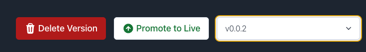

# Overview

Alchemy Subgraphs (fka Satsuma) allows you to deploy different *subgraphs* and *subgraph versions*.

* Each subgraph has a **live version**, which serves traffic at a static endpoint:

  `https://subgraph.satsuma-prod.com/<QUERY KEY>/<TEAM ID>/<SUBGRAPH NAME>/api`

* Each **subgraph version** gets a version-specific endpoint:

  `https://subgraph.satsuma-prod.com/<QUERY KEY>/<TEAM ID>/<SUBGRAPH NAME>/version/<VERSION NAME>/api`

* Version names must be unique within a subgraph.

* Alchemy will randomly generate a version name when deploying from versions of the CLIs that don't support the `--version-label` flag.

# Promoting a version to live

When deploying a **new subgraph**, the first version will be set to live.

However, **new versions of existing subgraphs** will not be automatically promoted to live. You can promote the version to live within the dashboard.



## API endpoint

You can also set a version to live via an API call:

<CodeGroup>
  ```bash bash
  curl -X POST https://subgraphs.alchemy.com/api/subgraphs/<TEAM ID>/<SUBGRAPH_NAME>/<VERSION_NAME>/promote-live \
  	-H 'x-api-key: <DEPLOY_KEY>'
  ```
</CodeGroup>

Your team ID is automatically-generated — it can be found directly after the query key in your subgraph's query endpoint.

#### Use cases

This flexible system allows you to do things like:

* Test a new version with live queries before switching your application over.
* Instantly roll back to a previous version if there are issues with a new version.

# Auto-promote

In certain situations, you might want to **auto-promote** a newly deployed version. Once the subgraph version finishes syncing, it will automatically get promoted to live.

This can be useful within your CI / CD pipelines.

## API endpoint

Make a request to this endpoint to enable auto-promote for a subgraph version:

<CodeGroup>
  ```bash bash
  curl -X POST https://subgraphs.alchemy.com/api/subgraphs/<TEAM ID>/<SUBGRAPH_NAME>/<VERSION_NAME>/auto-promote-live \
  	-H "Content-Type: application/json" -H "x-api-key: <DEPLOY_KEY>"
  ```
</CodeGroup>

Your team ID is automatically-generated — it can be found directly after the query key in your subgraph's query endpoint.
