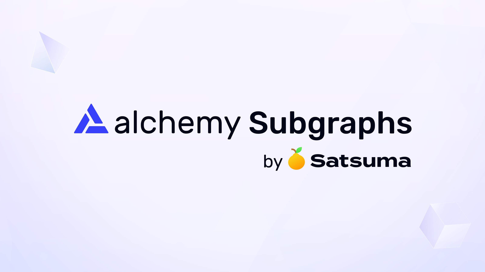

# What is a Subgraph?

Subgraphs are an open-source tool for building custom GraphQL APIs with blockchain data.

## How it works

1. Write your subgraph code.
2. Deploy to Alchemy Subgraphs.
3. Query live blockchain data through your GraphQL API.

## Why use a subgraph?

* Ship in days, not weeks - Spend up to 50% less time on data indexing and dealing with forks / reorgs.
* Simplify your infrastructure - Save hours every week on infra maintenance or downtime.
