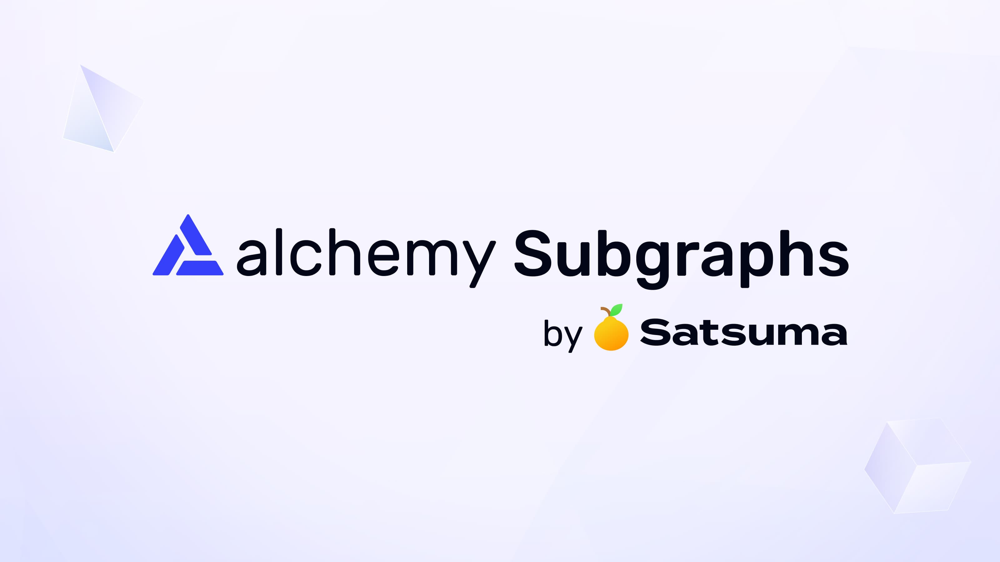

# What is a Subgraph?



Subgraphs are an open-source tool for building custom GraphQL APIs with blockchain data.

## How it works

1. Write your subgraph code.
2. Deploy to Alchemy Subgraphs.
3. Query live blockchain data through your GraphQL API.

## Why use a subgraph?

* Ship in days, not weeks - Spend up to 50% less time on data indexing and dealing with forks / reorgs.
* Simplify your infrastructure - Save hours every week on infra maintenance or downtime.

# Getting Started

## Creating a new subgraph

1. Install the `graph-cli`:

   <CodeGroup>
     ```bash bash
     npm install -g @graphprotocol/graph-cli
     ```
   </CodeGroup>

2. Retrieve contract address and related ABI.

3. Create a new subgraph:

   <CodeGroup>
     ```bash bash
     graph init --from-contract <0x_CONTRACT_ADDRESS> --abi '<PATH_TO_ABI>'
     ```
   </CodeGroup>

4. Make modifications as necessary to the manifest, schema, and handlers.

5. See [Developing a Subgraph](/reference/developing-a-subgraph) for more details.

## Deploying your subgraph

1. Get your deploy key from your [Alchemy Dashboard](https://dashboard.alchemy.com/).

2. Run the following:

   <CodeGroup>
     ```bash bash
     cd <SUBGRAPH_DIRECTORY>

     graph deploy <SUBGRAPH_NAME> \
       --version-label <VERSION_NAME> \
       --node https://subgraphs.alchemy.com/api/subgraphs/deploy \
       --deploy-key <DEPLOY_KEY>
       --ipfs https://ipfs.satsuma.xyz
     ```
   </CodeGroup>

   See []()[Deploying a Subgraph](/reference/deploying-a-subgraph) for more details.

3. You’ll receive a link to view your newly deployed subgraph. Congrats! 🎉
