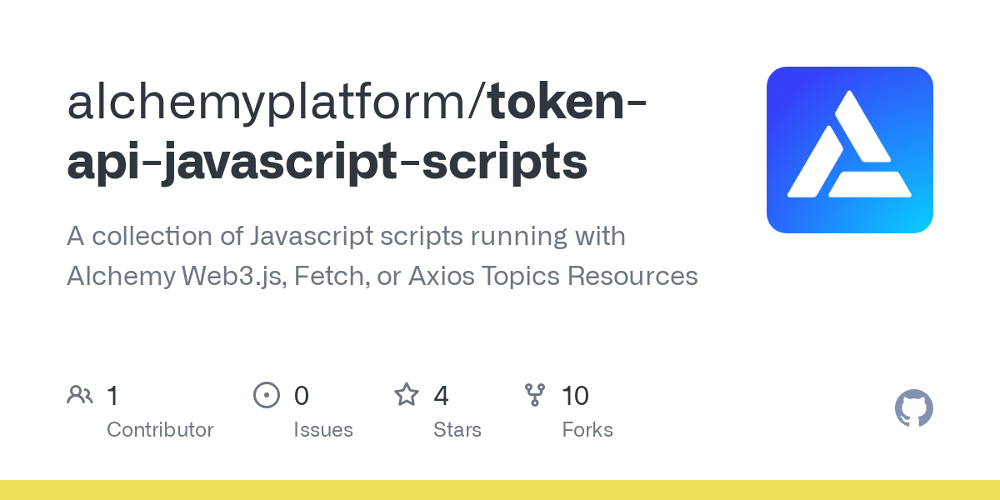

### New CU Costs

Build and scale apps with lower CU costs on key APIs

[How CU costs work](<https://docs.alchemy.com/reference/compute-unit-costs?utm_source=docs\&utm_medium=website\&utm_campaign=build >)

With the Token API, you can retrieve token balances, metadata, and more.

Alchemy currently supports the following [Token API Endpoints](/reference/token-api):

* [`alchemy_getTokenAllowance`](/reference/alchemy-gettokenallowance): Returns the amount which the sender is allowed to withdraw from the owner.
* [`alchemy_getTokenBalances`](/reference/alchemy-gettokenbalances) : Returns ERC20 token balances for all tokens the given address has ever transacted in with. Optionally accepts a list of contracts.
* [`alchemy_getTokenMetadata`](/reference/alchemy-gettokenmetadata): Returns metadata (name, symbol, decimals, logo) for a given token contract address.

Interested in token prices? Check out the [Prices API](/reference/prices-api-quickstart).

<Info>
  Unless otherwise specified, Alchemy methods will return decoded values in their responses (e.g., for token decimals, 18 will be returned instead of "0x12") to save you the extra step of decoding the value yourself ✅
</Info>

***

# How to Query the Token API

## Alchemy SDK (Recommended)

Install the `alchemy-sdk` module to easily interact with Alchemy APIs. We highly recommend the `alchemy-sdk` for WebSocket support, retries, and more.

Check the Github repo here: [https://github.com/alchemyplatform/alchemy-sdk-js](https://github.com/alchemyplatform/alchemy-sdk-js)

### Installation

Run the following command to install `alchemy-sdk` with `npm` or `yarn`

<CodeGroup>
  ```shell npm
  npm install alchemy-sdk
  ```

  ```shell yarn
  yarn add alchemy-sdk
  ```
</CodeGroup>

### Usage

[](https://github.com/alchemyplatform/token-api-javascript-scripts/blob/main/alchemy-web3-script.js)

[github.com](https://github.com/alchemyplatform/token-api-javascript-scripts/blob/main/alchemy-web3-script.js)

[token-api-javascript-scripts/alchemy-web3-script.js at main · alchemyplatform/token-api-javascript-scripts](https://github.com/alchemyplatform/token-api-javascript-scripts/blob/main/alchemy-web3-script.js)

<CodeGroup>
  ```shell shell
  touch alchemy-sdk-script.js
  ```
</CodeGroup>

And then paste the following code snippet into the file:

<CodeGroup>
  ```javascript alchemy-sdk-script.js
  import { Alchemy, Network } from "alchemy-sdk";

  const settings = {
    apiKey: "demo", // Replace with your Alchemy API Key.
    network: Network.ETH_MAINNET, // Replace with your network.
  };
  const alchemy = new Alchemy(settings);

  // The wallet address / token we want to query for:
  const ownerAddr = "0x3f5ce5fbfe3e9af3971dd833d26ba9b5c936f0be";
  const balances = await alchemy.core.getTokenBalances(ownerAddr, [
    "0x607f4c5bb672230e8672085532f7e901544a7375",
  ]);

  // The token address we want to query for metadata:
  const metadata = await alchemy.core.getTokenMetadata(
    "0x607f4c5bb672230e8672085532f7e901544a7375"
  );

  console.log("Token Balances:");
  console.log(balances);
  console.log("Token Metadata: ");
  console.log(metadata);
  ```
</CodeGroup>

From your command line, you can execute the script with:

<CodeGroup>
  ```shell shell
  node alchemy-sdk-script.js
  ```
</CodeGroup>

You should see output like this:

<CodeGroup>
  ```shell shell
  Token Balances:
  {
    address: '0x3f5ce5fbfe3e9af3971dd833d26ba9b5c936f0be',
    tokenBalances: [
      {
        contractAddress: '0x607f4c5bb672230e8672085532f7e901544a7375',
        tokenBalance: '0x0000000000000000000000000000000000000000000000000000000000000000',
        error: null
      }
    ]
  }
  Token Metadata:
  {
    decimals: 9,
    logo: 'https://static.alchemyapi.com/images/assets/1637.png',
    name: 'iExec RLC',
    symbol: 'RLC'
  }
  ```
</CodeGroup>

## Node Fetch

`node-fetch` is a lightweight, common module for making HTTP requests.

See the documentation for more info: [https://www.npmjs.com/package/node-fetch](https://www.npmjs.com/package/node-fetch)

### Installation

Run the following command to install `node-fetch` with `npm` or `yarn`

<CodeGroup>
  ```shell npm
  npm install node-fetch
  ```

  ```shell yarn
  yarn add node-fetch
  ```
</CodeGroup>

### Usage

[](https://github.com/alchemyplatform/token-api-javascript-scripts/blob/main/fetch-script.js)

[github.com](https://github.com/alchemyplatform/token-api-javascript-scripts/blob/main/fetch-script.js)

[token-api-javascript-scripts/fetch-script.js at main · alchemyplatform/token-api-javascript-scripts](https://github.com/alchemyplatform/token-api-javascript-scripts/blob/main/fetch-script.js)

<CodeGroup>
  ```shell shell
  touch fetch-script.js
  ```
</CodeGroup>

and then paste the following code snippet into the file to explore the `getNFTs` method:=

<CodeGroup>
  ```javascript fetch-script.js
  // alchemy-token-api/fetch-script.js
  import fetch from 'node-fetch';

  // Replace with your Alchemy API key:
  const apiKey = "demo";
  const fetchURL = `https://eth-mainnet.g.alchemy.com/v2/${apiKey}`;

  // Replace with the wallet address you want to query:
  const ownerAddr = "0x3f5ce5fbfe3e9af3971dd833d26ba9b5c936f0be";
  // Replace with the token contract address you want to query:
  const tokenAddr = "0x607f4c5bb672230e8672085532f7e901544a7375";

  var raw = JSON.stringify({
    "jsonrpc": "2.0",
    "method": "alchemy_getTokenBalances",
    "headers": {
      "Content-Type": "application/json"
    },
    "params": [
      `${ownerAddr}`,
      [
        `${tokenAddr}`,
      ]
    ],
    "id": 42
  });

  var requestOptions = {
    method: 'POST',
    body: raw,
    redirect: 'follow'
  };

  // Make the request and print the formatted response:
  fetch(fetchURL, requestOptions)
    .then(response => response.json())
    .then(response => JSON.stringify(response, null, 2))
    .then(result => console.log(result))
    .catch(error => console.log('error', error));
  ```
</CodeGroup>

From your command line, you can execute the script with:

<CodeGroup>
  ```shell shell
  node fetch-script.js
  ```
</CodeGroup>

Your output should look like the following:

<CodeGroup>
  ```json json
  {
    "jsonrpc": "2.0",
    "id": 42,
    "result": {
      "address": "0x3f5ce5fbfe3e9af3971dd833d26ba9b5c936f0be",
      "tokenBalances": [
        {
          "contractAddress": "0x607f4c5bb672230e8672085532f7e901544a7375",
          "tokenBalance": "0x00000000000000000000000000000000000000000000000000003c005f81ab00",
          "error": null
        }
      ]
    }
  }
  ```
</CodeGroup>

***

# API Reference

For more details on the available Token API methods, check out the docs:

[](https://docs.alchemy.com/reference/token-api)

[docs.alchemy.com](https://docs.alchemy.com/reference/token-api)

[Token API Endpoints](https://docs.alchemy.com/reference/token-api)
