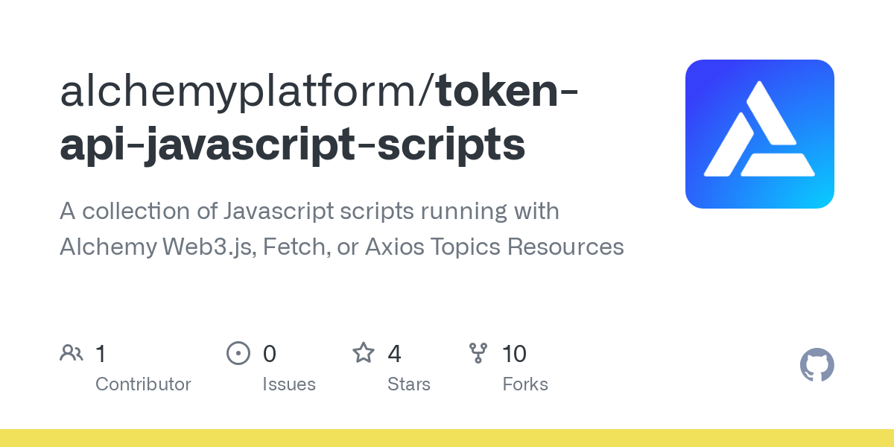

# How to Query the Token API

## Fetch

You can easily interact with Alchemy's Token API using simple fetch requests. No additional dependencies required with Node.js 18+.

### Usage

[](https://github.com/alchemyplatform/token-api-javascript-scripts/blob/main/alchemy-web3-script.js)

[github.com](https://github.com/alchemyplatform/token-api-javascript-scripts/blob/main/alchemy-web3-script.js)

[token-api-javascript-scripts/alchemy-web3-script.js at main · alchemyplatform/token-api-javascript-scripts](https://github.com/alchemyplatform/token-api-javascript-scripts/blob/main/alchemy-web3-script.js)

<CodeGroup>
  ```shell shell
  touch token-api-script.js
  ```
</CodeGroup>

And then paste the following code snippet into the file:

<CodeGroup>
  ```javascript token-api-script.js
  // Replace with your Alchemy API Key
  const apiKey = "demo";
  const baseURL = `https://eth-mainnet.g.alchemy.com/v2/${apiKey}`;

  async function getTokenData() {
    try {
      // The wallet address / token we want to query for:
      const ownerAddr = "0x3f5ce5fbfe3e9af3971dd833d26ba9b5c936f0be";
      const tokenAddr = "0x607f4c5bb672230e8672085532f7e901544a7375";

      // Get token balances
      const balanceResponse = await fetch(baseURL, {
        method: 'POST',
        headers: {
          'Content-Type': 'application/json',
        },
        body: JSON.stringify({
          jsonrpc: "2.0",
          method: "alchemy_getTokenBalances",
          params: [ownerAddr, [tokenAddr]],
          id: 1
        })
      });

      const balanceData = await balanceResponse.json();

      // Get token metadata
      const metadataResponse = await fetch(baseURL, {
        method: 'POST',
        headers: {
          'Content-Type': 'application/json',
        },
        body: JSON.stringify({
          jsonrpc: "2.0",
          method: "alchemy_getTokenMetadata",
          params: [tokenAddr],
          id: 2
        })
      });

      const metadataData = await metadataResponse.json();

      console.log("Token Balances:");
      console.log(balanceData.result);
      console.log("Token Metadata:");
      console.log(metadataData.result);

    } catch (error) {
      console.error('Request failed:', error.message);
    }
  }

  getTokenData();
  ```
</CodeGroup>

From your command line, you can execute the script with:

<CodeGroup>
  ```shell shell
  node token-api-script.js
  ```
</CodeGroup>

You should see output like this:

<CodeGroup>
  ```shell shell
  Token Balances:
  {
    address: '0x3f5ce5fbfe3e9af3971dd833d26ba9b5c936f0be',
    tokenBalances: [
      {
        contractAddress: '0x607f4c5bb672230e8672085532f7e901544a7375',
        tokenBalance: '0x0000000000000000000000000000000000000000000000000000000000000000',
        error: null
      }
    ]
  }
  Token Metadata:
  {
    decimals: 9,
    logo: 'https://static.alchemyapi.com/images/assets/1637.png',
    name: 'iExec RLC',
    symbol: 'RLC'
  }
  ```
</CodeGroup>

### Usage

[](https://github.com/alchemyplatform/token-api-javascript-scripts/blob/main/fetch-script.js)

[github.com](https://github.com/alchemyplatform/token-api-javascript-scripts/blob/main/fetch-script.js)

[token-api-javascript-scripts/fetch-script.js at main · alchemyplatform/token-api-javascript-scripts](https://github.com/alchemyplatform/token-api-javascript-scripts/blob/main/fetch-script.js)

<CodeGroup>
  ```shell shell
  touch fetch-script.js
  ```
</CodeGroup>

and then paste the following code snippet into the file to explore the `getNFTs` method:=

<CodeGroup>
  ```javascript fetch-script.js
  // alchemy-token-api/fetch-script.js
  

  // Replace with your Alchemy API key:
  const apiKey = "demo";
  const fetchURL = `https://eth-mainnet.g.alchemy.com/v2/${apiKey}`;

  // Replace with the wallet address you want to query:
  const ownerAddr = "0x3f5ce5fbfe3e9af3971dd833d26ba9b5c936f0be";
  // Replace with the token contract address you want to query:
  const tokenAddr = "0x607f4c5bb672230e8672085532f7e901544a7375";

  var raw = JSON.stringify({
    "jsonrpc": "2.0",
    "method": "alchemy_getTokenBalances",
    "headers": {
      "Content-Type": "application/json"
    },
    "params": [
      `${ownerAddr}`,
      [
        `${tokenAddr}`,
      ]
    ],
    "id": 42
  });

  var requestOptions = {
    method: 'POST',
    body: raw,
    redirect: 'follow'
  };

  // Make the request and print the formatted response:
  fetch(fetchURL, requestOptions)
    .then(response => response.json())
    .then(response => JSON.stringify(response, null, 2))
    .then(result => console.log(result))
    .catch(error => console.log('error', error));
  ```
</CodeGroup>

From your command line, you can execute the script with:

<CodeGroup>
  ```shell shell
  node fetch-script.js
  ```
</CodeGroup>

Your output should look like the following:

<CodeGroup>
  ```json json
  {
    "jsonrpc": "2.0",
    "id": 42,
    "result": {
      "address": "0x3f5ce5fbfe3e9af3971dd833d26ba9b5c936f0be",
      "tokenBalances": [
        {
          "contractAddress": "0x607f4c5bb672230e8672085532f7e901544a7375",
          "tokenBalance": "0x00000000000000000000000000000000000000000000000000003c005f81ab00",
          "error": null
        }
      ]
    }
  }
  ```
</CodeGroup>
