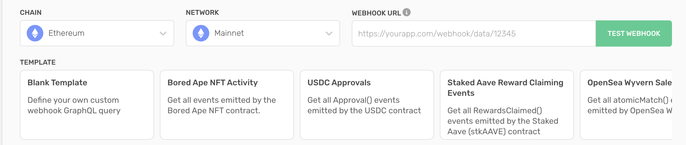

To utilize Alchemy's GraphQL webhook playground, feel free to use Alchemy's handy dashboard tool. Follow along [our guide](/reference/custom-webhooks-quickstart#set-up-custom-webhooks-in-your-dashboard) for more information!

To help developers understand the type of queries that Alchemy's Custom Webhooks can support, we've included some key examples that you can run on your own quickly! Feel free to use the Alchemy Notify template carousel to get started with queries that you can build off of.



<Info>
  When testing Alchemy's Custom Webhooks on different networks and chains, make sure you change the block hash and associated log/transaction information to match each blockchain's on-chain data!
</Info>

## Ethereum Custom Webhook GraphQL Templates:

**Mainnet**

* **Action:**

  Bored Ape NFT Activity

  * *Get all events emitted by the Bored Ape NFT contract*
    ```graphql

      {
        block(hash: "0x4a4d98f90439daaf082642dfbdd0f7b9a36749484582fb3d3e03bd4583da337a") {
          logs(filter: {addresses: ["0xBC4CA0EdA7647A8aB7C2061c2E118A18a936f13D"], topics: []}) {
            transaction {
              hash
              index
              from {
                address
              }
              to {
                address
              }
              maxFeePerGas
              maxPriorityFeePerGas
              gasUsed
              cumulativeGasUsed
              effectiveGasPrice
              logs {
                account {
                  address
                }
                topics
                index
              }
              type
              status
            }
          }
        }
      }
          
    ```

  ***

  **Action:**

  USDC Approvals

  * *Get all Approval() events emitted by the USDC contract*
    ```graphql
      {
        block(hash: "0xaaf4228db65eab92357c124ff8f8f1c5da72a04da660e147157cd4dfd8eb44d6") {
          logs(filter: {addresses: ["0xa0b86991c6218b36c1d19d4a2e9eb0ce3606eb48"], topics: ["0x8c5be1e5ebec7d5bd14f71427d1e84f3dd0314c0f7b2291e5b200ac8c7c3b925"]}) {
            account {
              address
            }
            topics
            transaction{
              hash
              index
              to{
                address
              }
              from {
                address
              }
              status
            }
          }
        }
      }
          
    ```

  ***

  **Action:**

  Staked Aave Reward Claiming Events

  * *Get all RewardsClaimed() events emitted by the Staked Aave (stkAAVE) contract*
    ```graphql
      {
        block(hash: "0xaaf4228db65eab92357c124ff8f8f1c5da72a04da660e147157cd4dfd8eb44d6") {
          logs(filter: {addresses: ["0xa0b86991c6218b36c1d19d4a2e9eb0ce3606eb48"], topics: ["0x8c5be1e5ebec7d5bd14f71427d1e84f3dd0314c0f7b2291e5b200ac8c7c3b925"]}) {
            account {
              address
            }
            topics
            transaction{
              hash
              index
              to{
                address
              }
              from {
                address
              }
              status
            }
          }
        }
      }
          
    ```

  ***

  **Action:**

  Uniswap Swap Events

  * *Get all swap() events emitted by a UniswapV3Pool*
    ```graphql
      {
        block(hash: "0x2f9586f3656c1daf815289d016d928c22fecc86cf04869f0bd9ae48ca9cc44b4") {
          logs(filter: {addresses: ["0x367e2d443988e4b222fbfdafdb35eeb7dda9fbb7"], topics: ["0xd78ad95fa46c994b6551d0da85fc275fe613ce37657fb8d5e3d130840159d822"]}) {
            transaction {
              hash
              index
              from {
                address
              }
              to {
                address
              }
              logs {
                topics
              }
              type
              status
            }
          }
        }
      }
          
    ```

  ***

  **Action:**

  Blur Sale Events

  * *Get all ordersMatched() events emitted by Blur*
    ```graphql
      {
        block(hash: "0x0a945bf7ea18e60e03d9cb4b686c1893218a54fcbd2460bef198cd97a6a0f48c") {
          logs(filter: {addresses: ["0x000000000000ad05ccc4f10045630fb830b95127"], topics: ["0x61cbb2a3dee0b6064c2e681aadd61677fb4ef319f0b547508d495626f5a62f64"]}) {
            transaction {
              hash
              index
              from {
                address
              }
              to {
                address
              }
              logs {
                topics
              }
              type
              status
            }
          }
        }
      }
          
    ```

  ***

**Georli**

* **Action:**

  MultiFaucet (Paradigm) NFT Activity

  * *Get all events emitted by the MultiFaucet (Paradigm) NFT Activity on Georli Testnet*
    ```graphql
      {
        block(hash: "0x59f86197e5a57ccc03b6962a3de88c9f526fe162a6a930a0cce0e19c1ad5ec38") {
          logs(filter: {addresses: ["0xf5de760f2e916647fd766B4AD9E85ff943cE3A2b"], topics: []}) {
            transaction {
              hash
              index
              from {
                address
              }
              to {
                address
              }
              maxFeePerGas
              maxPriorityFeePerGas
              gasUsed
              cumulativeGasUsed
              effectiveGasPrice
              logs {
                account {
                  address
                }
                topics
                index
              }
              type
              status
            }
          }
        }
      }
          
    ```

  ***

  **Action:**

  Uniswap Swap Events

  * *Get all swap() events emitted by a UniswapV3Pool*
    ```graphql
      {
        block(hash: "0x9e9c74005fdd5c51ad7af5e9e014b7aa99196ed98286755b6d17ce3aca95e123") {
          logs(filter: {addresses: ["0x5371f7ab89fb0837e78245fcdc9acbfd336fdbe1"], topics: ["0xc42079f94a6350d7e6235f29174924f928cc2ac818eb64fed8004e115fbcca67"]}) {
            transaction {
              hash
              index
              from {
                address
              }
              to {
                address
              }
              logs {
                topics
              }
              type
              status
            }
          }
        }
      }
          
    ```

  ***

## Polygon PoS Custom Webhook GraphQL Templates:

**Mainnet**

* **Action:**

  PlanetIX NFT Activity

  * *Get all events emitted by the PlanetIX NFT*
    ```graphql
      {
        block(hash: "0x081539375332c25a37fc3ac688ebba542363ae815cfa24da1ee585b7660bcff9") {
          logs(filter: {addresses: ["0xb2435253c71fca27be41206eb2793e44e1df6b6d"], topics: []}) {
            transaction {
              hash
              index
              from {
                address
              }
              to {
                address
              }
              maxFeePerGas
              maxPriorityFeePerGas
              gasUsed
              cumulativeGasUsed
              effectiveGasPrice
              logs {
                account {
                  address
                }
                topics
                index
              }
              type
              status
            }
          }
        }
      }
          
    ```

  ***

  **Action:**

  Uniswap Swap Events

  * *Get all swap() events emitted by a UniswapV3Pool*
    ```graphql
      {
        block(hash: "0x7108c7f0a3b37d0c7b7b467832099b49136f5c75360a5cd8c274eb240c9d32b6") {
          logs(filter: {addresses: ["0x86f1d8390222A3691C28938eC7404A1661E618e0"], topics: ["0xc42079f94a6350d7e6235f29174924f928cc2ac818eb64fed8004e115fbcca67"]}) {
            transaction {
              hash
              index
              from {
                address
              }
              to {
                address
              }
              maxFeePerGas
              maxPriorityFeePerGas
              gasUsed
              cumulativeGasUsed
              effectiveGasPrice
              logs {
                account {
                  address
                }
                topics
                index
              }
              type
              status
            }
          }
        }
      }
          
    ```

  ***

**Mumbai**

* **Action:**

  MultiFaucet (Paradigm) NFT Activity

  * *Get all events emitted by the MultiFaucet (Paradigm) NFT Activity on Mumbai Testnet*
    ```graphql
      {
        block(hash: "0x75a00be4712a9aa165d4b100ed58d1207f43acfc4c1bb22a60ed80e1fab06963") {
          logs(filter: {addresses: ["0xf5de760f2e916647fd766B4AD9E85ff943cE3A2b"], topics: []}) {
            transaction {
              hash
              index
              from {
                address
              }
              to {
                address
              }
              maxFeePerGas
              maxPriorityFeePerGas
              gasUsed
              cumulativeGasUsed
              effectiveGasPrice
              logs {
                account {
                  address
                }
                topics
                index
              }
              type
              status
            }
          }
        }
      }
          
    ```

  ***

  **Action:**

  Uniswap Swap Events

  * *Get all swap() events emitted by a UniswapV3Pool*
    ```graphql
      {
        block(hash: "0xc8dad078774991e18f1c5af2ad94ea94166528d03cf378473286986b5935fa19") {
          logs(filter: {addresses: ["0x6B3e06FB1a58a06c2Ce59281cAD545dC282FCb78"], topics: ["0xc42079f94a6350d7e6235f29174924f928cc2ac818eb64fed8004e115fbcca67"]}) {
            transaction {
              hash
              index
              from {
                address
              }
              to {
                address
              }
              maxFeePerGas
              maxPriorityFeePerGas
              gasUsed
              cumulativeGasUsed
              effectiveGasPrice
              logs {
                account {
                  address
                }
                topics
                index
              }
              type
              status
            }
          }
        }
      }
          
    ```

  ***

## Arbitrum Custom Webhook GraphQL Templates:

**Mainnet**

* **Action:**

  Arbitrum Odyssey NFT Activity

  * *Get all events emitted by Arbitrum Odyssey NFTs*
    ```graphql
      {
        block(hash: "0x168e3bef3a51fa21926d67b48d1c395492cf780f7cd44709ff67b1fd1214e085") {
          logs(filter: {addresses: ["0xfAe39eC09730CA0F14262A636D2d7C5539353752"], topics: []}) {
            transaction {
              hash
              index
              from {
                address
              }
              to {
                address
              }
              maxFeePerGas
              maxPriorityFeePerGas
              gasUsed
              cumulativeGasUsed
              effectiveGasPrice
              logs {
                account {
                  address
                }
                topics
                index
              }
              type
              status
            }
          }
        }
      }
          
    ```

  ***

  **Action:**

  Uniswap Swap Events

  * *Get all swap() events emitted by a UniswapV3Pool*
    ```graphql
      {
        block(hash: "0xa0fde9a9acaaae9df58feb3dfa27f106c6ea88aedceff27536a7793d799df103") {
          logs(filter: {addresses: ["0x81c48d31365e6b526f6bbadc5c9aafd822134863"], topics: []}) {
            transaction {
              hash
              index
              from {
                address
              }
              to {
                address
              }
              maxFeePerGas
              maxPriorityFeePerGas
              gasUsed
              cumulativeGasUsed
              effectiveGasPrice
              logs {
                account {
                  address
                }
                topics
                index
              }
              type
              status
            }
          }
        }
      }
          
    ```

  ***

**Georli**

* **Action:**

  Gravity SmolBrain Testnet NFT Activity

  * *Get all events emitted by the Gravity SmolBrain Testnet NFT*
    ```graphql
      {
        block(hash: "0x586ee2ba2ce913ee7cb2b442d04d779bb5a52415a5e3a4ddbd4c23e70ffdad62") {
          logs(filter: {addresses: ["0x9C58e1141171bDe21bCa77A31D6C5D858602Dea0"], topics: []}) {
            transaction {
              hash
              index
              from {
                address
              }
              to {
                address
              }
              maxFeePerGas
              maxPriorityFeePerGas
              gasUsed
              cumulativeGasUsed
              effectiveGasPrice
              logs {
                account {
                  address
                }
                topics
                index
              }
              type
              status
            }
          }
        }
      }
          
    ```

  ***

## Optimism Custom Webhook GraphQL Templates:

**Mainnet**

* **Action:**

  UNI-V3-POS NFT Activity

  * *Get all events emitted by the UNI-V3-POS NFT*
    ```graphql
      {
        block(hash: "0x91d0c0081254a16aadcffd6fc0ddc31750a3052458119b5982da20410428a40a") {
          logs(filter: {addresses: ["0xC36442b4a4522E871399CD717aBDD847Ab11FE88"], topics: []}) {
            transaction {
              hash
              index
              from {
                address
              }
              to {
                address
              }
              maxFeePerGas
              maxPriorityFeePerGas
              gasUsed
              cumulativeGasUsed
              effectiveGasPrice
              logs {
                account {
                  address
                }
                topics
                index
              }
              type
              status
            }
          }
        }
      }
          
    ```

  ***

  **Action:**

  Uniswap Swap Events

  * *Get all swap() events emitted by a UniswapV3Pool*
    ```graphql
      {
        block(hash: "0xd8868c0babdf1e5192f355716eafe276bc72f08b9cf8cb413fb5d0928c2bb773") {
          logs(filter: {addresses: ["0xE592427A0AEce92De3Edee1F18E0157C05861564"], topics: []}) {
            transaction {
              hash
              index
              from {
                address
              }
              to {
                address
              }
              maxFeePerGas
              maxPriorityFeePerGas
              gasUsed
              cumulativeGasUsed
              effectiveGasPrice
              logs {
                account {
                  address
                }
                topics
                index
              }
              type
              status
            }
          }
        }
      }
          
    ```

  ***

  **Action:**

  DAI Approvals

  * *Get all Approval() events emitted by the DAI contract*
    ```graphql
      {
        block(hash: "0x822a3b946263678730fb139066725a681b690736af34dd52d49bd02b476a4b65") {
          logs(filter: {addresses: ["0xda10009cbd5d07dd0cecc66161fc93d7c9000da1"], topics: ["0x8c5be1e5ebec7d5bd14f71427d1e84f3dd0314c0f7b2291e5b200ac8c7c3b925"]}) {
            account {
              address
            }
            topics
            transaction{
              hash
              index
              to{
                address
              }
              from {
                address
              }
              status
            }
          }
        }
      }
          
    ```

  ***

**Mainnet**

* **Action:**

  MultiFaucet (Paradigm) NFT Activity

  * *Get all events emitted by the MultiFaucet (Paradigm) NFTs*
    ```graphql
      {
        block(hash: "0x6117119d0300075df53350db3962bc297215e43a2083d59db05309b0e28eb625") {
          logs(filter: {addresses: ["0xf5de760f2e916647fd766B4AD9E85ff943cE3A2b"], topics: []}) {
            transaction {
              hash
              index
              from {
                address
              }
              to {
                address
              }
              maxFeePerGas
              maxPriorityFeePerGas
              gasUsed
              cumulativeGasUsed
              effectiveGasPrice
              logs {
                account {
                  address
                }
                topics
                index
              }
              type
              status
            }
          }
        }
      }
          
    ```

  ***

  **Action:**

  DAI Approvals

  * *Get all Approval() events emitted by the DAI contract*
    ```graphql
      {
        block(hash: "0x550a5408ccc985bbbb143db1f14a4ec6335dae39985bef185476aa9733bd59ce") {
          logs(filter: {addresses: ["0x8ea903081aa1137F11D51F64A1F372EDe67571a9"], topics: ["0x8c5be1e5ebec7d5bd14f71427d1e84f3dd0314c0f7b2291e5b200ac8c7c3b925"]}) {
            account {
              address
            }
            topics
            transaction{
              hash
              index
              to{
                address
              }
              from {
                address
              }
              status
            }
          }
        }
      }
            
    ```

  ***
