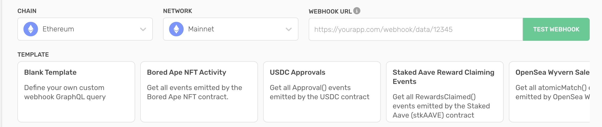
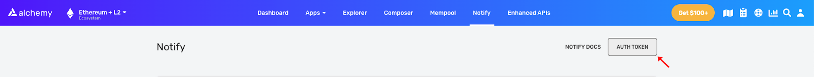

## What chains are Custom Webhooks supported on?

Custom Webhooks are live for Alchemy's EVM network suite, and we are adding new chains almost every week. The updated list of supported chains can be found [here](https://dashboard.alchemy.com/services)

## Why do I receive a webhook for every new block?

Don't be alarmed if you're seeing blank data like the following!

<CodeGroup>
  ```shell sample-empty-graphQL-webhook
  {
    "webhookId": "wh_yg0kkvlsnksbzvwz",
    "id": "whevt_3iho0jjd9zsmfgkk",
    "createdAt": "2023-02-02T23:11:24.585Z",
    "type": "GRAPHQL",
    "event": {
      "data": {
        "block": {
          "logs": []
        }
      },
      "sequenceNumber": "10000000000579857000"
    }
  }
  ```
</CodeGroup>

We send you notifications every time we run your GraphQL queries regardless of whether the filter results are *null*. This holds us accountable and serves as a receipt that we ran the query on each new canonical block!

<Info>
  If you want to turn this off and only receive webhooks for non-empty queries, check out instructions in the [next FAQ question](/reference/custom-webhooks-faq#how-do-i-receive-webhooks-for-only-non-empty-results-ie-turn-off-the-heartbeat-mechanism-described-abovedont-receive-a-webhook-for-every-block)!
</Info>

## How do I receive webhooks for only non-empty results (i.e. turn off the heartbeat mechanism described above/don't receive a webhook for every block)?

To turn off the "heartbeat" mechanism for your webhook query (aka. only receive a webhook if the query on a block is not empty), you can change the `graphql_query` from a string to `{ query: string, skip_empty_messages: boolean }` and set the `skip_empty_messages` param to True. For example:

```shell
curl --request POST \
     --url https://dashboard.alchemy.com/api/create-webhook \
     --header 'X-Alchemy-Token: ZEuI86oVdYIkJ8wvTfOPJoZQZX7OJ6Op' \
     --header 'accept: application/json' \
     --header 'content-type: application/json' \
     --data '{  "network": "ETH_MAINNET",  "webhook_type": "GRAPHQL",  "webhook_url": "https://oh5zluwgge.execute-api.us-east-1.amazonaws.com/Test2/",  "graphql_query": {   "skip_empty_messages":true,   "query":"query ($var: [Address!], $logTopic1: [Bytes32!]!) {  block {    hash    number    transactions(filter: { addresses: [{ to: $var }] }) {      hash      from {        address      }      to {        address      }      value      gas      status      logs {        data        topics      }    }    callTracerTraces(filter: { addresses: [{ to: $var }] }) {      from {        address      }      to {        address      }      value      input      output      gas      error      subtraceCount      traceAddressPath    }    logs(filter: { addresses: [], topics: [[], $logTopic1, []] }) {      topics      transaction {        hash        from {          address        }        to {          address        }        value        gas        status      }    }  }}"}}'
```

With this bool set to true, you will no longer receive webhooks for every new block, but instead only receive webhooks for non-empty block queries. This can be useful to reduce noise, however, you lose the receipt of receiving a webhook for every block.

## How do I use GraphQL to construct a query?

If you're new to GraphQL, the in-browser editor on the [Alchemy Notify Dashboard](https://dashboard.alchemyapi.io/notify)has autocomplete enabled and will magically suggest fields as you start typing. If you get lost, you can always search for available queries in the docs tab on the pop-up to the right of the webpage!

And, if you need a little inspiration, feel free to use the Alchemy Notify template carousel. Depending on your blockchain/network selection, you'll have a variety of different options to quickly build on top of!



## Can I add more expressive GraphQL filters?

100% We're hard at work creating new expressions to allow developers to make more complex queries. Keep your eyes peeled for updates!

## How many Custom Webhooks can I add?

There is currently a limit of 100 GraphQL queries within each team account.

## Why am I running into errors when creating a webhook?

If you're seeing 5xx error codes when creating webhooks, please ensure that you do not have *transactions.inputData* included as a parameter in your GraphQL query. We are heads-down working on ensuring reliable access across our entire API surface area!

## Are there any constraints to the GraphQL interface in Custom Webhooks?

While logs and transactions can be self-referential entities, we only allow for a single-layer nested data structure to bound GraphQL queries. This helps us to to maintain a tidy API surface area.

## How do I use the topic filter?

* Currently, our log/event filter leverages the same semantics as a traditional topic filter for an *eth\_getLogs* RPC call. If you're not familiar with how topic filters work for *eth\_getLogs*, here's [an article](/docs/deep-dive-into-eth_getlogs) to get you up to speed.

<Info>
  A transaction with topics pic fi will be matched by the following topic filters:
</Info>

* Feel free to peek 👀 at our example [GraphQL repository](/reference/custom-webhooks-example) as well to get inspiration for the different queries you can make.

## How much do Custom Webhooks cost?

Custom Webhooks fall under the Alchemy Notify suite and are priced based on bandwidth: the amount of data delivered as part of the subscription. Each byte of data delivered costs **0.04 CUs**. Since you only pay for what you use, feel free to tune each GraphQL to only deliver the information you want!

Once we move past our early access period, we will also include a fixed CU cost for hosting each GraphQL query on Alchemy.

## How are reorgs handled?

Custom Webhooks are built on top of Alchemy's Supernode, ensuring a reliable and accurate view of the blockchain. However, blockchain re-orgs (where the chain temporarily forks) can still happen.

If a re-org occurs, Alchemy will automatically re-run your GraphQL filters on the latest canonical (correct) block and send you a new webhook notification. To help you handle re-orgs and avoid duplicate data, each webhook response includes a *sequenceNumber* property.

The *sequenceNumber* is an incrementing number that tracks the order of notifications for each block. If a re-org happens, you may receive multiple webhook notifications for the same block number, but with different sequence numbers.

To ensure you're using the correct data, track both the block number and the *sequenceNumber*. If you get multiple notifications for the same block number, the one with the highest *sequenceNumber* is the correct and final version of the data for that block.

## What does the capacity limit error mean?

The capacity limit error means you've exceeded your total monthly compute units. To upgrade your capacity limits go to your [Alchemy dashboard](https://dashboard.alchemyapi.io/settings/billing). Below is an example capacity limit error.

<CodeGroup>
  ```shell Capacity limit error
  {
    "webhookId": "wh_127lzhz0dfwwimwe",
    "id": "whevt_55i2al4sc2ivp1m8",
    "createdAt": "2022-12-05T23:43:16.379Z",
    "type": "GRAPHQL",
    "event": {
      "error": "Monthly capacity limit exceeded. Visit https://dashboard.alchemy.com/settings/billing to upgrade your scaling policy for continued service."
    }
  }
  ```
</CodeGroup>

## What is the x-alchemy-signature?

The `x-alchemy-signature` is an Alchemy authentication token used to verify the source of your webhook requests and responses. The `x-alchemy-signature` ensures you’re getting responses from Alchemy and no other malicious source.

## Where do I find my Alchemy auth token?

Find your Alchemy auth token in the upper-right corner of your Notify dashboard by clicking the **AUTH TOKEN** button.



Alchemy dashboard showing where to copy the Auth Token for the Notify API.

## What does the 'paused' state for a webhook mean?

The 'paused' state indicates that a webhook is temporarily non-operational. This can happen either because you've manually set it to the 'paused' state or because you've hit your CU limit without autoscaling turned on. To make it operational again, you'll need to manually unpause it.

## How responsive is Custom Webhooks?

Custom Webhooks is [Alchemy's fastest way to ingest re-org protected blockchain data](https://www.alchemy.com/blog/custom-webhooks-variables-filters-block-freshness#block-freshness-improvements-for-significantly-faster-data-streams) and increases block freshenesss. We define block freshness (or lag) as the difference between the time the webhook was fired from Alchemy and the time the block itself was mined/confirmed.

## Why are my webhooks paused?

Your webhooks can be automatically paused if you reach your CU limit and don't have autoscaling activated. In this case, all your active webhooks will transition to the 'paused' state.

## If my webhooks are paused because I hit my CU limit, will they automatically become active when I upgrade or get more CUs?

No. Even if you upgrade or acquire more CUs, you'll still need to manually unpause your webhooks. This approach is in place mainly because many of our users quickly use up all their CUs at the beginning of the month. We'd prefer these webhooks to stay paused until you see value in them and decide to unpause.
