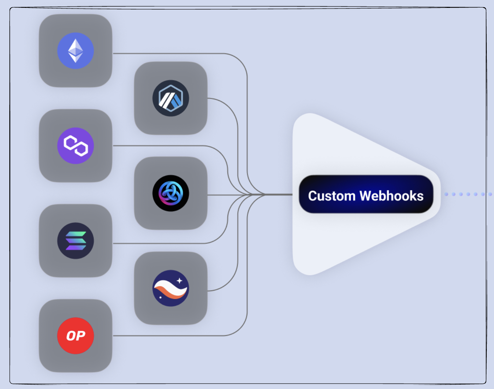

# Introduction

Alchemy's Custom Webhooks effectively solve the challenges of blockchain data by leveraging flexibility and control, giving developers Web3 data that is expansive and precise.

With Custom Webhooks, developers can stream on-chain data and get immediately notified about the most recent blockchain data changes. While previous Alchemy Notify solutions covered only pre-defined, transfers-based events, with Custom Webhooks, developers can understand any contract-based event, from token and marketplace activity, to comprehensive data ingestion. Custom Webhooks utilize a GraphQL interface so that web3 devs can have rich filters and only receive the precise blockchain data they need.

# How Do I Use Custom Webhooks?

<iframe width="560" height="315" src="https://www.youtube.com/embed/hM1cf_7O2VY?si=BIeRB-t6pd3mu5P5" title="YouTube video player" frameborder="0" allow="accelerometer; autoplay; clipboard-write; encrypted-media; gyroscope; picture-in-picture; web-share" referrerpolicy="strict-origin-when-cross-origin" allowfullscreen></iframe>

# How Does It Work?

Alchemy leverages GraphQL's expressiveness to allow developers to self-define the type of blockchain data that they want to receive. This can include anything at the block, transaction, or log/event level. In the background, Alchemy takes each developer's GraphQL query, runs it against every new canonical block, and returns the results to developers via a webhook notification.

# Use Cases

* **Bot integrations** - Start sending specific data streams to anywhere you spend time, whether it's a Twitter bot for activity on BAYC contracts or a Slack bot for the newest attestations from Chainlink oracles.
* **Token activity** - Get all token-related activity via Custom Webhooks, including approvals, staking, mints, burns, transfers and anything else you need. No more enriching data from a bunch of fragmented sources.
* **Marketplace activity** - Track marketplace activity at a granularity that's most useful for you. From protocols like UniswapV2Factory to OpenSea's Wyvern contracts, easily ingest swaps or atomic trades that represent more than one transfer event.
* **Oracle activity** - Find out right away anytime there is an attestation of off-chain data like ETH or DAI prices.
* **Data ingestion** - Ingest whatever data stream is useful for your business, from full block receipts to transaction activity, contract creations and more. If you're looking to ingest data into a DApp and want to see a real-time example, check out our [sample repl project](https://replit.com/@AlLuken/ETH-USDC-Custom-Webhook#index.js), fork it, and build on top of it!
* **Anything else** - Alchemy Notify’s Custom Webhooks are truly an open canvas, giving you the tools to get any combination of data your app needs.

<Tip title="Don’t have an API key?" icon="star">
  Sign up or upgrade your plan for access. [Get started for free](https://dashboard.alchemy.com/signup/?a=a82992b699)
</Tip>

# How Can I Set Up Custom Webhooks?

Setting up a Custom Webhook is as simple as defining a filter and adding a new URL to your application. If you're not familiar with the Alchemy Notify offering, note that Custom Webhooks is just [one of many different Notify API types](/reference/webhook-types)!

<Warning>
  If you need to constantly add or remove new Custom Webhooks, we recommend programmatically interacting with them through an API call.
</Warning>

# Set-up Custom Webhooks in your dashboard

For more information on setting up Custom Webhooks via the Alchemy Notify Dashboard, please refer to: [Custom Webhooks Dashboard Guide](/reference/custom-webhook#how-to-set-up-custom-webhooks)

# Set-up Custom Webhooks programmatically

Our Custom GraphQL Webhook leverages many of the same CRUD surface areas of Alchemy's existing Notify suite. However, at the moment, we limit users to creating, reading, and destroying individual webhook queries as we better understand user traffic patterns. Note that users, cannot currently update an existing Custom Webhook.

To interact with Alchemy's Custom Webhook products via API, feel free to use the following endpoints:

| Custom Webhook Endpoints                           |
| -------------------------------------------------- |
| [Create webhook](/reference/create-webhook)        |
| [Get all webhooks](/reference/team-webhooks)       |
| [Delete webhook](/reference/delete-webhook)        |
| [Update webhook status](/reference/update-webhook) |

# Reliability and Guarantees

* Custom Webhooks has built-in retry logic. As with the entire Webhooks suite, Custom Webhook notification deliveries are retried for non-200 response codes where the notification failed to reach your server. Requests are retried up to 5 times before failing. The request retry intervals are: 15 seconds, 1 minute, 10 minutes.
* Best-effort FIFO for first-time delivery- All first-time webhooks notifications, regardless of the selected chain/network and its speed, will be delivered in order to users

Happy Building 🏗️!
