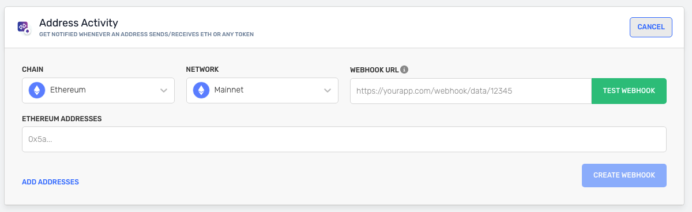

<Info>
  Check the [Chains](https://dashboard.alchemy.com/chains) page for details about product and chain support!

  
</Info>

# Introduction

Alchemy's Address Activity webhooks supports 30+ EVM chains (and now [Solana in early beta)](https://alchemotion.notion.site/External-Solana-Webhooks-Early-Access-Beta-18a069f200668057998afabc01472791). For EVM chains, it tracks all ETH, ERC20, ERC721 and ERC1155 transfers. This provides your app with real-time state changes when an address sends/receives tokens or ETH. A maximum of 100,000 addresses can be tracked by a single webhook.

<Info>
  If you are looking for historical activity, check out the [Transfers API Endpoints](/reference/transfers-api-endpoints).
</Info>

# Types of transfers

There are three main types of transfers that are captured when receiving a `fromAddress` activity response.

| Transfer type | Description                                                    |
| ------------- | -------------------------------------------------------------- |
| External ETH  | Top-level transactions from an EOA (Externally Owned Account). |
| Token         | Event logs for ERC20, ERC721, and ERC1155 transfers.           |
| Internal ETH  | Internal Transfers from a smart contract address.              |

<Warning>
**Note on Internal Transfers**

1. Internal transfers are currently only supported on Ethereum, Polygon, Arbitrum, Optimism and Base. Support for other networks is a WIP!
2. Internal Transfers with the call type `delegatecall` are not supported on Alchemy. Although they have a value associated with them, they don't transfer a value. For details read the [Ethereum Yellow Paper](https://ethereum.github.io/yellowpaper/paper.pdf). Internal transfer miner rewards are also unsupported on Alchemy.
</Warning>

# Example Response

Whenever one of the addresses that you are tracking sends/receives tokens or ETH, you receive a response from the webhook that looks like this:

<CodeGroup>
  ```shell Address Activity Response
  {
    "webhookId": "wh_k63lg72rxda78gce",
    "id": "whevt_vq499kv7elmlbp2v",
    "createdAt": "2024-01-23T07:42:26.411977228Z",
    "type": "ADDRESS_ACTIVITY",
    "event": {
      "network": "ETH_MAINNET",
      "activity": [
        {
          "blockNum": "0xdf34a3",
          "hash": "0x7a4a39da2a3fa1fc2ef88fd1eaea070286ed2aba21e0419dcfb6d5c5d9f02a72",
          "fromAddress": "0x503828976d22510aad0201ac7ec88293211d23da",
          "toAddress": "0xbe3f4b43db5eb49d1f48f53443b9abce45da3b79",
          "value": 293.092129,
          "erc721TokenId": null,
          "erc1155Metadata": null,
          "asset": "USDC",
          "category": "token",
          "rawContract": {
            "rawValue": "0x0000000000000000000000000000000000000000000000000000000011783b21",
            "address": "0xa0b86991c6218b36c1d19d4a2e9eb0ce3606eb48",
            "decimals": 6
          },
          "typeTraceAddress": null,
          "log": {
            "address": "0xa0b86991c6218b36c1d19d4a2e9eb0ce3606eb48",
            "topics": [
              "0xddf252ad1be2c89b69c2b068fc378daa952ba7f163c4a11628f55a4df523b3ef",
              "0x000000000000000000000000503828976d22510aad0201ac7ec88293211d23da",
              "0x000000000000000000000000be3f4b43db5eb49d1f48f53443b9abce45da3b79"
            ],
            "data": "0x0000000000000000000000000000000000000000000000000000000011783b21",
            "blockNumber": "0xdf34a3",
            "transactionHash": "0x7a4a39da2a3fa1fc2ef88fd1eaea070286ed2aba21e0419dcfb6d5c5d9f02a72",
            "transactionIndex": "0x46",
            "blockHash": "0xa99ec54413bd3db3f9bdb0c1ad3ab1400ee0ecefb47803e17f9d33bc4d0a1e91",
            "logIndex": "0x6e",
            "removed": false
          }
        },
        {
          "blockNum": "0xdf34a3",
          "hash": "0xc84eeeb72d2b23161fd93b088f304902cbd8b4510f1455a65fdac160e37b3173",
          "fromAddress": "0x71660c4005ba85c37ccec55d0c4493e66fe775d3",
          "toAddress": "0x7853b3736edba9d7ce681f2a90264307694f97f2",
          "value": 2400,
          "erc721TokenId": null,
          "erc1155Metadata": null,
          "asset": "USDC",
          "category": "token",
          "rawContract": {
            "rawValue": "0x000000000000000000000000000000000000000000000000000000008f0d1800",
            "address": "0xa0b86991c6218b36c1d19d4a2e9eb0ce3606eb48",
            "decimals": 6
          },
          "typeTraceAddress": null,
          "log": {
            "address": "0xa0b86991c6218b36c1d19d4a2e9eb0ce3606eb48",
            "topics": [
              "0xddf252ad1be2c89b69c2b068fc378daa952ba7f163c4a11628f55a4df523b3ef",
              "0x00000000000000000000000071660c4005ba85c37ccec55d0c4493e66fe775d3",
              "0x0000000000000000000000007853b3736edba9d7ce681f2a90264307694f97f2"
            ],
            "data": "0x000000000000000000000000000000000000000000000000000000008f0d1800",
            "blockNumber": "0xdf34a3",
            "transactionHash": "0xc84eeeb72d2b23161fd93b088f304902cbd8b4510f1455a65fdac160e37b3173",
            "transactionIndex": "0x48",
            "blockHash": "0xa99ec54413bd3db3f9bdb0c1ad3ab1400ee0ecefb47803e17f9d33bc4d0a1e91",
            "logIndex": "0x74",
            "removed": false
          }
        }
      ]
    }
  }
  ```
</CodeGroup>

# Field Definitions

Below you can find descriptions for each field of the response.

| Field              | Description                                                                                                                                                                                                                                                         | Value                                                                |
| ------------------ | ------------------------------------------------------------------------------------------------------------------------------------------------------------------------------------------------------------------------------------------------------------------- | -------------------------------------------------------------------- |
| `webhookId`        | Unique ID of the webhook destination.                                                                                                                                                                                                                               | `wh_octjglnywaupz6th`                                                |
| `id`               | ID of the event.                                                                                                                                                                                                                                                    | `whevt_ogrc5v64myey69ux`                                             |
| `createdAt`        | Timestamp when the webhook was created.                                                                                                                                                                                                                             | `2022-02-28T17:48:53.306Z`                                           |
| `type`             | Webhook event type.                                                                                                                                                                                                                                                 | `ADDRESS_ACTIVITY`                                                   |
| `event`            | Mined transaction object.                                                                                                                                                                                                                                           | `N/A`                                                                |
| `network`          | The default network for the webhook.                                                                                                                                                                                                                                | `MATIC_MAINNET`                                                      |
| `activity`         | List of transfer events whose `from` or `to` address matches the address configured in the webhook.                                                                                                                                                                 | `N/A`                                                                |
| `category`         | The `external`, `internal`, `erc721`, `erc1155`, `erc20`, or `token` category label for the transfer. **NOTE:** `token`maps to a transfer of an ERC20 OR ERC721 token                                                                                               | `token`                                                              |
| `fromAddress`      | Transfer from address.                                                                                                                                                                                                                                              | `0x59479de9d374bdbcba6c791e5d036591976fe422`                         |
| `toAddress`        | Transfer to address.                                                                                                                                                                                                                                                | `0x59479de9d374bdbcba6c791e5d036591976fe425`                         |
| `erc721TokenId`    | Raw `erc721` token ID.                                                                                                                                                                                                                                              | `0x1`                                                                |
| `rawContract`      | Underlying contract data.                                                                                                                                                                                                                                           | `N/A`                                                                |
| `rawValue`         | The raw transfer value.                                                                                                                                                                                                                                             | `0x`                                                                 |
| `address`          | Contract address.                                                                                                                                                                                                                                                   | `0x93C46aA4DdfD0413d95D0eF3c478982997cE9861`                         |
| `log`              | Returned log of the `token` transfer event.                                                                                                                                                                                                                         | `N/A`                                                                |
| `removed`          | Transaction is in a [chain re-org](https://www.alchemy.com/overviews/what-is-a-reorg) & no longer in the canonical chain.                                                                                                                                           | `false`                                                              |
| `address`          | Log origination address.                                                                                                                                                                                                                                            | `0x93C46aA4DdfD0413d95D0eF3c478982997cE9861`                         |
| `data`             | Non-indexed arguments of the log.                                                                                                                                                                                                                                   | `0x`                                                                 |
| `topics`           | Array of zero to four 32 bytes of indexed log arguments.                                                                                                                                                                                                            | `0xddf252ad1be2c89b69c2b068fc378daa952ba7f163c4a11628f55a4df523b3ef` |
| `blockNum`         | the block where the transfer occurred (hex string)                                                                                                                                                                                                                  | `N/A`                                                                |
| `hash`             | transaction hash (hex string)                                                                                                                                                                                                                                       | `N/A`                                                                |
| `value`            | converted asset transfer value as a number (raw value divided by contract decimal). Omitted if erc721 transfer or contract decimal is not available                                                                                                                 | `N/A`                                                                |
| `asset`            | `ETH` or the token's symbol. Omitted if not defined in the contract and not available from other sources                                                                                                                                                            | `N/A`                                                                |
| `erc1155Metadata`  | A list of objects containing the ERC1155 `tokenId` (hex string) and `value` (hex string). Omitted if not an ERC1155 transfer                                                                                                                                        | `N/A`                                                                |
| `decimal`          | contract decimal (hex string). Omitted if not defined in the contract and not available from other sources.                                                                                                                                                         | `N/A`                                                                |
| `typeTraceAddress` | the type of internal transfer (`call`, `staticcall`, `create`, `suicide`) followed by the trace address (ex. `call_0_1`). Omitted if not internal transfer. (note you can use this as a unique id for internal transfers since they will have the same parent hash) | `N/A`                                                                |
|                    |                                                                                                                                                                                                                                                                     |                                                                      |

# How to Set-Up Address Activity Webhook

1. In your [Alchemy Dashboard](https://dashboard.alchemyapi.io/notify) click the **Notify** tab.
2. Find Address Activity and click the **CREATE WEBHOOK** button on the right side of the window.


3. Select your **CHAIN** in the dropdown. Then choose your **NETWORK**.
4. Paste your unique webhook URL into the WEBHOOK URL field.
5. Enter your **ETHEREUM ADDRESSES**.



7. Test your webhook by clicking the **TEST WEBHOOK** button.
8. After the test is successful, click **CREATE WEBHOOK**. Your webhook appears in the list.
9. Check your endpoint to see the responses.

# Useful Endpoints

| Endpoint                                                        | Description                                                   |
| --------------------------------------------------------------- | ------------------------------------------------------------- |
| [Webhook Addresses](/reference/webhook-addresses)               | Get all addresses for an Address Activity webhook             |
| [Update Webhook Addresses](/reference/update-webhook-addresses) | Add or remove addresses from a specific webhook.              |
| [Create Webhook](/reference/create-webhook)                     | This endpoint allows you to create a webhook programatically. |
| [Delete Webhook](/reference/delete-webhook)                     | Allows you to delete a webhook.                               |
| [Update Webhook](/reference/update-webhook)                     | Allows you to set status of webhooks to active or inactive.   |
