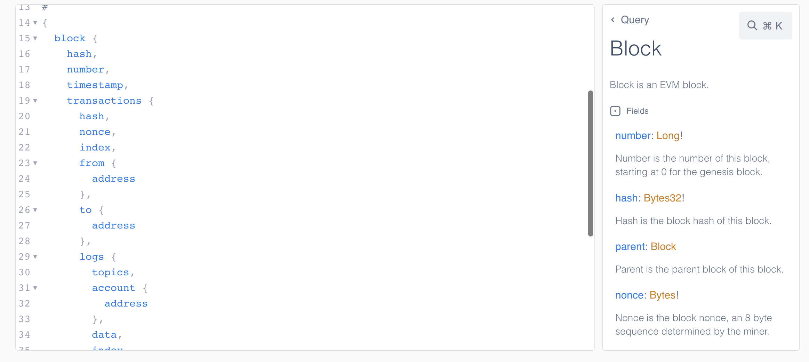

<Info>
  Check the [Chains](https://dashboard.alchemy.com/chains) page for details about product and chain support!

  
</Info>

# Introduction

Alchemy's Custom Webhook allows developers to stream on-chain data and get immediately notified about the most recent blockchain data changes. While previous Alchemy Notify solutions covered only pre-defined, transfers-based events, with Custom Webhooks, developers can understand any contract-based event, from token and marketplace activity, to comprehensive data ingestion. Custom Webhooks utilize a GraphQL interface so that web3 devs can have rich filters and only receive the precise blockchain data they need.

<Info>
  If you are looking for historical blockchain activity, check out the [Transfers API Endpoints](/reference/transfers-api-endpoints).
</Info>

# Example Response

With Custom Webhooks utilizing a GraphQL-style interface for queries, there are an infinite number of response payload combinations. While we cannot provide an exact example for each potential query, here is one potential response that highlights the nested structure of each query originating from the block level.

<CodeGroup>
  ```shell Custom Webhooks Response
  {
    "webhookId": "wh_a55wfsvq5h8n8u3z",
    "id": "whevt_rsdblc6zxi8a6ntl",
    "createdAt": "2024-01-23T07:51:07.945953790Z",
    "type": "GRAPHQL",
    "event": {
      "data": {
        "block": {
          "logs": [
            {
              "transaction": {
                "hash": "0x8a179038d909c1906fddf0a2d38e4d3ef76eba30c1c26f758451e3b69a64f5a6",
                "index": 105,
                "from": {
                  "address": "0xeeda051ab883d52923bc0951dd2edcbc7c0da597"
                },
                "to": {
                  "address": "0xdafce4acc2703a24f29d1321adaadf5768f54642"
                },
                "maxFeePerGas": "0x7a06d848c",
                "maxPriorityFeePerGas": "0x59682f00",
                "gasUsed": 628816,
                "cumulativeGasUsed": 10040718,
                "effectiveGasPrice": "0x57cc4f32c",
                "logs": [
                  {
                    "account": {
                      "address": "0xbc4ca0eda7647a8ab7c2061c2e118a18a936f13d"
                    },
                    "topics": [
                      "0x8c5be1e5ebec7d5bd14f71427d1e84f3dd0314c0f7b2291e5b200ac8c7c3b925",
                      "0x000000000000000000000000dbfd76af2157dc15ee4e57f3f942bb45ba84af24",
                      "0x0000000000000000000000000000000000000000000000000000000000000000",
                      "0x00000000000000000000000000000000000000000000000000000000000006e5"
                    ],
                    "index": 238
                  },
                  {
                    "account": {
                      "address": "0xbc4ca0eda7647a8ab7c2061c2e118a18a936f13d"
                    },
                    "topics": [
                      "0xddf252ad1be2c89b69c2b068fc378daa952ba7f163c4a11628f55a4df523b3ef",
                      "0x000000000000000000000000dbfd76af2157dc15ee4e57f3f942bb45ba84af24",
                      "0x000000000000000000000000dafce4acc2703a24f29d1321adaadf5768f54642",
                      "0x00000000000000000000000000000000000000000000000000000000000006e5"
                    ],
                    "index": 239
                  },
                  {
                    "account": {
                      "address": "0xbc4ca0eda7647a8ab7c2061c2e118a18a936f13d"
                    },
                    "topics": [
                      "0x8c5be1e5ebec7d5bd14f71427d1e84f3dd0314c0f7b2291e5b200ac8c7c3b925",
                      "0x000000000000000000000000dafce4acc2703a24f29d1321adaadf5768f54642",
                      "0x0000000000000000000000000000000000000000000000000000000000000000",
                      "0x00000000000000000000000000000000000000000000000000000000000006e5"
                    ],
                    "index": 240
                  },
                  {
                    "account": {
                      "address": "0xbc4ca0eda7647a8ab7c2061c2e118a18a936f13d"
                    },
                    "topics": [
                      "0xddf252ad1be2c89b69c2b068fc378daa952ba7f163c4a11628f55a4df523b3ef",
                      "0x000000000000000000000000dafce4acc2703a24f29d1321adaadf5768f54642",
                      "0x0000000000000000000000008e2c220cebe2072f734e6d2338c3410b03d987cc",
                      "0x00000000000000000000000000000000000000000000000000000000000006e5"
                    ],
                    "index": 241
                  },
                  {
                    "account": {
                      "address": "0x4d224452801aced8b2f0aebe155379bb5d594381"
                    },
                    "topics": [
                      "0xddf252ad1be2c89b69c2b068fc378daa952ba7f163c4a11628f55a4df523b3ef",
                      "0x0000000000000000000000005954ab967bc958940b7eb73ee84797dc8a2afbb9",
                      "0x0000000000000000000000008e2c220cebe2072f734e6d2338c3410b03d987cc"
                    ],
                    "index": 242
                  },
                  {
                    "account": {
                      "address": "0x5954ab967bc958940b7eb73ee84797dc8a2afbb9"
                    },
                    "topics": [
                      "0xd334b3114fc25cbd72389ff9c361d5f8b0924e35fa237c65ac209a2cdcf4ba13",
                      "0x0000000000000000000000008e2c220cebe2072f734e6d2338c3410b03d987cc",
                      "0x0000000000000000000000000000000000000000000000000000000000000001"
                    ],
                    "index": 243
                  },
                  {
                    "account": {
                      "address": "0x5954ab967bc958940b7eb73ee84797dc8a2afbb9"
                    },
                    "topics": [
                      "0x46916533b23d6665275e4143ec7eeb4b6b4ae92178ebbfe99f112564d2c7b1aa",
                      "0x0000000000000000000000008e2c220cebe2072f734e6d2338c3410b03d987cc",
                      "0x0000000000000000000000000000000000000000000000000000000000000001"
                    ],
                    "index": 244
                  },
                  {
                    "account": {
                      "address": "0x4d224452801aced8b2f0aebe155379bb5d594381"
                    },
                    "topics": [
                      "0xddf252ad1be2c89b69c2b068fc378daa952ba7f163c4a11628f55a4df523b3ef",
                      "0x0000000000000000000000005954ab967bc958940b7eb73ee84797dc8a2afbb9",
                      "0x0000000000000000000000008e2c220cebe2072f734e6d2338c3410b03d987cc"
                    ],
                    "index": 245
                  },
                  {
                    "account": {
                      "address": "0xbc4ca0eda7647a8ab7c2061c2e118a18a936f13d"
                    },
                    "topics": [
                      "0x8c5be1e5ebec7d5bd14f71427d1e84f3dd0314c0f7b2291e5b200ac8c7c3b925",
                      "0x0000000000000000000000008e2c220cebe2072f734e6d2338c3410b03d987cc",
                      "0x0000000000000000000000000000000000000000000000000000000000000000",
                      "0x00000000000000000000000000000000000000000000000000000000000006e5"
                    ],
                    "index": 246
                  },
                  {
                    "account": {
                      "address": "0xbc4ca0eda7647a8ab7c2061c2e118a18a936f13d"
                    },
                    "topics": [
                      "0xddf252ad1be2c89b69c2b068fc378daa952ba7f163c4a11628f55a4df523b3ef",
                      "0x0000000000000000000000008e2c220cebe2072f734e6d2338c3410b03d987cc",
                      "0x000000000000000000000000dafce4acc2703a24f29d1321adaadf5768f54642",
                      "0x00000000000000000000000000000000000000000000000000000000000006e5"
                    ],
                    "index": 247
                  },
                  {
                    "account": {
                      "address": "0xdafce4acc2703a24f29d1321adaadf5768f54642"
                    },
                    "topics": [
                      "0x6834bcb181c65df18ce2da14523ae95d5db81f9a666b2334d1b58e8caa952cfb",
                      "0x0000000000000000000000008e2c220cebe2072f734e6d2338c3410b03d987cc"
                    ],
                    "index": 248
                  },
                  {
                    "account": {
                      "address": "0x4d224452801aced8b2f0aebe155379bb5d594381"
                    },
                    "topics": [
                      "0xddf252ad1be2c89b69c2b068fc378daa952ba7f163c4a11628f55a4df523b3ef",
                      "0x0000000000000000000000008e2c220cebe2072f734e6d2338c3410b03d987cc",
                      "0x000000000000000000000000eeda051ab883d52923bc0951dd2edcbc7c0da597"
                    ],
                    "index": 249
                  },
                  {
                    "account": {
                      "address": "0xdafce4acc2703a24f29d1321adaadf5768f54642"
                    },
                    "topics": [
                      "0x26c0bb14e11e9523f44f08b2a825dca537906e0f69f7f106adddb627407287b2",
                      "0x0000000000000000000000008e2c220cebe2072f734e6d2338c3410b03d987cc",
                      "0x000000000000000000000000eeda051ab883d52923bc0951dd2edcbc7c0da597"
                    ],
                    "index": 250
                  },
                  {
                    "account": {
                      "address": "0x4d224452801aced8b2f0aebe155379bb5d594381"
                    },
                    "topics": [
                      "0xddf252ad1be2c89b69c2b068fc378daa952ba7f163c4a11628f55a4df523b3ef",
                      "0x0000000000000000000000008e2c220cebe2072f734e6d2338c3410b03d987cc",
                      "0x000000000000000000000000eeda051ab883d52923bc0951dd2edcbc7c0da597"
                    ],
                    "index": 251
                  },
                  {
                    "account": {
                      "address": "0xdafce4acc2703a24f29d1321adaadf5768f54642"
                    },
                    "topics": [
                      "0x9310ccfcb8de723f578a9e4282ea9f521f05ae40dc08f3068dfad528a65ee3c7",
                      "0x0000000000000000000000008e2c220cebe2072f734e6d2338c3410b03d987cc",
                      "0x000000000000000000000000eeda051ab883d52923bc0951dd2edcbc7c0da597"
                    ],
                    "index": 252
                  },
                  {
                    "account": {
                      "address": "0xbc4ca0eda7647a8ab7c2061c2e118a18a936f13d"
                    },
                    "topics": [
                      "0x8c5be1e5ebec7d5bd14f71427d1e84f3dd0314c0f7b2291e5b200ac8c7c3b925",
                      "0x000000000000000000000000dafce4acc2703a24f29d1321adaadf5768f54642",
                      "0x000000000000000000000000dbfd76af2157dc15ee4e57f3f942bb45ba84af24",
                      "0x00000000000000000000000000000000000000000000000000000000000006e5"
                    ],
                    "index": 253
                  },
                  {
                    "account": {
                      "address": "0xbc4ca0eda7647a8ab7c2061c2e118a18a936f13d"
                    },
                    "topics": [
                      "0x8c5be1e5ebec7d5bd14f71427d1e84f3dd0314c0f7b2291e5b200ac8c7c3b925",
                      "0x000000000000000000000000dafce4acc2703a24f29d1321adaadf5768f54642",
                      "0x0000000000000000000000000000000000000000000000000000000000000000",
                      "0x00000000000000000000000000000000000000000000000000000000000006e5"
                    ],
                    "index": 254
                  },
                  {
                    "account": {
                      "address": "0xbc4ca0eda7647a8ab7c2061c2e118a18a936f13d"
                    },
                    "topics": [
                      "0xddf252ad1be2c89b69c2b068fc378daa952ba7f163c4a11628f55a4df523b3ef",
                      "0x000000000000000000000000dafce4acc2703a24f29d1321adaadf5768f54642",
                      "0x000000000000000000000000dbfd76af2157dc15ee4e57f3f942bb45ba84af24",
                      "0x00000000000000000000000000000000000000000000000000000000000006e5"
                    ],
                    "index": 255
                  },
                  {
                    "account": {
                      "address": "0xdbfd76af2157dc15ee4e57f3f942bb45ba84af24"
                    },
                    "topics": [
                      "0x5a9eeaf8949838813289046091e8ea8a9196a2265ac24841464a2d27026a8549",
                      "0x000000000000000000000000dafce4acc2703a24f29d1321adaadf5768f54642",
                      "0x000000000000000000000000dafce4acc2703a24f29d1321adaadf5768f54642",
                      "0x000000000000000000000000bc4ca0eda7647a8ab7c2061c2e118a18a936f13d"
                    ],
                    "index": 256
                  },
                  {
                    "account": {
                      "address": "0xdbfd76af2157dc15ee4e57f3f942bb45ba84af24"
                    },
                    "topics": [
                      "0x24e54b4b5d12d667319275fb50d50071162f76f8062063c801f3bd99f9e57c39",
                      "0x0000000000000000000000005f6ac80cdb9e87f3cfa6a90e5140b9a16a361d5c",
                      "0x000000000000000000000000dafce4acc2703a24f29d1321adaadf5768f54642"
                    ],
                    "index": 257
                  },
                  {
                    "account": {
                      "address": "0x5f6ac80cdb9e87f3cfa6a90e5140b9a16a361d5c"
                    },
                    "topics": [
                      "0xe545d91adc7590a85edcad15f6db01579e5ec5f399437fecaa379e58c6891913",
                      "0x000000000000000000000000dafce4acc2703a24f29d1321adaadf5768f54642"
                    ],
                    "index": 258
                  }
                ],
                "type": 2,
                "status": 1
              }
            },
            {
              "transaction": {
                "hash": "0x8a179038d909c1906fddf0a2d38e4d3ef76eba30c1c26f758451e3b69a64f5a6",
                "index": 105,
                "from": {
                  "address": "0xeeda051ab883d52923bc0951dd2edcbc7c0da597"
                },
                "to": {
                  "address": "0xdafce4acc2703a24f29d1321adaadf5768f54642"
                },
                "maxFeePerGas": "0x7a06d848c",
                "maxPriorityFeePerGas": "0x59682f00",
                "gasUsed": 628816,
                "cumulativeGasUsed": 10040718,
                "effectiveGasPrice": "0x57cc4f32c",
                "logs": [
                  {
                    "account": {
                      "address": "0xbc4ca0eda7647a8ab7c2061c2e118a18a936f13d"
                    },
                    "topics": [
                      "0x8c5be1e5ebec7d5bd14f71427d1e84f3dd0314c0f7b2291e5b200ac8c7c3b925",
                      "0x000000000000000000000000dbfd76af2157dc15ee4e57f3f942bb45ba84af24",
                      "0x0000000000000000000000000000000000000000000000000000000000000000",
                      "0x00000000000000000000000000000000000000000000000000000000000006e5"
                    ],
                    "index": 238
                  },
                  {
                    "account": {
                      "address": "0xbc4ca0eda7647a8ab7c2061c2e118a18a936f13d"
                    },
                    "topics": [
                      "0xddf252ad1be2c89b69c2b068fc378daa952ba7f163c4a11628f55a4df523b3ef",
                      "0x000000000000000000000000dbfd76af2157dc15ee4e57f3f942bb45ba84af24",
                      "0x000000000000000000000000dafce4acc2703a24f29d1321adaadf5768f54642",
                      "0x00000000000000000000000000000000000000000000000000000000000006e5"
                    ],
                    "index": 239
                  },
                  {
                    "account": {
                      "address": "0xbc4ca0eda7647a8ab7c2061c2e118a18a936f13d"
                    },
                    "topics": [
                      "0x8c5be1e5ebec7d5bd14f71427d1e84f3dd0314c0f7b2291e5b200ac8c7c3b925",
                      "0x000000000000000000000000dafce4acc2703a24f29d1321adaadf5768f54642",
                      "0x0000000000000000000000000000000000000000000000000000000000000000",
                      "0x00000000000000000000000000000000000000000000000000000000000006e5"
                    ],
                    "index": 240
                  },
                  {
                    "account": {
                      "address": "0xbc4ca0eda7647a8ab7c2061c2e118a18a936f13d"
                    },
                    "topics": [
                      "0xddf252ad1be2c89b69c2b068fc378daa952ba7f163c4a11628f55a4df523b3ef",
                      "0x000000000000000000000000dafce4acc2703a24f29d1321adaadf5768f54642",
                      "0x0000000000000000000000008e2c220cebe2072f734e6d2338c3410b03d987cc",
                      "0x00000000000000000000000000000000000000000000000000000000000006e5"
                    ],
                    "index": 241
                  },
                  {
                    "account": {
                      "address": "0x4d224452801aced8b2f0aebe155379bb5d594381"
                    },
                    "topics": [
                      "0xddf252ad1be2c89b69c2b068fc378daa952ba7f163c4a11628f55a4df523b3ef",
                      "0x0000000000000000000000005954ab967bc958940b7eb73ee84797dc8a2afbb9",
                      "0x0000000000000000000000008e2c220cebe2072f734e6d2338c3410b03d987cc"
                    ],
                    "index": 242
                  },
                  {
                    "account": {
                      "address": "0x5954ab967bc958940b7eb73ee84797dc8a2afbb9"
                    },
                    "topics": [
                      "0xd334b3114fc25cbd72389ff9c361d5f8b0924e35fa237c65ac209a2cdcf4ba13",
                      "0x0000000000000000000000008e2c220cebe2072f734e6d2338c3410b03d987cc",
                      "0x0000000000000000000000000000000000000000000000000000000000000001"
                    ],
                    "index": 243
                  },
                  {
                    "account": {
                      "address": "0x5954ab967bc958940b7eb73ee84797dc8a2afbb9"
                    },
                    "topics": [
                      "0x46916533b23d6665275e4143ec7eeb4b6b4ae92178ebbfe99f112564d2c7b1aa",
                      "0x0000000000000000000000008e2c220cebe2072f734e6d2338c3410b03d987cc",
                      "0x0000000000000000000000000000000000000000000000000000000000000001"
                    ],
                    "index": 244
                  },
                  {
                    "account": {
                      "address": "0x4d224452801aced8b2f0aebe155379bb5d594381"
                    },
                    "topics": [
                      "0xddf252ad1be2c89b69c2b068fc378daa952ba7f163c4a11628f55a4df523b3ef",
                      "0x0000000000000000000000005954ab967bc958940b7eb73ee84797dc8a2afbb9",
                      "0x0000000000000000000000008e2c220cebe2072f734e6d2338c3410b03d987cc"
                    ],
                    "index": 245
                  },
                  {
                    "account": {
                      "address": "0xbc4ca0eda7647a8ab7c2061c2e118a18a936f13d"
                    },
                    "topics": [
                      "0x8c5be1e5ebec7d5bd14f71427d1e84f3dd0314c0f7b2291e5b200ac8c7c3b925",
                      "0x0000000000000000000000008e2c220cebe2072f734e6d2338c3410b03d987cc",
                      "0x0000000000000000000000000000000000000000000000000000000000000000",
                      "0x00000000000000000000000000000000000000000000000000000000000006e5"
                    ],
                    "index": 246
                  },
                  {
                    "account": {
                      "address": "0xbc4ca0eda7647a8ab7c2061c2e118a18a936f13d"
                    },
                    "topics": [
                      "0xddf252ad1be2c89b69c2b068fc378daa952ba7f163c4a11628f55a4df523b3ef",
                      "0x0000000000000000000000008e2c220cebe2072f734e6d2338c3410b03d987cc",
                      "0x000000000000000000000000dafce4acc2703a24f29d1321adaadf5768f54642",
                      "0x00000000000000000000000000000000000000000000000000000000000006e5"
                    ],
                    "index": 247
                  },
                  {
                    "account": {
                      "address": "0xdafce4acc2703a24f29d1321adaadf5768f54642"
                    },
                    "topics": [
                      "0x6834bcb181c65df18ce2da14523ae95d5db81f9a666b2334d1b58e8caa952cfb",
                      "0x0000000000000000000000008e2c220cebe2072f734e6d2338c3410b03d987cc"
                    ],
                    "index": 248
                  },
                  {
                    "account": {
                      "address": "0x4d224452801aced8b2f0aebe155379bb5d594381"
                    },
                    "topics": [
                      "0xddf252ad1be2c89b69c2b068fc378daa952ba7f163c4a11628f55a4df523b3ef",
                      "0x0000000000000000000000008e2c220cebe2072f734e6d2338c3410b03d987cc",
                      "0x000000000000000000000000eeda051ab883d52923bc0951dd2edcbc7c0da597"
                    ],
                    "index": 249
                  },
                  {
                    "account": {
                      "address": "0xdafce4acc2703a24f29d1321adaadf5768f54642"
                    },
                    "topics": [
                      "0x26c0bb14e11e9523f44f08b2a825dca537906e0f69f7f106adddb627407287b2",
                      "0x0000000000000000000000008e2c220cebe2072f734e6d2338c3410b03d987cc",
                      "0x000000000000000000000000eeda051ab883d52923bc0951dd2edcbc7c0da597"
                    ],
                    "index": 250
                  },
                  {
                    "account": {
                      "address": "0x4d224452801aced8b2f0aebe155379bb5d594381"
                    },
                    "topics": [
                      "0xddf252ad1be2c89b69c2b068fc378daa952ba7f163c4a11628f55a4df523b3ef",
                      "0x0000000000000000000000008e2c220cebe2072f734e6d2338c3410b03d987cc",
                      "0x000000000000000000000000eeda051ab883d52923bc0951dd2edcbc7c0da597"
                    ],
                    "index": 251
                  },
                  {
                    "account": {
                      "address": "0xdafce4acc2703a24f29d1321adaadf5768f54642"
                    },
                    "topics": [
                      "0x9310ccfcb8de723f578a9e4282ea9f521f05ae40dc08f3068dfad528a65ee3c7",
                      "0x0000000000000000000000008e2c220cebe2072f734e6d2338c3410b03d987cc",
                      "0x000000000000000000000000eeda051ab883d52923bc0951dd2edcbc7c0da597"
                    ],
                    "index": 252
                  },
                  {
                    "account": {
                      "address": "0xbc4ca0eda7647a8ab7c2061c2e118a18a936f13d"
                    },
                    "topics": [
                      "0x8c5be1e5ebec7d5bd14f71427d1e84f3dd0314c0f7b2291e5b200ac8c7c3b925",
                      "0x000000000000000000000000dafce4acc2703a24f29d1321adaadf5768f54642",
                      "0x000000000000000000000000dbfd76af2157dc15ee4e57f3f942bb45ba84af24",
                      "0x00000000000000000000000000000000000000000000000000000000000006e5"
                    ],
                    "index": 253
                  },
                  {
                    "account": {
                      "address": "0xbc4ca0eda7647a8ab7c2061c2e118a18a936f13d"
                    },
                    "topics": [
                      "0x8c5be1e5ebec7d5bd14f71427d1e84f3dd0314c0f7b2291e5b200ac8c7c3b925",
                      "0x000000000000000000000000dafce4acc2703a24f29d1321adaadf5768f54642",
                      "0x0000000000000000000000000000000000000000000000000000000000000000",
                      "0x00000000000000000000000000000000000000000000000000000000000006e5"
                    ],
                    "index": 254
                  },
                  {
                    "account": {
                      "address": "0xbc4ca0eda7647a8ab7c2061c2e118a18a936f13d"
                    },
                    "topics": [
                      "0xddf252ad1be2c89b69c2b068fc378daa952ba7f163c4a11628f55a4df523b3ef",
                      "0x000000000000000000000000dafce4acc2703a24f29d1321adaadf5768f54642",
                      "0x000000000000000000000000dbfd76af2157dc15ee4e57f3f942bb45ba84af24",
                      "0x00000000000000000000000000000000000000000000000000000000000006e5"
                    ],
                    "index": 255
                  },
                  {
                    "account": {
                      "address": "0xdbfd76af2157dc15ee4e57f3f942bb45ba84af24"
                    },
                    "topics": [
                      "0x5a9eeaf8949838813289046091e8ea8a9196a2265ac24841464a2d27026a8549",
                      "0x000000000000000000000000dafce4acc2703a24f29d1321adaadf5768f54642",
                      "0x000000000000000000000000dafce4acc2703a24f29d1321adaadf5768f54642",
                      "0x000000000000000000000000bc4ca0eda7647a8ab7c2061c2e118a18a936f13d"
                    ],
                    "index": 256
                  },
                  {
                    "account": {
                      "address": "0xdbfd76af2157dc15ee4e57f3f942bb45ba84af24"
                    },
                    "topics": [
                      "0x24e54b4b5d12d667319275fb50d50071162f76f8062063c801f3bd99f9e57c39",
                      "0x0000000000000000000000005f6ac80cdb9e87f3cfa6a90e5140b9a16a361d5c",
                      "0x000000000000000000000000dafce4acc2703a24f29d1321adaadf5768f54642"
                    ],
                    "index": 257
                  },
                  {
                    "account": {
                      "address": "0x5f6ac80cdb9e87f3cfa6a90e5140b9a16a361d5c"
                    },
                    "topics": [
                      "0xe545d91adc7590a85edcad15f6db01579e5ec5f399437fecaa379e58c6891913",
                      "0x000000000000000000000000dafce4acc2703a24f29d1321adaadf5768f54642"
                    ],
                    "index": 258
                  }
                ],
                "type": 2,
                "status": 1
              }
            },
            {
              "transaction": {
                "hash": "0x8a179038d909c1906fddf0a2d38e4d3ef76eba30c1c26f758451e3b69a64f5a6",
                "index": 105,
                "from": {
                  "address": "0xeeda051ab883d52923bc0951dd2edcbc7c0da597"
                },
                "to": {
                  "address": "0xdafce4acc2703a24f29d1321adaadf5768f54642"
                },
                "maxFeePerGas": "0x7a06d848c",
                "maxPriorityFeePerGas": "0x59682f00",
                "gasUsed": 628816,
                "cumulativeGasUsed": 10040718,
                "effectiveGasPrice": "0x57cc4f32c",
                "logs": [
                  {
                    "account": {
                      "address": "0xbc4ca0eda7647a8ab7c2061c2e118a18a936f13d"
                    },
                    "topics": [
                      "0x8c5be1e5ebec7d5bd14f71427d1e84f3dd0314c0f7b2291e5b200ac8c7c3b925",
                      "0x000000000000000000000000dbfd76af2157dc15ee4e57f3f942bb45ba84af24",
                      "0x0000000000000000000000000000000000000000000000000000000000000000",
                      "0x00000000000000000000000000000000000000000000000000000000000006e5"
                    ],
                    "index": 238
                  },
                  {
                    "account": {
                      "address": "0xbc4ca0eda7647a8ab7c2061c2e118a18a936f13d"
                    },
                    "topics": [
                      "0xddf252ad1be2c89b69c2b068fc378daa952ba7f163c4a11628f55a4df523b3ef",
                      "0x000000000000000000000000dbfd76af2157dc15ee4e57f3f942bb45ba84af24",
                      "0x000000000000000000000000dafce4acc2703a24f29d1321adaadf5768f54642",
                      "0x00000000000000000000000000000000000000000000000000000000000006e5"
                    ],
                    "index": 239
                  },
                  {
                    "account": {
                      "address": "0xbc4ca0eda7647a8ab7c2061c2e118a18a936f13d"
                    },
                    "topics": [
                      "0x8c5be1e5ebec7d5bd14f71427d1e84f3dd0314c0f7b2291e5b200ac8c7c3b925",
                      "0x000000000000000000000000dafce4acc2703a24f29d1321adaadf5768f54642",
                      "0x0000000000000000000000000000000000000000000000000000000000000000",
                      "0x00000000000000000000000000000000000000000000000000000000000006e5"
                    ],
                    "index": 240
                  },
                  {
                    "account": {
                      "address": "0xbc4ca0eda7647a8ab7c2061c2e118a18a936f13d"
                    },
                    "topics": [
                      "0xddf252ad1be2c89b69c2b068fc378daa952ba7f163c4a11628f55a4df523b3ef",
                      "0x000000000000000000000000dafce4acc2703a24f29d1321adaadf5768f54642",
                      "0x0000000000000000000000008e2c220cebe2072f734e6d2338c3410b03d987cc",
                      "0x00000000000000000000000000000000000000000000000000000000000006e5"
                    ],
                    "index": 241
                  },
                  {
                    "account": {
                      "address": "0x4d224452801aced8b2f0aebe155379bb5d594381"
                    },
                    "topics": [
                      "0xddf252ad1be2c89b69c2b068fc378daa952ba7f163c4a11628f55a4df523b3ef",
                      "0x0000000000000000000000005954ab967bc958940b7eb73ee84797dc8a2afbb9",
                      "0x0000000000000000000000008e2c220cebe2072f734e6d2338c3410b03d987cc"
                    ],
                    "index": 242
                  },
                  {
                    "account": {
                      "address": "0x5954ab967bc958940b7eb73ee84797dc8a2afbb9"
                    },
                    "topics": [
                      "0xd334b3114fc25cbd72389ff9c361d5f8b0924e35fa237c65ac209a2cdcf4ba13",
                      "0x0000000000000000000000008e2c220cebe2072f734e6d2338c3410b03d987cc",
                      "0x0000000000000000000000000000000000000000000000000000000000000001"
                    ],
                    "index": 243
                  },
                  {
                    "account": {
                      "address": "0x5954ab967bc958940b7eb73ee84797dc8a2afbb9"
                    },
                    "topics": [
                      "0x46916533b23d6665275e4143ec7eeb4b6b4ae92178ebbfe99f112564d2c7b1aa",
                      "0x0000000000000000000000008e2c220cebe2072f734e6d2338c3410b03d987cc",
                      "0x0000000000000000000000000000000000000000000000000000000000000001"
                    ],
                    "index": 244
                  },
                  {
                    "account": {
                      "address": "0x4d224452801aced8b2f0aebe155379bb5d594381"
                    },
                    "topics": [
                      "0xddf252ad1be2c89b69c2b068fc378daa952ba7f163c4a11628f55a4df523b3ef",
                      "0x0000000000000000000000005954ab967bc958940b7eb73ee84797dc8a2afbb9",
                      "0x0000000000000000000000008e2c220cebe2072f734e6d2338c3410b03d987cc"
                    ],
                    "index": 245
                  },
                  {
                    "account": {
                      "address": "0xbc4ca0eda7647a8ab7c2061c2e118a18a936f13d"
                    },
                    "topics": [
                      "0x8c5be1e5ebec7d5bd14f71427d1e84f3dd0314c0f7b2291e5b200ac8c7c3b925",
                      "0x0000000000000000000000008e2c220cebe2072f734e6d2338c3410b03d987cc",
                      "0x0000000000000000000000000000000000000000000000000000000000000000",
                      "0x00000000000000000000000000000000000000000000000000000000000006e5"
                    ],
                    "index": 246
                  },
                  {
                    "account": {
                      "address": "0xbc4ca0eda7647a8ab7c2061c2e118a18a936f13d"
                    },
                    "topics": [
                      "0xddf252ad1be2c89b69c2b068fc378daa952ba7f163c4a11628f55a4df523b3ef",
                      "0x0000000000000000000000008e2c220cebe2072f734e6d2338c3410b03d987cc",
                      "0x000000000000000000000000dafce4acc2703a24f29d1321adaadf5768f54642",
                      "0x00000000000000000000000000000000000000000000000000000000000006e5"
                    ],
                    "index": 247
                  },
                  {
                    "account": {
                      "address": "0xdafce4acc2703a24f29d1321adaadf5768f54642"
                    },
                    "topics": [
                      "0x6834bcb181c65df18ce2da14523ae95d5db81f9a666b2334d1b58e8caa952cfb",
                      "0x0000000000000000000000008e2c220cebe2072f734e6d2338c3410b03d987cc"
                    ],
                    "index": 248
                  },
                  {
                    "account": {
                      "address": "0x4d224452801aced8b2f0aebe155379bb5d594381"
                    },
                    "topics": [
                      "0xddf252ad1be2c89b69c2b068fc378daa952ba7f163c4a11628f55a4df523b3ef",
                      "0x0000000000000000000000008e2c220cebe2072f734e6d2338c3410b03d987cc",
                      "0x000000000000000000000000eeda051ab883d52923bc0951dd2edcbc7c0da597"
                    ],
                    "index": 249
                  },
                  {
                    "account": {
                      "address": "0xdafce4acc2703a24f29d1321adaadf5768f54642"
                    },
                    "topics": [
                      "0x26c0bb14e11e9523f44f08b2a825dca537906e0f69f7f106adddb627407287b2",
                      "0x0000000000000000000000008e2c220cebe2072f734e6d2338c3410b03d987cc",
                      "0x000000000000000000000000eeda051ab883d52923bc0951dd2edcbc7c0da597"
                    ],
                    "index": 250
                  },
                  {
                    "account": {
                      "address": "0x4d224452801aced8b2f0aebe155379bb5d594381"
                    },
                    "topics": [
                      "0xddf252ad1be2c89b69c2b068fc378daa952ba7f163c4a11628f55a4df523b3ef",
                      "0x0000000000000000000000008e2c220cebe2072f734e6d2338c3410b03d987cc",
                      "0x000000000000000000000000eeda051ab883d52923bc0951dd2edcbc7c0da597"
                    ],
                    "index": 251
                  },
                  {
                    "account": {
                      "address": "0xdafce4acc2703a24f29d1321adaadf5768f54642"
                    },
                    "topics": [
                      "0x9310ccfcb8de723f578a9e4282ea9f521f05ae40dc08f3068dfad528a65ee3c7",
                      "0x0000000000000000000000008e2c220cebe2072f734e6d2338c3410b03d987cc",
                      "0x000000000000000000000000eeda051ab883d52923bc0951dd2edcbc7c0da597"
                    ],
                    "index": 252
                  },
                  {
                    "account": {
                      "address": "0xbc4ca0eda7647a8ab7c2061c2e118a18a936f13d"
                    },
                    "topics": [
                      "0x8c5be1e5ebec7d5bd14f71427d1e84f3dd0314c0f7b2291e5b200ac8c7c3b925",
                      "0x000000000000000000000000dafce4acc2703a24f29d1321adaadf5768f54642",
                      "0x000000000000000000000000dbfd76af2157dc15ee4e57f3f942bb45ba84af24",
                      "0x00000000000000000000000000000000000000000000000000000000000006e5"
                    ],
                    "index": 253
                  },
                  {
                    "account": {
                      "address": "0xbc4ca0eda7647a8ab7c2061c2e118a18a936f13d"
                    },
                    "topics": [
                      "0x8c5be1e5ebec7d5bd14f71427d1e84f3dd0314c0f7b2291e5b200ac8c7c3b925",
                      "0x000000000000000000000000dafce4acc2703a24f29d1321adaadf5768f54642",
                      "0x0000000000000000000000000000000000000000000000000000000000000000",
                      "0x00000000000000000000000000000000000000000000000000000000000006e5"
                    ],
                    "index": 254
                  },
                  {
                    "account": {
                      "address": "0xbc4ca0eda7647a8ab7c2061c2e118a18a936f13d"
                    },
                    "topics": [
                      "0xddf252ad1be2c89b69c2b068fc378daa952ba7f163c4a11628f55a4df523b3ef",
                      "0x000000000000000000000000dafce4acc2703a24f29d1321adaadf5768f54642",
                      "0x000000000000000000000000dbfd76af2157dc15ee4e57f3f942bb45ba84af24",
                      "0x00000000000000000000000000000000000000000000000000000000000006e5"
                    ],
                    "index": 255
                  },
                  {
                    "account": {
                      "address": "0xdbfd76af2157dc15ee4e57f3f942bb45ba84af24"
                    },
                    "topics": [
                      "0x5a9eeaf8949838813289046091e8ea8a9196a2265ac24841464a2d27026a8549",
                      "0x000000000000000000000000dafce4acc2703a24f29d1321adaadf5768f54642",
                      "0x000000000000000000000000dafce4acc2703a24f29d1321adaadf5768f54642",
                      "0x000000000000000000000000bc4ca0eda7647a8ab7c2061c2e118a18a936f13d"
                    ],
                    "index": 256
                  },
                  {
                    "account": {
                      "address": "0xdbfd76af2157dc15ee4e57f3f942bb45ba84af24"
                    },
                    "topics": [
                      "0x24e54b4b5d12d667319275fb50d50071162f76f8062063c801f3bd99f9e57c39",
                      "0x0000000000000000000000005f6ac80cdb9e87f3cfa6a90e5140b9a16a361d5c",
                      "0x000000000000000000000000dafce4acc2703a24f29d1321adaadf5768f54642"
                    ],
                    "index": 257
                  },
                  {
                    "account": {
                      "address": "0x5f6ac80cdb9e87f3cfa6a90e5140b9a16a361d5c"
                    },
                    "topics": [
                      "0xe545d91adc7590a85edcad15f6db01579e5ec5f399437fecaa379e58c6891913",
                      "0x000000000000000000000000dafce4acc2703a24f29d1321adaadf5768f54642"
                    ],
                    "index": 258
                  }
                ],
                "type": 2,
                "status": 1
              }
            },
            {
              "transaction": {
                "hash": "0x8a179038d909c1906fddf0a2d38e4d3ef76eba30c1c26f758451e3b69a64f5a6",
                "index": 105,
                "from": {
                  "address": "0xeeda051ab883d52923bc0951dd2edcbc7c0da597"
                },
                "to": {
                  "address": "0xdafce4acc2703a24f29d1321adaadf5768f54642"
                },
                "maxFeePerGas": "0x7a06d848c",
                "maxPriorityFeePerGas": "0x59682f00",
                "gasUsed": 628816,
                "cumulativeGasUsed": 10040718,
                "effectiveGasPrice": "0x57cc4f32c",
                "logs": [
                  {
                    "account": {
                      "address": "0xbc4ca0eda7647a8ab7c2061c2e118a18a936f13d"
                    },
                    "topics": [
                      "0x8c5be1e5ebec7d5bd14f71427d1e84f3dd0314c0f7b2291e5b200ac8c7c3b925",
                      "0x000000000000000000000000dbfd76af2157dc15ee4e57f3f942bb45ba84af24",
                      "0x0000000000000000000000000000000000000000000000000000000000000000",
                      "0x00000000000000000000000000000000000000000000000000000000000006e5"
                    ],
                    "index": 238
                  },
                  {
                    "account": {
                      "address": "0xbc4ca0eda7647a8ab7c2061c2e118a18a936f13d"
                    },
                    "topics": [
                      "0xddf252ad1be2c89b69c2b068fc378daa952ba7f163c4a11628f55a4df523b3ef",
                      "0x000000000000000000000000dbfd76af2157dc15ee4e57f3f942bb45ba84af24",
                      "0x000000000000000000000000dafce4acc2703a24f29d1321adaadf5768f54642",
                      "0x00000000000000000000000000000000000000000000000000000000000006e5"
                    ],
                    "index": 239
                  },
                  {
                    "account": {
                      "address": "0xbc4ca0eda7647a8ab7c2061c2e118a18a936f13d"
                    },
                    "topics": [
                      "0x8c5be1e5ebec7d5bd14f71427d1e84f3dd0314c0f7b2291e5b200ac8c7c3b925",
                      "0x000000000000000000000000dafce4acc2703a24f29d1321adaadf5768f54642",
                      "0x0000000000000000000000000000000000000000000000000000000000000000",
                      "0x00000000000000000000000000000000000000000000000000000000000006e5"
                    ],
                    "index": 240
                  },
                  {
                    "account": {
                      "address": "0xbc4ca0eda7647a8ab7c2061c2e118a18a936f13d"
                    },
                    "topics": [
                      "0xddf252ad1be2c89b69c2b068fc378daa952ba7f163c4a11628f55a4df523b3ef",
                      "0x000000000000000000000000dafce4acc2703a24f29d1321adaadf5768f54642",
                      "0x0000000000000000000000008e2c220cebe2072f734e6d2338c3410b03d987cc",
                      "0x00000000000000000000000000000000000000000000000000000000000006e5"
                    ],
                    "index": 241
                  },
                  {
                    "account": {
                      "address": "0x4d224452801aced8b2f0aebe155379bb5d594381"
                    },
                    "topics": [
                      "0xddf252ad1be2c89b69c2b068fc378daa952ba7f163c4a11628f55a4df523b3ef",
                      "0x0000000000000000000000005954ab967bc958940b7eb73ee84797dc8a2afbb9",
                      "0x0000000000000000000000008e2c220cebe2072f734e6d2338c3410b03d987cc"
                    ],
                    "index": 242
                  },
                  {
                    "account": {
                      "address": "0x5954ab967bc958940b7eb73ee84797dc8a2afbb9"
                    },
                    "topics": [
                      "0xd334b3114fc25cbd72389ff9c361d5f8b0924e35fa237c65ac209a2cdcf4ba13",
                      "0x0000000000000000000000008e2c220cebe2072f734e6d2338c3410b03d987cc",
                      "0x0000000000000000000000000000000000000000000000000000000000000001"
                    ],
                    "index": 243
                  },
                  {
                    "account": {
                      "address": "0x5954ab967bc958940b7eb73ee84797dc8a2afbb9"
                    },
                    "topics": [
                      "0x46916533b23d6665275e4143ec7eeb4b6b4ae92178ebbfe99f112564d2c7b1aa",
                      "0x0000000000000000000000008e2c220cebe2072f734e6d2338c3410b03d987cc",
                      "0x0000000000000000000000000000000000000000000000000000000000000001"
                    ],
                    "index": 244
                  },
                  {
                    "account": {
                      "address": "0x4d224452801aced8b2f0aebe155379bb5d594381"
                    },
                    "topics": [
                      "0xddf252ad1be2c89b69c2b068fc378daa952ba7f163c4a11628f55a4df523b3ef",
                      "0x0000000000000000000000005954ab967bc958940b7eb73ee84797dc8a2afbb9",
                      "0x0000000000000000000000008e2c220cebe2072f734e6d2338c3410b03d987cc"
                    ],
                    "index": 245
                  },
                  {
                    "account": {
                      "address": "0xbc4ca0eda7647a8ab7c2061c2e118a18a936f13d"
                    },
                    "topics": [
                      "0x8c5be1e5ebec7d5bd14f71427d1e84f3dd0314c0f7b2291e5b200ac8c7c3b925",
                      "0x0000000000000000000000008e2c220cebe2072f734e6d2338c3410b03d987cc",
                      "0x0000000000000000000000000000000000000000000000000000000000000000",
                      "0x00000000000000000000000000000000000000000000000000000000000006e5"
                    ],
                    "index": 246
                  },
                  {
                    "account": {
                      "address": "0xbc4ca0eda7647a8ab7c2061c2e118a18a936f13d"
                    },
                    "topics": [
                      "0xddf252ad1be2c89b69c2b068fc378daa952ba7f163c4a11628f55a4df523b3ef",
                      "0x0000000000000000000000008e2c220cebe2072f734e6d2338c3410b03d987cc",
                      "0x000000000000000000000000dafce4acc2703a24f29d1321adaadf5768f54642",
                      "0x00000000000000000000000000000000000000000000000000000000000006e5"
                    ],
                    "index": 247
                  },
                  {
                    "account": {
                      "address": "0xdafce4acc2703a24f29d1321adaadf5768f54642"
                    },
                    "topics": [
                      "0x6834bcb181c65df18ce2da14523ae95d5db81f9a666b2334d1b58e8caa952cfb",
                      "0x0000000000000000000000008e2c220cebe2072f734e6d2338c3410b03d987cc"
                    ],
                    "index": 248
                  },
                  {
                    "account": {
                      "address": "0x4d224452801aced8b2f0aebe155379bb5d594381"
                    },
                    "topics": [
                      "0xddf252ad1be2c89b69c2b068fc378daa952ba7f163c4a11628f55a4df523b3ef",
                      "0x0000000000000000000000008e2c220cebe2072f734e6d2338c3410b03d987cc",
                      "0x000000000000000000000000eeda051ab883d52923bc0951dd2edcbc7c0da597"
                    ],
                    "index": 249
                  },
                  {
                    "account": {
                      "address": "0xdafce4acc2703a24f29d1321adaadf5768f54642"
                    },
                    "topics": [
                      "0x26c0bb14e11e9523f44f08b2a825dca537906e0f69f7f106adddb627407287b2",
                      "0x0000000000000000000000008e2c220cebe2072f734e6d2338c3410b03d987cc",
                      "0x000000000000000000000000eeda051ab883d52923bc0951dd2edcbc7c0da597"
                    ],
                    "index": 250
                  },
                  {
                    "account": {
                      "address": "0x4d224452801aced8b2f0aebe155379bb5d594381"
                    },
                    "topics": [
                      "0xddf252ad1be2c89b69c2b068fc378daa952ba7f163c4a11628f55a4df523b3ef",
                      "0x0000000000000000000000008e2c220cebe2072f734e6d2338c3410b03d987cc",
                      "0x000000000000000000000000eeda051ab883d52923bc0951dd2edcbc7c0da597"
                    ],
                    "index": 251
                  },
                  {
                    "account": {
                      "address": "0xdafce4acc2703a24f29d1321adaadf5768f54642"
                    },
                    "topics": [
                      "0x9310ccfcb8de723f578a9e4282ea9f521f05ae40dc08f3068dfad528a65ee3c7",
                      "0x0000000000000000000000008e2c220cebe2072f734e6d2338c3410b03d987cc",
                      "0x000000000000000000000000eeda051ab883d52923bc0951dd2edcbc7c0da597"
                    ],
                    "index": 252
                  },
                  {
                    "account": {
                      "address": "0xbc4ca0eda7647a8ab7c2061c2e118a18a936f13d"
                    },
                    "topics": [
                      "0x8c5be1e5ebec7d5bd14f71427d1e84f3dd0314c0f7b2291e5b200ac8c7c3b925",
                      "0x000000000000000000000000dafce4acc2703a24f29d1321adaadf5768f54642",
                      "0x000000000000000000000000dbfd76af2157dc15ee4e57f3f942bb45ba84af24",
                      "0x00000000000000000000000000000000000000000000000000000000000006e5"
                    ],
                    "index": 253
                  },
                  {
                    "account": {
                      "address": "0xbc4ca0eda7647a8ab7c2061c2e118a18a936f13d"
                    },
                    "topics": [
                      "0x8c5be1e5ebec7d5bd14f71427d1e84f3dd0314c0f7b2291e5b200ac8c7c3b925",
                      "0x000000000000000000000000dafce4acc2703a24f29d1321adaadf5768f54642",
                      "0x0000000000000000000000000000000000000000000000000000000000000000",
                      "0x00000000000000000000000000000000000000000000000000000000000006e5"
                    ],
                    "index": 254
                  },
                  {
                    "account": {
                      "address": "0xbc4ca0eda7647a8ab7c2061c2e118a18a936f13d"
                    },
                    "topics": [
                      "0xddf252ad1be2c89b69c2b068fc378daa952ba7f163c4a11628f55a4df523b3ef",
                      "0x000000000000000000000000dafce4acc2703a24f29d1321adaadf5768f54642",
                      "0x000000000000000000000000dbfd76af2157dc15ee4e57f3f942bb45ba84af24",
                      "0x00000000000000000000000000000000000000000000000000000000000006e5"
                    ],
                    "index": 255
                  },
                  {
                    "account": {
                      "address": "0xdbfd76af2157dc15ee4e57f3f942bb45ba84af24"
                    },
                    "topics": [
                      "0x5a9eeaf8949838813289046091e8ea8a9196a2265ac24841464a2d27026a8549",
                      "0x000000000000000000000000dafce4acc2703a24f29d1321adaadf5768f54642",
                      "0x000000000000000000000000dafce4acc2703a24f29d1321adaadf5768f54642",
                      "0x000000000000000000000000bc4ca0eda7647a8ab7c2061c2e118a18a936f13d"
                    ],
                    "index": 256
                  },
                  {
                    "account": {
                      "address": "0xdbfd76af2157dc15ee4e57f3f942bb45ba84af24"
                    },
                    "topics": [
                      "0x24e54b4b5d12d667319275fb50d50071162f76f8062063c801f3bd99f9e57c39",
                      "0x0000000000000000000000005f6ac80cdb9e87f3cfa6a90e5140b9a16a361d5c",
                      "0x000000000000000000000000dafce4acc2703a24f29d1321adaadf5768f54642"
                    ],
                    "index": 257
                  },
                  {
                    "account": {
                      "address": "0x5f6ac80cdb9e87f3cfa6a90e5140b9a16a361d5c"
                    },
                    "topics": [
                      "0xe545d91adc7590a85edcad15f6db01579e5ec5f399437fecaa379e58c6891913",
                      "0x000000000000000000000000dafce4acc2703a24f29d1321adaadf5768f54642"
                    ],
                    "index": 258
                  }
                ],
                "type": 2,
                "status": 1
              }
            },
            {
              "transaction": {
                "hash": "0x8a179038d909c1906fddf0a2d38e4d3ef76eba30c1c26f758451e3b69a64f5a6",
                "index": 105,
                "from": {
                  "address": "0xeeda051ab883d52923bc0951dd2edcbc7c0da597"
                },
                "to": {
                  "address": "0xdafce4acc2703a24f29d1321adaadf5768f54642"
                },
                "maxFeePerGas": "0x7a06d848c",
                "maxPriorityFeePerGas": "0x59682f00",
                "gasUsed": 628816,
                "cumulativeGasUsed": 10040718,
                "effectiveGasPrice": "0x57cc4f32c",
                "logs": [
                  {
                    "account": {
                      "address": "0xbc4ca0eda7647a8ab7c2061c2e118a18a936f13d"
                    },
                    "topics": [
                      "0x8c5be1e5ebec7d5bd14f71427d1e84f3dd0314c0f7b2291e5b200ac8c7c3b925",
                      "0x000000000000000000000000dbfd76af2157dc15ee4e57f3f942bb45ba84af24",
                      "0x0000000000000000000000000000000000000000000000000000000000000000",
                      "0x00000000000000000000000000000000000000000000000000000000000006e5"
                    ],
                    "index": 238
                  },
                  {
                    "account": {
                      "address": "0xbc4ca0eda7647a8ab7c2061c2e118a18a936f13d"
                    },
                    "topics": [
                      "0xddf252ad1be2c89b69c2b068fc378daa952ba7f163c4a11628f55a4df523b3ef",
                      "0x000000000000000000000000dbfd76af2157dc15ee4e57f3f942bb45ba84af24",
                      "0x000000000000000000000000dafce4acc2703a24f29d1321adaadf5768f54642",
                      "0x00000000000000000000000000000000000000000000000000000000000006e5"
                    ],
                    "index": 239
                  },
                  {
                    "account": {
                      "address": "0xbc4ca0eda7647a8ab7c2061c2e118a18a936f13d"
                    },
                    "topics": [
                      "0x8c5be1e5ebec7d5bd14f71427d1e84f3dd0314c0f7b2291e5b200ac8c7c3b925",
                      "0x000000000000000000000000dafce4acc2703a24f29d1321adaadf5768f54642",
                      "0x0000000000000000000000000000000000000000000000000000000000000000",
                      "0x00000000000000000000000000000000000000000000000000000000000006e5"
                    ],
                    "index": 240
                  },
                  {
                    "account": {
                      "address": "0xbc4ca0eda7647a8ab7c2061c2e118a18a936f13d"
                    },
                    "topics": [
                      "0xddf252ad1be2c89b69c2b068fc378daa952ba7f163c4a11628f55a4df523b3ef",
                      "0x000000000000000000000000dafce4acc2703a24f29d1321adaadf5768f54642",
                      "0x0000000000000000000000008e2c220cebe2072f734e6d2338c3410b03d987cc",
                      "0x00000000000000000000000000000000000000000000000000000000000006e5"
                    ],
                    "index": 241
                  },
                  {
                    "account": {
                      "address": "0x4d224452801aced8b2f0aebe155379bb5d594381"
                    },
                    "topics": [
                      "0xddf252ad1be2c89b69c2b068fc378daa952ba7f163c4a11628f55a4df523b3ef",
                      "0x0000000000000000000000005954ab967bc958940b7eb73ee84797dc8a2afbb9",
                      "0x0000000000000000000000008e2c220cebe2072f734e6d2338c3410b03d987cc"
                    ],
                    "index": 242
                  },
                  {
                    "account": {
                      "address": "0x5954ab967bc958940b7eb73ee84797dc8a2afbb9"
                    },
                    "topics": [
                      "0xd334b3114fc25cbd72389ff9c361d5f8b0924e35fa237c65ac209a2cdcf4ba13",
                      "0x0000000000000000000000008e2c220cebe2072f734e6d2338c3410b03d987cc",
                      "0x0000000000000000000000000000000000000000000000000000000000000001"
                    ],
                    "index": 243
                  },
                  {
                    "account": {
                      "address": "0x5954ab967bc958940b7eb73ee84797dc8a2afbb9"
                    },
                    "topics": [
                      "0x46916533b23d6665275e4143ec7eeb4b6b4ae92178ebbfe99f112564d2c7b1aa",
                      "0x0000000000000000000000008e2c220cebe2072f734e6d2338c3410b03d987cc",
                      "0x0000000000000000000000000000000000000000000000000000000000000001"
                    ],
                    "index": 244
                  },
                  {
                    "account": {
                      "address": "0x4d224452801aced8b2f0aebe155379bb5d594381"
                    },
                    "topics": [
                      "0xddf252ad1be2c89b69c2b068fc378daa952ba7f163c4a11628f55a4df523b3ef",
                      "0x0000000000000000000000005954ab967bc958940b7eb73ee84797dc8a2afbb9",
                      "0x0000000000000000000000008e2c220cebe2072f734e6d2338c3410b03d987cc"
                    ],
                    "index": 245
                  },
                  {
                    "account": {
                      "address": "0xbc4ca0eda7647a8ab7c2061c2e118a18a936f13d"
                    },
                    "topics": [
                      "0x8c5be1e5ebec7d5bd14f71427d1e84f3dd0314c0f7b2291e5b200ac8c7c3b925",
                      "0x0000000000000000000000008e2c220cebe2072f734e6d2338c3410b03d987cc",
                      "0x0000000000000000000000000000000000000000000000000000000000000000",
                      "0x00000000000000000000000000000000000000000000000000000000000006e5"
                    ],
                    "index": 246
                  },
                  {
                    "account": {
                      "address": "0xbc4ca0eda7647a8ab7c2061c2e118a18a936f13d"
                    },
                    "topics": [
                      "0xddf252ad1be2c89b69c2b068fc378daa952ba7f163c4a11628f55a4df523b3ef",
                      "0x0000000000000000000000008e2c220cebe2072f734e6d2338c3410b03d987cc",
                      "0x000000000000000000000000dafce4acc2703a24f29d1321adaadf5768f54642",
                      "0x00000000000000000000000000000000000000000000000000000000000006e5"
                    ],
                    "index": 247
                  },
                  {
                    "account": {
                      "address": "0xdafce4acc2703a24f29d1321adaadf5768f54642"
                    },
                    "topics": [
                      "0x6834bcb181c65df18ce2da14523ae95d5db81f9a666b2334d1b58e8caa952cfb",
                      "0x0000000000000000000000008e2c220cebe2072f734e6d2338c3410b03d987cc"
                    ],
                    "index": 248
                  },
                  {
                    "account": {
                      "address": "0x4d224452801aced8b2f0aebe155379bb5d594381"
                    },
                    "topics": [
                      "0xddf252ad1be2c89b69c2b068fc378daa952ba7f163c4a11628f55a4df523b3ef",
                      "0x0000000000000000000000008e2c220cebe2072f734e6d2338c3410b03d987cc",
                      "0x000000000000000000000000eeda051ab883d52923bc0951dd2edcbc7c0da597"
                    ],
                    "index": 249
                  },
                  {
                    "account": {
                      "address": "0xdafce4acc2703a24f29d1321adaadf5768f54642"
                    },
                    "topics": [
                      "0x26c0bb14e11e9523f44f08b2a825dca537906e0f69f7f106adddb627407287b2",
                      "0x0000000000000000000000008e2c220cebe2072f734e6d2338c3410b03d987cc",
                      "0x000000000000000000000000eeda051ab883d52923bc0951dd2edcbc7c0da597"
                    ],
                    "index": 250
                  },
                  {
                    "account": {
                      "address": "0x4d224452801aced8b2f0aebe155379bb5d594381"
                    },
                    "topics": [
                      "0xddf252ad1be2c89b69c2b068fc378daa952ba7f163c4a11628f55a4df523b3ef",
                      "0x0000000000000000000000008e2c220cebe2072f734e6d2338c3410b03d987cc",
                      "0x000000000000000000000000eeda051ab883d52923bc0951dd2edcbc7c0da597"
                    ],
                    "index": 251
                  },
                  {
                    "account": {
                      "address": "0xdafce4acc2703a24f29d1321adaadf5768f54642"
                    },
                    "topics": [
                      "0x9310ccfcb8de723f578a9e4282ea9f521f05ae40dc08f3068dfad528a65ee3c7",
                      "0x0000000000000000000000008e2c220cebe2072f734e6d2338c3410b03d987cc",
                      "0x000000000000000000000000eeda051ab883d52923bc0951dd2edcbc7c0da597"
                    ],
                    "index": 252
                  },
                  {
                    "account": {
                      "address": "0xbc4ca0eda7647a8ab7c2061c2e118a18a936f13d"
                    },
                    "topics": [
                      "0x8c5be1e5ebec7d5bd14f71427d1e84f3dd0314c0f7b2291e5b200ac8c7c3b925",
                      "0x000000000000000000000000dafce4acc2703a24f29d1321adaadf5768f54642",
                      "0x000000000000000000000000dbfd76af2157dc15ee4e57f3f942bb45ba84af24",
                      "0x00000000000000000000000000000000000000000000000000000000000006e5"
                    ],
                    "index": 253
                  },
                  {
                    "account": {
                      "address": "0xbc4ca0eda7647a8ab7c2061c2e118a18a936f13d"
                    },
                    "topics": [
                      "0x8c5be1e5ebec7d5bd14f71427d1e84f3dd0314c0f7b2291e5b200ac8c7c3b925",
                      "0x000000000000000000000000dafce4acc2703a24f29d1321adaadf5768f54642",
                      "0x0000000000000000000000000000000000000000000000000000000000000000",
                      "0x00000000000000000000000000000000000000000000000000000000000006e5"
                    ],
                    "index": 254
                  },
                  {
                    "account": {
                      "address": "0xbc4ca0eda7647a8ab7c2061c2e118a18a936f13d"
                    },
                    "topics": [
                      "0xddf252ad1be2c89b69c2b068fc378daa952ba7f163c4a11628f55a4df523b3ef",
                      "0x000000000000000000000000dafce4acc2703a24f29d1321adaadf5768f54642",
                      "0x000000000000000000000000dbfd76af2157dc15ee4e57f3f942bb45ba84af24",
                      "0x00000000000000000000000000000000000000000000000000000000000006e5"
                    ],
                    "index": 255
                  },
                  {
                    "account": {
                      "address": "0xdbfd76af2157dc15ee4e57f3f942bb45ba84af24"
                    },
                    "topics": [
                      "0x5a9eeaf8949838813289046091e8ea8a9196a2265ac24841464a2d27026a8549",
                      "0x000000000000000000000000dafce4acc2703a24f29d1321adaadf5768f54642",
                      "0x000000000000000000000000dafce4acc2703a24f29d1321adaadf5768f54642",
                      "0x000000000000000000000000bc4ca0eda7647a8ab7c2061c2e118a18a936f13d"
                    ],
                    "index": 256
                  },
                  {
                    "account": {
                      "address": "0xdbfd76af2157dc15ee4e57f3f942bb45ba84af24"
                    },
                    "topics": [
                      "0x24e54b4b5d12d667319275fb50d50071162f76f8062063c801f3bd99f9e57c39",
                      "0x0000000000000000000000005f6ac80cdb9e87f3cfa6a90e5140b9a16a361d5c",
                      "0x000000000000000000000000dafce4acc2703a24f29d1321adaadf5768f54642"
                    ],
                    "index": 257
                  },
                  {
                    "account": {
                      "address": "0x5f6ac80cdb9e87f3cfa6a90e5140b9a16a361d5c"
                    },
                    "topics": [
                      "0xe545d91adc7590a85edcad15f6db01579e5ec5f399437fecaa379e58c6891913",
                      "0x000000000000000000000000dafce4acc2703a24f29d1321adaadf5768f54642"
                    ],
                    "index": 258
                  }
                ],
                "type": 2,
                "status": 1
              }
            },
            {
              "transaction": {
                "hash": "0x8a179038d909c1906fddf0a2d38e4d3ef76eba30c1c26f758451e3b69a64f5a6",
                "index": 105,
                "from": {
                  "address": "0xeeda051ab883d52923bc0951dd2edcbc7c0da597"
                },
                "to": {
                  "address": "0xdafce4acc2703a24f29d1321adaadf5768f54642"
                },
                "maxFeePerGas": "0x7a06d848c",
                "maxPriorityFeePerGas": "0x59682f00",
                "gasUsed": 628816,
                "cumulativeGasUsed": 10040718,
                "effectiveGasPrice": "0x57cc4f32c",
                "logs": [
                  {
                    "account": {
                      "address": "0xbc4ca0eda7647a8ab7c2061c2e118a18a936f13d"
                    },
                    "topics": [
                      "0x8c5be1e5ebec7d5bd14f71427d1e84f3dd0314c0f7b2291e5b200ac8c7c3b925",
                      "0x000000000000000000000000dbfd76af2157dc15ee4e57f3f942bb45ba84af24",
                      "0x0000000000000000000000000000000000000000000000000000000000000000",
                      "0x00000000000000000000000000000000000000000000000000000000000006e5"
                    ],
                    "index": 238
                  },
                  {
                    "account": {
                      "address": "0xbc4ca0eda7647a8ab7c2061c2e118a18a936f13d"
                    },
                    "topics": [
                      "0xddf252ad1be2c89b69c2b068fc378daa952ba7f163c4a11628f55a4df523b3ef",
                      "0x000000000000000000000000dbfd76af2157dc15ee4e57f3f942bb45ba84af24",
                      "0x000000000000000000000000dafce4acc2703a24f29d1321adaadf5768f54642",
                      "0x00000000000000000000000000000000000000000000000000000000000006e5"
                    ],
                    "index": 239
                  },
                  {
                    "account": {
                      "address": "0xbc4ca0eda7647a8ab7c2061c2e118a18a936f13d"
                    },
                    "topics": [
                      "0x8c5be1e5ebec7d5bd14f71427d1e84f3dd0314c0f7b2291e5b200ac8c7c3b925",
                      "0x000000000000000000000000dafce4acc2703a24f29d1321adaadf5768f54642",
                      "0x0000000000000000000000000000000000000000000000000000000000000000",
                      "0x00000000000000000000000000000000000000000000000000000000000006e5"
                    ],
                    "index": 240
                  },
                  {
                    "account": {
                      "address": "0xbc4ca0eda7647a8ab7c2061c2e118a18a936f13d"
                    },
                    "topics": [
                      "0xddf252ad1be2c89b69c2b068fc378daa952ba7f163c4a11628f55a4df523b3ef",
                      "0x000000000000000000000000dafce4acc2703a24f29d1321adaadf5768f54642",
                      "0x0000000000000000000000008e2c220cebe2072f734e6d2338c3410b03d987cc",
                      "0x00000000000000000000000000000000000000000000000000000000000006e5"
                    ],
                    "index": 241
                  },
                  {
                    "account": {
                      "address": "0x4d224452801aced8b2f0aebe155379bb5d594381"
                    },
                    "topics": [
                      "0xddf252ad1be2c89b69c2b068fc378daa952ba7f163c4a11628f55a4df523b3ef",
                      "0x0000000000000000000000005954ab967bc958940b7eb73ee84797dc8a2afbb9",
                      "0x0000000000000000000000008e2c220cebe2072f734e6d2338c3410b03d987cc"
                    ],
                    "index": 242
                  },
                  {
                    "account": {
                      "address": "0x5954ab967bc958940b7eb73ee84797dc8a2afbb9"
                    },
                    "topics": [
                      "0xd334b3114fc25cbd72389ff9c361d5f8b0924e35fa237c65ac209a2cdcf4ba13",
                      "0x0000000000000000000000008e2c220cebe2072f734e6d2338c3410b03d987cc",
                      "0x0000000000000000000000000000000000000000000000000000000000000001"
                    ],
                    "index": 243
                  },
                  {
                    "account": {
                      "address": "0x5954ab967bc958940b7eb73ee84797dc8a2afbb9"
                    },
                    "topics": [
                      "0x46916533b23d6665275e4143ec7eeb4b6b4ae92178ebbfe99f112564d2c7b1aa",
                      "0x0000000000000000000000008e2c220cebe2072f734e6d2338c3410b03d987cc",
                      "0x0000000000000000000000000000000000000000000000000000000000000001"
                    ],
                    "index": 244
                  },
                  {
                    "account": {
                      "address": "0x4d224452801aced8b2f0aebe155379bb5d594381"
                    },
                    "topics": [
                      "0xddf252ad1be2c89b69c2b068fc378daa952ba7f163c4a11628f55a4df523b3ef",
                      "0x0000000000000000000000005954ab967bc958940b7eb73ee84797dc8a2afbb9",
                      "0x0000000000000000000000008e2c220cebe2072f734e6d2338c3410b03d987cc"
                    ],
                    "index": 245
                  },
                  {
                    "account": {
                      "address": "0xbc4ca0eda7647a8ab7c2061c2e118a18a936f13d"
                    },
                    "topics": [
                      "0x8c5be1e5ebec7d5bd14f71427d1e84f3dd0314c0f7b2291e5b200ac8c7c3b925",
                      "0x0000000000000000000000008e2c220cebe2072f734e6d2338c3410b03d987cc",
                      "0x0000000000000000000000000000000000000000000000000000000000000000",
                      "0x00000000000000000000000000000000000000000000000000000000000006e5"
                    ],
                    "index": 246
                  },
                  {
                    "account": {
                      "address": "0xbc4ca0eda7647a8ab7c2061c2e118a18a936f13d"
                    },
                    "topics": [
                      "0xddf252ad1be2c89b69c2b068fc378daa952ba7f163c4a11628f55a4df523b3ef",
                      "0x0000000000000000000000008e2c220cebe2072f734e6d2338c3410b03d987cc",
                      "0x000000000000000000000000dafce4acc2703a24f29d1321adaadf5768f54642",
                      "0x00000000000000000000000000000000000000000000000000000000000006e5"
                    ],
                    "index": 247
                  },
                  {
                    "account": {
                      "address": "0xdafce4acc2703a24f29d1321adaadf5768f54642"
                    },
                    "topics": [
                      "0x6834bcb181c65df18ce2da14523ae95d5db81f9a666b2334d1b58e8caa952cfb",
                      "0x0000000000000000000000008e2c220cebe2072f734e6d2338c3410b03d987cc"
                    ],
                    "index": 248
                  },
                  {
                    "account": {
                      "address": "0x4d224452801aced8b2f0aebe155379bb5d594381"
                    },
                    "topics": [
                      "0xddf252ad1be2c89b69c2b068fc378daa952ba7f163c4a11628f55a4df523b3ef",
                      "0x0000000000000000000000008e2c220cebe2072f734e6d2338c3410b03d987cc",
                      "0x000000000000000000000000eeda051ab883d52923bc0951dd2edcbc7c0da597"
                    ],
                    "index": 249
                  },
                  {
                    "account": {
                      "address": "0xdafce4acc2703a24f29d1321adaadf5768f54642"
                    },
                    "topics": [
                      "0x26c0bb14e11e9523f44f08b2a825dca537906e0f69f7f106adddb627407287b2",
                      "0x0000000000000000000000008e2c220cebe2072f734e6d2338c3410b03d987cc",
                      "0x000000000000000000000000eeda051ab883d52923bc0951dd2edcbc7c0da597"
                    ],
                    "index": 250
                  },
                  {
                    "account": {
                      "address": "0x4d224452801aced8b2f0aebe155379bb5d594381"
                    },
                    "topics": [
                      "0xddf252ad1be2c89b69c2b068fc378daa952ba7f163c4a11628f55a4df523b3ef",
                      "0x0000000000000000000000008e2c220cebe2072f734e6d2338c3410b03d987cc",
                      "0x000000000000000000000000eeda051ab883d52923bc0951dd2edcbc7c0da597"
                    ],
                    "index": 251
                  },
                  {
                    "account": {
                      "address": "0xdafce4acc2703a24f29d1321adaadf5768f54642"
                    },
                    "topics": [
                      "0x9310ccfcb8de723f578a9e4282ea9f521f05ae40dc08f3068dfad528a65ee3c7",
                      "0x0000000000000000000000008e2c220cebe2072f734e6d2338c3410b03d987cc",
                      "0x000000000000000000000000eeda051ab883d52923bc0951dd2edcbc7c0da597"
                    ],
                    "index": 252
                  },
                  {
                    "account": {
                      "address": "0xbc4ca0eda7647a8ab7c2061c2e118a18a936f13d"
                    },
                    "topics": [
                      "0x8c5be1e5ebec7d5bd14f71427d1e84f3dd0314c0f7b2291e5b200ac8c7c3b925",
                      "0x000000000000000000000000dafce4acc2703a24f29d1321adaadf5768f54642",
                      "0x000000000000000000000000dbfd76af2157dc15ee4e57f3f942bb45ba84af24",
                      "0x00000000000000000000000000000000000000000000000000000000000006e5"
                    ],
                    "index": 253
                  },
                  {
                    "account": {
                      "address": "0xbc4ca0eda7647a8ab7c2061c2e118a18a936f13d"
                    },
                    "topics": [
                      "0x8c5be1e5ebec7d5bd14f71427d1e84f3dd0314c0f7b2291e5b200ac8c7c3b925",
                      "0x000000000000000000000000dafce4acc2703a24f29d1321adaadf5768f54642",
                      "0x0000000000000000000000000000000000000000000000000000000000000000",
                      "0x00000000000000000000000000000000000000000000000000000000000006e5"
                    ],
                    "index": 254
                  },
                  {
                    "account": {
                      "address": "0xbc4ca0eda7647a8ab7c2061c2e118a18a936f13d"
                    },
                    "topics": [
                      "0xddf252ad1be2c89b69c2b068fc378daa952ba7f163c4a11628f55a4df523b3ef",
                      "0x000000000000000000000000dafce4acc2703a24f29d1321adaadf5768f54642",
                      "0x000000000000000000000000dbfd76af2157dc15ee4e57f3f942bb45ba84af24",
                      "0x00000000000000000000000000000000000000000000000000000000000006e5"
                    ],
                    "index": 255
                  },
                  {
                    "account": {
                      "address": "0xdbfd76af2157dc15ee4e57f3f942bb45ba84af24"
                    },
                    "topics": [
                      "0x5a9eeaf8949838813289046091e8ea8a9196a2265ac24841464a2d27026a8549",
                      "0x000000000000000000000000dafce4acc2703a24f29d1321adaadf5768f54642",
                      "0x000000000000000000000000dafce4acc2703a24f29d1321adaadf5768f54642",
                      "0x000000000000000000000000bc4ca0eda7647a8ab7c2061c2e118a18a936f13d"
                    ],
                    "index": 256
                  },
                  {
                    "account": {
                      "address": "0xdbfd76af2157dc15ee4e57f3f942bb45ba84af24"
                    },
                    "topics": [
                      "0x24e54b4b5d12d667319275fb50d50071162f76f8062063c801f3bd99f9e57c39",
                      "0x0000000000000000000000005f6ac80cdb9e87f3cfa6a90e5140b9a16a361d5c",
                      "0x000000000000000000000000dafce4acc2703a24f29d1321adaadf5768f54642"
                    ],
                    "index": 257
                  },
                  {
                    "account": {
                      "address": "0x5f6ac80cdb9e87f3cfa6a90e5140b9a16a361d5c"
                    },
                    "topics": [
                      "0xe545d91adc7590a85edcad15f6db01579e5ec5f399437fecaa379e58c6891913",
                      "0x000000000000000000000000dafce4acc2703a24f29d1321adaadf5768f54642"
                    ],
                    "index": 258
                  }
                ],
                "type": 2,
                "status": 1
              }
            },
            {
              "transaction": {
                "hash": "0x8a179038d909c1906fddf0a2d38e4d3ef76eba30c1c26f758451e3b69a64f5a6",
                "index": 105,
                "from": {
                  "address": "0xeeda051ab883d52923bc0951dd2edcbc7c0da597"
                },
                "to": {
                  "address": "0xdafce4acc2703a24f29d1321adaadf5768f54642"
                },
                "maxFeePerGas": "0x7a06d848c",
                "maxPriorityFeePerGas": "0x59682f00",
                "gasUsed": 628816,
                "cumulativeGasUsed": 10040718,
                "effectiveGasPrice": "0x57cc4f32c",
                "logs": [
                  {
                    "account": {
                      "address": "0xbc4ca0eda7647a8ab7c2061c2e118a18a936f13d"
                    },
                    "topics": [
                      "0x8c5be1e5ebec7d5bd14f71427d1e84f3dd0314c0f7b2291e5b200ac8c7c3b925",
                      "0x000000000000000000000000dbfd76af2157dc15ee4e57f3f942bb45ba84af24",
                      "0x0000000000000000000000000000000000000000000000000000000000000000",
                      "0x00000000000000000000000000000000000000000000000000000000000006e5"
                    ],
                    "index": 238
                  },
                  {
                    "account": {
                      "address": "0xbc4ca0eda7647a8ab7c2061c2e118a18a936f13d"
                    },
                    "topics": [
                      "0xddf252ad1be2c89b69c2b068fc378daa952ba7f163c4a11628f55a4df523b3ef",
                      "0x000000000000000000000000dbfd76af2157dc15ee4e57f3f942bb45ba84af24",
                      "0x000000000000000000000000dafce4acc2703a24f29d1321adaadf5768f54642",
                      "0x00000000000000000000000000000000000000000000000000000000000006e5"
                    ],
                    "index": 239
                  },
                  {
                    "account": {
                      "address": "0xbc4ca0eda7647a8ab7c2061c2e118a18a936f13d"
                    },
                    "topics": [
                      "0x8c5be1e5ebec7d5bd14f71427d1e84f3dd0314c0f7b2291e5b200ac8c7c3b925",
                      "0x000000000000000000000000dafce4acc2703a24f29d1321adaadf5768f54642",
                      "0x0000000000000000000000000000000000000000000000000000000000000000",
                      "0x00000000000000000000000000000000000000000000000000000000000006e5"
                    ],
                    "index": 240
                  },
                  {
                    "account": {
                      "address": "0xbc4ca0eda7647a8ab7c2061c2e118a18a936f13d"
                    },
                    "topics": [
                      "0xddf252ad1be2c89b69c2b068fc378daa952ba7f163c4a11628f55a4df523b3ef",
                      "0x000000000000000000000000dafce4acc2703a24f29d1321adaadf5768f54642",
                      "0x0000000000000000000000008e2c220cebe2072f734e6d2338c3410b03d987cc",
                      "0x00000000000000000000000000000000000000000000000000000000000006e5"
                    ],
                    "index": 241
                  },
                  {
                    "account": {
                      "address": "0x4d224452801aced8b2f0aebe155379bb5d594381"
                    },
                    "topics": [
                      "0xddf252ad1be2c89b69c2b068fc378daa952ba7f163c4a11628f55a4df523b3ef",
                      "0x0000000000000000000000005954ab967bc958940b7eb73ee84797dc8a2afbb9",
                      "0x0000000000000000000000008e2c220cebe2072f734e6d2338c3410b03d987cc"
                    ],
                    "index": 242
                  },
                  {
                    "account": {
                      "address": "0x5954ab967bc958940b7eb73ee84797dc8a2afbb9"
                    },
                    "topics": [
                      "0xd334b3114fc25cbd72389ff9c361d5f8b0924e35fa237c65ac209a2cdcf4ba13",
                      "0x0000000000000000000000008e2c220cebe2072f734e6d2338c3410b03d987cc",
                      "0x0000000000000000000000000000000000000000000000000000000000000001"
                    ],
                    "index": 243
                  },
                  {
                    "account": {
                      "address": "0x5954ab967bc958940b7eb73ee84797dc8a2afbb9"
                    },
                    "topics": [
                      "0x46916533b23d6665275e4143ec7eeb4b6b4ae92178ebbfe99f112564d2c7b1aa",
                      "0x0000000000000000000000008e2c220cebe2072f734e6d2338c3410b03d987cc",
                      "0x0000000000000000000000000000000000000000000000000000000000000001"
                    ],
                    "index": 244
                  },
                  {
                    "account": {
                      "address": "0x4d224452801aced8b2f0aebe155379bb5d594381"
                    },
                    "topics": [
                      "0xddf252ad1be2c89b69c2b068fc378daa952ba7f163c4a11628f55a4df523b3ef",
                      "0x0000000000000000000000005954ab967bc958940b7eb73ee84797dc8a2afbb9",
                      "0x0000000000000000000000008e2c220cebe2072f734e6d2338c3410b03d987cc"
                    ],
                    "index": 245
                  },
                  {
                    "account": {
                      "address": "0xbc4ca0eda7647a8ab7c2061c2e118a18a936f13d"
                    },
                    "topics": [
                      "0x8c5be1e5ebec7d5bd14f71427d1e84f3dd0314c0f7b2291e5b200ac8c7c3b925",
                      "0x0000000000000000000000008e2c220cebe2072f734e6d2338c3410b03d987cc",
                      "0x0000000000000000000000000000000000000000000000000000000000000000",
                      "0x00000000000000000000000000000000000000000000000000000000000006e5"
                    ],
                    "index": 246
                  },
                  {
                    "account": {
                      "address": "0xbc4ca0eda7647a8ab7c2061c2e118a18a936f13d"
                    },
                    "topics": [
                      "0xddf252ad1be2c89b69c2b068fc378daa952ba7f163c4a11628f55a4df523b3ef",
                      "0x0000000000000000000000008e2c220cebe2072f734e6d2338c3410b03d987cc",
                      "0x000000000000000000000000dafce4acc2703a24f29d1321adaadf5768f54642",
                      "0x00000000000000000000000000000000000000000000000000000000000006e5"
                    ],
                    "index": 247
                  },
                  {
                    "account": {
                      "address": "0xdafce4acc2703a24f29d1321adaadf5768f54642"
                    },
                    "topics": [
                      "0x6834bcb181c65df18ce2da14523ae95d5db81f9a666b2334d1b58e8caa952cfb",
                      "0x0000000000000000000000008e2c220cebe2072f734e6d2338c3410b03d987cc"
                    ],
                    "index": 248
                  },
                  {
                    "account": {
                      "address": "0x4d224452801aced8b2f0aebe155379bb5d594381"
                    },
                    "topics": [
                      "0xddf252ad1be2c89b69c2b068fc378daa952ba7f163c4a11628f55a4df523b3ef",
                      "0x0000000000000000000000008e2c220cebe2072f734e6d2338c3410b03d987cc",
                      "0x000000000000000000000000eeda051ab883d52923bc0951dd2edcbc7c0da597"
                    ],
                    "index": 249
                  },
                  {
                    "account": {
                      "address": "0xdafce4acc2703a24f29d1321adaadf5768f54642"
                    },
                    "topics": [
                      "0x26c0bb14e11e9523f44f08b2a825dca537906e0f69f7f106adddb627407287b2",
                      "0x0000000000000000000000008e2c220cebe2072f734e6d2338c3410b03d987cc",
                      "0x000000000000000000000000eeda051ab883d52923bc0951dd2edcbc7c0da597"
                    ],
                    "index": 250
                  },
                  {
                    "account": {
                      "address": "0x4d224452801aced8b2f0aebe155379bb5d594381"
                    },
                    "topics": [
                      "0xddf252ad1be2c89b69c2b068fc378daa952ba7f163c4a11628f55a4df523b3ef",
                      "0x0000000000000000000000008e2c220cebe2072f734e6d2338c3410b03d987cc",
                      "0x000000000000000000000000eeda051ab883d52923bc0951dd2edcbc7c0da597"
                    ],
                    "index": 251
                  },
                  {
                    "account": {
                      "address": "0xdafce4acc2703a24f29d1321adaadf5768f54642"
                    },
                    "topics": [
                      "0x9310ccfcb8de723f578a9e4282ea9f521f05ae40dc08f3068dfad528a65ee3c7",
                      "0x0000000000000000000000008e2c220cebe2072f734e6d2338c3410b03d987cc",
                      "0x000000000000000000000000eeda051ab883d52923bc0951dd2edcbc7c0da597"
                    ],
                    "index": 252
                  },
                  {
                    "account": {
                      "address": "0xbc4ca0eda7647a8ab7c2061c2e118a18a936f13d"
                    },
                    "topics": [
                      "0x8c5be1e5ebec7d5bd14f71427d1e84f3dd0314c0f7b2291e5b200ac8c7c3b925",
                      "0x000000000000000000000000dafce4acc2703a24f29d1321adaadf5768f54642",
                      "0x000000000000000000000000dbfd76af2157dc15ee4e57f3f942bb45ba84af24",
                      "0x00000000000000000000000000000000000000000000000000000000000006e5"
                    ],
                    "index": 253
                  },
                  {
                    "account": {
                      "address": "0xbc4ca0eda7647a8ab7c2061c2e118a18a936f13d"
                    },
                    "topics": [
                      "0x8c5be1e5ebec7d5bd14f71427d1e84f3dd0314c0f7b2291e5b200ac8c7c3b925",
                      "0x000000000000000000000000dafce4acc2703a24f29d1321adaadf5768f54642",
                      "0x0000000000000000000000000000000000000000000000000000000000000000",
                      "0x00000000000000000000000000000000000000000000000000000000000006e5"
                    ],
                    "index": 254
                  },
                  {
                    "account": {
                      "address": "0xbc4ca0eda7647a8ab7c2061c2e118a18a936f13d"
                    },
                    "topics": [
                      "0xddf252ad1be2c89b69c2b068fc378daa952ba7f163c4a11628f55a4df523b3ef",
                      "0x000000000000000000000000dafce4acc2703a24f29d1321adaadf5768f54642",
                      "0x000000000000000000000000dbfd76af2157dc15ee4e57f3f942bb45ba84af24",
                      "0x00000000000000000000000000000000000000000000000000000000000006e5"
                    ],
                    "index": 255
                  },
                  {
                    "account": {
                      "address": "0xdbfd76af2157dc15ee4e57f3f942bb45ba84af24"
                    },
                    "topics": [
                      "0x5a9eeaf8949838813289046091e8ea8a9196a2265ac24841464a2d27026a8549",
                      "0x000000000000000000000000dafce4acc2703a24f29d1321adaadf5768f54642",
                      "0x000000000000000000000000dafce4acc2703a24f29d1321adaadf5768f54642",
                      "0x000000000000000000000000bc4ca0eda7647a8ab7c2061c2e118a18a936f13d"
                    ],
                    "index": 256
                  },
                  {
                    "account": {
                      "address": "0xdbfd76af2157dc15ee4e57f3f942bb45ba84af24"
                    },
                    "topics": [
                      "0x24e54b4b5d12d667319275fb50d50071162f76f8062063c801f3bd99f9e57c39",
                      "0x0000000000000000000000005f6ac80cdb9e87f3cfa6a90e5140b9a16a361d5c",
                      "0x000000000000000000000000dafce4acc2703a24f29d1321adaadf5768f54642"
                    ],
                    "index": 257
                  },
                  {
                    "account": {
                      "address": "0x5f6ac80cdb9e87f3cfa6a90e5140b9a16a361d5c"
                    },
                    "topics": [
                      "0xe545d91adc7590a85edcad15f6db01579e5ec5f399437fecaa379e58c6891913",
                      "0x000000000000000000000000dafce4acc2703a24f29d1321adaadf5768f54642"
                    ],
                    "index": 258
                  }
                ],
                "type": 2,
                "status": 1
              }
            },
            {
              "transaction": {
                "hash": "0x8a179038d909c1906fddf0a2d38e4d3ef76eba30c1c26f758451e3b69a64f5a6",
                "index": 105,
                "from": {
                  "address": "0xeeda051ab883d52923bc0951dd2edcbc7c0da597"
                },
                "to": {
                  "address": "0xdafce4acc2703a24f29d1321adaadf5768f54642"
                },
                "maxFeePerGas": "0x7a06d848c",
                "maxPriorityFeePerGas": "0x59682f00",
                "gasUsed": 628816,
                "cumulativeGasUsed": 10040718,
                "effectiveGasPrice": "0x57cc4f32c",
                "logs": [
                  {
                    "account": {
                      "address": "0xbc4ca0eda7647a8ab7c2061c2e118a18a936f13d"
                    },
                    "topics": [
                      "0x8c5be1e5ebec7d5bd14f71427d1e84f3dd0314c0f7b2291e5b200ac8c7c3b925",
                      "0x000000000000000000000000dbfd76af2157dc15ee4e57f3f942bb45ba84af24",
                      "0x0000000000000000000000000000000000000000000000000000000000000000",
                      "0x00000000000000000000000000000000000000000000000000000000000006e5"
                    ],
                    "index": 238
                  },
                  {
                    "account": {
                      "address": "0xbc4ca0eda7647a8ab7c2061c2e118a18a936f13d"
                    },
                    "topics": [
                      "0xddf252ad1be2c89b69c2b068fc378daa952ba7f163c4a11628f55a4df523b3ef",
                      "0x000000000000000000000000dbfd76af2157dc15ee4e57f3f942bb45ba84af24",
                      "0x000000000000000000000000dafce4acc2703a24f29d1321adaadf5768f54642",
                      "0x00000000000000000000000000000000000000000000000000000000000006e5"
                    ],
                    "index": 239
                  },
                  {
                    "account": {
                      "address": "0xbc4ca0eda7647a8ab7c2061c2e118a18a936f13d"
                    },
                    "topics": [
                      "0x8c5be1e5ebec7d5bd14f71427d1e84f3dd0314c0f7b2291e5b200ac8c7c3b925",
                      "0x000000000000000000000000dafce4acc2703a24f29d1321adaadf5768f54642",
                      "0x0000000000000000000000000000000000000000000000000000000000000000",
                      "0x00000000000000000000000000000000000000000000000000000000000006e5"
                    ],
                    "index": 240
                  },
                  {
                    "account": {
                      "address": "0xbc4ca0eda7647a8ab7c2061c2e118a18a936f13d"
                    },
                    "topics": [
                      "0xddf252ad1be2c89b69c2b068fc378daa952ba7f163c4a11628f55a4df523b3ef",
                      "0x000000000000000000000000dafce4acc2703a24f29d1321adaadf5768f54642",
                      "0x0000000000000000000000008e2c220cebe2072f734e6d2338c3410b03d987cc",
                      "0x00000000000000000000000000000000000000000000000000000000000006e5"
                    ],
                    "index": 241
                  },
                  {
                    "account": {
                      "address": "0x4d224452801aced8b2f0aebe155379bb5d594381"
                    },
                    "topics": [
                      "0xddf252ad1be2c89b69c2b068fc378daa952ba7f163c4a11628f55a4df523b3ef",
                      "0x0000000000000000000000005954ab967bc958940b7eb73ee84797dc8a2afbb9",
                      "0x0000000000000000000000008e2c220cebe2072f734e6d2338c3410b03d987cc"
                    ],
                    "index": 242
                  },
                  {
                    "account": {
                      "address": "0x5954ab967bc958940b7eb73ee84797dc8a2afbb9"
                    },
                    "topics": [
                      "0xd334b3114fc25cbd72389ff9c361d5f8b0924e35fa237c65ac209a2cdcf4ba13",
                      "0x0000000000000000000000008e2c220cebe2072f734e6d2338c3410b03d987cc",
                      "0x0000000000000000000000000000000000000000000000000000000000000001"
                    ],
                    "index": 243
                  },
                  {
                    "account": {
                      "address": "0x5954ab967bc958940b7eb73ee84797dc8a2afbb9"
                    },
                    "topics": [
                      "0x46916533b23d6665275e4143ec7eeb4b6b4ae92178ebbfe99f112564d2c7b1aa",
                      "0x0000000000000000000000008e2c220cebe2072f734e6d2338c3410b03d987cc",
                      "0x0000000000000000000000000000000000000000000000000000000000000001"
                    ],
                    "index": 244
                  },
                  {
                    "account": {
                      "address": "0x4d224452801aced8b2f0aebe155379bb5d594381"
                    },
                    "topics": [
                      "0xddf252ad1be2c89b69c2b068fc378daa952ba7f163c4a11628f55a4df523b3ef",
                      "0x0000000000000000000000005954ab967bc958940b7eb73ee84797dc8a2afbb9",
                      "0x0000000000000000000000008e2c220cebe2072f734e6d2338c3410b03d987cc"
                    ],
                    "index": 245
                  },
                  {
                    "account": {
                      "address": "0xbc4ca0eda7647a8ab7c2061c2e118a18a936f13d"
                    },
                    "topics": [
                      "0x8c5be1e5ebec7d5bd14f71427d1e84f3dd0314c0f7b2291e5b200ac8c7c3b925",
                      "0x0000000000000000000000008e2c220cebe2072f734e6d2338c3410b03d987cc",
                      "0x0000000000000000000000000000000000000000000000000000000000000000",
                      "0x00000000000000000000000000000000000000000000000000000000000006e5"
                    ],
                    "index": 246
                  },
                  {
                    "account": {
                      "address": "0xbc4ca0eda7647a8ab7c2061c2e118a18a936f13d"
                    },
                    "topics": [
                      "0xddf252ad1be2c89b69c2b068fc378daa952ba7f163c4a11628f55a4df523b3ef",
                      "0x0000000000000000000000008e2c220cebe2072f734e6d2338c3410b03d987cc",
                      "0x000000000000000000000000dafce4acc2703a24f29d1321adaadf5768f54642",
                      "0x00000000000000000000000000000000000000000000000000000000000006e5"
                    ],
                    "index": 247
                  },
                  {
                    "account": {
                      "address": "0xdafce4acc2703a24f29d1321adaadf5768f54642"
                    },
                    "topics": [
                      "0x6834bcb181c65df18ce2da14523ae95d5db81f9a666b2334d1b58e8caa952cfb",
                      "0x0000000000000000000000008e2c220cebe2072f734e6d2338c3410b03d987cc"
                    ],
                    "index": 248
                  },
                  {
                    "account": {
                      "address": "0x4d224452801aced8b2f0aebe155379bb5d594381"
                    },
                    "topics": [
                      "0xddf252ad1be2c89b69c2b068fc378daa952ba7f163c4a11628f55a4df523b3ef",
                      "0x0000000000000000000000008e2c220cebe2072f734e6d2338c3410b03d987cc",
                      "0x000000000000000000000000eeda051ab883d52923bc0951dd2edcbc7c0da597"
                    ],
                    "index": 249
                  },
                  {
                    "account": {
                      "address": "0xdafce4acc2703a24f29d1321adaadf5768f54642"
                    },
                    "topics": [
                      "0x26c0bb14e11e9523f44f08b2a825dca537906e0f69f7f106adddb627407287b2",
                      "0x0000000000000000000000008e2c220cebe2072f734e6d2338c3410b03d987cc",
                      "0x000000000000000000000000eeda051ab883d52923bc0951dd2edcbc7c0da597"
                    ],
                    "index": 250
                  },
                  {
                    "account": {
                      "address": "0x4d224452801aced8b2f0aebe155379bb5d594381"
                    },
                    "topics": [
                      "0xddf252ad1be2c89b69c2b068fc378daa952ba7f163c4a11628f55a4df523b3ef",
                      "0x0000000000000000000000008e2c220cebe2072f734e6d2338c3410b03d987cc",
                      "0x000000000000000000000000eeda051ab883d52923bc0951dd2edcbc7c0da597"
                    ],
                    "index": 251
                  },
                  {
                    "account": {
                      "address": "0xdafce4acc2703a24f29d1321adaadf5768f54642"
                    },
                    "topics": [
                      "0x9310ccfcb8de723f578a9e4282ea9f521f05ae40dc08f3068dfad528a65ee3c7",
                      "0x0000000000000000000000008e2c220cebe2072f734e6d2338c3410b03d987cc",
                      "0x000000000000000000000000eeda051ab883d52923bc0951dd2edcbc7c0da597"
                    ],
                    "index": 252
                  },
                  {
                    "account": {
                      "address": "0xbc4ca0eda7647a8ab7c2061c2e118a18a936f13d"
                    },
                    "topics": [
                      "0x8c5be1e5ebec7d5bd14f71427d1e84f3dd0314c0f7b2291e5b200ac8c7c3b925",
                      "0x000000000000000000000000dafce4acc2703a24f29d1321adaadf5768f54642",
                      "0x000000000000000000000000dbfd76af2157dc15ee4e57f3f942bb45ba84af24",
                      "0x00000000000000000000000000000000000000000000000000000000000006e5"
                    ],
                    "index": 253
                  },
                  {
                    "account": {
                      "address": "0xbc4ca0eda7647a8ab7c2061c2e118a18a936f13d"
                    },
                    "topics": [
                      "0x8c5be1e5ebec7d5bd14f71427d1e84f3dd0314c0f7b2291e5b200ac8c7c3b925",
                      "0x000000000000000000000000dafce4acc2703a24f29d1321adaadf5768f54642",
                      "0x0000000000000000000000000000000000000000000000000000000000000000",
                      "0x00000000000000000000000000000000000000000000000000000000000006e5"
                    ],
                    "index": 254
                  },
                  {
                    "account": {
                      "address": "0xbc4ca0eda7647a8ab7c2061c2e118a18a936f13d"
                    },
                    "topics": [
                      "0xddf252ad1be2c89b69c2b068fc378daa952ba7f163c4a11628f55a4df523b3ef",
                      "0x000000000000000000000000dafce4acc2703a24f29d1321adaadf5768f54642",
                      "0x000000000000000000000000dbfd76af2157dc15ee4e57f3f942bb45ba84af24",
                      "0x00000000000000000000000000000000000000000000000000000000000006e5"
                    ],
                    "index": 255
                  },
                  {
                    "account": {
                      "address": "0xdbfd76af2157dc15ee4e57f3f942bb45ba84af24"
                    },
                    "topics": [
                      "0x5a9eeaf8949838813289046091e8ea8a9196a2265ac24841464a2d27026a8549",
                      "0x000000000000000000000000dafce4acc2703a24f29d1321adaadf5768f54642",
                      "0x000000000000000000000000dafce4acc2703a24f29d1321adaadf5768f54642",
                      "0x000000000000000000000000bc4ca0eda7647a8ab7c2061c2e118a18a936f13d"
                    ],
                    "index": 256
                  },
                  {
                    "account": {
                      "address": "0xdbfd76af2157dc15ee4e57f3f942bb45ba84af24"
                    },
                    "topics": [
                      "0x24e54b4b5d12d667319275fb50d50071162f76f8062063c801f3bd99f9e57c39",
                      "0x0000000000000000000000005f6ac80cdb9e87f3cfa6a90e5140b9a16a361d5c",
                      "0x000000000000000000000000dafce4acc2703a24f29d1321adaadf5768f54642"
                    ],
                    "index": 257
                  },
                  {
                    "account": {
                      "address": "0x5f6ac80cdb9e87f3cfa6a90e5140b9a16a361d5c"
                    },
                    "topics": [
                      "0xe545d91adc7590a85edcad15f6db01579e5ec5f399437fecaa379e58c6891913",
                      "0x000000000000000000000000dafce4acc2703a24f29d1321adaadf5768f54642"
                    ],
                    "index": 258
                  }
                ],
                "type": 2,
                "status": 1
              }
            },
            {
              "transaction": {
                "hash": "0x8a179038d909c1906fddf0a2d38e4d3ef76eba30c1c26f758451e3b69a64f5a6",
                "index": 105,
                "from": {
                  "address": "0xeeda051ab883d52923bc0951dd2edcbc7c0da597"
                },
                "to": {
                  "address": "0xdafce4acc2703a24f29d1321adaadf5768f54642"
                },
                "maxFeePerGas": "0x7a06d848c",
                "maxPriorityFeePerGas": "0x59682f00",
                "gasUsed": 628816,
                "cumulativeGasUsed": 10040718,
                "effectiveGasPrice": "0x57cc4f32c",
                "logs": [
                  {
                    "account": {
                      "address": "0xbc4ca0eda7647a8ab7c2061c2e118a18a936f13d"
                    },
                    "topics": [
                      "0x8c5be1e5ebec7d5bd14f71427d1e84f3dd0314c0f7b2291e5b200ac8c7c3b925",
                      "0x000000000000000000000000dbfd76af2157dc15ee4e57f3f942bb45ba84af24",
                      "0x0000000000000000000000000000000000000000000000000000000000000000",
                      "0x00000000000000000000000000000000000000000000000000000000000006e5"
                    ],
                    "index": 238
                  },
                  {
                    "account": {
                      "address": "0xbc4ca0eda7647a8ab7c2061c2e118a18a936f13d"
                    },
                    "topics": [
                      "0xddf252ad1be2c89b69c2b068fc378daa952ba7f163c4a11628f55a4df523b3ef",
                      "0x000000000000000000000000dbfd76af2157dc15ee4e57f3f942bb45ba84af24",
                      "0x000000000000000000000000dafce4acc2703a24f29d1321adaadf5768f54642",
                      "0x00000000000000000000000000000000000000000000000000000000000006e5"
                    ],
                    "index": 239
                  },
                  {
                    "account": {
                      "address": "0xbc4ca0eda7647a8ab7c2061c2e118a18a936f13d"
                    },
                    "topics": [
                      "0x8c5be1e5ebec7d5bd14f71427d1e84f3dd0314c0f7b2291e5b200ac8c7c3b925",
                      "0x000000000000000000000000dafce4acc2703a24f29d1321adaadf5768f54642",
                      "0x0000000000000000000000000000000000000000000000000000000000000000",
                      "0x00000000000000000000000000000000000000000000000000000000000006e5"
                    ],
                    "index": 240
                  },
                  {
                    "account": {
                      "address": "0xbc4ca0eda7647a8ab7c2061c2e118a18a936f13d"
                    },
                    "topics": [
                      "0xddf252ad1be2c89b69c2b068fc378daa952ba7f163c4a11628f55a4df523b3ef",
                      "0x000000000000000000000000dafce4acc2703a24f29d1321adaadf5768f54642",
                      "0x0000000000000000000000008e2c220cebe2072f734e6d2338c3410b03d987cc",
                      "0x00000000000000000000000000000000000000000000000000000000000006e5"
                    ],
                    "index": 241
                  },
                  {
                    "account": {
                      "address": "0x4d224452801aced8b2f0aebe155379bb5d594381"
                    },
                    "topics": [
                      "0xddf252ad1be2c89b69c2b068fc378daa952ba7f163c4a11628f55a4df523b3ef",
                      "0x0000000000000000000000005954ab967bc958940b7eb73ee84797dc8a2afbb9",
                      "0x0000000000000000000000008e2c220cebe2072f734e6d2338c3410b03d987cc"
                    ],
                    "index": 242
                  },
                  {
                    "account": {
                      "address": "0x5954ab967bc958940b7eb73ee84797dc8a2afbb9"
                    },
                    "topics": [
                      "0xd334b3114fc25cbd72389ff9c361d5f8b0924e35fa237c65ac209a2cdcf4ba13",
                      "0x0000000000000000000000008e2c220cebe2072f734e6d2338c3410b03d987cc",
                      "0x0000000000000000000000000000000000000000000000000000000000000001"
                    ],
                    "index": 243
                  },
                  {
                    "account": {
                      "address": "0x5954ab967bc958940b7eb73ee84797dc8a2afbb9"
                    },
                    "topics": [
                      "0x46916533b23d6665275e4143ec7eeb4b6b4ae92178ebbfe99f112564d2c7b1aa",
                      "0x0000000000000000000000008e2c220cebe2072f734e6d2338c3410b03d987cc",
                      "0x0000000000000000000000000000000000000000000000000000000000000001"
                    ],
                    "index": 244
                  },
                  {
                    "account": {
                      "address": "0x4d224452801aced8b2f0aebe155379bb5d594381"
                    },
                    "topics": [
                      "0xddf252ad1be2c89b69c2b068fc378daa952ba7f163c4a11628f55a4df523b3ef",
                      "0x0000000000000000000000005954ab967bc958940b7eb73ee84797dc8a2afbb9",
                      "0x0000000000000000000000008e2c220cebe2072f734e6d2338c3410b03d987cc"
                    ],
                    "index": 245
                  },
                  {
                    "account": {
                      "address": "0xbc4ca0eda7647a8ab7c2061c2e118a18a936f13d"
                    },
                    "topics": [
                      "0x8c5be1e5ebec7d5bd14f71427d1e84f3dd0314c0f7b2291e5b200ac8c7c3b925",
                      "0x0000000000000000000000008e2c220cebe2072f734e6d2338c3410b03d987cc",
                      "0x0000000000000000000000000000000000000000000000000000000000000000",
                      "0x00000000000000000000000000000000000000000000000000000000000006e5"
                    ],
                    "index": 246
                  },
                  {
                    "account": {
                      "address": "0xbc4ca0eda7647a8ab7c2061c2e118a18a936f13d"
                    },
                    "topics": [
                      "0xddf252ad1be2c89b69c2b068fc378daa952ba7f163c4a11628f55a4df523b3ef",
                      "0x0000000000000000000000008e2c220cebe2072f734e6d2338c3410b03d987cc",
                      "0x000000000000000000000000dafce4acc2703a24f29d1321adaadf5768f54642",
                      "0x00000000000000000000000000000000000000000000000000000000000006e5"
                    ],
                    "index": 247
                  },
                  {
                    "account": {
                      "address": "0xdafce4acc2703a24f29d1321adaadf5768f54642"
                    },
                    "topics": [
                      "0x6834bcb181c65df18ce2da14523ae95d5db81f9a666b2334d1b58e8caa952cfb",
                      "0x0000000000000000000000008e2c220cebe2072f734e6d2338c3410b03d987cc"
                    ],
                    "index": 248
                  },
                  {
                    "account": {
                      "address": "0x4d224452801aced8b2f0aebe155379bb5d594381"
                    },
                    "topics": [
                      "0xddf252ad1be2c89b69c2b068fc378daa952ba7f163c4a11628f55a4df523b3ef",
                      "0x0000000000000000000000008e2c220cebe2072f734e6d2338c3410b03d987cc",
                      "0x000000000000000000000000eeda051ab883d52923bc0951dd2edcbc7c0da597"
                    ],
                    "index": 249
                  },
                  {
                    "account": {
                      "address": "0xdafce4acc2703a24f29d1321adaadf5768f54642"
                    },
                    "topics": [
                      "0x26c0bb14e11e9523f44f08b2a825dca537906e0f69f7f106adddb627407287b2",
                      "0x0000000000000000000000008e2c220cebe2072f734e6d2338c3410b03d987cc",
                      "0x000000000000000000000000eeda051ab883d52923bc0951dd2edcbc7c0da597"
                    ],
                    "index": 250
                  },
                  {
                    "account": {
                      "address": "0x4d224452801aced8b2f0aebe155379bb5d594381"
                    },
                    "topics": [
                      "0xddf252ad1be2c89b69c2b068fc378daa952ba7f163c4a11628f55a4df523b3ef",
                      "0x0000000000000000000000008e2c220cebe2072f734e6d2338c3410b03d987cc",
                      "0x000000000000000000000000eeda051ab883d52923bc0951dd2edcbc7c0da597"
                    ],
                    "index": 251
                  },
                  {
                    "account": {
                      "address": "0xdafce4acc2703a24f29d1321adaadf5768f54642"
                    },
                    "topics": [
                      "0x9310ccfcb8de723f578a9e4282ea9f521f05ae40dc08f3068dfad528a65ee3c7",
                      "0x0000000000000000000000008e2c220cebe2072f734e6d2338c3410b03d987cc",
                      "0x000000000000000000000000eeda051ab883d52923bc0951dd2edcbc7c0da597"
                    ],
                    "index": 252
                  },
                  {
                    "account": {
                      "address": "0xbc4ca0eda7647a8ab7c2061c2e118a18a936f13d"
                    },
                    "topics": [
                      "0x8c5be1e5ebec7d5bd14f71427d1e84f3dd0314c0f7b2291e5b200ac8c7c3b925",
                      "0x000000000000000000000000dafce4acc2703a24f29d1321adaadf5768f54642",
                      "0x000000000000000000000000dbfd76af2157dc15ee4e57f3f942bb45ba84af24",
                      "0x00000000000000000000000000000000000000000000000000000000000006e5"
                    ],
                    "index": 253
                  },
                  {
                    "account": {
                      "address": "0xbc4ca0eda7647a8ab7c2061c2e118a18a936f13d"
                    },
                    "topics": [
                      "0x8c5be1e5ebec7d5bd14f71427d1e84f3dd0314c0f7b2291e5b200ac8c7c3b925",
                      "0x000000000000000000000000dafce4acc2703a24f29d1321adaadf5768f54642",
                      "0x0000000000000000000000000000000000000000000000000000000000000000",
                      "0x00000000000000000000000000000000000000000000000000000000000006e5"
                    ],
                    "index": 254
                  },
                  {
                    "account": {
                      "address": "0xbc4ca0eda7647a8ab7c2061c2e118a18a936f13d"
                    },
                    "topics": [
                      "0xddf252ad1be2c89b69c2b068fc378daa952ba7f163c4a11628f55a4df523b3ef",
                      "0x000000000000000000000000dafce4acc2703a24f29d1321adaadf5768f54642",
                      "0x000000000000000000000000dbfd76af2157dc15ee4e57f3f942bb45ba84af24",
                      "0x00000000000000000000000000000000000000000000000000000000000006e5"
                    ],
                    "index": 255
                  },
                  {
                    "account": {
                      "address": "0xdbfd76af2157dc15ee4e57f3f942bb45ba84af24"
                    },
                    "topics": [
                      "0x5a9eeaf8949838813289046091e8ea8a9196a2265ac24841464a2d27026a8549",
                      "0x000000000000000000000000dafce4acc2703a24f29d1321adaadf5768f54642",
                      "0x000000000000000000000000dafce4acc2703a24f29d1321adaadf5768f54642",
                      "0x000000000000000000000000bc4ca0eda7647a8ab7c2061c2e118a18a936f13d"
                    ],
                    "index": 256
                  },
                  {
                    "account": {
                      "address": "0xdbfd76af2157dc15ee4e57f3f942bb45ba84af24"
                    },
                    "topics": [
                      "0x24e54b4b5d12d667319275fb50d50071162f76f8062063c801f3bd99f9e57c39",
                      "0x0000000000000000000000005f6ac80cdb9e87f3cfa6a90e5140b9a16a361d5c",
                      "0x000000000000000000000000dafce4acc2703a24f29d1321adaadf5768f54642"
                    ],
                    "index": 257
                  },
                  {
                    "account": {
                      "address": "0x5f6ac80cdb9e87f3cfa6a90e5140b9a16a361d5c"
                    },
                    "topics": [
                      "0xe545d91adc7590a85edcad15f6db01579e5ec5f399437fecaa379e58c6891913",
                      "0x000000000000000000000000dafce4acc2703a24f29d1321adaadf5768f54642"
                    ],
                    "index": 258
                  }
                ],
                "type": 2,
                "status": 1
              }
            }
          ]
        }
      },
      "sequenceNumber": "10000000000578619000"
    }
  }
  ```
</CodeGroup>

# Field Definitions

Below you can find descriptions for select response fields. Note that this is not a comprehensive list but rather a partial list that highlights the shared response fields that all Custom Webhooks will have!

| Field            | Description                                                   | Value                      |
| ---------------- | ------------------------------------------------------------- | -------------------------- |
| `webhookId`      | Unique ID of the webhook destination.                         | `wh_octjglnywaupz6th`      |
| `id`             | ID of the event.                                              | `whevt_ogrc5v64myey69ux`   |
| `createdAt`      | Timestamp when the webhook was created.                       | `2022-02-28T17:48:53.306Z` |
| `type`           | Webhook event type.                                           | `GRAPHQL`                  |
| `event`          | Nested block/transaction/log object.                          | `N/A`                      |
| `block`          | Nested object under each block                                | `N/A`                      |
| `sequenceNumber` | An incrementing integer used for client-side re-org handling. | `10000000000578619000`     |

# How to Set Up Custom Webhooks

1. Navigate to the Notify tab in your [Alchemy Dashboard](https://dashboard.alchemyapi.io/notify) and find the Custom GraphQL webhook interface
2. Click the **CREATE WEBHOOK** button.
3. Select your desired chain and network. **NOTE:** Each Custom Webhook can only be mapped to a single network/chain; if you want to have the same query applied to numerous chains, make sure to duplicate the creation process!
4. Add your unique webhook URL. This is the link to receive requests. The webhook payload might not always be compatible for 3rd party integrations. For simple visual testing, we recommend using hosted sites like [requestbin](https://requestbin.com/) or [webhook.site](https://webhook.site/) OR spinning up a dedicated server for webhook notifications for production applications.
5. Define a GraphQL query using the dashboard playground.



If you're new to GraphQL, this editor has autocomplete enabled and will magically suggest fields as you start typing. If you get lost, you can always search for available queries in the docs tab on the right!

6. Test and validate your GraphQL query by clicking the **Test Webhook** button. Confirm that your GraphQL query is valid does not contain any syntactical errors. **NOTE:** If you want to test your GraphQL query on a historical block, you can simply define your target block hash within the top-level block filter.

<CodeGroup>
  ```shell Historical Block Filter
  {
    block (hash: "0x23..... 2d1e") {
      hash,
      }
  }
  ```
</CodeGroup>

7. Click **CREATE WEBHOOK** again to submit your GraphQL filter to Alchemy. Alchemy automatically replaces the top-level block hash filter with *latest* so each webhook is fired for the latest canonical block!
8. Check your endpoint to see responses.

# Useful Endpoints

| Endpoint                                     | Description                                                   |
| -------------------------------------------- | ------------------------------------------------------------- |
| [Create Webhook](/reference/create-webhook)  | This endpoint allows you to create a webhook programatically. |
| [Delete Webhook](/reference/delete-webhook)  | Allows you to delete a webhook.                               |
| [Get All Webhooks](/reference/team-webhooks) | Allows you to get all instantiated webhooks.                  |
