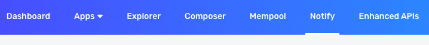
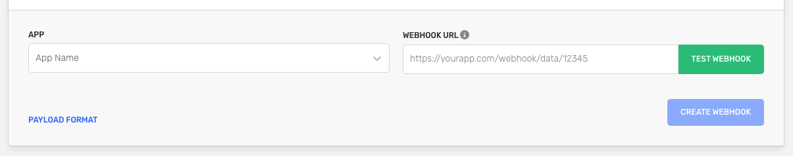

<Warning>
  Creation of Dropped and Mined Transaction webhooks has indefinitely been
  disabled for maintenance purposes. Please reach out on
  [discord](https://discord.com/invite/alchemyplatform) if you have any
  questions or require access!
</Warning>

<Info>
  Check the [Chains](https://dashboard.alchemy.com/chains) page for details about product and chain support!


</Info>

# Introduction

The Dropped Transaction webhook notifies your app when a transaction sent through your app (using your API key) gets dropped. This is useful for you to further notify the users of your app about the status of the transaction. The Dropped Transaction webhook is available on all the networks in Alchemy.

# Example Response

When a transaction sent through your app gets dropped, you receive a response from the webhook that looks like this:

<CodeGroup>
  ```json v2
  {
    "webhookId": "wh_5905ay7anvosr7wh",
    "id": "whevt_hwtwzrkkvx2xojzt",
    "createdAt": "2024-01-23T07:49:06.587397980Z",
    "type": "DROPPED_TRANSACTION",
    "event": {
      "appId": "mm3cwq3q0jrg0uzs",
      "network": "ETH_MAINNET",
      "transaction": {
        "chainId": "0x1",
        "nonce": "0x420a8",
        "maxPriorityFeePerGas": "0x104c533c00",
        "maxFeePerGas": "0x37e11d6000",
        "gasLimit": "0x3d090",
        "to": "0x7a250d5630b4cf539739df2c5dacb4c659f2488d",
        "value": "0x0",
        "accessList": [],
        "v": "0x1",
        "r": "0x60b3601b1eebe4367e73d4c2bfa25d4b70fb494e15030ec312956aa028ef24ae",
        "s": "0x47d9e88be9f1693a3aecef621e2529b8e42d3b13d7c54d11ab9b62b699ecda58",
        "input": "0x38ed173900000000000000000000000000000000000000000000005a3ff009a10ea8f0000000000000000000000000000000000000000000000000000d881d3015b3449500000000000000000000000000000000000000000000000000000000000000a00000000000000000000000005ab9d116a53ef41063e3eae26a7ebe736720e9ba00000000000000000000000000000000000000000000000000000000615d3b1f00000000000000000000000000000000000000000000000000000000000000020000000000000000000000006bb61215298f296c55b19ad842d3df69021da2ef000000000000000000000000c02aaa39b223fe8d0a0e5c4f27ead9083c756cc2",
        "from": "0x5ab9d116a53ef41063e3eae26a7ebe736720e9ba",
        "type": "0x2",
        "hash": "0x5cae384413d28da53c50596144d15c78628154892f355de002537e2904a8c5af",
        "blockHash": null,
        "blockNumber": null,
        "transactionIndex": null
      }
    }
  }
  ```

```shell v1
{
  "app": "Alchemy Mainnet",
  "network": "MAINNET",
  "webhookType": "DROPPED_TRANSACTION",
  "timestamp": "2020-06-08T22:12:57.126Z",
  "fullTransaction": {
    "hash": "0x5a4bf6970980a9381e6d6c78d96ab278035bbff58c383ffe96a0a2bbc7c02a4b",
    "blockHash": null,
    "blockNumber": null,
    "from": "0x8a9d69aa686fa0f9bbdec21294f67d4d9cfb4a3e",
    "gas": "0x5208",
    "gasPrice": "0x165a0bc00",
    "input": "0x",
    "nonce": "0x2f",
    "r": "0x575d26288c1e3aa63e80eea927f54d5ad587ad795ad830149837258344a87d7c",
    "s": "0x25f5a3abf22f5b8ef6ed307a76e670f0c9fb4a71fab2621fce8b52da2ab8fe82",
    "to": "0xd69b8ff1888e78d9c337c2f2e6b3bf3e7357800e",
    "transactionIndex": null,
    "v": "0x1c",
    "value": "0x1bc16d674ec80000"
  }
}
```

</CodeGroup>

# Field definitions for `v2`

Below you can find descriptions for each field of the `v2` response.

| Field              | Description                                                                                    | Value                                                                |
| ------------------ | ---------------------------------------------------------------------------------------------- | -------------------------------------------------------------------- |
| `webhookId`        | Unique ID of the webhook destination.                                                          | `wh_octjglnywaupz6th`                                                |
| `id`               | ID of the event.                                                                               | `whevt_ogrc5v64myey69ux`                                             |
| `createdAt`        | Timestamp when the webhook was created.                                                        | `2021-12-07T03:52:45.899Z`                                           |
| `type`             | Webhook event type.                                                                            | `DROPPED_TRANSACTION`                                                |
| `event`            | Mined transaction object.                                                                      | `N/A`                                                                |
| `appId`            | ID of the Alchemy app that sent the transaction.                                               | `j6tqmhfxlu9pa5r7`                                                   |
| `network`          | The default network for the webhook.                                                           | `OPT_MAINNET`                                                        |
| `transaction`      | The transaction object.                                                                        | `N/A`                                                                |
| `blockHash`        | The ID hash of the block in the blockchain.                                                    | `null`                                                               |
| `blockNumber`      | Transaction block number.                                                                      | `null`                                                               |
| `from`             | Address of the sender.                                                                         | `0x8a9d69aa686fa0f9bbdec21294f67d4d9cfb4a3e`                         |
| `gas`              | Amount of required computational power.                                                        | `0x5208`                                                             |
| `gasPrice`         | The gas fee price of the transaction.                                                          | `0x165a0bc00`                                                        |
| `input`            | Call function on the contract.                                                                 | `0x`                                                                 |
| `nonce`            | Number of confirmed transactions from sender account.                                          | `0x2f`                                                               |
| `r`                | 32 byte ECDSA signature.                                                                       | `0x575d26288c1e3aa63e80eea927f54d5ad587ad795ad830149837258344a87d7c` |
| `s`                | \`32 byte ECDSA signature.                                                                     | `0x25f5a3abf22f5b8ef6ed307a76e670f0c9fb4a71fab2621fce8b52da2ab8fe82` |
| `to`               | The receiver of the Mined Transaction.                                                         | `0xd69b8ff1888e78d9c337c2f2e6b3bf3e7357800e`                         |
| `transactionIndex` | The index of the transaction location in the block.                                            | `0x1`                                                                |
| `v`                | [ECDSA](https://en.wikipedia.org/wiki/Elliptic_Curve_Digital_Signature_Algorithm) recovery ID. | `0x1c`                                                               |
| `value`            | Transferred value amount.                                                                      | `0x0`                                                                |

# Field Definitions for `v1`

| Field             | Description                                                                                                            | Value                      |
| ----------------- | ---------------------------------------------------------------------------------------------------------------------- | -------------------------- |
| `app`             | Alchemy app name that sent the transaction and is configured to this webhook                                           | `Alchemy Mainnet`          |
| `network`         | Network for the event, can be Ethereum only :`MAINNET` or `GOERLI`                                                     | `MAINNET`                  |
| `webhookType`     | Type of webhook event, can be `"MINED_TRANSACTION"`, `"DROPPED_TRANSACTION"`, `"ADDRESS_ACTIVITY"` or `"NFT_ACTIVITY"` | `DROPPED_TRANSACTION`      |
| `timestamp`       | Timestamp that the webhook event was created (might be different from the block timestamp that the event was in)       | `2020-06-08T22:12:57.126Z` |
| `fullTransaction` | Dropped transaction object(same output as calling [eth_getTransactionByHash](/reference/eth-gettransactionbyhash))     | `OBJECT`                   |

<Info>
### How to find the `app_id`

1. First, create a Dropped Transaction webhook in your dashboard.
2. Next, use the [Get all
   webhooks](reference/data/webhooks/custom-webhook-api-methods/custom-webhook-api-methods/notify-api-methods/team-webhooks) endpoint.
3. Extract the `app_id` from the created Dropped Transaction in step 1.
   </Info>

# How to Set-Up Dropped Transaction Webhook

1. Navigate to your [Alchemy Dashboard](https://dashboard.alchemyapi.io/notify) and click the **Notify** tab.



2. Click the **CREATE WEBHOOK** button on the "Dropped Transaction Notifications" webhook.


3. Select your **App name** in the dropdown to add the webhook notifications.
4. Paste your unique webhook URL in the **WEBHOOK URL** field. This is the link to receive the requests.



5. Test your webhook by clicking the **TEST WEBHOOK** button.
6. After the test is successful, click **CREATE WEBHOOK**. Your webhook appears in the list.
7. Check your endpoint to see the responses.

# Useful Endpoints

| Endpoint                                    | Description                                                   |
| ------------------------------------------- | ------------------------------------------------------------- |
| [Create Webhook](/reference/create-webhook) | This endpoint allows you to create a webhook programatically. |
| [Delete Webhook](/reference/delete-webhook) | Allows you to delete a webhook.                               |
| [Update Webhook](/reference/update-webhook) | Allows you to set status of webhooks to active or inactive.   |
