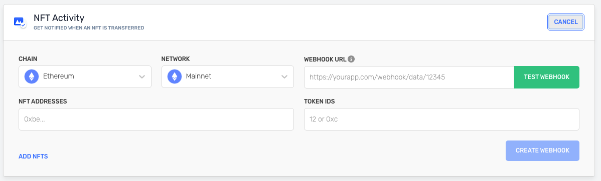

<Info>
  Check the [Chains](https://dashboard.alchemy.com/chains) page for details about product and chain support!

  
</Info>

# Introduction

The NFT Activity webhook allows you to track ERC721 and ERC1155 token contracts for Ethereum, Arbitrum, Optimism and Polygon NFTs. This provides your app with real-time state changes when an NFT is transferred between addresses.

# Example Response

When a token (ERC721 or ERC1155) from the token contracts that you are tracking gets transferred, you receive a response from the webhook that looks like this:

<CodeGroup>
  ```shell NFT Activity Response
  {
    "webhookId": "wh_5dzeea0ikdnzgq6w",
    "id": "whexs_awxsragnkmh182tl",
    "createdAt": "2024-05-31T21:38:13.912Z",
    "type": "NFT_ACTIVITY",
    "event": {
      "network": "ETH_MAINNET",
      "activity": [
        {
          "fromAddress": "0x715af6b6c6e3aefb97f1f6811ce52db563b38896",
          "toAddress": "0x29469395eaf6f95920e59f858042f0e28d98a20b",
          "contractAddress": "0xbc4ca0eda7647a8ab7c2061c2e118a18a936f13d",
          "blockNum": "0x1310fe1",
          "hash": "0xe6385e8896aa5de1147f8d324ebeb79640f7a0e6fc87f3685d5e39a531f14ea4",
          "erc721TokenId": "0x1eeb",
          "category": "erc721",
          "log": {
            "address": "0xbc4ca0eda7647a8ab7c2061c2e118a18a936f13d",
            "topics": [
              "0xddf252ad1be2c89b69c2b068fc378daa952ba7f163c4a11628f55a4df523b3ef",
              "0x000000000000000000000000715af6b6c6e3aefb97f1f6811ce52db563b38896",
              "0x00000000000000000000000029469395eaf6f95920e59f858042f0e28d98a20b",
              "0x0000000000000000000000000000000000000000000000000000000000001eeb"
            ],
            "data": "0x",
            "blockNumber": "0x1310fe1",
            "transactionHash": "0xe6385e8896aa5de1147f8d324ebeb79640f7a0e6fc87f3685d5e39a531f14ea4",
            "transactionIndex": "0x20",
            "blockHash": "0x50bf5446bee2aff19c2399250c93db840eaab0132e7750ed026acb92c93a92ec",
            "logIndex": "0x9c",
            "removed": false
          }
        }
      ]
    }
  }
  ```
</CodeGroup>

# Field Definitions

Below you can find descriptions for each field of the response.

| Field              | Description                                                                                                                                                                      | Value                                                                |
| ------------------ | -------------------------------------------------------------------------------------------------------------------------------------------------------------------------------- | -------------------------------------------------------------------- |
| `webhookId`        | Unique ID of the webhook destination.                                                                                                                                            | `wh_v394g727u681i5rj`                                                |
| `id`               | ID of the event.                                                                                                                                                                 | `whevt_13vxrot10y8omrdp`                                             |
| `createdAt`        | Timestamp when the webhook was created.                                                                                                                                          | `2022-08-03T23:29:11.267808614Z`                                     |
| `type`             | Webhook event type.                                                                                                                                                              | `NFT_ACTIVITY`                                                       |
| `event`            | NFT Activity object.                                                                                                                                                             | `N/A`                                                                |
| `activity`         | List of transfer events whose `from` or `to` address matches the address configured in the NFT Activity webhook.                                                                 | `N/A`                                                                |
| `network`          | The default network for the webhook.                                                                                                                                             | `ETH_GOERLI`                                                         |
| `fromAddress`      | Transfer from address.                                                                                                                                                           | `0x2acc2dff0c1fa9c1c62f518c9415a0ca60e03f77`                         |
| `toAddress`        | Transfer to address.                                                                                                                                                             | `0x15dd13f3c4c5279222b5f09ed1b9e9340ed17185`                         |
| `contractAddress`  | The contract ID address.                                                                                                                                                         | `0xf4910c763ed4e47a585e2d34baa9a4b611ae448c`                         |
| `blockNumber`      | Transaction block number.                                                                                                                                                        | `0x78b94e`                                                           |
| `hash`             | Transaction hash rate.                                                                                                                                                           | `0x6ca7fed3e3ca7a97e774b0eab7d8f46b7dcad5b8cf8ff28593a2ba00cdef4bff` |
| `erc1155Metadata`  | List of objects containing the ERC1155 `tokenId` & `value`.                                                                                                                      | `N/A`                                                                |
| `tokenId`          | Raw `erc721` token ID.                                                                                                                                                           | `0x2acc2dff0c1fa9c1c62f518c9415a0ca60e03f77000000000000010000000001` |
| `value`            | Transferred value amount.                                                                                                                                                        | `0x0`                                                                |
| `category`         | The ` ERC-721` or `ERC-1155` data standard.                                                                                                                                      | `erc1155`                                                            |
| `log`              | Returned log of the `token` NFT Activity event.                                                                                                                                  | `N/A`                                                                |
| `address`          | Log origination address.                                                                                                                                                         | `0xf4910c763ed4e47a585e2d34baa9a4b611ae448c`                         |
| `topics`           | Array of zero to four 32 bytes of indexed log arguments.                                                                                                                         | `0xc3d58168c5ae7397731d063d5bbf3d657854427343f4c083240f7aacaa2d0f62` |
| `data`             | Non-indexed arguments of the log.                                                                                                                                                | `0x2acc2dff0c1fa9c1c62f518c9415a0ca60e03f7700000000000001000...`     |
| `blockNumber`      | Transaction block number.                                                                                                                                                        | `0x78b94e`                                                           |
| `transactionHash`  | Transaction block number.                                                                                                                                                        | `0x6ca7fed3e3ca7a97e774b0eab7d8f46b7dcad5b8cf8ff28593a2ba00cdef4bff` |
| `transactionIndex` | The index of the transaction location in the block.                                                                                                                              | `0x1b`                                                               |
| `blockHash`        | The ID hash of the block in the blockchain.                                                                                                                                      | `0x4887f8bfbba48b7bff0362c34149d76783feae32f29bff3d98c841bc2ba1902f` |
| `logIndex`         | ID of the event.                                                                                                                                                                 | `0x16`                                                               |
| `removed`          | Transaction is in a \[chain re-org] ([https://www.alchemy.com/overviews/what-is-a-reorg](https://www.alchemy.com/overviews/what-is-a-reorg)) & no longer in the canonical chain. | `false`                                                              |
| `erc721TokenId`    | raw erc721 token id (hex string). `null` if not an erc721 token transfer.                                                                                                        | `N/A`                                                                |

# How to Set-Up NFT Activity Webhook

1. In your \[Alchemy Dashboard] ([https://dashboard.alchemyapi.io/notify](https://dashboard.alchemyapi.io/notify)) click the **Notify** tab.
2. Find NFT Activity and click the **CREATE WEBHOOK** button on the right side of the window.


3. Select your **CHAIN** in the dropdown. Then choose your **NETWORK**.
4. Paste your unique webhook URL into the **WEBHOOK URL** field.
5. Add your **NFT ADDRESSES**.
6. Enter your **TOKEN IDS**.



7. Test your webhook by clicking the **TEST WEBHOOK** button.
8. After the test is successful, click **CREATE WEBHOOK**. Your webhook appears in the list.
9. Check your endpoint to see the responses.

To add/remove addresses from already existing webhooks check out [update webhook addresses](/reference/update-webhook-addresses) endpoint.

# Useful Endpoints

| Endpoint                                                            | Description                                                                                |
| ------------------------------------------------------------------- | ------------------------------------------------------------------------------------------ |
| [Update Webhook NFT Filters](/reference/update-webhook-nft-filters) | Add and remove webhook NFT filters.                                                        |
| [Webhook NFT Filters](/reference/webhook-nft-filters)               | Paginated endpoint to list all of the NFT filter objects a given webhook is subscribed to. |
| [Create Webhook](/reference/create-webhook)                         | This endpoint allows you to create a webhook programatically.                              |
| [Delete Webhook](/reference/delete-webhook)                         | Allows you to delete a webhook.                                                            |
| [Update Webhook](/reference/update-webhook)                         | Allows you to set status of webhooks to active or inactive.                                |
