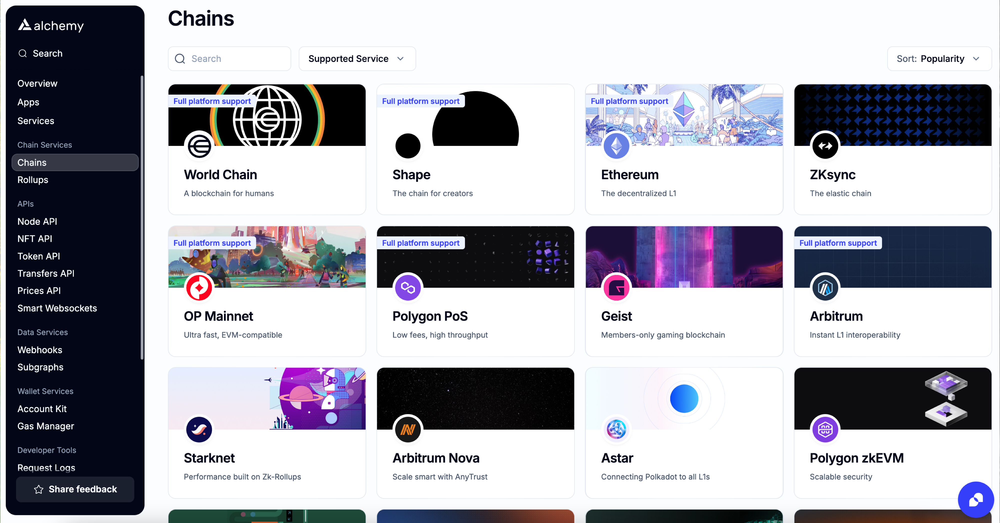

# Intro

Alchemy provides a set of webhooks for tracking address activity and gas prices on several blockchains.

Developers can manually create webhooks from within the dashboard, or programmatically create webhooks to track activity for 10+ addresses using the Notify API.

Alchemy Webhooks provide real-time notifications for primarily on-chain data. They're often used to stream on-chain activity for a set of wallets, events and traces on a set of smart contracts, and all block data for a particular chain, but are customizable to your many different use cases! Here are a few quick-links and an introduction video:

* [Webhook Types](/reference/webhook-types)
* [How to Set up Webhooks](/reference/notify-api-quickstart#how-to-set-up-webhooks)

<Tip title="Don’t have an API key?" icon="star">
  Sign up or upgrade your plan for access. [Get started for free](https://dashboard.alchemy.com/signup)
</Tip>

# Webhook types

| Webhook Type                                                | Description                                                                                                                                                                                                                                                                                                                                 |
| ----------------------------------------------------------- | ------------------------------------------------------------------------------------------------------------------------------------------------------------------------------------------------------------------------------------------------------------------------------------------------------------------------------------------- |
| [Custom](/reference/custom-webhook)                         | Custom Webhooks allows you to track any smart contract or marketplace activity, monitor any contract creation, or any other on-chain interaction. This gives you infinite data access with precise filter controls to get the blockchain data you need.                                                                                     |
| [Address Activity](/reference/address-activity-webhook)     | Alchemy's Address Activity webhook tracks all ETH, ERC20, ERC721 and ERC1155 transfers. This provides your app with real-time state changes when an address sends/receives tokens or ETH. Specify the addresses for which you want to track this activity via API as well. A maximum of 100,000 addresses can be added to a single webhook. |
| [NFT Activity](/reference/nft-activity-webhook)             | The NFT Activity webhook allows you to track ERC721 and ERC1155 token contracts for NFTs. This provides your app with real-time state changes when an NFT is transferred between addresses.                                                                                                                                                 |

<Info>
  Check the [Chains](https://dashboard.alchemy.com/chains) page for details about product and chain support!

  
</Info>

## V2 Webhook

### Field definitions

| Field       | Description                             | Value                      |
| ----------- | --------------------------------------- | -------------------------- |
| `webhookId` | Unique ID of the webhook destination.   | `wh_octjglnywaupz6th`      |
| `id`        | ID of the event.                        | `whevt_ogrc5v64myey69ux`   |
| `createdAt` | The timestamp when webhook was created. | `2021-12-07T03:52:45.899Z` |
| `type`      | Webhook event type.                     | `TYPE_STRING`              |
| `event`     | Object-mined transaction.               | `OBJECT`                   |

### Example

<CodeGroup>
  ```shell V2
  {
   "webhookId": "wh_octjglnywaupz6th",
   "id": "whevt_ogrc5v64myey69ux",
   "createdAt": "2021-12-07T03:52:45.899Z",
   "type": TYPE_STRING,
   "event": OBJECT
  }
  ```
</CodeGroup>

## V1 Webhook Event Object

### Field definitions

| Field         | Description                                       | Value                      |
| ------------- | ------------------------------------------------- | -------------------------- |
| `app`         | Alchemy app name sending the transaction webhook. | `Demo`                     |
| `network`     | Network for the webhook event.                    | `MAINNET`                  |
| `webhookType` | The type of webhook.                              | `MINED_TRANSACTION`        |
| `timestamp`   | Timestamp when the webhook was created.           | `2020-07-29T00:29:18.414Z` |
| `event name`  | Webhook event type.                               | `OBJECT`                   |

For Webhooks full dependencies and more code examples, \[go to the GitHub repo] ([https://github.com/alchemyplatform/webhook-examples](https://github.com/alchemyplatform/webhook-examples)).

### Example Response

<CodeGroup>
  ```shell v1
  {
    "app": "Demo", 
    "network": "MAINNET",
    "webhookType": "MINED_TRANSACTION",
    "timestamp": "2020-07-29T00:29:18.414Z",
    "event name": OBJECT
  }
  ```
</CodeGroup>
