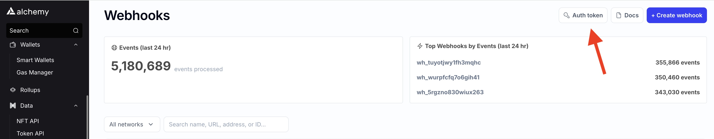

## What does the capacity limit error mean?

The capacity limit error means you've exceeded your total monthly compute units. To upgrade your capacity limits go to your [Alchemy dashboard](https://dashboard.alchemyapi.io/settings/billing). Below is an example capacity limit error.

<CodeGroup>
  ```shell Capacity limit error
  {
    "webhookId": "wh_127lzhz0dfwwimwe",
    "id": "whevt_55i2al4sc2ivp1m8",
    "createdAt": "2022-12-05T23:43:16.379Z",
    "type": "ADDRESS_ACTIVITY",
    "event": {
      "error": "Monthly capacity limit exceeded. Visit https://dashboard.alchemy.com/settings/billing to upgrade your scaling policy for continued service."
    }
  }
  ```
</CodeGroup>

## How do I validate the webhook event?

Every outbound request contains a hashed authentication signature in the header `X-Alchemy-Signature`. It's computed by concatenating your signing key and request body. Then generates a hash using the HMAC SHA256 hash algorithm.

To verify the signature came from Alchemy, you generate the HMAC SHA256 hash and compare it with the signature received.

### Example Request Header

<CodeGroup>
  ```shell Request header
  POST /yourWebhookServer/push HTTP/1.1
  Content-Type: application/json;
  X-Alchemy-Signature: your-hashed-signature
  ```
</CodeGroup>

### Example Signature Validation

<CodeGroup>
  ```javascript JavaScript
  import * as crypto from "crypto";

  function isValidSignatureForStringBody(
      body: string, // must be raw string body, not json transformed version of the body
      signature: string, // your "X-Alchemy-Signature" from header
      signingKey: string, // taken from dashboard for specific webhook
    ): boolean {
      const hmac = crypto.createHmac("sha256", signingKey); // Create a HMAC SHA256 hash using the signing key
      hmac.update(body, "utf8"); // Update the token hash with the request body using utf8
      const digest = hmac.digest("hex");
      return signature === digest;
  }
  ```

  ```python Python
  import hmac
  import hashlib

  def isValidSignatureForStringBody(body: str, signature: str, signing_key: str)->bool:
      digest = hmac.new(
          bytes(signing_key, "utf-8"),
          msg=bytes(body, "utf-8"),
          digestmod=hashlib.sha256,
      ).hexdigest()
      
      return signature == digest
  ```

  ```go Go
  func isValidSignatureForStringBody(
    body []byte, // must be raw string body, not json transformed version of the body
    signature string, // your "X-Alchemy-Signature" from header
    signingKey []byte, // taken from dashboard for specific webhook
  ) bool {
    h := hmac.New(sha256.New, signingKey)
    h.Write([]byte(body))
    digest := hex.EncodeToString(h.Sum(nil))
    return digest == signature
  }
  ```

  ```rust Rust
  fn is_valid_signature_for_string_body(
      body: &[u8], // must be raw string body, not json transformed version of the body
      signature: &str, // your "X-Alchemy-Signature" from header
      signing_key: &str, // taken from dashboard for specific webhook
  ) -> Result<bool, Box<dyn std::error::Error>> {
      let signing_key_bytes: Vec<u8> = signing_key.bytes().collect();
      let mut mac = Hmac::<Sha256>::new_from_slice(&signing_key_bytes)?;
      mac.update(&body);
      let hex_decode_signature = hex::decode(signature)?;
      let verification = mac.verify_slice(&hex_decode_signature).is_ok();
      Ok(verification)
  }
  ```
</CodeGroup>

## Where do I find my Alchemy auth token?

Find your Alchemy auth token in the upper-right corner of your Webhook dashboard by clicking the **AUTH TOKEN** button.



Alchemy dashboard showing where to copy the Auth Token for the Webhooks API.

## How many webhooks can I create?

These are the number of webhooks you can create per tier!

| Tier          | # of Webhooks |
| ------------- | ------------- |
| Free          | 5             |
| Pay As You Go | 100           |
| Enterprise    | Unlimited     |

## How many addresses can you add to a single webhook?

For Address Activity webhooks, we reliably support up to 100,000 addresses per single webhook. For Custom webhooks, with [variables](https://alchemyenterprisegroup.readme.io/reference/custom-webhook-variables), we support a maximum of 10M addresses.

## Why am I missing transactions in the response?

Double check that you're parsing the response payload correctly. Remember, transactions are returned in a list. Transactions that are mined within the same block will be returned within the same `activity` list.

## Why are address activity events for the same transaction split across multiple response?

You may notice `activity` entries from the same transaction being split across multiple requests when using the Address Activity webhooks. This is expected behavior because webhook streams are currently separated by `block` and `type`. This means that if there are `external`, `internal` and `token` transfers all within the same transaction that occurred in block 49, you will still receive 3 separate webhook payloads, one for each of them.

## What are some best practices when using webhooks with a large number of addresses?

When working with large address lists, we suggest that users assign no more than 100,000 addresses to each webhook. If you find yourself using many addresses, spin up a new webhook to ensure that you have a reliable and scalable system.

## How are reorgs handled?

When a chain reorganization occurs, block logs on the old chain will be emitted again with the property `removed` set to `true`.

## Why am I getting 5xx errors repeatedly setting up a webhook?

You may be seeing repeated 5xx errors because of automatic webhook-retry-logic where requests are retried for non-200 response codes and upon failures to reach your server.

One common mistake we see is users not responding with 2xx status codes on a successful response which will trigger a retry. To resolve, set-up a [webhook listener](/reference/notify-api-quickstart#create-webhook-listeners).

## How does reaching my CU limit impact my webhook's activity?

If you hit your CU limit and don't have autoscaling activated, all your active webhooks will be set to the 'paused' state. This means they'll temporarily stop operating until you manually unpause them or acquire more CUs.

## What happens when my webhooks are in a 'paused' state?

When your webhooks are 'paused', they won't operate or trigger any notifications. You'll need to either wait for more CUs or upgrade to unpause them.

## Why won't my paused webhooks automatically unpause after I upgrade or when I acquire more CUs?

We've noticed that many of our users use up all their CUs quickly at the month's start. To ensure these webhooks don't consume resources without proving their value, we ask that you manually unpause them, even after an upgrade.
