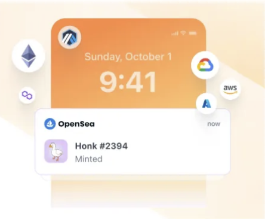
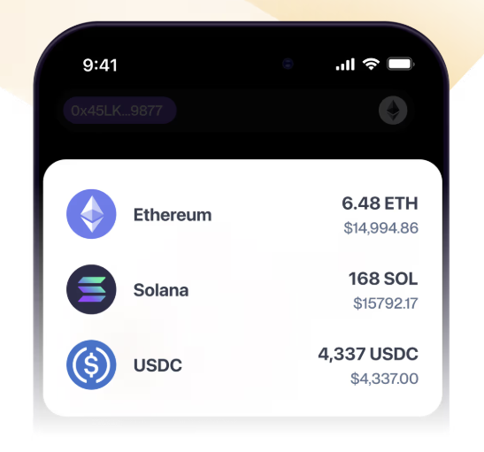
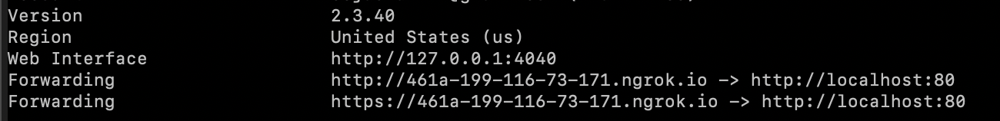

Alchemy Webhooks let you receive real-time HTTP POST requests for on-chain events across 80+ chains — no polling required! They’re often used to stream:

* all on-chain activity for millions of wallets
* events and traces for any smart contract
* all block data (including traces)

They're also fully [customizable via a GraphQL style query](/reference/custom-webhook).

# Why Alchemy Webhooks?

* ⛓️ **Multi-Chain:** Supports over 80+ EVM chains (+ [Solana now](/reference/address-activity-webhook)) and more soon
* ⚡ **Fast:** Streams on-chain events immediately as blocks confirm
* 💪🏽 **Reliable:** Built on our propietary blockchain engine, and incudes retries
* 🧑‍🤝‍🧑 **Scalable:** Tracks millions of users effortlessly
* **💰 Savings:** Reduces RPC spend by eliminating polling workflows

# Webhook types

| [**Custom Webhooks**](/reference/custom-webhook)                                                                              | [**Address Activity**](/reference/address-activity-webhook)                                                                                                      | [NFT Activity](/reference/get-transaction-history-by-address)                                                                        |
| ----------------------------------------------------------------------------------------------------------------------------------------- | --------------------------------------------------------------------------------------------------------------------------------------------------------- | ------------------------------------------------------------------------------------------------------------------------------------------- |
|                       |                                       |                         |
| **Ideal for:** Most Use Cases **How it works:** Get notified for any event on every block | **Ideal for:** Wallets, Portfolio Trackers **How it works:** Get notified when an address transacts| **Ideal for:** NFT Collections, NFT Analytics **How it works:** Get notified when NFTs are transferred |

<Info>
  Check the [Chains](https://dashboard.alchemy.com/chains) page for details about product and chain support!

  
</Info>

# Webhook Payload Structure

## Field definitions

| Field       | Description                             | Value                      |
| ----------- | --------------------------------------- | -------------------------- |
| `webhookId` | Unique ID of the webhook destination.   | `wh_octjglnywaupz6th`      |
| `id`        | ID of the event.                        | `whevt_ogrc5v64myey69ux`   |
| `createdAt` | The timestamp when webhook was created. | `2021-12-07T03:52:45.899Z` |
| `type`      | Webhook event type.                     | `TYPE_STRING`              |
| `event`     | Object-mined transaction.               | `OBJECT`                   |

### Example

<CodeGroup>
  ```shell V2
  {
   "webhookId": "wh_octjglnywaupz6th",
   "id": "whevt_ogrc5v64myey69ux",
   "createdAt": "2021-12-07T03:52:45.899Z",
   "type": TYPE_STRING,
   "event": OBJECT
  }
  ```
</CodeGroup>

# Getting Started

To start building with webhooks:

1. Select the right webhook type
2. Create a webhook listener
3. Create and test your webhook

## Select the right webhook type

* If you’re interested in tracking transfers on a set of wallets, (\< 100K wallets), get started with our [Address Activity webhooks](/reference/address-activity-webhook)!
* If you’re interested in tracking transfers of a particular NFT, an NFT collection, or all NFTs for a chain, use the [NFT Activity webhooks](/reference/nft-activity-webhook)!
* For all other use cases, we recommend leveraging our [Custom webhooks](/reference/custom-webhook)!

## Create a webhook listener

Webhook listeners receive requests and process event data.

The listener responds to the Alchemy server with a `200` status code once it successfully receives the webhook event. Your webhook listener can be a simple server or Slack integration to receive the webhook listener data.

After setting up the webhooks in your Alchemy dashboard (or programmatically) use the starter code in JavaScript, Python, Go, and Rust below. Here's the [GitHub repository](https://github.com/alchemyplatform/webhook-examples) for the entire code.

<CodeGroup>
  ```ts typescript
  import express from "express";
  import { getRequiredEnvVar, setDefaultEnvVar } from "./envHelpers";
  import {
    addAlchemyContextToRequest,
    validateAlchemySignature,
    AlchemyWebhookEvent,
  } from "./webhooksUtil";

  async function main(): Promise<void> {
    const app = express();

    setDefaultEnvVar("PORT", "8080");
    setDefaultEnvVar("HOST", "127.0.0.1");
    setDefaultEnvVar("SIGNING_KEY", "whsec_test");

    const port = +getRequiredEnvVar("PORT");
    const host = getRequiredEnvVar("HOST");
    const signingKey = getRequiredEnvVar("SIGNING_KEY");

    // Middleware needed to validate the alchemy signature
    app.use(
      express.json({
        verify: addAlchemyContextToRequest,
      })
    );
    app.use(validateAlchemySignature(signingKey));

    // Register handler for Alchemy Notify webhook events
    // TODO: update to your own webhook path
    app.post("/webhook-path", (req, res) => {
      const webhookEvent = req.body as AlchemyWebhookEvent;
      // Do stuff with with webhook event here!
      console.log(`Processing webhook event id: ${webhookEvent.id}`);
      // Be sure to respond with 200 when you successfully process the event
      res.send("Alchemy Webhooks are the best!");
    });

    // Listen to Alchemy Notify webhook events
    app.listen(port, host, () => {
      console.log(`Example Alchemy Webhooks app listening at ${host}:${port}`);
    });
  }

  main();
  ```

  ```python python
  import hmac
  import hashlib
  from django.core.exceptions import PermissionDenied
  from webhook_server.settings import SIGNING_KEY
  import json
  from types import SimpleNamespace

  def is_valid_signature_for_string_body(
      body: str, signature: str, signing_key: str
  ) -> bool:
      digest = hmac.new(
          bytes(signing_key, "utf-8"),
          msg=bytes(body, "utf-8"),
          digestmod=hashlib.sha256,
      ).hexdigest()

      return signature == digest

  class AlchemyWebhookEvent:
      def __init__(self, webhookId, id, createdAt, type, event):
          self.webhook_id = webhookId
          self.id = id
          self.created_at = createdAt
          self.type = type
          self.event = event

  class AlchemyRequestHandlerMiddleware:
      def __init__(self, get_response):
          self.get_response = get_response

      def __call__(self, request):
          str_body = str(request.body, request.encoding or "utf-8")
          signature = request.headers["x-alchemy-signature"]
          if not is_valid_signature_for_string_body(str_body, signature, SIGNING_KEY):
              raise PermissionDenied("Signature validation failed, unauthorized!")

          webhook_event = json.loads(str_body)
          request.alchemy_webhook_event = AlchemyWebhookEvent(**webhook_event)
          response = self.get_response(request)
          return response
  ```

  ```go go
  package notify

  import (
  	"crypto/hmac"
  	"crypto/sha256"
  	"encoding/hex"
  	"encoding/json"
  	"io/ioutil"
  	"log"
  	"net/http"
  	"time"
  )

  type AlchemyWebhookEvent struct {
  	WebhookId string
  	Id        string
  	CreatedAt time.Time
  	Type      string
  	Event     map[string]interface{}
  }

  func jsonToAlchemyWebhookEvent(body []byte) (*AlchemyWebhookEvent, error) {
  	event := new(AlchemyWebhookEvent)
  	if err := json.Unmarshal(body, &event); err != nil {
  		return nil, err
  	}
  	return event, nil
  }

  // Middleware helpers for handling an Alchemy Notify webhook request
  type AlchemyRequestHandler func(http.ResponseWriter, *http.Request, *AlchemyWebhookEvent)

  type AlchemyRequestHandlerMiddleware struct {
  	handler    AlchemyRequestHandler
  	signingKey string
  }

  func NewAlchemyRequestHandlerMiddleware(handler AlchemyRequestHandler, signingKey string) *AlchemyRequestHandlerMiddleware {
  	return &AlchemyRequestHandlerMiddleware{handler, signingKey}
  }

  func isValidSignatureForStringBody(
  	body []byte,
  	signature string,
  	signingKey []byte,
  ) bool {
  	h := hmac.New(sha256.New, signingKey)
  	h.Write([]byte(body))
  	digest := hex.EncodeToString(h.Sum(nil))
  	return digest == signature
  }

  func (arh *AlchemyRequestHandlerMiddleware) ServeHTTP(w http.ResponseWriter, r *http.Request) {
  	signature := r.Header.Get("x-alchemy-signature")
  	body, err := ioutil.ReadAll(r.Body)
  	if err != nil {
  		http.Error(w, err.Error(), http.StatusInternalServerError)
  		log.Panic(err)
  		return
  	}
  	r.Body.Close()

  	isValidSignature := isValidSignatureForStringBody(body, signature, []byte(arh.signingKey))
  	if !isValidSignature {
  		errMsg := "Signature validation failed, unauthorized!"
  		http.Error(w, errMsg, http.StatusForbidden)
  		log.Panic(errMsg)
  		return
  	}

  	event, err := jsonToAlchemyWebhookEvent(body)
  	if err != nil {
  		http.Error(w, err.Error(), http.StatusBadRequest)
  		log.Panic(err)
  		return
  	}
  	arh.handler(w, r, event)
  }
  ```

  ```rust rust
  use chrono::{DateTime, FixedOffset};
  use hex;
  use hmac::{Hmac, Mac};
  use sha2::Sha256;
  use std::{
      future::{ready, Ready},
      rc::Rc,
  };

  use serde::{de, Deserialize, Deserializer};

  use actix_web::{
      dev::{self, Service, ServiceRequest, ServiceResponse, Transform},
      error::ErrorBadRequest,
      error::ErrorUnauthorized,
      web::BytesMut,
      Error, HttpMessage,
  };
  use futures_util::{future::LocalBoxFuture, stream::StreamExt};

  #[derive(Deserialize)]
  #[serde(rename_all = "camelCase")]

  pub struct AlchemyWebhookEvent {
      pub webhook_id: String,
      pub id: String,
      #[serde(deserialize_with = "deserialize_date_time")]
      pub created_at: DateTime<FixedOffset>,
      #[serde(rename = "type")]
      pub webhook_type: String,
      pub event: serde_json::Value,
  }

  fn deserialize_date_time<'a, D>(deserializer: D) -> Result<DateTime<FixedOffset>, D::Error>
  where
      D: Deserializer<'a>,
  {
      let date_time_string: String = Deserialize::deserialize(deserializer)?;
      let date_time = DateTime::<FixedOffset>::parse_from_rfc3339(&date_time_string)
          .map_err(|e| de::Error::custom(e.to_string()))?;
      Ok(date_time)
  }

  fn is_valid_signature_for_string_body(
      body: &[u8],
      signature: &str,
      signing_key: &str,
  ) -> Result<bool, Box<dyn std::error::Error>> {
      let signing_key_bytes: Vec<u8> = signing_key.bytes().collect();
      let mut mac = Hmac::<Sha256>::new_from_slice(&signing_key_bytes)?;
      mac.update(&body);
      let hex_decode_signature = hex::decode(signature)?;
      let verification = mac.verify_slice(&hex_decode_signature).is_ok();
      Ok(verification)
  }

  pub struct AlchemyRequestHandlerMiddleware<S> {
      signing_key: String,
      service: Rc<S>,
  }

  impl<S, B> Service<ServiceRequest> for AlchemyRequestHandlerMiddleware<S>
  where
      S: Service<ServiceRequest, Response = ServiceResponse<B>, Error = Error> + 'static,
      S::Future: 'static,
      B: 'static,
  {
      type Response = ServiceResponse<B>;
      type Error = Error;
      type Future = LocalBoxFuture<'static, Result<Self::Response, Self::Error>>;

      dev::forward_ready!(service);

      fn call(&self, mut req: ServiceRequest) -> Self::Future {
          let svc = self.service.clone();
          let signing_key = self.signing_key.clone();

          Box::pin(async move {
              let mut body = BytesMut::new();
              let mut stream = req.take_payload();
              while let Some(chunk) = stream.next().await {
                  body.extend_from_slice(&chunk?);
              }

              let signature = req
                  .headers()
                  .get("x-alchemy-signature")
                  .ok_or(ErrorBadRequest(
                      "Signature validation failed, missing x-alchemy-signature header!",
                  ))?
                  .to_str()
                  .map_err(|_| {
                      ErrorBadRequest(
                          "Signature validation failed, x-alchemy-signature header is not a string!",
                      )
                  })?;

              let is_valid_signature =
                  is_valid_signature_for_string_body(&body, signature, &signing_key)?;

              if !is_valid_signature {
                  return Err(ErrorUnauthorized(
                      "Signature validation failed, signature and body do not match!",
                  ));
              }

              let webhook: AlchemyWebhookEvent = serde_json::from_slice(&body).map_err(|_| {
                  ErrorBadRequest("Bad format, body could not be mapped to AlchemyWebhookEvent")
              })?;

              req.extensions_mut()
                  .insert::<Rc<AlchemyWebhookEvent>>(Rc::new(webhook));

              let res = svc.call(req).await?;

              Ok(res)
          })
      }
  }

  pub struct AlchemyRequestHandlerMiddlewareFactory {
      signing_key: String,
  }

  impl AlchemyRequestHandlerMiddlewareFactory {
      pub fn new(signing_key: String) -> Self {
          AlchemyRequestHandlerMiddlewareFactory { signing_key }
      }
  }

  impl<S, B> Transform<S, ServiceRequest> for AlchemyRequestHandlerMiddlewareFactory
  where
      B: 'static,
      S: Service<ServiceRequest, Response = ServiceResponse<B>, Error = Error> + 'static,
  {
      type Response = ServiceResponse<B>;
      type Error = Error;
      type Transform = AlchemyRequestHandlerMiddleware<S>;
      type InitError = ();
      type Future = Ready<Result<Self::Transform, Self::InitError>>;

      fn new_transform(&self, service: S) -> Self::Future {
          ready(Ok(AlchemyRequestHandlerMiddleware {
              signing_key: self.signing_key.clone(),
              service: Rc::new(service),
          }))
      }
  }
  ```
</CodeGroup>

## Create and test your webhooks

1. Navigate to the [webhooks dashboard](https://dashboard.alchemy.com/webhooks) and click **Create Webhook** OR create one by calling the [createWebhook](/data/webhooks/custom-webhook-api-methods/custom-webhook-api-methods/notify-api-methods/create-webhook) endpoint. When it asks for your Webhook URL, enter your endpoint or follow these steps to create an NGROK endpoint:
   * Sign-up for a [free Ngrok account](https://dashboard.ngrok.com/signup).
   * Install Ngrok using [the Ngrok guide](https://dashboard.ngrok.com/get-started/setup). On macOS run `brew install ngrok`.
   * Connect your Ngrok account by running `ngrok authtoken YOUR_AUTH_TOKEN`.
   * Start your local forwarding tunnel: `ngrok http 80`.
     

2. Once you have a URL to test your webhook (in this case `https://461a-199-116-73-171.ngrok.io` pictured above), paste your NGROK endpoint into the Webhook URL field and hit “Test Webhook”, and see the event appear here: http://localhost:4040/inspect/http

3. Navigate to your [webhooks dashboard](https://dashboard.alchemy.com/webhooks).

4. Click **Create Webhook** on the webhook you want to test.

5. Paste **your unique URL** and hit the **Test Webhook** button.

6. You'll see the webhooks here: `http://localhost:4040/inspect/http`.

# Webhook Signature & Security

## Signatures

To make your webhooks secure, you can verify that they originated from Alchemy by generating a HMAC SHA-256 hash code using your unique webhook signing key.

### Find your signing key

To find your signing key, navigate to the [webhooks dashboard](https://dashboard.alchemy.com/webhooks), select your webhook, and copy the singing key from the top right of that webhook's detail page.

### Validate the signature received

Every outbound request contains a hashed authentication signature in the header. It's computed by concatenating your signing key and request body. Then generates a hash using the HMAC SHA256 hash algorithm.

To verify the signature came from Alchemy, you generate the HMAC SHA256 hash and compare it with the signature received.

### Example request header

<CodeGroup>
  ```shell Request header
  POST /yourWebhookServer/push HTTP/1.1
  Content-Type: application/json;
  X-Alchemy-Signature: your-hashed-signature
  ```
</CodeGroup>

### Example signature validation

<CodeGroup>
  ```ts typescript
  import * as crypto from "crypto";

  function isValidSignatureForStringBody(
      body: string, // must be raw string body, not json transformed version of the body
      signature: string, // your "X-Alchemy-Signature" from header
      signingKey: string, // taken from dashboard for specific webhook
    ): boolean {
      const hmac = crypto.createHmac("sha256", signingKey); // Create a HMAC SHA256 hash using the signing key
      hmac.update(body, "utf8"); // Update the token hash with the request body using utf8
      const digest = hmac.digest("hex");
      return signature === digest;
  }
  ```

  ```python Python
  import hmac
  import hashlib

  def isValidSignatureForStringBody(body: str, signature: str, signing_key: str)->bool:
      digest = hmac.new(
          bytes(signing_key, "utf-8"),
          msg=bytes(body, "utf-8"),
          digestmod=hashlib.sha256,
      ).hexdigest()
      
      return signature == digest
  ```

  ```go Go
  func isValidSignatureForStringBody(
    body []byte, // must be raw string body, not json transformed version of the body
    signature string, // your "X-Alchemy-Signature" from header
    signingKey []byte, // taken from dashboard for specific webhook
  ) bool {
    h := hmac.New(sha256.New, signingKey)
    h.Write([]byte(body))
    digest := hex.EncodeToString(h.Sum(nil))
    return digest == signature
  }
  ```

  ```rust Rust
  fn is_valid_signature_for_string_body(
      body: &[u8], // must be raw string body, not json transformed version of the body
      signature: &str, // your "X-Alchemy-Signature" from header
      signing_key: &str, // taken from dashboard for specific webhook
  ) -> Result<bool, Box<dyn std::error::Error>> {
      let signing_key_bytes: Vec<u8> = signing_key.bytes().collect();
      let mut mac = Hmac::<Sha256>::new_from_slice(&signing_key_bytes)?;
      mac.update(&body);
      let hex_decode_signature = hex::decode(signature)?;
      let verification = mac.verify_slice(&hex_decode_signature).is_ok();
      Ok(verification)
  }
  ```
</CodeGroup>

## Auth Token

The Auth Token, located at the top of you [webhooks dashboard](https://dashboard.alchemy.com/webhooks), is required to let you manage your webhooks via our webhooks API!

## Webhooks IP addresses

As an added security measure, you can ensure your webhook notification originates from Alchemy by using one of the following IP addresses:

* `54.236.136.17`
* `34.237.24.169`

# Webhook Delivery Behavior

* **Event Ordering** - All first-time webhooks notifications, regardless of the selected chain/network and its speed, will be delivered in order to users.
* **Automatic Retries** -  Webhooks have built-in retry-logic with exponential backoff for non-200 response codes in failures to reach your server. For Free and PAYG tier teams, these will fire with back off up to 10 minutes after. For Enterprise customers, this back off period will extend to 1 hour.
* **Manual Retries (Coming Soon)** - Soon you’ll have the ability to manually trigger retries for failed events!
