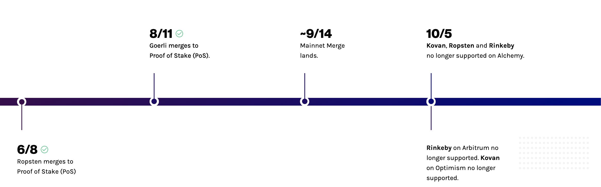
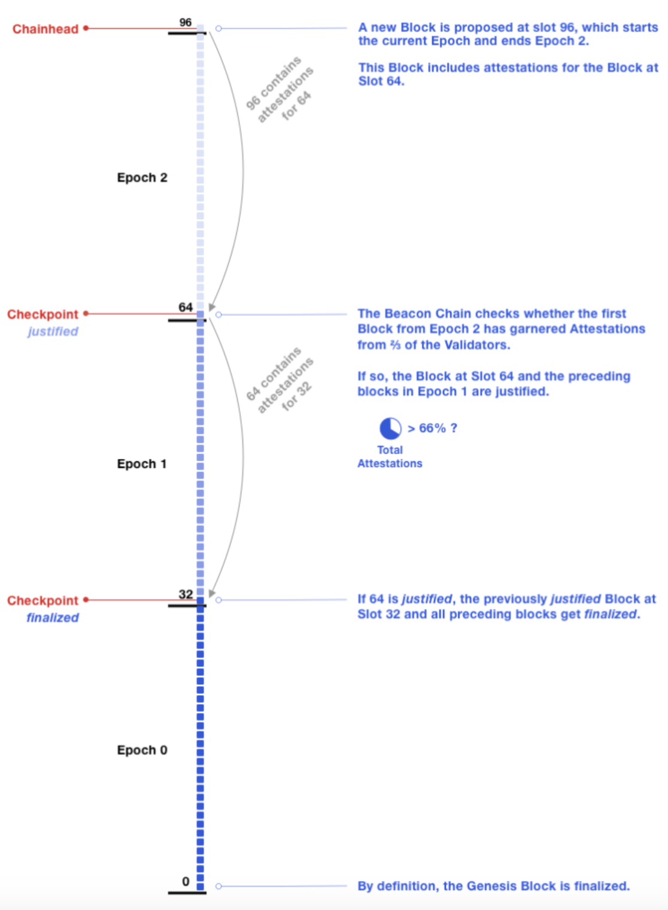

This document outlines what you need to know as an Ethereum developer about The Merge

## What is The Merge?

TLDR; Ethereum has moved from Proof of Work to Proof of Stake. For a high level overview of what the Merge is and why it happened, check out [The Merge resource hub](https://www.alchemy.com/the-merge).

## What testnet should I be using after The Merge?

**Update: March 6, 2023**: [Goerli will be deprecated as of January 2023](https://github.com/eth-clients/goerli). It will be supported long-term until the end of 2023. We recommend using Sepolia testnet.

You can also get free Sepolia ETH using Alchemy's [Sepolia Faucet](https://sepoliafaucet.com/). The drip allows for up to 1 sETH every 24 hours.

Sepolia: Sepolia is a proof-of-stake (PoS) testnet where dapp developers can test their smart contracts and decentralized applications. Unlike other testnets like Goerli, Sepolia's total number of testnet tokens is uncapped, which means it is less likely that developers using Sepolia will face testnet token scarcity like Goerli.

Another difference between Sepolia and other testnets like Goerli is that validators are public, meaning anyone can participate in validation by staking. Sepolia was also designed to simulate harsh network conditions, and has shorter block times, which enable faster transaction confirmation times and feedback for developers.

For help, refer to these articles

* [Goerli vs Sepolia](https://www.alchemy.com/overviews/goerli-vs-sepolia)
* [What is the Sepolia testnet?](https://www.alchemy.com/overviews/sepolia-testnet)
* [Top Sepolia RPC Providers](https://www.alchemy.com/overviews/sepolia-rpc-providers)

## What APIs have changed?

All API methods that accept the `latest` block tag now also accept two new block tags for Ethereum commitment levels: `safe` and `finalized`. This applies to the following methods on Ethereum Mainnet and Goerli:

* [eth\_getBlockByNumber](/reference/eth-getblockbynumber)
* [eth\_getLogs](/reference/eth-getlogs)
* [eth\_getBlockTransactionCountByNumber](/reference/eth-getblocktransactioncountbynumber)
* [eth\_getTransactionCount](/reference/eth-gettransactioncount)
* [eth\_getTransactionByBlockHashAndIndex](/reference/eth-gettransactionbyblockhashandindex)
* [eth\_getBlockReceipts](/reference/eth-getblockreceipts)
* [eth\_getBalance](/reference/eth-getbalance)
* [eth\_getCode](/reference/eth-getcode)
* [eth\_estimateGas](/reference/eth-estimategas)
* [eth\_getUncleByBlockNumberAndIndex](/reference/eth-getunclebyblocknumberandindex)
* [eth\_call](/reference/eth-call)
* [trace\_call](/reference/trace-call)
* [trace\_replayBlockTransactions](/reference/trace-replayblocktransactions)
* [trace\_block](/reference/trace-block)

## What are "slots" and "epochs"?

A slot is an opportunity for a block to be added to the chain. Slots occur every ~12 seconds. An epoch is 32 slots, which is around every ~6 minutes.

## How are blocks introduced after The Merge?

In Proof of Stake, validators are randomly selected every "slot" to propose a block. These validators are known as **block proposers**. If the validator does not propose a block in their slot (e.g if the validator is offline) the network will contain an empty slot in that position and move on to the next one. Otherwise, if the block is created, a randomly chosen committee of validators (attesters) will first verify that new block is valid then submit a vote (attestation) that that block it is valid to the network.

## What are `safe` and `finalized`?

`safe` and `finalized` are new blog tags introduced after The Merge that define commitment levels for block finality. Unlike `latest` which increments one block at a time (ex 101, 102, 103), `safe` and `finalized` increment every "epoch" (32 blocks), which is every ~6 minutes assuming an average ~12 second block times.

Below are the definitions for each block tag:

* `safe`: The most recent crypto-economically secure block, cannot be re-orged outside of manual intervention driven by community coordination. Intuitively, this block is “unlikely” to be re-orged.
* `finalized`: The most recent crypto-economically secure block, that has been accepted by >2/3 of validators. Typically finalized in two epochs. Cannot be re-orged outside of manual intervention driven by community coordination. Intuitively, this block is *very* unlikely to be re-orged.
* `latest`: The most recent block in the canonical chain observed by the client, this block may be re-orged out of the canonical chain even under healthy/normal conditions. Intuitively, this block is the most recent block observed by the client.
* `earliest`: The lowest numbered block the client has available. Intuitively, you can think of this as the first block created.
* `pending`: A sample next block built by the client on top of `latest` and containing the set of transactions usually taken from local mempool. Intuitively, you can think of these as blocks that have not been mined yet.

To remember the differences between the block tags you can think of them in the order of oldest to newest block numbers: `earliest` ≤ `finalized` ≤ `safe` ≤ `latest` ≤ `pending`

## How are `safe` and `finalized` calculated?

In Proof of Stake, after every "epoch" (32 "slots") the `safe` and `finalized` blocks are voted on by validators. The first block in every new epoch (known as a checkpoint) contains validator attestations for the first block in the previous epoch.

Source: [https://consensys.net/blog/news/the-ethereum-2-0-beacon-chain-explained/](https://consensys.net/blog/news/the-ethereum-2-0-beacon-chain-explained/)

## Which networks does this apply to?

Right now, these changes are live on Ethereum Mainnet and Goerli.

## What is a re-org (re-organization)?

[Re-org](https://www.alchemy.com/overviews/what-is-a-reorg) stands for re-organization and is an event where a block that was included in the canonical chain (longest chain) is removed from the canonical chain in favor of another block with the same height. It can occur when more than one miner or validator proposes a block at the same time.

## How should I handle re-orgs after the merge?

In order to minimize the risk of receiving re-org’d data you should use the new block tags `safe` and `finalized` (with `finalized` being the least likely to be re-orged) instead of `latest`
