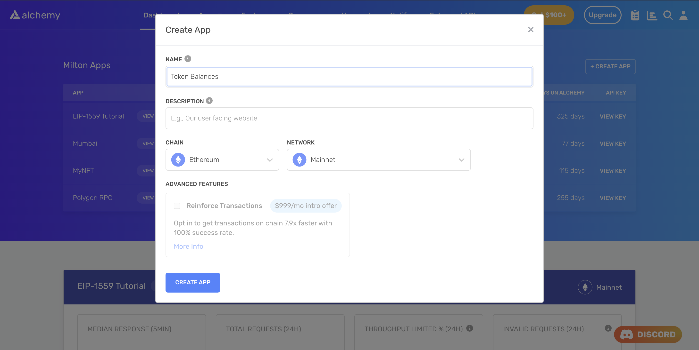

# How to decode an eth\_call response

Learn how to decode the overwhelmingly large hex strings returned by the [`eth_call`](/reference/eth-call) method.

# Introduction

The [`eth_call`](/reference/eth-call) method is commonly used to call the read-only functions of smart contracts, like reading the owner off an NFT smart contract. The values returned by these functions are in the hex format. To convert these values to a human-readable format, we need to decode them. In this guide, we will show you how to decode the responses of the `eth_call` method so that you can easily read them.

# Prerequisites

To continue with this guide you need to about the [eth\_call](/reference/eth-call) method and how it works.

# Making an `eth_call` request

For the sake of this tutorial, we will be using the `eth_call` method on an ERC20 token contract (USDT) to get the balance of a particular address and also get the symbol of the token. We will be calling the [eth\_call](/reference/eth-call) method through [Alchemy SDK](/reference/alchemy-sdk-quickstart).

<Info>
  It would be way easier to get the the token balance of an address and the symbol of the token using Alchemy's [`getTokenBalances`](/reference/alchemy-gettokenbalances) and [`getTokenMetadata`](/reference/alchemy-gettokenmetadata) APIs as you won't have to deal with decoding the response in that case.
</Info>

## Step 1: Install Node and npm

In case you haven't already, [install node and npm](https://nodejs.org/en/download/) on your local machine.

Make sure that node is at least **v14 or higher** by typing the following in your terminal:

<CodeGroup>
  ```shell shell
  node -v
  ```
</CodeGroup>

## Step 2: Create an Alchemy app

***

In case you haven't already, [sign up for a free Alchemy account](https://dashboard.alchemy.com/signup/?a=decode-eth-call).



Alchemy's account dashboard where developers can create a new app on the Ethereum blockchain.

Next, navigate to the [Alchemy Dashboard](https://dashboard.alchemy.com/signup/?a=decode-eth-call) and [create a new app](/reference/alchemy-quickstart-guide). Make sure you set the chain to Ethereum and the network to Mainnet. Once the app is created, click on your app's *View Key* button on the dashboard. Take note of the **HTTP URL**.

The URL will be in this form: `https://eth-mainnet.g.alchemy.com/v2/xxxxxxxxx`

You will need this later.

***

## Step 3: Create a node project

Let's now create an empty repository and install all node dependencies.

<CodeGroup>
  ```shell shell
  mkdir eth-call-decoder && cd eth-call-decoder
  npm init -y
  npm install alchemy-sdk ethers
  touch main.js
  ```
</CodeGroup>

This will create a repository named `eth-call-decoder` that holds all your files and dependencies. Next, open this repo in your favorite code editor. We will be writing all our code in the `main.js` file.

In order to get the balance of a token for a wallet address and its symbol, we need to leverage the [eth\_call](/reference/eth-call) method. This will allow us to query USDT contract's `balanceOf` method and the `symbol` state variable.

Add the following code to the `main.js` file. Here's an overview of what the code is doing (also explained in comments):

* Imports the required objects from Alchemy SDK.
* Sets the config object (setting API key and the network).
* Makes an `alchemy` variable using the config object for making the calls.
* Defines a main function that gets executed when the script runs.
* In the main function it defines the wallet address whose balance we want to query.
* Defines the contract address for the ERC20 token.
* Defines the number of decimals of the ERC20 token.
* Defines the abi for the ERC20 token that will be used for making an `eth_call` request.
* Creates function call data for getting the symbol and balance using the abi and Utils object of Alchemy SDK.
* Makes an `eth_call` request using Alchemy SDK for getting the symbol value in the hex format.
* Makes an `eth_call` request using Alchemy SDK for getting the balance value in the hex format.
* Logs the hex values of both symbol and balance.

<CodeGroup>
  ```javascript main.js
  const { Alchemy, Network, Utils } = require("alchemy-sdk");

  const config = {
    apiKey: "<-- ALCHEMY API KEY -->",
    network: Network.ETH_MAINNET,
  };

  const alchemy = new Alchemy(config);

  const main = async () => {
    // Wallet address whose balance you want to query
    const walletAddress = "0xef0dcc839c1490cebc7209baa11f46cfe83805ab";

    // USDT contract address
    const contractAddress = "0xdAC17F958D2ee523a2206206994597C13D831ec7";
    const numDecimals = 6;
    // You can find out how many decimal places any currency has by reading the decimals value from the contract's page on Etherscan.

    // ABI -- defining the functions in the ABI that we want to call using the eth_call method.
    let abi = ["function balanceOf(address account)", "function symbol()"];

    // Create function call data for getting the symbol and balance -- eth_call
    let iface = new Utils.Interface(abi);
    let symbolData = iface.encodeFunctionData("symbol");
    let balanceData = iface.encodeFunctionData("balanceOf", [walletAddress]);

    // Get symbol of the token in hex format -- usage of eth_call
    let symbolInHex = await alchemy.core.call({
      to: contractAddress,
      data: symbolData,
    });

    // Get balance for the wallet address in hex format -- usage of eth_call
    let balanceInHex = await alchemy.core.call({
      to: contractAddress,
      data: balanceData,
    });

    console.log("Balance:", balanceInHex);
    console.log("Symbol:", symbolInHex);
  };

  const runMain = async () => {
    try {
      await main();
      process.exit(0);
    } catch (error) {
      console.log(error);
      process.exit(1);
    }
  };

  runMain();
  ```
</CodeGroup>

Run the script using the following command:

<CodeGroup>
  ```shell terminal
  node main.js
  ```
</CodeGroup>

If all goes well, you should see an output that looks like this:

```shell
Balance: 0x0000000000000000000000000000000000000000000000000000384c37830c89
Symbol: 0x000000000000000000000000000000000000000000000000000000000000002000000000000000000000000000000000000000000000000000000000000000045553445400000000000000000000000000000000000000000000000000000000
```

As you can see that these are the hex strings and not readable by us humans. So, let's learn how to decode these hex strings so that we can read them easily!

# Decoding the response

There are two ways to decode an `eth_call` response depending upon the return type of the call. Two key data types get passed over the response: **[quantities](#decoding-quantities) (integers, numbers)** and **[unformatted byte arrays](#decoding-unformatted-data) (account addresses, hashes, bytecode arrays)** . Both are passed with a hex encoding but with different requirements for decoding.

## Decoding Quantities

In order to format quantities(integers, numbers) into human-readable form, you simply convert the hexadecimal result received from the API response into a decimal.

Furthermore, if it's the value of an ERC20 token, for example, ERC20 balance of an address. You need to divide the decimal form by the number of decimal places that that particular token has. USDT, for instance, has 6. You can find out how many decimal places any currency has by reading the `decimals` value from the contract's page on Etherscan.

Solidity does not support decimal point numbers. So, If you want an ERC20 token to have the ability to be subdivided with a precision of 2 decimal places, you need to represent 1 token as 100 (set its decimal places to 2). Similarly if I you want an ERC20 token to have the ability to subdivided with a precision of 18 decimal places, you need to represent 1 token as 1000000000000000000 (set its decimal places to 18).

So, the formula for number of tokens becomes:

`tokenSupplyWithDecimalZeros = actualTokenSupply * (10 ** decimals)`

That is why we need to divide the decimal value by the number of decimal places, to get the actual token value.

Let's decode the balance hexadecimal string received in our case to demonstrate this. Here's an overview of what the code is doing (also explained in comments):

* Imports the required objects from Alchemy SDK.
* Sets the config object (setting API key and the network).
* Makes an `alchemy` variable using the config object for making the calls.
* Defines a main function that gets executed when the script runs.
* In the main function it defines the wallet address whose balance we want to query.
* Defines the contract address for the ERC20 token.
* Defines the number of decimals of the ERC20 token.
* Defines the abi for the ERC20 token that will be used for making an `eth_call` request.
* Creates function call data for getting the symbol and balance using the abi and Utils object of Alchemy SDK.
* Makes an `eth_call` request using Alchemy SDK for getting the symbol value in the hex format.
* Makes an `eth_call` request using Alchemy SDK for getting the balance value in the hex format.
* Converts the balance in the hex format to decimal format and logs it.
* Logs the symbol in the hex format.

<CodeGroup>
  ```javascript main.js
  const { Alchemy, Network, Utils } = require("alchemy-sdk");

  const config = {
    apiKey: "<-- ALCHEMY API KEY -->",
    network: Network.ETH_MAINNET,
  };

  const alchemy = new Alchemy(config);

  const main = async () => {
    // Wallet address whose balance you want to query
    const walletAddress = "0xef0dcc839c1490cebc7209baa11f46cfe83805ab";

    // USDT contract address
    const contractAddress = "0xdAC17F958D2ee523a2206206994597C13D831ec7";
    const numDecimals = 6;
    // You can find out how many decimal places any currency has by reading the decimals value from the contract's page on Etherscan.

    // ABI -- defining the functions in the ABI that we want to call using the eth_call method.
    let abi = ["function balanceOf(address account)", "function symbol()"];

    // Create function call data for getting the symbol and balance -- eth_call
    let iface = new Utils.Interface(abi);
    let symbolData = iface.encodeFunctionData("symbol");
    let balanceData = iface.encodeFunctionData("balanceOf", [walletAddress]);

    // Get symbol of the token in hex format -- usage of eth_call
    let symbolInHex = await alchemy.core.call({
      to: contractAddress,
      data: symbolData,
    });

    // Get balance for the wallet address in hex format -- usage of eth_call
    let balanceInHex = await alchemy.core.call({
      to: contractAddress,
      data: balanceData,
    });

    // Using parseInt we convert the hex value into decimal and then dividing it by number of decimals of the token.
    // .toFixed(2) means that we are only intersted in the first two decimal places.
    balance = (parseInt(balanceInHex) / 10 ** numDecimals).toFixed(2);
    console.log("Decoded Balance:", balance, "USDT");

    console.log("Symbol:", symbolInHex);
  };

  const runMain = async () => {
    try {
      await main();
      process.exit(0);
    } catch (error) {
      console.log(error);
      process.exit(1);
    }
  };

  runMain();
  ```
</CodeGroup>

Run the script using the following command:

<CodeGroup>
  ```shell terminal
  node main.js
  ```
</CodeGroup>

You should see an output like this:

```shell
Decoded Balance: 61900000.01 USDT
Symbol: 0x000000000000000000000000000000000000000000000000000000000000002000000000000000000000000000000000000000000000000000000000000000045553445400000000000000000000000000000000000000000000000000000000
```

As you can see that we have decoded the value of the balance. So the wallet address in our case holds 61.9 Million USDT.

But the value of the symbol will be a string and not a number, so we have to use the other approach to decode its value. Let's take a look at how to do that.

## Decoding Unformatted Data

In order to convert unformatted data(byte arrays, account addresses, hashes, bytecode arrays) into human-readable format, you need to convert its `hex` value to `utf8` value.

You can convert a hex value to utf8 value using the `toUtf8String` method of `ethers` or if for some reason you don't want to use `ethers` you can do it with pure javascript, you can use the [`decodeURIComponent`](https://developer.mozilla.org/en-US/docs/Web/JavaScript/Reference/Global_Objects/decodeURIComponent) function in combination with some [regex](https://developer.mozilla.org/en-US/docs/Web/JavaScript/Guide/Regular_Expressions) to accomplish this. We'll look at both ways of doing this.

### Decoding using `ethers`:

Here's an overview of what the code is doing (also explained in comments):

* Imports the required objects from Alchemy SDK.
* Sets the config object (setting API key and the network).
* Makes an `alchemy` variable using the config object for making the calls.
* Defines a main function that gets executed when the script runs.
* In the main function it defines the wallet address whose balance we want to query.
* Defines the contract address for the ERC20 token.
* Defines the number of decimals of the ERC20 token.
* Defines the abi for the ERC20 token that will be used for making an `eth_call` request.
* Creates function call data for getting the symbol and balance using the abi and Utils object of Alchemy SDK.
* Makes an `eth_call` request using Alchemy SDK for getting the symbol value in the hex format.
* Makes an `eth_call` request using Alchemy SDK for getting the balance value in the hex format.
* Converts the balance in the hex format to decimal format and logs it.
* Converts the symbol value in the hex format to utf8 format, which is readable by humans, and logs it.

<CodeGroup>
  ```javascript main.js
  const { Alchemy, Network, Utils } = require("alchemy-sdk");
  const ethers = require("ethers");

  const config = {
    apiKey: "<-- ALCHEMY API KEY -->",
    network: Network.ETH_MAINNET,
  };

  const alchemy = new Alchemy(config);

  const main = async () => {
    // Wallet address whose balance you want to query
    const walletAddress = "0xef0dcc839c1490cebc7209baa11f46cfe83805ab";

    // USDT contract address
    const contractAddress = "0xdAC17F958D2ee523a2206206994597C13D831ec7";
    const numDecimals = 6;
    // You can find out how many decimal places any currency has by reading the decimals value from the contract's page on Etherscan.

    // ABI -- defining the functions in the ABI that we want to call using the eth_call method.
    let abi = ["function balanceOf(address account)", "function symbol()"];

    // Create function call data for getting the symbol and balance -- eth_call
    let iface = new Utils.Interface(abi);
    let symbolData = iface.encodeFunctionData("symbol");
    let balanceData = iface.encodeFunctionData("balanceOf", [walletAddress]);

    // Get symbol of the token in hex format -- usage of eth_call
    let symbolInHex = await alchemy.core.call({
      to: contractAddress,
      data: symbolData,
    });

    // Get balance for the wallet address in hex format -- usage of eth_call
    let balanceInHex = await alchemy.core.call({
      to: contractAddress,
      data: balanceData,
    });

    // Using parseInt we convert the hex value into decimal and then dividing it by number of decimals of the token.
    // .toFixed(2) means that we are only intersted in the first two decimal places.
    balance = (parseInt(balanceInHex) / 10 ** numDecimals).toFixed(2);
    console.log("Decoded Balance:", balance, "USDT");

    // Using the hexToUtf8 function to convert the hex value into utf8 value
    let symbol = ethers.utils.toUtf8String(symbolInHex);
    console.log("Decoded Symbol:", symbol);
  };

  const runMain = async () => {
    try {
      await main();
      process.exit(0);
    } catch (error) {
      console.log(error);
      process.exit(1);
    }
  };

  runMain();
  ```
</CodeGroup>

Run the script using the following command:

<CodeGroup>
  ```shell terminal
  node main.js
  ```
</CodeGroup>

You should see an output like this:

```shell
Decoded Balance: 61900000.01 USDT
Decoded Symbol:  USDT
```

You can see that the symbol of the ERC20 token is USDT. Now we have the decoded value of both the symbol and the balance.

Let's also take a look at how to decode unformatted data (byte arrays, account addresses, hashes, bytecode arrays) using pure javascript:

### Decoding using pure javascript

If for some reason you don't want to use `ethers` for decoding the symbol hex value, here's the pure javascript way of doing it.

Here's an overview of what the code is doing (also explained in comments):

* Imports the required objects from Alchemy SDK.
* Sets the config object (setting API key and the network).
* Makes an `alchemy` variable using the config object for making the calls.
* Defines a main function that gets executed when the script runs.
* In the main function it defines the wallet address whose balance we want to query.
* Defines the contract address for the ERC20 token.
* Defines the number of decimals of the ERC20 token.
* Defines the abi for the ERC20 token that will be used for making an `eth_call` request.
* Creates function call data for getting the symbol and balance using the abi and Utils object of Alchemy SDK.
* Makes an `eth_call` request using Alchemy SDK for getting the symbol value in the hex format.
* Makes an `eth_call` request using Alchemy SDK for getting the balance value in the hex format.
* Converts the balance in the hex format to decimal format and logs it.
* Converts the symbol value in the hex format to utf8 format, which is readable by humans, and logs it.

<CodeGroup>
  ```javascript main.js
  const { Alchemy, Network, Utils } = require("alchemy-sdk");

  const config = {
    apiKey: "<-- ALCHEMY API KEY -->",
    network: Network.ETH_MAINNET,
  };

  const alchemy = new Alchemy(config);

  const main = async () => {
    // Wallet address whose balance you want to query
    const walletAddress = "0xef0dcc839c1490cebc7209baa11f46cfe83805ab";

    // USDT contract address
    const contractAddress = "0xdAC17F958D2ee523a2206206994597C13D831ec7";
    const numDecimals = 6;
    // You can find out how many decimal places any currency has by reading the decimals value from the contract's page on Etherscan.

    // ABI -- defining the functions in the ABI that we want to call using the eth_call method.
    let abi = ["function balanceOf(address account)", "function symbol()"];

    // Create function call data for getting the symbol and balance -- eth_call
    let iface = new Utils.Interface(abi);
    let symbolData = iface.encodeFunctionData("symbol");
    let balanceData = iface.encodeFunctionData("balanceOf", [walletAddress]);

    // Get symbol of the token in hex format -- usage of eth_call
    let symbolInHex = await alchemy.core.call({
      to: contractAddress,
      data: symbolData,
    });

    // Get balance for the wallet address in hex format -- usage of eth_call
    let balanceInHex = await alchemy.core.call({
      to: contractAddress,
      data: balanceData,
    });

    // Using parseInt we convert the hex value into decimal and then dividing it by number of decimals of the token.
    // .toFixed(2) means that we are only intersted in the first two decimal places.
    balance = (parseInt(balanceInHex) / 10 ** numDecimals).toFixed(2);
    console.log("Decoded Balance:", balance, "USDT");

    // Using the decodeURIComponent function in combination with regex to convert the hex value into utf8 value
    let symbol = decodeURIComponent(
      symbolInHex.replace(/\s+/g, "").replace(/[0-9a-f]{2}/g, "%$&")
    );
    // The output is appened with this string: "0x "
    // So slicing the first 3 characters and only printing the characters after that as the final value.
    console.log("Decoded Symbol:", symbol.slice(3));
  };

  const runMain = async () => {
    try {
      await main();
      process.exit(0);
    } catch (error) {
      console.log(error);
      process.exit(1);
    }
  };

  runMain();
  ```
</CodeGroup>

Run the script using the following command:

<CodeGroup>
  ```shell terminal
  node main.js
  ```
</CodeGroup>

And you will see the same output as before:

```shell
Decoded Balance: 61900000.01 USDT
Decoded Symbol:  USDT
```

Congratulations! You now know how to decode an `eth_call` response to understand it!
