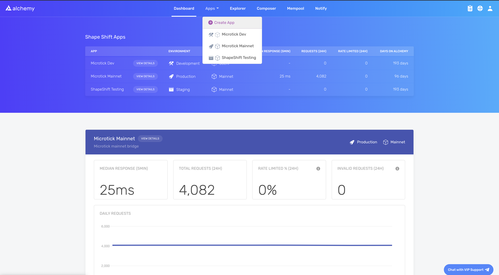
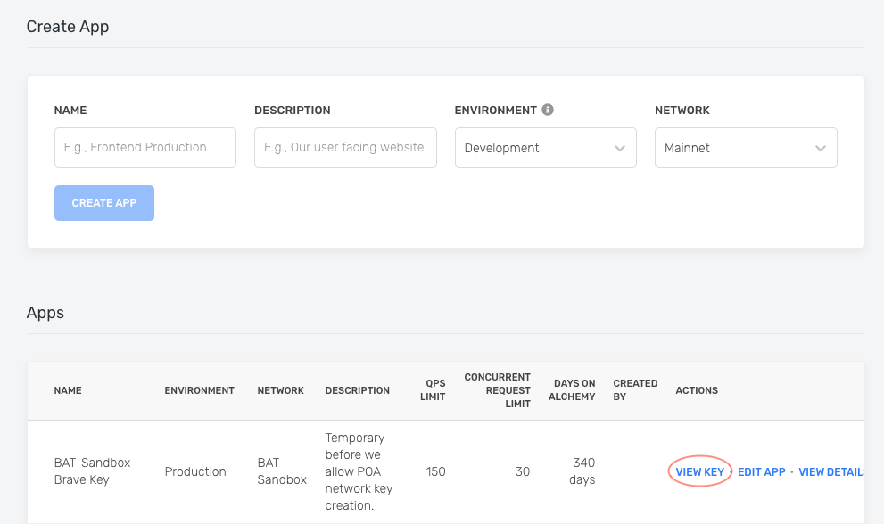

If you're looking to start using the Alchemy SDK, but want some plug-and-play examples on how to get started with common use cases on the Optimism blockchain, here's the place to start! We'll walk you through setting up the Alchemy SDK and a variety of basic tasks you can do.

# Setting up the Alchemy SDK

This guide assumes you already have an [Alchemy account](https://alchemy.com/?r=e68b2f77-7fc7-4ef7-8e9c-cdfea869b9b5) and access to our [Dashboard](https://dashboard.alchemyapi.io).

## 1. Create an Alchemy Key

To access Alchemy's free node infrastructure, you need an API key to authenticate your requests.

You can [create API keys from the dashboard](http://dashboard.alchemyapi.io). Check out this video on how to create an app, replacing the chain "Ethereum" with "Optimism".

Or follow the written steps below:

First, navigate to the "create app" button in the "Apps" tab.



Fill in the details under "Create App" to get your new key. You can also see apps you previously made and those made by your team here. Make sure to select the Optimism chain.

Pull existing keys by clicking on "View Key" for any app.



You can also pull existing API keys by hovering over "Apps" and selecting one. You can "View Key" here, as well as "Edit App" to whitelist specific domains, see several developer tools, and view analytics.

.gif")

## 2. Install and set up the Alchemy SDK

To install the Alchemy SDK, you want to create a project, and then navigate to your project directory to run the installation. Let's go ahead and do that! Once we're in our home directory, let's execute the following:

With NPM:

<CodeGroup>
  ```shell NPM
  mkdir your-project-name
  cd your-project-name
  npm init   # (or npm init --yes)
  npm install alchemy-sdk
  ```
</CodeGroup>

Next, create a file named `index.js` and add the following contents:

<Info>
  You should ultimately replace `demo` with your Alchemy HTTP API key.
</Info>

<CodeGroup>
  ```javascript index.js
  // Setup: npm install alchemy-sdk
  const { Network, Alchemy } = require("alchemy-sdk");

  // Optional Config object, but defaults to demo api-key and eth-mainnet.
  const settings = {
    apiKey: "demo", // Replace with your Alchemy API Key.
    network: Network.OPT_MAINNET, // Replace with your network.
  };

  const alchemy = new Alchemy(settings);

  async function main() {
    const latestBlock = await alchemy.core.getBlockNumber();
    console.log("The latest block number is", latestBlock);
  }

  main();
  ```
</CodeGroup>

Unfamiliar with the async stuff? Check out this [Medium post](https://betterprogramming.pub/understanding-async-await-in-javascript-1d81bb079b2c).

## 3. Run your dApp using Node

<CodeGroup>
  ```shell shell
  node index.js
  ```
</CodeGroup>

You should now see the latest block number output in your console!

<CodeGroup>
  ```shell shell
  The latest block number is 11043912
  ```
</CodeGroup>

Below, we'll list a number of examples on how to make common requests on Optimism or EVM blockchains.

# [How to Get the Latest Block Number on Optimism](/reference/eth-blocknumber-optimism)

If you're looking for the latest block on Optimism, you can plug in the following:

<CodeGroup>
  ```typescript typescript
  async function main() {
    const latestBlock = await alchemy.core.getBlockNumber();
    console.log("The latest block number is", latestBlock);
  }

  main();
  ```
</CodeGroup>

# [How to Get a Block By Its Block Hash on Optimism](/reference/eth-getblockbyhash-optimism)

Every block on Optimism correspond to a specific hash. If you'd like to look up a block by its hash, you can plug in the following code:

<CodeGroup>
  ```typescript typescript
  async function main() {
    const block = await alchemy.core.getBlock(
        "0x92fc42b9642023f2ee2e88094df80ce87e15d91afa812fef383e6e5cd96e2ed3"
    );
    console.log(block);
  }

  main();
  ```
</CodeGroup>

# [How to Get a Block By Its Block Number on Optimism](/reference/eth-getblockbynumber-optimism)

Every block on Optimism correspond to a specific number. If you'd like to look up a block by its number, you can plug in the following code:

<CodeGroup>
  ```typescript typescript
  async function main() {
  	const block = await alchemy.core.getBlock(15221026);
    console.log(block);
  }

  main();
  ```
</CodeGroup>

# [How to Get Logs for an Optimism Transaction](/reference/eth-getlogs-optimism)

Logs are essentially a published list of user-defined events that have happened on the blockchain during an Optimism transaction. You can learn more about them in [Understanding Logs: Deep Dive into eth\_getLogs](/docs/deep-dive-into-eth_getlogs).

Here's an example on how to write a getLogs query on Optimism:

<CodeGroup>
  ```typescript typescript
  async function main() {
    const getLogs = await alchemy.core.getLogs({
        address: "0xdAC17F958D2ee523a2206206994597C13D831ec7",
        topics: [
          "0xddf252ad1be2c89b69c2b068fc378daa952ba7f163c4a11628f55a4df523b3ef",
        ],
        blockHash:
          "0x49664d1de6b3915d7e6fa297ff4b3d1c5328b8ecf2ff0eefb912a4dc5f6ad4a0",
    });
    console.log(getLogs);
  }

  main();
  ```
</CodeGroup>

# [How to Make an Eth\_Call on Optimism](/reference/eth-call-optimism)

An eth\_call in Optimism is essentially a way to execute a message call immediately without creating a transaction on the block chain. It can be used to query internal contract state, to execute validations coded into a contract or even to test what the effect of a transaction would be without running it live.

Here's an example on how to write a call query on Optimism:

<CodeGroup>
  ```typescript typescript
  async function main() {
    const call = await alchemy.core.call({
      to: "0x4976fb03C32e5B8cfe2b6cCB31c09Ba78EBaBa41",
      gas: "0x76c0",
      gasPrice: "0x9184e72a000",
      data: "0x3b3b57debf074faa138b72c65adbdcfb329847e4f2c04bde7f7dd7fcad5a52d2f395a558",
    });
    console.log(call);
  }

  main();
  ```
</CodeGroup>

# [How to Get a Transaction by Its Hash on Optimism](/reference/eth-gettransactionbyhash-optimism)

Every transaction on Optimism correspond to a specific hash. If you'd like to look up a transaction by its hash, you can plug in the following code:

<CodeGroup>
  ```typescript typescript
  async function main() {
    const tx = await alchemy.core.getTransaction(
      "0x88df016429689c079f3b2f6ad39fa052532c56795b733da78a91ebe6a713944b"
    );
    console.log(tx);
  }

  main();
  ```
</CodeGroup>

# [How to Get a Transaction Receipt on Optimism](/reference/eth-gettransactionreceipt-optimism)

Every transaction on Optimism has an associated receipt with metadata about the transaction, such as the gas used and logs printed during the transaction. If you'd like to look up a transaction's receipt, you can plug in the following code:

<CodeGroup>
  ```typescript typescript
  async function main() {
  	const txReceipt = await alchemy.core.getTransactionReceipt(
      "0x88df016429689c079f3b2f6ad39fa052532c56795b733da78a91ebe6a713944b"
    );
    console.log(txReceipt);
  }

  main();
  ```
</CodeGroup>

# [How to get a User's Transaction Count on Optimism](/reference/eth-gettransactioncount-optimism)

The number of transactions a user has sent is particularly important when it comes to calculating the [nonce for sending new transactions on Optimism](/docs/ethereum-transactions-pending-mined-dropped-replaced). Without it, you'll be unable to send new transactions because your nonce won't be set correctly.

<CodeGroup>
  ```typescript typescript
  async function main() {
    const txCount = await alchemy.core.getTransaction(
      "0x88df016429689c079f3b2f6ad39fa052532c56795b733da78a91ebe6a713944b"
    );
    console.log(txCount);
  }

  main();
  ```
</CodeGroup>

# [How to Fetch Historical Transactions on Optimism](/reference/alchemy-getassettransfers)

Oftentimes, you'll want to look up a set of transactions on Optimism between a set of blocks, corresponding to a set of token types such as ERC20 or ERC721, or with certain attributes. Alchemy's proprietary Transfers API allows you to do so in milliseconds, rather than searching every block on the blockchain.

<CodeGroup>
  ```typescript typescript
  async function main() {
    const getTransfers = alchemy.core.getAssetTransfers({
      fromBlock: "0x0",
      toBlock: "latest",
      contractAddresses: ["0xbc4ca0eda7647a8ab7c2061c2e118a18a936f13d"],
      excludeZeroValue: true,
      category: ["erc721"],
    });
    console.log(getTransfers);
  }

  main();
  ```
</CodeGroup>

# [How to Subscribe to New Blocks on Optimism](/reference/subscription-api)

If you'd like to open a WebSocket subscription to send you a JSON object whenever a new block is published to the blockchain, you can set one up using the following syntax.

<CodeGroup>
  ```typescript typescript
  // Subscription for new blocks on Eth Mainnet.
  alchemy.ws.on("block", (blockNumber) =>
    console.log("The latest block number is", blockNumber)
  );
  ```
</CodeGroup>

# [How to Estimate the Gas of a Transaction on Optimism](/reference/eth-estimategas-optimism)

Oftentimes, you'll need to calculate how much gas a particular transaction will use on the blockchain to understand the maximum amount that you'll pay on that transaction. This example will return the gas used by the specified transaction:

<CodeGroup>
  ```typescript typescript
  async function main() {
  	const gasEstimate = await alchemy.core.estimateGas({
      // Wrapped ETH address
      to: "0xC02aaA39b223FE8D0A0e5C4F27eAD9083C756Cc2",
      // `function deposit() payable`
      data: "0xd0e30db0",
      // 1 ether
      value: parseEther("1.0"),
    });
    console.log(gasEstimate);
  }

  main();
  ```
</CodeGroup>

# [How to Get the Current Gas Price in Optimism](/reference/eth-gasprice-optimism)

You can retrieve the current gas price in wei using this method:

<CodeGroup>
  ```typescript typescript
  async function main() {
  	const gasPrice = await alchemy.core.getGasPrice();
    console.log(gasPrice);
  }

  main();
  ```
</CodeGroup>
