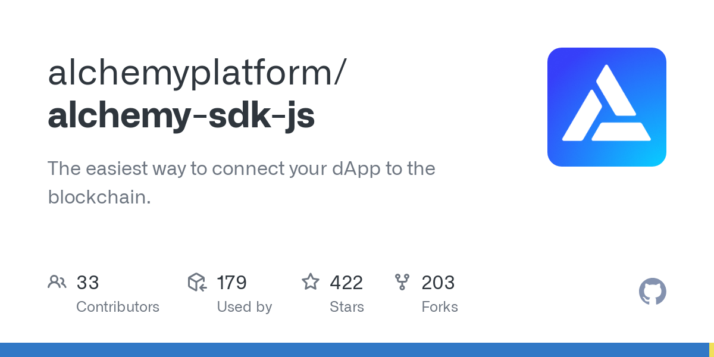

<Tip title="Don’t have an API key?" icon="star">
  Sign up to start building on Polygon. [Get started for free](https://dashboard.alchemy.com/signup/?a=polygon-quickstarrt)
</Tip>

# Getting Started Instructions

## 1. Choose a package manager (npm or yarn)

For this guide, we will be using npm or yarn as our package manager to install either `alchemy-sdk` or any other packages.

### npm

To get started with `npm`, follow the documentation to install Node.js and `npm` for your operating system: [https://docs.npmjs.com/downloading-and-installing-node-js-and-npm](https://docs.npmjs.com/downloading-and-installing-node-js-and-npm)

### yarn

To get started with `yarn`, follow these steps: [https://classic.yarnpkg.com/lang/en/docs/install](https://classic.yarnpkg.com/lang/en/docs/install/#mac-stable)

## 2. Set up your project (npm or yarn)

<CodeGroup>
  ```text Shell (npm)
  mkdir alchemy-polygon-api
  cd alchemy-polygon-api
  npm init --yes
  ```

  ```text Shell (yarn)
  mkdir alchemy-polygon-api
  cd alchemy-polygon-api
  yarn init --yes
  ```
</CodeGroup>

## 3. Install Alchemy-SDK

Run the following command to install the Alchemy SDK with npm or yarn.

<CodeGroup>
  ```text npm
  npm install alchemy-sdk
  ```

  ```text yarn
  yarn add alchemy-sdk
  ```
</CodeGroup>

## 4. Make your first request

You are all set now to use Polygon PoS API and make your first request. For instance, lets make a request to `get latest block`. Create an `index.js` file and paste the following code snippet into the file.

<CodeGroup>
  ```javascript index.js
  const { Network, Alchemy } = require("alchemy-sdk");

  // Optional Config object, but defaults to demo api-key and eth-mainnet.
  const settings = {
    apiKey: "demo", // Replace with your Alchemy API Key.
    network: Network.MATIC_MAINNET, // Replace with your network.
  };

  const alchemy = new Alchemy(settings);

  async function main() {
    const latestBlock = await alchemy.core.getBlockNumber();
    console.log("The latest block number is", latestBlock);
  }

  main();
  ```
</CodeGroup>

## 5. Run script

To run the above node script, use cmd `node index.js`, and you should see the output.

<CodeGroup>
  ```text shell
  The latest block number is 36250231
  ```
</CodeGroup>

***

# Polygon Tutorials

You must not stop here! Want to build your first Dapp on Polygon and use Polygon APIs?

Check out the following tutorials to learn how to build on Polygon:

* [How to Code and Deploy a Polygon Smart Contract](/docs/how-to-code-and-deploy-a-polygon-smart-contract)
* [Polygon SDK Examples](/reference/polygon-sdk-examples)
* [Polygon API FAQ](/reference/polygon-api-faq)
* [How to Add Polygon to Metamask](/docs/how-to-add-polygon-to-metamask)

For full documentation on the available endpoints for alchemy-sdk, check the github repo:

[](https://github.com/alchemyplatform/alchemy-sdk-js)

[github.com](https://github.com/alchemyplatform/alchemy-sdk-js)

[GitHub - alchemyplatform/alchemy-sdk-js: The easiest way to connect your dApp to the blockchain.](https://github.com/alchemyplatform/alchemy-sdk-js)
