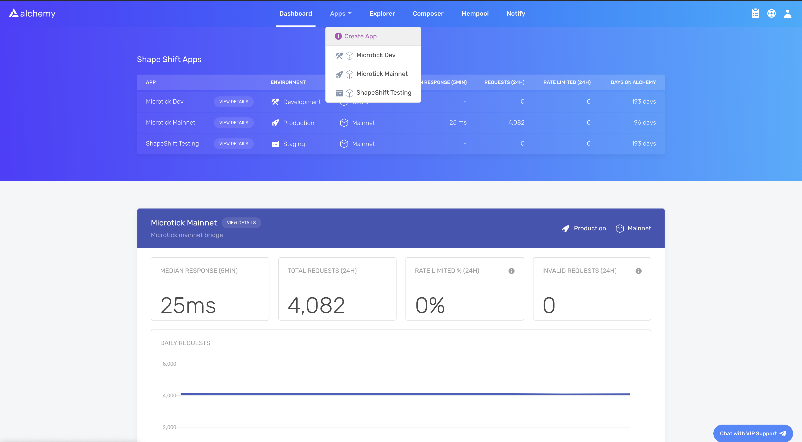
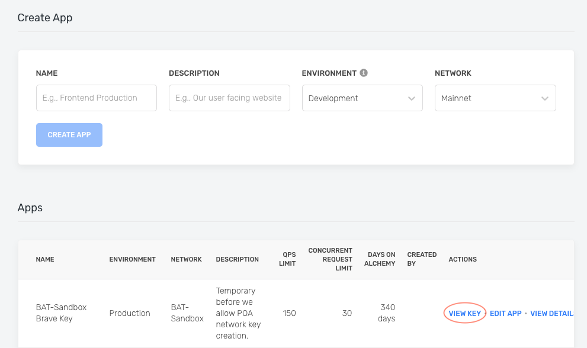

If you're looking to start querying Polygon blockchain data, here's the place to start! We'll walk you through setting up Viem and Ethers.js with Alchemy and show you common use cases.

# Getting Started with Polygon

This guide assumes you already have an [Alchemy account](https://alchemy.com/?r=e68b2f77-7fc7-4ef7-8e9c-cdfea869b9b5) and access to our [Dashboard](https://dashboard.alchemyapi.io).

## 1. Create an Alchemy Key

To access Alchemy's free node infrastructure, you need an API key to authenticate your requests.

You can [create API keys from the dashboard](http://dashboard.alchemyapi.io). Check out this video on how to create an app, replacing the chain "Ethereum" with "Polygon".

Or follow the written steps below:

First, navigate to the "create app" button in the "Apps" tab.



Fill in the details under "Create App" to get your new key. You can also see apps you previously made and those made by your team here. Make sure to select the Polygon chain.

Pull existing keys by clicking on "View Key" for any app.



You can also pull existing API keys by hovering over "Apps" and selecting one. You can "View Key" here, as well as "Edit App" to whitelist specific domains, see several developer tools, and view analytics.

## 2. Install and set up Web3 libraries

To get started with Polygon, you can use either Viem or Ethers.js. Create a project and install your preferred library:

<CodeGroup>
  ```shell Viem
  mkdir your-project-name
  cd your-project-name
  npm init -y
  npm install viem
  ```

  ```shell Ethers.js
  mkdir your-project-name
  cd your-project-name
  npm init -y
  npm install ethers
  ```
</CodeGroup>

Next, create a file named `index.js` and add the following contents:

<Info>
  Replace `demo` with your Alchemy API key from the dashboard.
</Info>

<CodeGroup>
  ```javascript Viem
  import { createPublicClient, http } from 'viem'
  import { polygon } from 'viem/chains'

  const client = createPublicClient({
    chain: polygon,
    transport: http('https://polygon-mainnet.g.alchemy.com/v2/demo') // Replace 'demo' with your API key
  })

  async function main() {
    const latestBlock = await client.getBlockNumber()
    console.log('The latest block number is', latestBlock)
  }

  main()
  ```

  ```javascript Ethers.js
  import { JsonRpcProvider } from 'ethers'

  const provider = new JsonRpcProvider('https://polygon-mainnet.g.alchemy.com/v2/demo') // Replace 'demo' with your API key

  async function main() {
    const latestBlock = await provider.getBlockNumber()
    console.log('The latest block number is', latestBlock)
  }

  main()
  ```
</CodeGroup>

Unfamiliar with the async stuff? Check out this [Medium post](https://betterprogramming.pub/understanding-async-await-in-javascript-1d81bb079b2c).

## 3. Run your dApp using Node

<CodeGroup>
  ```shell shell
  node index.js
  ```
</CodeGroup>

You should now see the latest block number output in your console!

<CodeGroup>
  ```shell shell
  The latest block number is 11043912
  ```
</CodeGroup>

Below, we'll list a number of examples on how to make common requests on Polygon or EVM blockchains.

# [How to Get the Latest Block Number on Polygon](/reference/eth-blocknumber-polygon)

If you're looking for the latest block on Polygon, you can use the following:

<CodeGroup>
  ```javascript Viem
  async function main() {
    const latestBlock = await client.getBlockNumber()
    console.log('The latest block number is', latestBlock)
  }

  main()
  ```

  ```javascript Ethers.js
  async function main() {
    const latestBlock = await provider.getBlockNumber()
    console.log('The latest block number is', latestBlock)
  }

  main()
  ```
</CodeGroup>

# [How to Get a Block By Its Block Hash on Polygon](/reference/eth-getblockbyhash-polygon)

Every block on Polygon corresponds to a specific hash. If you'd like to look up a block by its hash, you can use the following code:

<CodeGroup>
  ```javascript Viem
  async function main() {
    const block = await client.getBlock({
      blockHash: '0x92fc42b9642023f2ee2e88094df80ce87e15d91afa812fef383e6e5cd96e2ed3'
    })
    console.log(block)
  }

  main()
  ```

  ```javascript Ethers.js
  async function main() {
    const block = await provider.getBlock(
      '0x92fc42b9642023f2ee2e88094df80ce87e15d91afa812fef383e6e5cd96e2ed3'
    )
    console.log(block)
  }

  main()
  ```
</CodeGroup>

# [How to Get a Block By Its Block Number on Polygon](/reference/eth-getblockbynumber-polygon)

Every block on Polygon corresponds to a specific number. If you'd like to look up a block by its number, you can use the following code:

<CodeGroup>
  ```javascript Viem
  async function main() {
    const block = await client.getBlock({
      blockNumber: 15221026n
    })
    console.log(block)
  }

  main()
  ```

  ```javascript Ethers.js
  async function main() {
    const block = await provider.getBlock(15221026)
    console.log(block)
  }

  main()
  ```
</CodeGroup>

# [How to Get Logs for a Polygon Transaction](/reference/eth-getlogs-polygon)

Logs are essentially a published list of user-defined events that have happened on the blockchain during a Polygon transaction. You can learn more about them in [Understanding Logs: Deep Dive into eth\_getLogs](/docs/deep-dive-into-eth_getlogs).

Here's an example on how to write a getLogs query on Polygon:

<CodeGroup>
  ```javascript Viem
  async function main() {
    const logs = await client.getLogs({
      address: '0xdAC17F958D2ee523a2206206994597C13D831ec7',
      topics: [
        '0xddf252ad1be2c89b69c2b068fc378daa952ba7f163c4a11628f55a4df523b3ef',
      ],
      blockHash: '0x49664d1de6b3915d7e6fa297ff4b3d1c5328b8ecf2ff0eefb912a4dc5f6ad4a0',
    })
    console.log(logs)
  }

  main()
  ```

  ```javascript Ethers.js
  async function main() {
    const logs = await provider.getLogs({
      address: '0xdAC17F958D2ee523a2206206994597C13D831ec7',
      topics: [
        '0xddf252ad1be2c89b69c2b068fc378daa952ba7f163c4a11628f55a4df523b3ef',
      ],
      blockHash: '0x49664d1de6b3915d7e6fa297ff4b3d1c5328b8ecf2ff0eefb912a4dc5f6ad4a0',
    })
    console.log(logs)
  }

  main()
  ```
</CodeGroup>

# [How to Make an Eth\_Call on Polygon](/reference/eth-call-polygon)

An eth\_call in Polygon is essentially a way to execute a message call immediately without creating a transaction on the blockchain. It can be used to query internal contract state, to execute validations coded into a contract or even to test what the effect of a transaction would be without running it live.

Here's an example on how to write a call query on Polygon:

<CodeGroup>
  ```javascript Viem
  async function main() {
    const result = await client.call({
      to: '0x4976fb03C32e5B8cfe2b6cCB31c09Ba78EBaBa41',
      gas: 0x76c0n,
      gasPrice: 0x9184e72a000n,
      data: '0x3b3b57debf074faa138b72c65adbdcfb329847e4f2c04bde7f7dd7fcad5a52d2f395a558',
    })
    console.log(result)
  }

  main()
  ```

  ```javascript Ethers.js
  async function main() {
    const result = await provider.call({
      to: '0x4976fb03C32e5B8cfe2b6cCB31c09Ba78EBaBa41',
      gasLimit: '0x76c0',
      gasPrice: '0x9184e72a000',
      data: '0x3b3b57debf074faa138b72c65adbdcfb329847e4f2c04bde7f7dd7fcad5a52d2f395a558',
    })
    console.log(result)
  }

  main()
  ```
</CodeGroup>

# [How to Get a Transaction by Its Hash on Polygon](/reference/eth-gettransactionbyhash-polygon)

Every transaction on Polygon corresponds to a specific hash. If you'd like to look up a transaction by its hash, you can use the following code:

<CodeGroup>
  ```javascript Viem
  async function main() {
    const tx = await client.getTransaction({
      hash: '0x88df016429689c079f3b2f6ad39fa052532c56795b733da78a91ebe6a713944b'
    })
    console.log(tx)
  }

  main()
  ```

  ```javascript Ethers.js
  async function main() {
    const tx = await provider.getTransaction(
      '0x88df016429689c079f3b2f6ad39fa052532c56795b733da78a91ebe6a713944b'
    )
    console.log(tx)
  }

  main()
  ```
</CodeGroup>

# [How to Get a Transaction Receipt on Polygon](/reference/eth-gettransactionreceipt-polygon)

Every transaction on Polygon has an associated receipt with metadata about the transaction, such as the gas used and logs printed during the transaction. If you'd like to look up a transaction's receipt, you can use the following code:

<CodeGroup>
  ```javascript Viem
  async function main() {
    const txReceipt = await client.getTransactionReceipt({
      hash: '0x88df016429689c079f3b2f6ad39fa052532c56795b733da78a91ebe6a713944b'
    })
    console.log(txReceipt)
  }

  main()
  ```

  ```javascript Ethers.js
  async function main() {
    const txReceipt = await provider.getTransactionReceipt(
      '0x88df016429689c079f3b2f6ad39fa052532c56795b733da78a91ebe6a713944b'
    )
    console.log(txReceipt)
  }

  main()
  ```
</CodeGroup>

# [How to get a User's Transaction Count on Polygon](/reference/eth-gettransactioncount-polygon)

The number of transactions a user has sent is particularly important when it comes to calculating the [nonce for sending new transactions on Polygon](/docs/ethereum-transactions-pending-mined-dropped-replaced). Without it, you'll be unable to send new transactions because your nonce won't be set correctly.

<CodeGroup>
  ```javascript Viem
  async function main() {
    const txCount = await client.getTransactionCount({
      address: '0xd8dA6BF26964aF9D7eEd9e03E53415D37aA96045'
    })
    console.log(txCount)
  }

  main()
  ```

  ```javascript Ethers.js
  async function main() {
    const txCount = await provider.getTransactionCount(
      '0xd8dA6BF26964aF9D7eEd9e03E53415D37aA96045'
    )
    console.log(txCount)
  }

  main()
  ```
</CodeGroup>

# [How to Fetch Historical Transactions on Polygon](/reference/alchemy-getassettransfers)

Oftentimes, you'll want to look up a set of transactions on Polygon between a set of blocks, corresponding to a set of token types such as ERC20 or ERC721, or with certain attributes. Alchemy's proprietary Transfers API allows you to do so in milliseconds, rather than searching every block on the blockchain.

<CodeGroup>
  ```javascript Fetch
  async function main() {
    const response = await fetch('https://polygon-mainnet.g.alchemy.com/v2/demo', {
      method: 'POST',
      headers: {
        'Content-Type': 'application/json',
      },
      body: JSON.stringify({
        jsonrpc: '2.0',
        id: 0,
        method: 'alchemy_getAssetTransfers',
        params: [{
          fromBlock: '0x0',
          toBlock: 'latest',
          contractAddresses: ['0xbc4ca0eda7647a8ab7c2061c2e118a18a936f13d'],
          excludeZeroValue: true,
          category: ['erc721'],
        }]
      })
    })
    const data = await response.json()
    console.log(data.result)
  }

  main()
  ```
</CodeGroup>

# [How to Subscribe to New Blocks on Polygon](/reference/subscription-api)

If you'd like to open a WebSocket subscription to send you a JSON object whenever a new block is published to the blockchain, you can set one up using the following syntax.

<CodeGroup>
  ```javascript Viem
  import { createPublicClient, webSocket } from 'viem'
  import { polygon } from 'viem/chains'

  const client = createPublicClient({
    chain: polygon,
    transport: webSocket('wss://polygon-mainnet.g.alchemy.com/v2/demo')
  })

  // Subscription for new blocks on Polygon
  const unsubscribe = client.watchBlocks({
    onBlock: (block) => {
      console.log('The latest block number is', block.number)
    }
  })
  ```

  ```javascript Ethers.js
  import { WebSocketProvider } from 'ethers'

  const provider = new WebSocketProvider('wss://polygon-mainnet.g.alchemy.com/v2/demo')

  // Subscription for new blocks on Polygon
  provider.on('block', (blockNumber) => {
    console.log('The latest block number is', blockNumber)
  })
  ```
</CodeGroup>

# [How to Estimate the Gas of a Transaction on Polygon](/reference/eth-estimategas-polygon)

Oftentimes, you'll need to calculate how much gas a particular transaction will use on the blockchain to understand the maximum amount that you'll pay on that transaction. This example will return the gas used by the specified transaction:

<CodeGroup>
  ```javascript Viem
  import { parseEther } from 'viem'

  async function main() {
    const gasEstimate = await client.estimateGas({
      // Wrapped MATIC address on Polygon
      to: '0x0d500B1d8E8eF31E21C99d1Db9A6444d3ADf1270',
      // `function deposit() payable`
      data: '0xd0e30db0',
      // 1 MATIC
      value: parseEther('1.0'),
    })
    console.log(gasEstimate)
  }

  main()
  ```

  ```javascript Ethers.js
  import { parseEther } from 'ethers'

  async function main() {
    const gasEstimate = await provider.estimateGas({
      // Wrapped MATIC address on Polygon
      to: '0x0d500B1d8E8eF31E21C99d1Db9A6444d3ADf1270',
      // `function deposit() payable`
      data: '0xd0e30db0',
      // 1 MATIC
      value: parseEther('1.0'),
    })
    console.log(gasEstimate)
  }

  main()
  ```
</CodeGroup>

# [How to Get the Current Gas Price in Polygon](/reference/eth-gasprice-polygon)

You can retrieve the current gas price in wei using this method:

<CodeGroup>
  ```javascript Viem
  async function main() {
    const gasPrice = await client.getGasPrice()
    console.log(gasPrice)
  }

  main()
  ```

  ```javascript Ethers.js
  async function main() {
    const gasPrice = await provider.getGasPrice()
    console.log(gasPrice)
  }

  main()
  ```
</CodeGroup>
