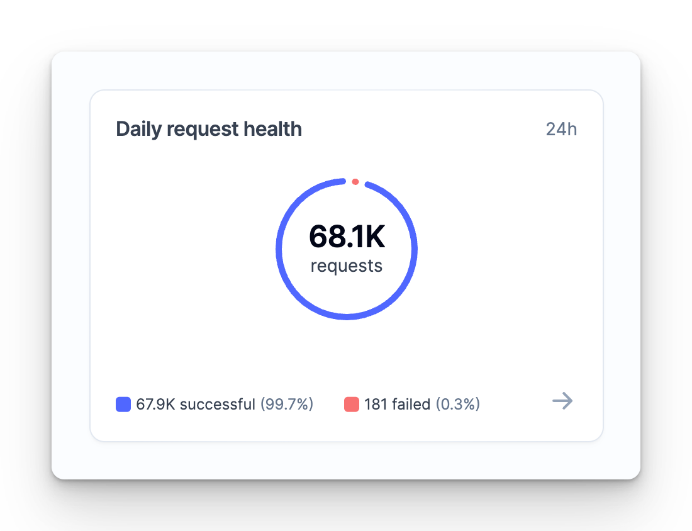
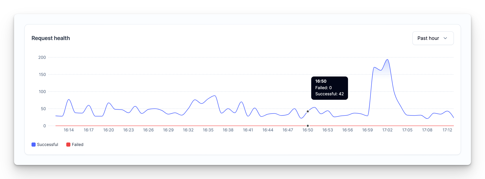

# Identifying an Error Request

When using Alchemy (and in general, web3 development), to understand if your JSON-RPC request was successful or encountered an error, follow these steps:

1. Check the **HTTP Status Code** of the response:

   * If the status code is **not** within the `2xx` range, the request failed.
   * If the status code is within the `2xx` range, proceed to the next step.

2. Check the **error field** in the JSON response body:

   * If an `error` field is present, the request encountered an error.
   * If no `error` field is present, the request was successful.

Here are examples of how HTTP responses may look:

* **Success** (HTTP status is `2xx` and no error field in the response):

  <CodeGroup>
    ```json json
    {"jsonrpc":"2.0","id":0,"result":"0x127776c"}
    ```
  </CodeGroup>

* **Failed** (HTTP status is `2xx` but the error field is populated):

  <CodeGroup>
    ```json json
    {"jsonrpc":"2.0","error":{"code":-32002,"message":"Transaction simulation failed"}}
    ```
  </CodeGroup>

Understanding these responses is important for accurately determining the outcome of your requests.

# HTTP Status Codes

HTTP Status codes are standardized numeric codes that are returned by our servers in response to a client's HTTP requests. In general, there are 3 categories of HTTP codes that you might encounter when using Alchemy: `2xx` , `4xx`, and `5xx`. HTTP error response can have any combination of JSON-RPC error codes (even for `2xx` responses). Below are example HTTP error codes and potential solutions.

<Warning>
  `200` HTTP response indicates that we were able to receive and respond to the request successfully, but there may have been issues actually executing that request on the nodes or on-chain. For example, if you send an `eth_call` request and the gas is too low, you’d get back a `200` HTTP response but a `3` JSON-RPC error code and an error message indicating `execution reverted` since gas is too low.
</Warning>

| Category | HTTP Code | Example JSON-RPC Codes                           | Example Error Message                                                                                                                | Meaning                                                                                                                                                                                                          | Example Solution                                                                                                          |
| -------- | --------- | ------------------------------------------------ | ------------------------------------------------------------------------------------------------------------------------------------ | ---------------------------------------------------------------------------------------------------------------------------------------------------------------------------------------------------------------- | ------------------------------------------------------------------------------------------------------------------------- |
| `2xx`    | `200`     | Any                                              | - `execution reverted` - `err: intrinsic gas too low (supplied gas 50000000)` - `filter not found` - `already known`                 | **Success**: the request was received by the client and returned successfully by the server, however, the request may have encountered issues while being processed on chain.                                    | Verify that your request is valid.                                                                                        |
| `4xx`    |           |                                                  |                                                                                                                                      | **Client Error**: the client had an issue when sending the request                                                                                                                                               |                                                                                                                           |
|          | `400`     | `-32700`, `-32602`, `-32600`, `-32521`, `-32500` | - `Unsupported method` - `Invalid <nth> argument` - `Parse error`                                                                    | **Bad Request**: The request is invalid (e.g incorrect format)                                                                                                                                                   | Verify your request body and format is correct.                                                                           |
|          | `401`     | `-32600`                                         | - `Must be authenticated!` - `Invalid access key`                                                                                    | **Unauthorized**: You must authenticate your request with an API key. Check out how to [create an Alchemy key](/docs/alchemy-quickstart-guide#1key-create-an-alchemy-key) if you do not have one.                | Create a new API key                                                                                                      |
|          | `403`     | `-32600`                                         | - `Monthly capacity limit exceeded.` - `App is inactive.` - `Origin not on whitelist.`                                               | **Forbidden**: the server has received the request successfully, but is intentionally refusing to process it due to some missing criteria.                                                                       | - Upgrade tiers to increase capacity - Create a new API key - Update allowlist to permit request origin.                  |
|          | `429`     | `429`                                            | - `Your app has exceeded its compute units per second capacity.`                                                                     | **Too Many Requests**: You've exceeded your concurrent requests capacity or [compute units](/reference/compute-units) per second capacity. Check out the [throughput](/reference/throughput) page for solutions. | - Upgrade to increase throughput - Implement [automatic retries](/docs/how-to-implement-retries)                          |
| `5xx`    |           |                                                  |                                                                                                                                      | **Server Error**: there was an error processing the request on the server side.                                                                                                                                  | Check out the [status page](https://status.alchemy.com/) for the latest updates.                                          |
|          | `500`     | `-3200` `-32603`                                 | - `Unable to complete request at this time.` - `Block <block number> not processed yet. Please try again.` - `internal server error` | **Server error**: unable to complete the request due to server issues or due to the block not being processed yet                                                                                                | - See the [status page](https://status.alchemy.com/) for latest updates - Ensure the requested block is valid, then retry |
|          | `503`     | `-3200`                                          | `Unable to complete request at this time.`                                                                                           | **Server error**: unable to complete the request due to server issues                                                                                                                                            | - See the [status page](https://status.alchemy.com/) for latest updates                                                   |

# JSON-RPC Error Codes

For JSON-RPC specific errors, you may receive any of the above HTTP Error codes in addition to the JSON RPC error codes specified below.

Error codes range from `-32768` to `-32000`, any code in this range but not defined explicitly is reserved for future use or application-specific errors. For more info on how these are defined check out the [JSON-RPC Error specification docs](https://www.jsonrpc.org/specification#error_object).

| Code                                                                                      | Example Error Message                                                                                                                             | Meaning                                                                                                                                                                                 |
| ----------------------------------------------------------------------------------------- | ------------------------------------------------------------------------------------------------------------------------------------------------- | --------------------------------------------------------------------------------------------------------------------------------------------------------------------------------------- |
| `-32700`                                                                                  | `Parse error`                                                                                                                                     | **Parse error**: Invalid JSON was received by the server. An error occurred on the server while parsing the JSON text.                                                                  |
| `-32600`                                                                                  | - `Must be authenticated!` - `Invalid access key`                                                                                                 | **Invalid Request**: The JSON sent is not a valid Request object.                                                                                                                       |
| `-32601`                                                                                  | `Unsupported method: <method>.`                                                                                                                   | **Method not found**: The method does not exist / is not available.                                                                                                                     |
| `-32602`                                                                                  | `invalid <nth> argument:`                                                                                                                         | **Invalid params**: Invalid method parameter(s).                                                                                                                                        |
| `-32603`                                                                                  | `internal server error`                                                                                                                           | **Internal error**: Internal JSON-RPC error.                                                                                                                                            |
| `-32000` to `-32099`                                                                      | `Unable to complete request at this time.`                                                                                                        | **Server error**: Reserved for implementation-defined server-errors.                                                                                                                    |
| Anything from`-32099 `to `-32599` **or** `-32603` to `-32699` **or** `-32701` to `-32768` | - `-32500` :`AA20 account not deployed`, `AA25 invalid account nonce` - `-32501`: `COLLECT_LIMIT_EXCEEDED `, `user operation's call reverted: 0x` | **Any**: Application-defined error or other.                                                                                                                                            |
| `3`                                                                                       | `execution reverted`                                                                                                                              | Generally used for `eth_call`, `eth_estimateGas`, `alchemy_getTokenBalances`. The `data` field in the error response will have more details on the root cause.                          |
| `20` to `63`                                                                              | `Starknet specific errors`                                                                                                                        | Errors related to Starknet methods. See [https://docs.starkware.co/starkex/api/spot/error\_codes.htmlfor](https://docs.starkware.co/starkex/api/spot/error_codes.htmlfor) more details. |

# Error Messages

Below are a few common error messages and how to solve them.

| Error Message                             | Meaning                                                                                                                                                                                                    | Solution                                                                                   |
| ----------------------------------------- | ---------------------------------------------------------------------------------------------------------------------------------------------------------------------------------------------------------- | ------------------------------------------------------------------------------------------ |
| `already known`                           | This generally means the transaction already posted and is on the node in a pending state. Sometimes this error occurs when transactions fail at first but are retried when the node already knows of them | Check if you’ve already sent a transaction with the same nonce.                            |
| `Unspecified origin not on whitelist`     | Whoever is making the request is not on the allowlist for your API key.                                                                                                                                    | Safely ignore the request or update your app’s allowlist to include the new request origin |
| `filter not found`                        | Filters expire after 5 minutes of inactivity so if it's not found the filter likely expired.                                                                                                               | Create a new filter.                                                                       |
| `Request timed out. Client should retry.` | Gateway timeouts (usually from nodes).                                                                                                                                                                     | Retry the request.                                                                         |
| `transaction underpriced`                 | Transaction was sent with too low gas.                                                                                                                                                                     | Retry the transaction with higher gas.                                                     |

# Common Errors

## How to Solve ENOTFOUND getAddrInfo Errors

**ENOTFOUND getAddrInfo** error is a common issue encountered by developers when trying to make network requests to a specific URL that might not exist any longer.

To resolve this issue, you need to update the URL from `eth-mainnet.alchemy.io` to `eth-mainnet.g.alchemy.com`. Open your application where you are making requests to the old URL and replace it with the new one.

**Before**:

JavaScript

`const apiUrl = '<https://eth-mainnet.alchemy.io/v2/YOUR_API_KEY'>;`

**After**:

JavaScript

`const apiUrl = '<https://eth-mainnet.g.alchemy.com/v2/YOUR_API_KEY'>;`

Save the changes you made to your application and run it again. The ENOTFOUND getAddrInfo error should no longer occur since you are now using the updated URL. To confirm that the error has been resolved, check your application's output or script, and you should see successful network requests to the new URL without any ENOTFOUND errors.

## How to solve `ECONNRESET` errors?

`ECONNRESET` errors occur when a TCP connection cannot be established at that time. If you experience `ECONNRESET` errors, please ensure that your client is not creating a scenario where new connections are unable to be created. Historically, we have only seen client-side issues causing these errors (if the server were rejecting requests indiscriminately, then it would obviously effect multiple clients simultaneously which has never been the case). If you’re hitting a generic `EPROTO` error message, it’s possible you’re facing similar issues.

Here are some guidelines to limit client side issues:

1. If you’re using AWS, a NAT gateway can support up to [55,000](https://docs.aws.amazon.com/vpc/latest/userguide/nat-gateway-troubleshooting.html) simultaneous connections (or approximately 900 connections per second/55,000 connections per minute). Ensure your rate of opening new connections falls within the threshold!

   1. If in AWS, check NAT Gateway for port ErrorPortAllocation errors ([guide](https://repost.aws/knowledge-center/vpc-resolve-port-allocation-errors))
   2. If not in AWS, check to make sure source ports aren’t exhausted

2. For Java, consider implementing a [connection pools](https://www.baeldung.com/httpclient-connection-management).

3. For node.js, consider using [options.keepAlive](https://nodejs.org/api/http.html#http_new_agent_options) to keep the TCP connection alive!

4. Consider enabling HTTP Pipeline (in which you can send more than one request per TCP connection)

5. Ensure systems outside of your production environment are are also not creating too many requests!

If these guidelines don’t help, please request support on our [discord](https://discord.com/invite/alchemyplatform) or email [\[email protected\]](/cdn-cgi/l/email-protection#b1c2c4c1c1dec3c5f1d0ddd2d9d4dcc89fd2dedc).

# How we define “successful” vs. “failed” requests in the dashboard

The dashboard includes various charts that indicate the number of successful or failed request across your applications. A few examples of these include:

[Daily Request Health Pie on the Homepage](https://dashboard.alchemy.com/)



[Request Health Chart on the Homepage](https://dashboard.alchemy.com/)



Several other pages including apps list, app details, logs, and more.

The definitions used for “success” and “failure” throughout the dashboard are the following:

* **Success:** HTTP status code is `2xx` **and** the `response.error` field is empty (null).
* **Failure:** Any condition that does not meet the success criteria.

These definitions ensure a straightforward approach to interpreting dashboard metrics and aligns with the actual HTTP responses you receive.
