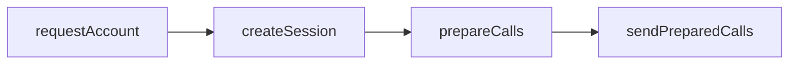

This guide outlines exactly what you need to use Wallet Server with your app! We’ll go over the [`wallet_requestAccount`](https://www.alchemy.com/docs/node/smart-wallets/wallets-api-endpoints/wallets-api-endpoints/wallet-request-account), [`wallet_createSession`](https://www.alchemy.com/docs/node/smart-wallets/wallets-api-endpoints/wallets-api-endpoints/wallet-create-session), [`wallet_prepareCalls`](https://www.alchemy.com/docs/node/smart-wallets/wallets-api-endpoints/wallets-api-endpoints/wallet-prepare-calls), and [`wallet_sendPreparedCalls`](https://www.alchemy.com/docs/node/smart-wallets/wallets-api-endpoints/wallets-api-endpoints/wallet-send-prepared-calls) endpoints in this tutorial.

The logical flow is to get an account for a given signer, create a session for use with that account, prepare the calls you’re looking to send, and send them! If you're looking for a typescript SDK guide, you'll find that here too.

Session keys are useful if you are looking to grant your app’s server partial, secure access to user’s wallets so that the server can sign and send transactions on a user’s behalf within certain permissions.

In API calls, it’s as simple as:



If instead, you don’t want to use session keys and you want the user’s to sign all of the transactions, you can simply skip the createSession step and use the client side signer to sign prepared calls.

This guide assumes you have an account you can sign with, like an [Alchemy Signer](https://www.alchemy.com/docs/wallets/signer/what-is-a-signer#alchemy-signer).

## Using The JSON-RPC APIs Directly

### 1. Request an Account for the Owner Signer

Given an owner address, call `wallet_requestAccount` to return the smart account address for that owner. The [owner](https://accountkit.alchemy.com/concepts/smart-account-signer) address can be any signer (or public key) that has the ability to sign transactions.

* If you want to use social sign up / log in, you can simply use the [SDK](https://accountkit.alchemy.com/react/getting-started) to authenticate user’s and retrieve their signer address
* If instead, you want to generate and control wallets with a custodied owner, you can generate any public private key pair (e.g. any EOA)

This will return the account address associated with the given signer, as well as a uuid you could use to differentiate between accounts for the same signer in the future.

```bash
curl --request POST \
     --url https://api.g.alchemy.com/v2/API_KEY \
     --header 'accept: application/json' \
     --header 'content-type: application/json' \
     --data '
{
  "id": 1,
  "jsonrpc": "2.0",
  "method": "wallet_requestAccount",
  "params": [
    {
      "signerAddress": "0xOWNER_ADDRESS"
    }
  ]
}
'
```

This will return the smart account address associated with the given signer:

```bash
{
  "jsonrpc": "2.0",
  "id": 1,
  "result": {
    "accountAddress": "0xACCOUNT_ADDRESS",
    "id": "af638-a8..."
  }
}
```

### 2. Create a Session With the Session Key Signer

Session keys are useful if you are looking to define on-chain policies or grant your app’s server partial, secure access to user’s wallets so that the server can sign and send transactions on a user’s behalf within certain permissions. If you don’t want to use session keys for server side signing, you can skip to step 4.

After creating a session, you will be able to sign transactions for the generated wallet within the defined permissioned using that session key.

To create a session key using onchain policies:

* Get the public address of a key you want to use as a session key. This can be any key pair that has the ability to sign (aka a [signer](https://accountkit.alchemy.com/concepts/smart-account-signer) that is either an local [signer](https://accountkit.alchemy.com/reference/aa-sdk/core/classes/LocalAccountSigner/constructor#localaccountsigner) like an EOA or signer generated with a signer provider)
* Create a session for that key using your session key public address - here passed in `publicKey` call `wallet_createSession`.

```bash
curl --request POST \
     --url https://api.g.alchemy.com/v2/API_KEY \
     --header 'accept: application/json' \
     --header 'content-type: application/json' \
     --data '
{
	"jsonrpc": "2.0",
  "id": 1,
  "method": "wallet_createSession",
  "params": [
    {
      "account": "0xACCOUNT_ADDRESS",
      "chainId": "0xCHAIN_ID",
      "expiry": UNIX_TIMESTAMP_EXPIRY,
      "key": {
        "publicKey": "0xSESSION_KEY_ADDRESS",
        "type": "secp256k1"
      },
      "permissions": [
        {
          "type": "root"
        }
      ]
    }
  ]
}'
```

This will return two key elements:

1. The session ID
2. The signature request you’ve got to sign to authorize the session key

Keep note of the session ID, you’ll need it later!

```bash
{
    "jsonrpc": "2.0",
    "id": 1,
    "result": {
        "sessionId": "0xSESSION_ID",
        "signatureRequest": {
            "type": "eth_signTypedData_v4",
            "data": {...userOperation}
        }
    }
}
```

### 3. Sign the Session Key Authorization

Sign the signature request from the owner key (used in step 1), then store the resulting signature.

You’re going to need to build the hex-concatenation of `0x00`, the session ID, and the signature.

### 4. Prepare Calls With the Session Key

With the session ID received in step 2 and the signature from step 3, we’re now ready to prepare some calls!

In the “context” field under “permissions” you need to pass the concatenated hex of `0x00` (the context version indicator), the  session ID, and the signature. If you are not using session keys, you can omit the capabilities and permissions params.

```bash
curl --request POST \
     --url https://api.g.alchemy.com/v2/API_KEY \
     --header 'accept: application/json' \
     --header 'content-type: application/json' \
     --data '
{
  "id": 1,
  "jsonrpc": "2.0",
  "method": "wallet_prepareCalls",
  "params": [
    {
      "capabilities": {
        "permissions": {
          "context": concat_hex("0x00", 0xSESSION_ID, 0xPERMISSION_SIG)
          # if a session key was installed outside of the createSession flow
          # then you can use this format:
          # concat_hex(["0x02", toHex(isGlobalValidation), 0x4BYTE_ENTITY_ID])
        }
      },
      "calls": [
        {
          "to": "0x0000000000000000000000000000000000000000"
        }
      ],
      "from": "0xACCOUNT_ADDRESS",
      "chainId": "0xCHAIN_ID"
    }
  ]
}
'
```

This will return the userop request (the `data` field) and a signature request, for example:

```bash
type: "user-operation-v070",
data: {...useropRequest},
chainId: "0xCHAIN_ID"
signatureRequest: {
  type: "personal_sign",
  data: {
    raw: HASH_TO_SIGN,
  }
}
```

### 5. Sign the userop

With the returned signature request, all you have to do is sign the userop hash returned in the `signatureRequest.data.raw` field from step 4.

* If not using session keys, you’ll sign this with the owner of the account (from step 1). You can learn how to stamp the request on the frontend [here](https://docs.alchemy.com/reference/how-to-stamp-requests).
* If using session keys, you can sign this with the session key that was added in step 2 and 3. This signature will be valid as long as it is within the permissions the session key has.

Note that the `type` field in the `signatureRequest` indicates the signature type needed, in this case, we need to `personal_sign` the hash.

### 6. Send the Prepared Calls!

With the signature from step 5, the `useropRequest` from step 4, and the  context from step 3, you’re good to go to send the call!

If you are signing with the owner of the account and not a session key, you can omit the capabilities param.

```bash
curl --request POST \
     --url https://api.g.alchemy.com/v2/API_KEY \
     --header 'accept: application/json' \
     --header 'content-type: application/json' \
     --data '
{
  "id": 1,
  "jsonrpc": "2.0",
  "method": "wallet_sendPreparedCalls",
  "params": [
    {
      "type": "user-operation-v070",
      "data": {...useropRequest},
      "capabilities": {
        "permissions": {
          "context": concat_hex("0x00", 0xSESSION_ID, 0xPERMISSION_SIG)
          # if a session key was installed outside of the createSession flow
          # then you can use this format:
          # concat_hex(["0x02", toHex(isGlobalValidation), 0x4BYTE_ENTITY_ID])
        }
      }
      "signature": {
        "signature": "0xUSEROP_SIGNATURE",
      }
    }
  ]
}
'
```

This will return the array of prepared call IDs! These are userOp hashes.

## Using The Account Kit SDK

Given a signer (e.g. a `LocalAccountSigner` imported from `@aa-sdk/core` or an [Alchemy Signer](https://www.alchemy.com/docs/wallets/signer/what-is-a-signer#alchemy-signer)), all you need to do is follow a few simple steps to start sending user ops with Wallet APIs!

### Create A Smart Account Client

```
import { createSmartWalletClient } from "@account-kit/wallet-client";
  
const client = createSmartWalletClient({
  transport,
  chain: CHAIN, // imported from @account-kit/infra
  mode: "remote",
  signer,
});
```

### Request The Account

A counterfactual address is the account address associated with the given signer-- but the account contract hasn't been deployed yet.

```
const account = await client.requestAccount();
  
// get the address
const address = account.address;
```

### Sign A Message

```
const message = "we are so back"
  
const signature = await client.signMessage(message);
  
// using a regular viem publicClient, instantiated with createPublicClient()
const isValid = await publicClient.verifyMessage({
  address: account.address, // fetched from await client.requestAccount()
  message,
  signature,
});
```

### Sign Typed Data

```
// assuming you have a typedData variable
const signature = await client.signTypedData(typedData);
  
const isValid = await publicClient.verifyTypedData({
  address: account.address, // fetched from await client.requestAccount()
  ...givenTypedData,
  signature,
});
```

### Send A UserOp

```
const account = await client.requestAccount();
  
const preparedUO = await client.prepareCalls({
  calls: [{ to: zeroAddress, value: "0x0" }], // callData is optional in a "data" parameter
  from: account.address,
  // capabilities are a data structure that hold paymaster data (as seen below) or permission data
  // capabilities: {
  //   paymasterService: {
  //     policyId: process.env.TEST_PAYMASTER_POLICY_ID!,
  //   },
  // },
});
  
// Sign the userOp
const signature = await client.signSignatureRequest(
  preparedUO.signatureRequest,
);
  
// Send the userOp
const result = await client.sendPreparedCalls({
  ...preparedUO,
  signature,
});
```

### Create A Session With Permissions

```
const account = await client.requestAccount();
  
// This is where you would use your session key signer!
const sessionKey = LocalAccountSigner.generatePrivateKeySigner();
  
const permissions = await client.grantPermissions({
  account: account.address,
  expiry: Math.floor(Date.now() / 1000) + 60 * 60,
  key: {
    publicKey: await sessionKey.getAddress(),
    type: "secp256k1",
  },
  permissions: [{ type: "root" }], // Here we grant root permissions as an example, but this is not advised in production!
});
  
const preparedUO = await client.prepareCalls({
  calls: [{ to: zeroAddress, value: "0x0" }],
  from: account.address,
  capabilities: {
    // Optional paymaster information goes here too
    permissions,
  },
});
  
const signature = await signSignatureRequest(
  sessionKey, // Note that we now sign with the session key!
  preparedUO.signatureRequest,
);
  
const result = await client.sendPreparedCalls({
  ...preparedUO,
  signature,
  capabilities: {
    permissions,
  },
});
```
