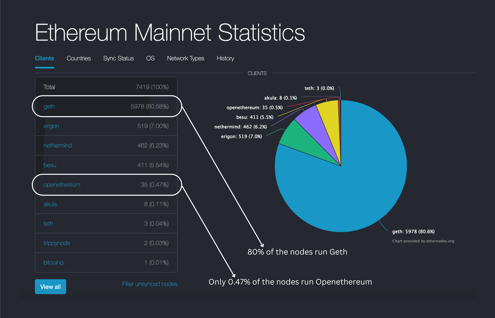

# Prerequisites

Before reading this article you should know about [Ethereum Clients](https://www.alchemy.com/overviews/execution-layer-and-consensus-layer-node-clients) and [EVM Traces](/reference/what-are-evm-traces).

# Introduction

Geth and Openethereum are two popular Ethereum clients. In this article, we'll compare and contrast the [debug API](/reference/debug-api-endpoints) offered by Geth with the [trace API](/reference/trace-api-quickstart) offered by Openethereum and Erigon.

# Debug API

The [Debug API](/reference/debug-api-endpoints) is a set of RPC methods developed by the Go-Ethereum team that provide deeper insights into transaction processing. Some common debug API methods are:

1. [debug\_traceTransaction](/reference/debug-tracetransaction)
2. [debug\_traceCall](/reference/debug-tracecall)
3. [debug\_traceBlockByNumber](/reference/debug-traceblockbynumber)
4. [debug\_traceBlockByHash](/reference/debug-traceblockbyhash)

# Trace API

[Trace API Quickstart](/reference/trace-api-quickstart) is Openethereum's equivalent to Geth's Debug API. It is also a set of RPC methods that provide deeper insights into transaction processing. Some common Trace API methods are:

1. [trace\_transaction](/reference/trace-transaction)
2. [trace\_call](/reference/trace-call)
3. [trace\_block](/reference/trace-block)
4. [trace\_filter](/reference/trace-filter)
5. [trace\_get](/reference/trace-get)
6. [trace\_rawTransaction](/reference/trace-rawtransaction)
7. [trace\_replayBlockTransactions](/reference/trace-replayblocktransactions)
8. [trace\_replayTransaction](/reference/trace-replaytransaction)

# Difference between Trace API and Debug API

1. Geth offers debug API while Trace API is offered by Openethereum and Erigon.
2. Debug API has more methods than Trace API. [Here](https://geth.ethereum.org/docs/rpc/ns-debug) you can find a list of all the methods that Debug API supports.
3. Debug API is more accessible than Trace API as the majority of the Ethereum nodes run the Geth client.
4. Trace API does not include calls to the 9 precompiled contracts specified in the Ethereum chain specification, while debug API does.

<Info>
  Precompiled contracts are a feature of the Ethereum Virtual Machine (EVM) that allow for efficient execution of certain computationally expensive operations. These contracts are built into the EVM and can be called by other contracts to perform specific tasks. They are specified as a part of the Ethereum chain specification, and their addresses are hardcoded into the EVM.

  Currently, there are nine precompiled contracts in the Ethereum network. These precompiled contracts can be called by other smart contracts, and the gas cost of executing them is determined by the size of the input data, which is fixed and known in advance. It means that the execution cost of these contracts is constant, regardless of the specific input provided. This is useful for operations that are known to be computationally expensive, such as elliptic curve operations, modular exponentiation, and hash calculations.
</Info>

5. Trace API includes REWARDS for miners in the trace, but debug API does not.
6. The representation of the callstack is different between Trace and Debug API, trace API includes a field called [traceAddress](/reference/what-are-evm-traces#how-to-read-traceaddress) which gives the exact location of the call trace, while the call stack is nested in the response in debug API.
7. The way error handling is done is different in Trace and Debug API, trace API uses [custom](https://github.com/ledgerwatch/erigon/blob/devel/cmd/rpcdaemon/commands/trace_adhoc.go#L390) error handling while debug API uses [predefined constants](https://github.com/ethereum/go-ethereum/blob/1fa91729f2a591df2baf2dc77e81711a6e61c028/core/vm/errors.go) to represent errors that can occur during EVM execution.

