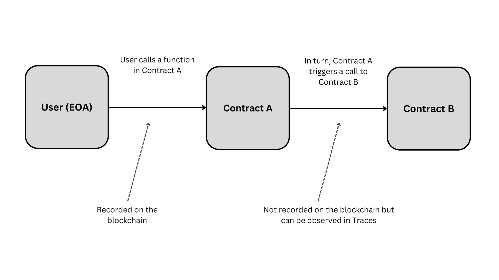
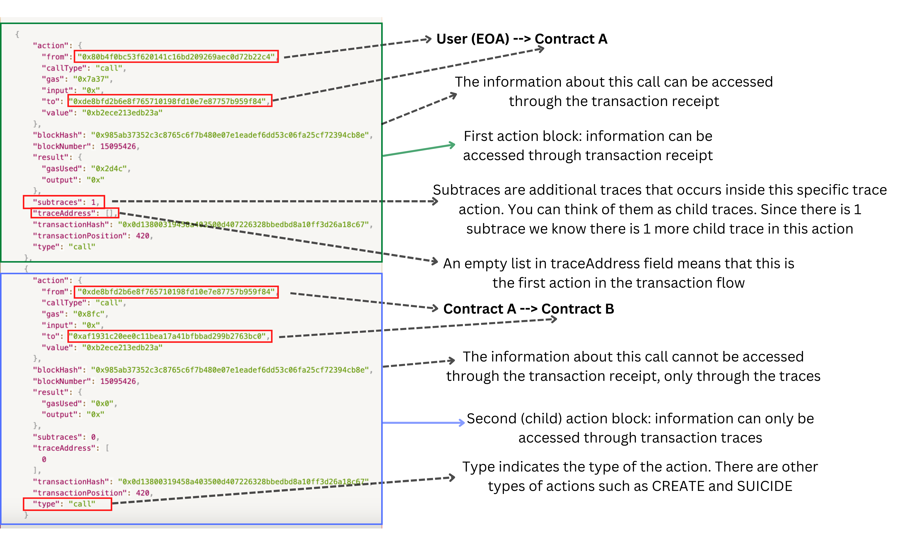
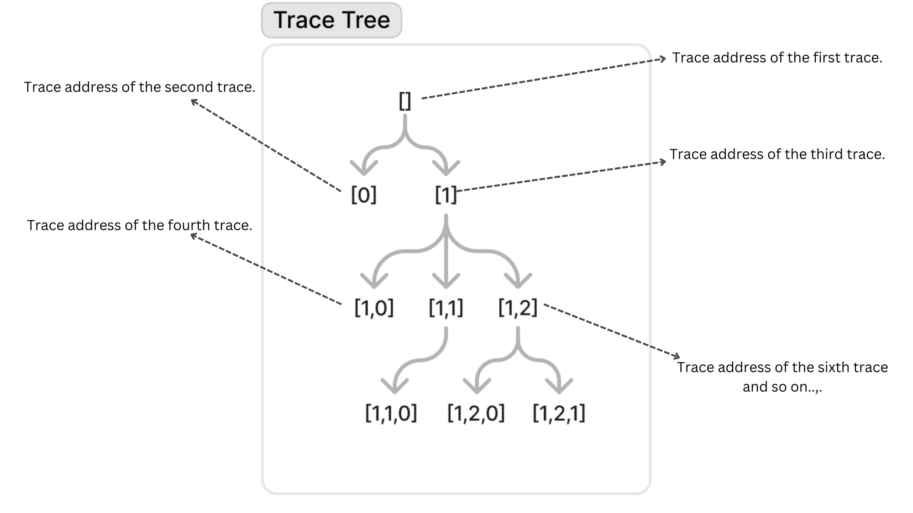
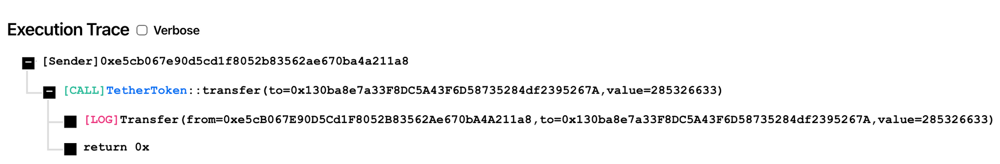
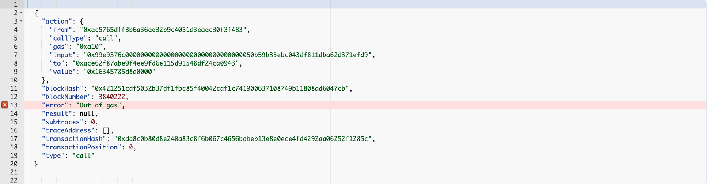

# Prerequisites

Before reading about EVM traces, you should have a clear understanding of [EVM](https://www.alchemy.com/overviews/what-is-the-ethereum-virtual-machine-evm), [Execution Clients](https://www.alchemy.com/overviews/execution-layer-and-consensus-layer-node-clients), [Smart Contracts](https://ethereum.org/en/developers/docs/smart-contracts/) and [Nodes](https://ethereum.org/en/developers/docs/nodes-and-clients/). You can read about these topics in the official [Ethereum documentation](https://ethereum.org/en/developers/docs/) or [Alchemy documentation](https://docs.alchemy.com/). However, if you just need a refresher, you can find the one-line definitions for these topics below.

* **Smart Contracts:** Smart contracts are self-executing contracts with the terms of the agreement written into lines of code. The code and the agreements contained therein exist across a decentralized, distributed blockchain network.
* **Execution Client:** An Execution/Ethereum Client is a software program that connects to the Ethereum network to enable users to interact with the Ethereum blockchain. Some popular Ethereum clients include Geth, Parity, and Erigon.
* **EVM:** The Ethereum Virtual Machine (EVM) is a turing-complete virtual machine that allows for the execution of smart contracts on the Ethereum blockchain. The EVM is responsible for processing and executing all of the transactions that occur on the Ethereum network.
* **Node:** An Ethereum node is a computer that runs an Ethereum Client and maintains the Ethereum blockchain.

# The Problem

There are two types of transactions in EVM-compatible protocols:

1. **Value Transfers:** A value transfer just moves the native blockchain currency (Ether in the case of Ethereum) from one account to another.
2. **Contract Executions:** A contract execution involves calling a function of the smart contract that can change the state of the contract and even call functions of other smart contracts.

The downside of the contract execution is that it is very hard to tell what the transaction actually did. When a transaction is executed, you can get a transaction receipt that contains a status code to check whether the execution succeeded or not, besides looking at EVM traces there is no way to see what data was modified, or what external contracts were invoked.

Look at the transaction flow below:



Here is the [Etherscan link](https://etherscan.io/tx/0x0d13800319458a403500d407226328bbedbd8a10ff3d26a18c67872ac1f94ea7) for the transaction defined above. This is a transaction in which a user (externally owned account) invokes a contract which in turn invokes another contract and this is how the transaction receipt for this transaction looks like:

<CodeGroup>
  ```json transaction-receipt.json
  {
    to: '0xdE8BFD2b6E8F765710198fd10E7e87757B959F84',
    from: '0x80b4f0bc53F620141C16Bd209269aeC0D72B22c4', 
    contractAddress: null, 
    gasUsed: BigNumber { _hex: '0x7f54', _isBigNumber: true }, 
    blockHash: '0x985ab37352c3c8765c6f7b480e07e1eadef6dd53c06fa25cf72394cb8eae34', 
    transactionHash: '0x0d13800319458a403500d407226328bbedbd8a10ff3d26a18c67872ac1f94ea7',
    blockNumber: 15095426, 
    confirmations: 768898,
    effectiveGasPrice: BigNumber { _hex: '0x0454f97690', _isBigNumber: true },
    status: 1,
  }
  ```
</CodeGroup>

<Info>
  You can get the transaction receipt for any transaction using the **[eth\_getTransactionReceipt](/reference/eth-gettransactionreceipt)** Alchemy API
</Info>

The transaction receipt has a couple of fields, let’s take a look at them one by one:

* `to`: The address the transaction is directed to. (In this case, Contract A address).
* `from`: Address of the caller (In this case, the user).
* `contractAddress`: If a new contract was created as part of this transaction then this field would have the address of the newly created contract, in this case, it is `null` because no new contract was created.
* `gasUsed`: Gas used for the execution of the transaction in big number format.
* `blockHash`: Hash of the block in which the transaction is included.
* `transactionHash`: The hash of the transaction itself. This is the unique identifier of the transaction.
* `blockNumber`: The block number in which the transaction is included.
* `confirmations`: The number of blocks that have been mined since the block containing the given transaction was mined.
* `effectiveGasPrice`: Gas price for the transaction.
* `status`: A status with the value `1` means that the transaction was successful while a value of `0` means that the transaction failed.

As you can see that the transaction receipt provides some information about the transaction but it does not tell that contract A further called contract B. This can be a problem depending on your use case. If you want information about all the steps involved in the transaction including calls to other contracts then transaction receipt will not be of much use to you. So how can this problem be solved?

# The Solution: EVM Traces

**EVM traces** provide a step-by-step record of what happened during the execution of a transaction, including which other contracts were invoked and what data was changed. They help give debugging information that can be used to troubleshoot issues with EVM-compatible smart contracts, which is useful for understanding why a contract behaved in a certain way, or for finding bugs.

When you trace a transaction you get back an array of objects also known as **EVM traces** for the transaction. Each step of the transaction is represented as an individual object in the array.

## Example

So, the EVM traces for [this](https://etherscan.io/tx/0x0d13800319458a403500d407226328bbedbd8a10ff3d26a18c67872ac1f94ea7) transaction which is also defined in "The Problem" section looks like this (We’ll learn how to retrieve EVM traces in a later section):

<CodeGroup>
  ```json evm-traces.json
  [
    {
      "action": {
        "from": "0x80b4f0bc53f620141c16bd209269aec0d72b22c4",
        "callType": "call",
        "gas": "0x7a37",
        "input": "0x",
        "to": "0xde8bfd2b6e8f765710198fd10e7e87757b959f84",
        "value": "0xb2ece213edb23a"
      },
      "blockHash": "0x985ab37352c3c8765c6f7b480e07e1eadef6dd53c06fa25cf72394cb8eae32b4",
      "blockNumber": 15095426,
      "result": {
        "gasUsed": "0x2d4c",
        "output": "0x"
      },
      "subtraces": 1,
      "traceAddress": [],
      "transactionHash": "0x0d13800319458a403500d407226328bbedbd8a10ff3d26a18c67872ac1f94ea7",
      "transactionPosition": 420,
      "type": "call"
    },
    {
      "action": {
        "from": "0xde8bfd2b6e8f765710198fd10e7e87757b959f84",
        "callType": "call",
        "gas": "0x8fc",
        "input": "0x",
        "to": "0xaf1931c20ee0c11bea17a41bfbbad299b2763bc0",
        "value": "0xb2ece213edb23a"
      },
      "blockHash": "0x985ab37352c3c8765c6f7b480e07e1eadef6dd53c06fa25cf72394cb8eae32b4",
      "blockNumber": 15095426,
      "result": {
        "gasUsed": "0x0",
        "output": "0x"
      },
      "subtraces": 0,
      "traceAddress": [
        0
      ],
      "transactionHash": "0x0d13800319458a403500d407226328bbedbd8a10ff3d26a18c67872ac1f94ea7",
      "transactionPosition": 420,
      "type": "call"
    }
  ]
  ```
</CodeGroup>

Here is an explanation of the above EVM traces (click on the image to zoom into it):



Each step of the transaction is represented as a separate **Trace** and each trace has its own fields. A lot of the fields are the same as the fields of the transaction receipt, such as `from`, `to`, `blockHash`, `blockNumber` and `transactionHash` but there are additional fields as well.

The **type** field defines the type of the given action/trace and the structure of the given trace depends on the type of the action. Let’s take a look at the types of trace actions and their structures.

## Types of Trace Actions

There are many types of actions captured in transaction traces: Some common actions are [CREATE](#create), [SUICIDE](#suicide) and [CALL](#call). Below you will find the structure for these trace actions.

### **`CREATE`**

Captured when a new smart contract is created.

**Structure**

* `action`

  * `from`: address that created the contract
  * `gas`: gas cost to create the contract
  * `init`: initialization code for creating the contract
  * `value`: value sent to contract

* `blockHash`: block hash the transaction was included in

* `blockNumber`: block number the transaction was included in

* `result`

  * `address`: address for contract created
  * `code`: code for contract created
  * `gasUsed`: gas used in contract creation

* `subtraces`: number of child traces of the given trace

* `traceAddress`: index for the given trace in the trace tree

* `transactionHash`: hash for the transaction

* `transactionPosition`: position (or index) of transaction in the block

* `type`: type of action, in this case, `CREATE`

**Example:**

<CodeGroup>
  ```json create-evm-trace.json
  {
      "action": {
        "from": "0x6090a6e47849629b7245dfa1ca21d94cd15878ef",
        "gas": "0x6a7f1",
        "init": "0x606060405260405160208061051683398101604052515b60028054600160a060020a03808416600160a060020a0319928316179092556000805433909316929091169190911790554260019081556005805460ff19169091179055346004555b505b6104a6806100706000396000f300606060405236156100885763ffffffff60e060020a60003504166305b34410811461008a5780630b5ab3d5146100ac57806313af4035146100be5780632b20e397146100dc5780633fa4f24514610108578063674f220f1461012a5780638da5cb5b14610156578063b0c8097214610182578063bbe427711461019c578063faab9d39146101b1575bfe5b341561009257fe5b61009a6101cf565b60408051918252519081900360200190f35b34156100b457fe5b6100bc6101d5565b005b34156100c657fe5b6100bc600160a060020a036004351661021d565b005b34156100e457fe5b6100ec6102c3565b60408051600160a060020a039092168252519081900360200190f35b341561011057fe5b61009a6102d2565b60408051918252519081900360200190f35b341561013257fe5b6100ec6102d8565b60408051600160a060020a039092168252519081900360200190f35b341561015e57fe5b6100ec6102e7565b60408051600160a060020a039092168252519081900360200190f35b341561018a57fe5b6100bc60043560243515156102f6565b005b34156101a457fe5b6100bc600435610382565b005b34156101b957fe5b6100bc600160a060020a0360043516610431565b005b60015481565b60055460ff16156101e65760006000fd5b600254604051600160a060020a039182169130163180156108fc02916000818181858888f193505050501561021a5761deadff5b5b565b60005433600160a060020a039081169116146102395760006000fd5b600160a060020a038116151561024f5760006000fd5b600280546003805473ffffffffffffffffffffffffffffffffffffffff19908116600160a060020a03808516919091179092559084169116811790915560408051918252517fa2ea9883a321a3e97b8266c2b078bfeec6d50c711ed71f874a90d500ae2eaf369181900360200190a15b5b50565b600054600160a060020a031681565b60045481565b600354600160a060020a031681565b600254600160a060020a031681565b60005433600160a060020a039081169116146103125760006000fd5b60055460ff1615156103245760006000fd5b8160045410156103345760006000fd5b6004829055600254604051600160a060020a039182169130163184900380156108fc02916000818181858888f193505050501580156103705750805b1561037b5760006000fd5b5b5b5b5050565b60005433600160a060020a0390811691161461039e5760006000fd5b60055460ff1615156103b05760006000fd5b6005805460ff1916905561dead6108fc6103e883810330600160a060020a031631025b604051919004801590920291906000818181858888f1935050505015156103fa5760006000fd5b6040517fbb2ce2f51803bba16bc85282b47deeea9a5c6223eabea1077be696b3f265cf1390600090a16102bf6101d5565b5b5b5b50565b60005433600160a060020a0390811691161461044d5760006000fd5b6000805473ffffffffffffffffffffffffffffffffffffffff1916600160a060020a0383161790555b5b505600a165627a7a72305820fbfa6f8a2024760ef0e0eb29a332c9a820526e92f8b4fbcce6f00c7643234b140029000000000000000000000000a7f3659c53820346176f7e0e350780df304db179",
        "value": "0xe4b4b8af6a70000"
      },
      "blockHash": "0x6d00f7707938cca36b0730d8f7f090543242002b6fa0fe94bf85b9ab02e6bed6",
      "blockNumber": 4000036,
      "result": {
        "address": "0xfc9779d9a0f2715435a3e8ebf780322145d7546e",
        "code": "0x606060405236156100885763ffffffff60e060020a60003504166305b34410811461008a5780630b5ab3d5146100ac57806313af4035146100be5780632b20e397146100dc5780633fa4f24514610108578063674f220f1461012a5780638da5cb5b14610156578063b0c8097214610182578063bbe427711461019c578063faab9d39146101b1575bfe5b341561009257fe5b61009a6101cf565b60408051918252519081900360200190f35b34156100b457fe5b6100bc6101d5565b005b34156100c657fe5b6100bc600160a060020a036004351661021d565b005b34156100e457fe5b6100ec6102c3565b60408051600160a060020a039092168252519081900360200190f35b341561011057fe5b61009a6102d2565b60408051918252519081900360200190f35b341561013257fe5b6100ec6102d8565b60408051600160a060020a039092168252519081900360200190f35b341561015e57fe5b6100ec6102e7565b60408051600160a060020a039092168252519081900360200190f35b341561018a57fe5b6100bc60043560243515156102f6565b005b34156101a457fe5b6100bc600435610382565b005b34156101b957fe5b6100bc600160a060020a0360043516610431565b005b60015481565b60055460ff16156101e65760006000fd5b600254604051600160a060020a039182169130163180156108fc02916000818181858888f193505050501561021a5761deadff5b5b565b60005433600160a060020a039081169116146102395760006000fd5b600160a060020a038116151561024f5760006000fd5b600280546003805473ffffffffffffffffffffffffffffffffffffffff19908116600160a060020a03808516919091179092559084169116811790915560408051918252517fa2ea9883a321a3e97b8266c2b078bfeec6d50c711ed71f874a90d500ae2eaf369181900360200190a15b5b50565b600054600160a060020a031681565b60045481565b600354600160a060020a031681565b600254600160a060020a031681565b60005433600160a060020a039081169116146103125760006000fd5b60055460ff1615156103245760006000fd5b8160045410156103345760006000fd5b6004829055600254604051600160a060020a039182169130163184900380156108fc02916000818181858888f193505050501580156103705750805b1561037b5760006000fd5b5b5b5b5050565b60005433600160a060020a0390811691161461039e5760006000fd5b60055460ff1615156103b05760006000fd5b6005805460ff1916905561dead6108fc6103e883810330600160a060020a031631025b604051919004801590920291906000818181858888f1935050505015156103fa5760006000fd5b6040517fbb2ce2f51803bba16bc85282b47deeea9a5c6223eabea1077be696b3f265cf1390600090a16102bf6101d5565b5b5b5b50565b60005433600160a060020a0390811691161461044d5760006000fd5b6000805473ffffffffffffffffffffffffffffffffffffffff1916600160a060020a0383161790555b5b505600a165627a7a72305820fbfa6f8a2024760ef0e0eb29a332c9a820526e92f8b4fbcce6f00c7643234b140029",
        "gasUsed": "0x52ce0"
      },
      "subtraces": 0,
      "traceAddress": [
        0
      ],
      "transactionHash": "0xc9601ea5ca42e57c3ef1d770ab0b278d6aadf2511a4feb879cba573854443423",
      "transactionPosition": 70,
      "type": "create"
    }
  ```
</CodeGroup>

Here is the [link](https://etherscan.io/tx/0xc9601ea5ca42e57c3ef1d770ab0b278d6aadf2511a4feb879cba573854443423) for the transaction on Etherscan whose example EVM trace is given above.

### **`SUICIDE`**

Captured when a smart contract is destroyed, which transfers the contract's current balance to a specified `address` and clear the contract's data, freeing up memory on-chain. The freed space on-chain is processed as a refund towards the total gas cost for completing the transaction.

**Structure**

* `action`

  * `address`: address of contract to destroy
  * `refundAddress`: address to send the remainder of the contract `balance` to
  * `balance`: remaining balance in the contract

* `blockHash`: block hash the transaction was included in

* `blockNumber`: block number the transaction was included in

* `result:` `null` for `SUICIDE` actions

* `subtraces`: number of child traces of the given trace

* `traceAddress`: index for the given trace in the trace tree

* `transactionHash`: hash for the transaction

* `transactionPosition`: position (or index) of transaction in the block

* `type`: type of the action, in this case, `SUICIDE`

**Example:**

<CodeGroup>
  ```json suicide-evm-trace.json
  {
      "action": {
        "address": "0x87051f6ba0562fdb0485763562bf34cb2ad705b1",
        "refundAddress": "0x000000000000000000000000000000000000dead",
        "balance": "0x0"
      },
      "blockHash": "0x6d00f7707938cca36b0730d8f7f090543242002b6fa0fe94bf85b9ab02e6bed6",
      "blockNumber": 4000036,
      "result": null,
      "subtraces": 0,
      "traceAddress": [
        1,
        2,
        2
      ],
      "transactionHash": "0xbc15addb97490a168dc1d099ab8537caf2e4ff7d1deeff6d685d2d594a750037",
      "transactionPosition": 45,
      "type": "suicide"
    },
  ```
</CodeGroup>

Here is the [link](https://etherscan.io/tx/0xbc15addb97490a168dc1d099ab8537caf2e4ff7d1deeff6d685d2d594a750037) for the transaction on Etherscan whose example EVM trace is given above.

### **`CALL`**

Used for transferring ETH between [externally owned accounts](/docs/web3-glossary#externally-owned-account) (EOAs) or to call a smart contract function.

**Structure**

* `action`

  * `from`: address of the sender

  * `callType`: type of `CALL`, can be any of the following:

    * `call`
    * `delegatecall`
    * `callcode`
    * `staticcall`

  * `gas`: gas included in the transaction

  * `input`: the specific function to call on the contract with parameters specified, encoded. For transfers to an EOA, `input` will be `0x`

  * `to`: address the transaction is directed.

  * `value`: the amount of value to be transferred

* `blockHash`: block hash the transaction was included in

* `blockNumber`: block number the transaction was included in

* `result`

  * `gasUsed`: gas used to execute the transaction
  * `output`: the result of the smart contract function call, encoded. For transfers to an EOA or smart contract, the `output` will be `0x`.

* `subtraces`: number of child traces of the given trace

* `traceAddress`: index for a given trace in the trace tree

* `transactionHash`: hash for the transaction

* `transactionPosition`: position (or index) of transaction in the block

* `type`: type of the action, in this case, `CALL`

**Example:**

<CodeGroup>
  ```json call-evm-trace.json
  {
      "action": {
        "from": "0xbc9f06dd67578b0b8b4d87fda9acde453bc4c067",
        "callType": "call",
        "gas": "0x97478",
        "input": "0xfebefd610000000000000000000000000000000000000000000000000000000000000040cc849afc28894f79411f12309e75c71ded27d1666b75a2423633c204e671cb1e00000000000000000000000000000000000000000000000000000000000000036eaec0ff7c4899bec2db1479d7d195d614ca26819a301523d82daaaaf436122d2ceb36dfa12b359202b4dfd756478988f5023bf7297afa81f563d4b6242e36e707671a8bf38ee483a37feca948997dcfba17b3372e166ba5c824629beeed6b5c",
        "to": "0x6090a6e47849629b7245dfa1ca21d94cd15878ef",
        "value": "0x2386f26fc10000"
      },
      "blockHash": "0x6d00f7707938cca36b0730d8f7f090543242002b6fa0fe94bf85b9ab02e6bed6",
      "blockNumber": 4000036,
      "result": {
        "gasUsed": "0x7ad71",
        "output": "0x"
      },
      "subtraces": 4,
      "traceAddress": [],
      "transactionHash": "0x552b31a3a9c92577d65db62cf9f729e81571e10cad90e356423adcfa2caebacc",
      "transactionPosition": 71,
      "type": "call"
    }
  ```
</CodeGroup>

Here is the [link](https://etherscan.io/tx/0x552b31a3a9c92577d65db62cf9f729e81571e10cad90e356423adcfa2caebacc) for the transaction on Etherscan whose example EVM trace is given above.

## How to read `traceAddress`?

Traces are structured in a tree format. This helps in better understanding the flow of the transaction. The `traceAddress` field represents the position of the given trace in the tree. An empty array represents the root of the tree (the first trace). Furthermore, traces which are captured due to the first trace have their `traceAddress` in \[0], \[1], \[2] etc. format.

Here is a diagram of `traceAddress` results to help understand how to read this position:



# Applications of EVM Traces

There are many use cases for EVM traces some of them are listed below:

### **Transaction Tracers**

Etherscan and other transaction tracers help us better understand the flow of a transaction. They extract the EVM traces for a transaction and display them in a way that’s readable by us. For example here is the result for a USDT transfer transaction trace:



As you can see it’s clear from the execution trace that the caller called the transfer function of the `TetherToken` contract and the contract transferred 285 USDT from the caller to the target address.

### **Debugging Transactions**

When a transaction fails, you can find the reason for the failure of the transaction using EVM traces. For example, in the trace image below you can see that the transaction failed due to an "Out of gas" exception, which means that there was not enough gas to complete the transaction.



Here is the [link](https://etherscan.io/tx/0xda8c0b80d8e240a83c8f6b067c4656babeb13e8e0ece4fd4292aa06252f1285c) to the above-defined transaction on Etherscan.

### **Contract Performance Analysis**

Transaction traces can be used to analyze the performance of smart contracts by looking at the number of actions it takes for each transaction to be processed. This information can be used to identify bottlenecks and optimize the contract for better performance.

# How to retrieve EVM traces?

There are several ways to retrieve EVM traces of a transaction.

1. **Using Alchemy APIs:** Alchemy manages trace-enabled nodes and offers API endpoints to collect transaction traces. This is the simplest way of retrieving EVM traces since running your own node requires a lot of resources and maintenance. You can either use the [Trace API](/reference/trace-api-quickstart) endpoints or the [Debug API](/reference/debug-api-endpoints) endpoints to get the transaction traces. For getting the transaction traces using a transaction hash, you can use the [trace\_transaction](/reference/trace-transaction) method.

2. **Replaying the transaction in a full/archive node:** Ethereum clients have methods that allow them to re-run transactions that have been executed previously. They collect traces from these transactions in order to get results. Even though it takes time to retrieve the results, nodes are not required to store the traces as long as they have enough information to run the transaction.

3. **Running an archive node with traces enabled:** Ethereum clients support running nodes with traces enabled. This allows nodes to store traces so that they can be retrieved quickly without having to re-execute the transaction. However, this comes at the expense of higher costs and slower node performance.

# Conclusion

In conclusion, EVM transaction traces are a valuable tool for debugging smart contracts. They provide a step-by-step record of the execution of a contract and can be used to identify errors and optimize code.
