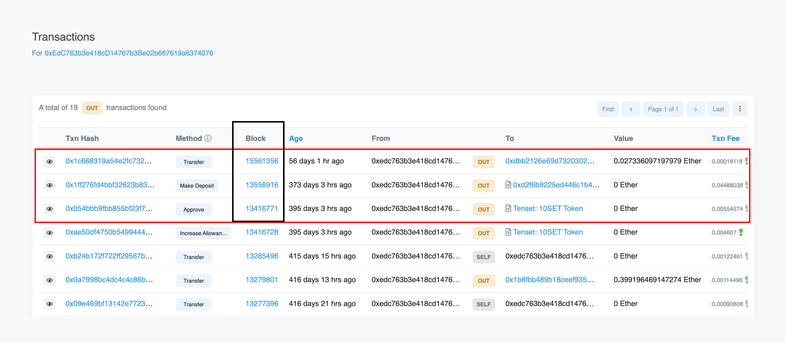

# What is trace\_filter?

Learn what the [trace\_filter](/reference/trace-filter) method is, how to use it on EVM blockchains, and test an example use case.

# Prerequisites

Before reading this article you should have a clear understanding of [EVM Traces](/reference/what-are-evm-traces).

# What is `trace_filter`?

`trace_filter` is an RPC method exposed by the Openethereum and Erigon [Ethereum clients](https://www.alchemy.com/overviews/execution-layer-and-consensus-layer-node-clients). It allows you to get the traces of multiple transactions in a single request based on the filters provided by you. You can specify the `from` and `to` block numbers, and the `from` and `to` addresses. This is useful for debugging purposes or for monitoring specific addresses.

## **Parameters**

1. `Object` - The filter object

   * `fromBlock`: `Quantity` or `Tag` - (optional) From this block.
   * `toBlock`: `Quantity` or `Tag` - (optional) To this block.
   * `fromAddress`: `Array` - (optional) Sent from these addresses.
   * `toAddress`: `Array` - (optional) Sent to these addresses.
   * `after`: `Quantity` - (optional) The offset trace number.
   * `count`: `Quantity` - (optional) Integer number of traces to return.

## Response

* `array` - Traces of transactions based on the given filters.

# How to use trace\_filter

To use the [trace\_filter](/reference/trace-filter) method [sign up for Alchemy](https://dashboard.alchemy.com/signup/?a=e8cafd6dd9) on the Growth tier, or [upgrade your account](https://dashboard.alchemyapi.io/settings/billing/?a=e8cafd6dd9).

You can call the `trace_filter` method by passing a filter object as a parameter to it. An example request and response are given below:

## Request

This request will return traces of all the transactions sent by [0xEdC763b3e418cD14767b3Be02b667619a6374076](https://etherscan.io/txs?a=0xEdC763b3e418cD14767b3Be02b667619a6374076\&f=2) address after the block number `0xccb942` (13416770).

<CodeGroup>
  ```curl cURL
  curl https://eth-mainnet.g.alchemy.com/v2/your-api-key/ \
    -X POST \
    -H "Content-Type: application/json" \
    --data '{"method":"trace_filter","params":[{"fromBlock":"0xccb942","toBlock":"latest","fromAddress":["0xEdC763b3e418cD14767b3Be02b667619a6374076"]}],"id":1,"jsonrpc":"2.0"}'
  ```

  ```javascript postman
  URL: https://eth-mainnet.g.alchemy.com/v2/your-api-key
  RequestType: POST
  Body: 
  {
      "jsonrpc":"2.0",
      "method":"trace_filter",
      "params":[{"fromBlock":"0xccb942","toBlock":"latest","fromAddress":["0xEdC763b3e418cD14767b3Be02b667619a6374076"]}],
      "id":1
  }
  ```

  ```javascript ethers
  const ethers = require("ethers");
  (async () => {
    const provider = new ethers.providers.JsonRpcProvider("https://eth-mainnet.g.alchemy.com/v2/your-api-key/");
    const trace = await provider.send("trace_filter", [
      {
        "fromBlock": "0xccb942",
        "toBlock": "latest",
        "fromAddress": ["0xEdC763b3e418cD14767b3Be02b667619a6374076"],
      },
    ]);
    console.log(trace);
  })();
  ```

  ```python web3py
  from web3 import HTTPProvider

  client = HTTPProvider('https://eth-mainnet.g.alchemy.com/v2/your-api-key/')
  result = client.make_request('trace_filter', [{
      "fromBlock": "0xccb942",
      "toBlock": "latest",
      "fromAddress": ['0xEdC763b3e418cD14767b3Be02b667619a6374076'],
  }])
  print(result)
  ```
</CodeGroup>

## Response

<CodeGroup>
  ```json response
  [
    {
      "action": {
        "from": "0xedc763b3e418cd14767b3be02b667619a6374076",
        "callType": "call",
        "gas": "0x8462",
        "input": "0x095ea7b30000000000000000000000007a250d5630b4cf539739df2c5dacb4c659f2488dffffffffffffffffffffffffffffffffffffffffffffffffffffffffffffffff",
        "to": "0x7ff4169a6b5122b664c51c95727d87750ec07c84",
        "value": "0x0"
      },
      "blockHash": "0x351e7c06ec010c8f7e7358eb580238dd23e1e129be96822aa93ebb6da08558e6",
      "blockNumber": 13416771,
      "result": {
        "gasUsed": "0x6009",
        "output": "0x0000000000000000000000000000000000000000000000000000000000000001"
      },
      "subtraces": 0,
      "traceAddress": [],
      "transactionHash": "0x054bbb9fbb855bf23f755e548c7409f45fc5eff8a824b2ad06380bc038d7b049",
      "transactionPosition": 54,
      "type": "call"
    },
    {
      "action": {
        "from": "0xedc763b3e418cd14767b3be02b667619a6374076",
        "callType": "call",
        "gas": "0x7063a",
        "input": "0x2440fdc2000000000000000000000000edc763b3e418cd14767b3be02b667619a6374076000000000000000000000000000000000000000000000000000000000000000600000000000000000000000000000000000000000000003753ab94a123aa7960",
        "to": "0xd2f6b9225ed446c1b445ac0656c8ccc97d096fb8",
        "value": "0x0"
      },
      "blockHash": "0xa6c8748136b5d22aabff34f71357f85911eddc5e772258f48d7d14fe30d2f87f",
      "blockNumber": 13556916,
      "result": {
        "gasUsed": "0x4926c",
        "output": "0x00000000000000000000000000000000000000000000000000000000000009f7"
      },
      "subtraces": 1,
      "traceAddress": [],
      "transactionHash": "0x1ff276fd4bbf32623b83653eb07352f76c5adf258d42190693d46669168b227a",
      "transactionPosition": 237,
      "type": "call"
    },
    {
      "action": {
        "from": "0xedc763b3e418cd14767b3be02b667619a6374076",
        "callType": "call",
        "gas": "0x0",
        "input": "0x",
        "to": "0xdbb2126e69d73203024002f427758557d2994c5e",
        "value": "0x611e091b07f64f"
      },
      "blockHash": "0x47b76a1db0bc39efc5f3fe9b2fe7975c4fbaa7de7f767a2cd4c345eac18a1e99",
      "blockNumber": 15561356,
      "result": {
        "gasUsed": "0x0",
        "output": "0x"
      },
      "subtraces": 0,
      "traceAddress": [],
      "transactionHash": "0x1c668319a54e2fc73241ae6f930deb824a34e48738e79cd8f5391e3c9ce0154f",
      "transactionPosition": 98,
      "type": "call"
    }
  ]
  ```
</CodeGroup>

As you can see that only three transactions are sent by this address after the block number `13416770`, that's why only three traces are returned in the response which are traces of these three transactions.



# Use Cases

The `trace_filter` method is useful for filtering traces based on certain criteria. You can use it to find traces that involve a particular address or to find traces that involve a particular contract.

An example is given above in the ["How to use trace\_filter"](#how-to-use-trace_filter) section where we filter the traces of all the transactions sent by an address after a particular block number.

# Conclusion

In conclusion, the `trace_filter` method is a valuable tool that can be used for monitoring the on-chain activity of addresses.
