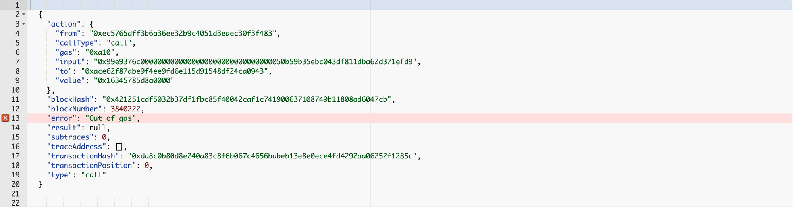
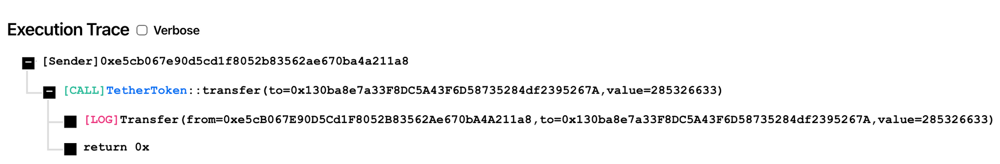

# What is trace\_transaction?

Learn what the [trace\_transaction](/reference/trace-transaction) method is, how to use it on EVM blockchains, and test an example use case.

# Prerequisites

Before reading this article you should have a clear understanding of [EVM Traces](/reference/what-are-evm-traces).

# What is `trace_transaction`?

`trace_transaction` is an RPC method exposed by the Openethereum and Erigon [Ethereum clients](https://www.alchemy.com/overviews/execution-layer-and-consensus-layer-node-clients). You can get the EVM traces of a previously executed transaction using this method. This can be useful for debugging purposes, or for understanding how a transaction works.

## Parameters

This method only takes one parameter which is the transaction hash of the transaction whose traces you wish to get:

1. `Hash` - Transaction hash

<CodeGroup>
  ```json params
  params: ["0x17104ac9d3312d8c136b7f44d4b8b47852618065ebfa534bd2d3b5ef218ca1f3"]
  ```
</CodeGroup>

## Response

This method returns the traces of the given transaction as a response:

* `array` - Traces of the given transaction

# How to use trace\_transaction

To use the [trace\_transaction](/reference/trace-transaction) method [sign up for Alchemy](https://dashboard.alchemy.com/signup/?a=e8cafd6dd9) on the Growth tier, or [upgrade your account](https://dashboard.alchemyapi.io/settings/billing/?a=e8cafd6dd9).

You can call the [trace\_transaction](/reference/trace-transaction) method by providing the transaction hash of the transaction you wish to trace. You can find this by looking up the transaction on a block explorer. Once you have the transaction hash, you can call the "trace\_transaction" method with it as follows:

## Request

<CodeGroup>
  ```curl cURL
  curl https://eth-mainnet.g.alchemy.com/v2/your-api-key \
  -X POST \
  -H "Content-Type: application/json" \
  -d '{"method":"trace_transaction","params":["0x17104ac9d3312d8c136b7f44d4b8b47852618065ebfa534bd2d3b5ef218ca1f3"],"id":1,"jsonrpc":"2.0"}'
  ```

  ```http postman
  URL: https://eth-mainnet.g.alchemy.com/v2/your-api-key
  RequestType: POST
  Body: 
  {
      "jsonrpc":"2.0",
      "method":"trace_transaction",
      "params":["0x17104ac9d3312d8c136b7f44d4b8b47852618065ebfa534bd2d3b5ef218ca1f3"],
      "id":1
  }
  ```

  ```javascript ethers.js
  const ethers = require("ethers");
  (async () => {
    const provider = new ethers.providers.JsonRpcProvider("https://eth-mainnet.g.alchemy.com/v2/your-api-key");
    const transaction = await provider.send("trace_transaction", [
      "0x3277c743c14e482243862c03a70e83ccb52e25cb9e54378b20a8303f15cb985d",
    ]);
    console.log(transaction);
  })();
  ```

  ```python web3py
  from web3 import HTTPProvider

  client = HTTPProvider('https://eth-mainnet.g.alchemy.com/v2/your-api-key/')
  result = client.make_request("trace_transaction", ["0x3277c743c14e482243862c03a70e83ccb52e25cb9e54378b20a8303f15cb985d"])
  print(result)
  ```
</CodeGroup>

## Response

<CodeGroup>
  ```json response
  {
    "jsonrpc": "2.0",
    "result": [
      {
        "action": {
          "callType": "call",
          "from": "0x83806d539d4ea1c140489a06660319c9a303f874",
          "gas": "0x1a1f8",
          "input": "0x",
          "to": "0x1c39ba39e4735cb65978d4db400ddd70a72dc750",
          "value": "0x7a16c911b4d00000"
        },
        "blockHash": "0x7eb25504e4c202cf3d62fd585d3e238f592c780cca82dacb2ed3cb5b38883add",
        "blockNumber": 3068185,
        "result": {
          "gasUsed": "0x2982",
          "output": "0x"
        },
        "subtraces": 2,
        "traceAddress": [],
        "transactionHash": "0x17104ac9d3312d8c136b7f44d4b8b47852618065ebfa534bd2d3b5ef218ca1f3",
        "transactionPosition": 2,
        "type": "call"
      },
      {
        "action": {
          "callType": "call",
          "from": "0x1c39ba39e4735cb65978d4db400ddd70a72dc750",
          "gas": "0x13e99",
          "input": "0x16c72721",
          "to": "0x2bd2326c993dfaef84f696526064ff22eba5b362",
          "value": "0x0"
        },
        "blockHash": "0x7eb25504e4c202cf3d62fd585d3e238f592c780cca82dacb2ed3cb5b38883add",
        "blockNumber": 3068185,
        "result": {
          "gasUsed": "0x183",
          "output": "0x0000000000000000000000000000000000000000000000000000000000000001"
        },
        "subtraces": 0,
        "traceAddress": [
          0
        ],
        "transactionHash": "0x17104ac9d3312d8c136b7f44d4b8b47852618065ebfa534bd2d3b5ef218ca1f3",
        "transactionPosition": 2,
        "type": "call"
      },
      {
        "action": {
          "callType": "call",
          "from": "0x1c39ba39e4735cb65978d4db400ddd70a72dc750",
          "gas": "0x8fc",
          "input": "0x",
          "to": "0x70faa28a6b8d6829a4b1e649d26ec9a2a39ba413",
          "value": "0x7a16c911b4d00000"
        },
        "blockHash": "0x7eb25504e4c202cf3d62fd585d3e238f592c780cca82dacb2ed3cb5b38883add",
        "blockNumber": 3068185,
        "result": {
          "gasUsed": "0x0",
          "output": "0x"
        },
        "subtraces": 0,
        "traceAddress": [
          1
        ],
        "transactionHash": "0x17104ac9d3312d8c136b7f44d4b8b47852618065ebfa534bd2d3b5ef218ca1f3",
        "transactionPosition": 2,
        "type": "call"
      }
    ],
    "id": 0
  }
  ```
</CodeGroup>

Here is the [link](https://etherscan.io/tx/0x17104ac9d3312d8c136b7f44d4b8b47852618065ebfa534bd2d3b5ef218ca1f3) to the transaction on Etherscan whose EVM trace is given above in the Response.

# Use Cases

### **Understanding/Debugging a transaction**

You can get the whole trace tree for a transaction and analyze what exactly happened during the transaction execution. The trace tree also returns the gas used for each action, the output values, and the revert reason (if the transaction failed). For example, in the trace image below you can see that the transaction failed due to an "Out of gas" exception, which means that there was not enough gas to complete the transaction.



Here is the [link](https://etherscan.io/tx/0xda8c0b80d8e240a83c8f6b067c4656babeb13e8e0ece4fd4292aa06252f1285c) to the above-defined transaction on Etherscan.

### **Transaction Tracers**

As you can get the traces for a previously executed transaction using `trace_call`, you can build transaction tracers like [txs.fyi](https://txs.fyi/) using it. Transaction tracers help us better understand the flow of a transaction. They extract the EVM traces for a transaction and display them in a way that’s readable by us. For example here is the result for a USDT transfer transaction on [txs.fyi](https://txs.fyi/eth/0x68ea69fd8b5dfa589a7a983c324ab153a33356320207885a9bba84425598dcaa).



As you can see it’s clear from the execution trace that the caller called the transfer function of the TetherToken contract and the contract transferred 285 USDT from the caller to the target address.

### **Contract Performance Analysis**

Transaction traces can be used to analyze the performance of smart contracts by looking at the number of actions it takes for each transaction to be processed. This information can be used to identify bottlenecks and optimize the contract for better performance.

# Conclusion

In conclusion, the `trace_transaction` method is a valuable tool for debugging transactions. It provides a step-by-step record of the execution of a transaction and can be used to identify errors and optimize code.
