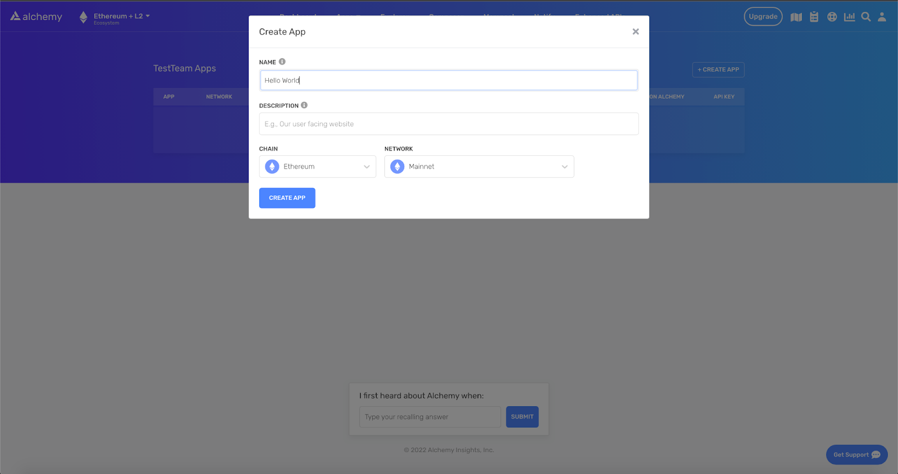

## What are WebSockets and how do they differ from HTTP requests?

WebSockets is a bidirectional communication protocol that maintains a network connection between two parties, typically a server and a client. Unlike HTTP, with WebSockets clients don't need to continuously make requests when they want information.

Instead, in an open WebSocket connection, a server can push network updates to clients by allowing them to subscribe to certain network states, such as new transactions or blocks being added to the blockchain.

This dramatically improves the efficiency of certain HTTP “push” network requests - instead of making an HTTP request every second to pull the latest data, the client can simply open a WebSocket connection and wait for the updates to arrive.

***

## How can I set up a WebSocket connection?

It’s quite simple to set up a new WebSocket connection to Ethereum - try the command below in your terminal.

<CodeGroup>
  ```shell shell
  wscat -c wss://eth-mainnet.g.alchemy.com/v2/demo
  ```
</CodeGroup>

If you’d like an endpoint with higher rate limits, sign up for a free Alchemy account, grab a new API key to replace the command above, and get access to over 300 million compute units for free per month.

In addition to Ethereum, Alchemy currently supports WebSocket connections to these EVM-compatible blockchains:

* [Polygon](/reference/eth-subscribe-polygon)
* [Optimism](/reference/eth-subscribe-optimism)
* [Arbitrum](/reference/eth-subscribe-arbitrum)
* [Astar](/reference/eth-subscribe-astar)

***

## How can I make WebSocket subscriptions for Ethereum blockchain updates?

Once you’ve run the command above, you’ll have an open WebSocket connection to an Ethereum node. To start/stop receiving push updates on certain state changes in the Ethereum network, you’ll need to send one of the following methods:

1. [eth\_subscribe](/reference/eth-subscribe)
2. [eth\_unsubscribe](/reference/eth-unsubscribe)

These two requests enable blockchain app developers to create and delete subscriptions. By setting their parameters properly, you’ll get push updates whenever new transactions are sent or new blocks are created.

Here’s an example of an `eth_subscribe` request:

<CodeGroup>
  ```json json
  // initiate websocket stream first 
  wscat -c wss://eth-mainnet.g.alchemy.com/v2/demo

  // then call subscription 
  {"jsonrpc":"2.0","id": 2, 
   "method": "eth_subscribe", 
   "params": ["alchemy_minedTransactions"]
   }
  ```
</CodeGroup>

Using Alchemy’s [Subscription API](/reference/subscription-api), there are five main types of WebSocket subscriptions you can make to receive push updates to an Ethereum node: ​

1. [alchemy\_minedTransactions](/reference/alchemy-minedtransactions): Emits full transaction objects or hashes that are mined on the network based on provided filters and block tags.
2. [alchemy\_pendingTransactions](/reference/alchemy-pendingtransactions): Emits full transactions that are sent to the network, marked as "pending", and are sent from or to a certain address. A custom Alchemy subscription.
3. [newPendingTransactions](/reference/newpendingtransactions)​: Emits transaction hashes that are sent to the network and marked as "pending". ​
4. [newHeads](/reference/newheads): Emits new blocks that are added to the blockchain.
5. ​[logs](/reference/logs): Emits logs attached to a new block that match certain topic filters.

## How can I make WebSocket subscriptions for transaction-specific updates?

It's no different from initiating a subscription using the base Ethereum websocket API. You can use the exact same commands as the ones introduced above. To start/stop receiving push updates on certain transaction changes (primarily confirmation of a pending transaction and confirmation that it has been fully mined), you’ll need to send either [eth\_subscribe](/reference/eth-subscribe) or [eth\_unsubscribe](/reference/eth-unsubscribe).

Here’s an example of an `eth_subscribe` request for transaction-specific data: NOTE: You can be very expressive with your transaction-specific data subscriptions and can either have unfiltered or highly filtered parameters

<CodeGroup>
  ```json json
  // initiate websocket stream first 
  wscat -c wss://eth-mainnet.g.alchemy.com/v2/demo

  // then call subscription 
  {
    "jsonrpc": "2.0",
    "method": "eth_subscribe",
    "params": [
      "alchemy_minedTransactions",
      {
        "addresses": [
          {
            "to": "0x9f3ce0ad29b767d809642a53c2bccc9a130659d7",
            "from": "0x228f108fd09450d083bb33fe0cc50ae449bc7e11"
          },
          {
            "to": "0xA0b86991c6218b36c1d19D4a2e9Eb0cE3606eB48"
          }
        ],
        "includeRemoved": false,
        "hashesOnly": true
      }
    ],
    "id": 1
  }
  ```
</CodeGroup>

***

## Reasons to Use HTTPS instead of WebSockets for JSON-RPC Node Requests

In general, the best practice that we recommend is that developers don’t send standard Ethereum JSON-RPC requests over WebSockets, and instead use HTTP(S) requests. Sending JSON-RPC requests over WebSockets may become unsupported in the future.

This is for four main reasons:

* Silent failures
* Load balancing
* Retries HTTP
* Status codes
* gZip compression

## 1. Silent failures

WebSockets client-side handling has many tricky edge cases and silent failure modes, which can make web3 dApp less stable.

## 2. Load balancing

When making requests to distributed systems such as Alchemy, individual HTTP requests are load-balanced to the fastest possible server.

When developers open a WebSocket connection, they incur additional latency by sending JSON-RPC requests only to a single node rather than the most available resource.

## 3. Retries

In most common request frameworks, support for retrying failed HTTP requests comes automatically and can be configured easily. Conversely, in WebSockets retrying failed requests typically requires custom JSON-RPC id-based tracking.

## 4. HTTP status codes

When web3 developers use WebSockets they won't receive HTTP status codes in WebSockets responses, which can be useful for debugging or sorting responses.

## 5. gZip Compression

To provide users with better product experiences, we updated our infrastructure serving HTTP requests to offer Alchemy developers **support for gzip compression on all responses larger than 1kb in size**.

In practice, we’ve seen roughly a **75% improvement in the total latency of typical JSON-RPC replayTransaction calls**.

Go to this article to learn how to implement gZip compression:

[](https://docs.alchemy.com/docs/how-to-enable-compression-to-speed-up-json-rpc-blockchain-requests)

[docs.alchemy.com](https://docs.alchemy.com/docs/how-to-enable-compression-to-speed-up-json-rpc-blockchain-requests)

[How to Enable Compression to Speed Up JSON-RPC Blockchain Requests](https://docs.alchemy.com/docs/how-to-enable-compression-to-speed-up-json-rpc-blockchain-requests)

***

## Conclusion

If you’re interested in getting pushed updates on the state of the Ethereum network and avoiding HTTP workaround strategies such as [long polling](https://www.educative.io/edpresso/what-is-http-long-polling), start using [WebSockets today](/reference/subscription-api) to streamline your request workflow!
