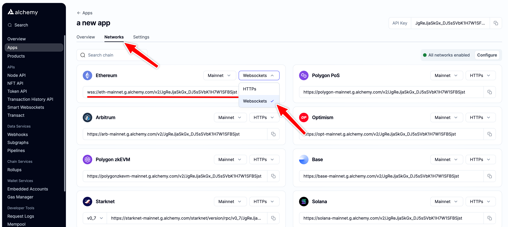

# Getting Started

There are two primary ways to use the Subscription API or WebSockets:

1. [Using the Alchemy SDK](/reference/alchemy-sdk-quickstart) (recommended)
2. [Using standard JSON-RPC methods](#using-json-rpc-requests-to-access-websockets)

# Subscription API Endpoints

For a full list of Subscription API endpoints and supported chains see the [Subscription API Endpoints](/reference/subscription-api-endpoints) doc, or if you're using the [Alchemy SDK](/reference/alchemy-sdk-quickstart) see [SDK WebSockets Endpoints](/reference/sdk-websockets-endpoints). Below are the subscription endpoints available and the corresponding docs for each of them.

<Info />

| Subscription Type                                                      | Description                                                                                                            |
| ---------------------------------------------------------------------- | ---------------------------------------------------------------------------------------------------------------------- |
| [alchemy\_minedTransactions](/reference/alchemy-minedtransactions)     | Emits full transaction objects or hashes that are mined on the network based on provided filters and block tags.       |
| [alchemy\_pendingTransactions](/reference/alchemy-pendingtransactions) | Emits full transaction objects or hashes that are sent to the network, marked as "pending", based on provided filters. |
| [newPendingTransactions](/reference/newpendingtransactions)            | Emits transaction hashes that are sent to the network and marked as "pending".                                         |
| [newHeads](/reference/newheads)                                        | Emits new blocks that are added to the blockchain.                                                                     |
| [logs](/reference/logs)                                                | Emits logs attached to a new block that match certain topic filters.                                                   |

# What are WebSockets and how do they differ from HTTP?

WebSockets is a bidirectional communication protocol that maintains a network connection between a server and a client. Unlike HTTP, with WebSockets clients don't need to continuously make requests when they want information.

Instead, an open WebSocket connection can push network updates to clients by allowing them to subscribe to certain network states, such as new transactions or blocks being added to the blockchain.

## Using JSON-RPC Requests to Access WebSockets

The `eth_subscribe` and `eth_unsubscribe` JSON-RPC methods allow you to access WebSockets.

To begin, open a WebSocket using the WebSocket URL for your app. You can find your app's WebSocket URL by opening the app's page in [your dashboard](https://dashboard.alchemy.com/?a=30fdcb2c1f) and clicking "View Key".

Note that your app's URL for WebSockets is different from its URL for HTTP requests, but both can be found in the app's "Network" tab.



Next, install a command line tool for making WebSocket requests such as [wscat](https://github.com/websockets/wscat), or to make requests from your project files instead of the command line, check out the [Alchemy SDK](/reference/sdk-websockets-endpoints). Using `wscat`, you can send requests as follows:

<CodeGroup>
  ```shell Shell
  $ wscat -c wss://eth-mainnet.ws.g.alchemy.com/v2/demo

  // create subscription
  > {"id": 1, "method": "eth_subscribe", "params": ["newHeads"]}
  < {"jsonrpc":"2.0","id":1,"result":"0xcd0c3e8af590364c09d0fa6a1210faf5"}

  // incoming notifications
  < {"jsonrpc":"2.0","method":"eth_subscription","params":{"subscription":"0xcd0c3e8af590364c09d0fa6a1210faf5","result":{"difficulty":"0xd9263f42a87",<...>, "uncles":[]}}}
  < {"jsonrpc":"2.0","method":"eth_subscription","params":{"subscription":"0xcd0c3e8af590364c09d0fa6a1210faf5","result":{"difficulty":"0xd90b1a7ad02", <...>, "uncles":["0x80aacd1ea4c9da32efd8c2cc9ab38f8f70578fcd46a1a4ed73f82f3e0957f936"]}}}

  // cancel subscription
  > {"id": 1, "method": "eth_unsubscribe", "params": ["0xcd0c3e8af590364c09d0fa6a1210faf5"]}
  < {"jsonrpc":"2.0","id":1,"result":true}
  ```

  ```javascript Alchemy SDK
  // Setup: npm install alchemy-sdk
  import { Alchemy } from "alchemy-sdk";

  // Optional config object, but defaults to demo api-key and eth-mainnet.
  const settings = {
    apiKey: "demo", // Replace with your Alchemy API Key.
    network: Network.ETH_MAINNET, // Replace with your network.
  };

  const alchemy = new Alchemy(settings);

  // Subscription for new blocks on Eth Mainnet.
  alchemy.ws.on("block", (blockNumber) =>
    console.log("The latest block number is", blockNumber)
  );

  // Subscription for Alchemy's pendingTransactions Enhanced API
  alchemy.ws.on(
    {
      method: "alchemy_pendingTransactions",
      toAddress: "vitalik.eth",
    },
    (tx) => console.log(tx)
  );
  ```
</CodeGroup>

<Warning>
  Though it's currently possible to send all your HTTP requests over Websockets, we discourage our developers from doing so. Instead, you should only send `eth_subscribe` and `eth_unsubscribe` requests to WebSockets.

  This is for several reasons:
</Warning>

# WebSocket Limits

The following limits apply for WebSocket connections:

* There is a limit of **20,000 WebSocket connections** per API Key as well as **1,000 parallel WebSocket subscriptions** per WebSocket connection, creating a maximum of **20 million subscriptions per application**.
* The maximum size of a JSON-RPC `batch` request that can be sent over a WebSocket connection is 20
* Free tier users will be limited to 10 concurrent requests per WebSocket connection.

***

# Error Codes

| Error Code | Error Message                                                                                                                | Solution                                                                                                                                                         |
| ---------- | ---------------------------------------------------------------------------------------------------------------------------- | ---------------------------------------------------------------------------------------------------------------------------------------------------------------- |
| `32600`    | `"The maximum batch size that can be sent over a websocket connection is 10. Please decrease the batch size and try again."` | Occurs when user attempts to send high-volume JSON-RPC traffic over Websockets. We recommend this traffic be sent over HTTP instead to optimize server backends. |

***

# Example Projects

* [How to Listen to NFT Mints](/docs/how-to-listen-to-nft-mints)
