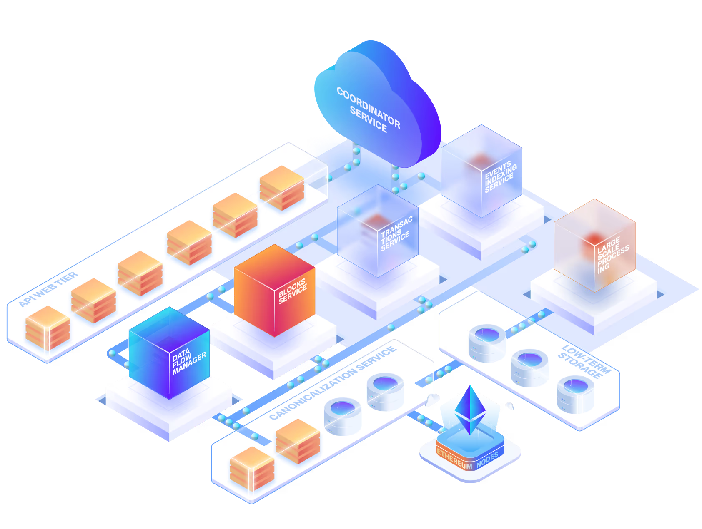

<h1>Alchemy Documentation</h1>
 
<h4 class="t-muted">All the resources you need to build onchain apps.</h4>
 
<a href="/get-started">
  <button id="get-started-button" class="fern-button filled gradient">
    Get Started
  </button>
</a>
 
 

  

    <SearchBar />
  

  

    
Popular searches

    <button class="fern-button minimal">Transfers API</button>
    <button class="fern-button minimal">How to send transactions</button>
    <button class="fern-button minimal">NFT smart contract</button>
  

<h2>What are you building?</h2>
 

<CardGroup cols={2}>
  

    <Card
      title="Build an onchain app"
      href="/"
    >
      Jump into building an app on our supported chains.
      
      
    </Card>
  

  

    <Card
      title="Build your own chain"
      href="/"
    >
      Deploy and get access to millions of developers.
      
      
    </Card>
  

</CardGroup>

<h2>Use cases for every builder</h2>
 

  <CardGroup cols={1}>
    <Card
      title="JSON RPC"
      icon={}
      href="/"
    >
      Use our Node API to start reading and writing to the blockchain—scale infinitely.
    </Card>
    <Card
      title="Onboard users"
      icon={}
      href="/"
    >
      Your complete toolkit to build embedded wallets—powered by smart accounts.
    </Card>
    <Card
      title="Stream events"
      icon={}
      href="/"
    >
      Get consistent push notifications and subscribe to ongoing onchain data.
    </Card>
    <Card
      title="Index data"
      icon={}
      href="/"
    >
      Ship faster with a custom API for your onchain data. Reduce data lag by up to 50%. Backfill data up to 5x faster.
    </Card>
    <Card
      title="Cheaper, faster, safer transactions"
      icon={}
      href="/"
    >
      Your complete toolkit to build embedded wallets—powered by smart accounts.
    </Card>
  </CardGroup>

