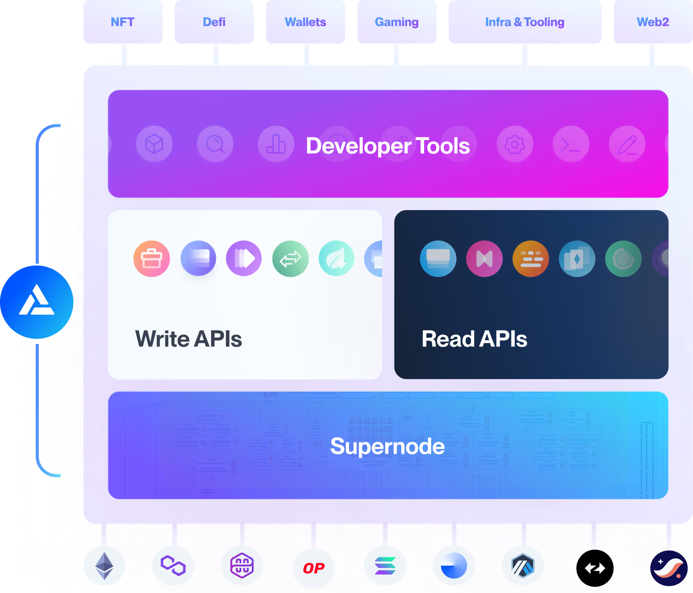
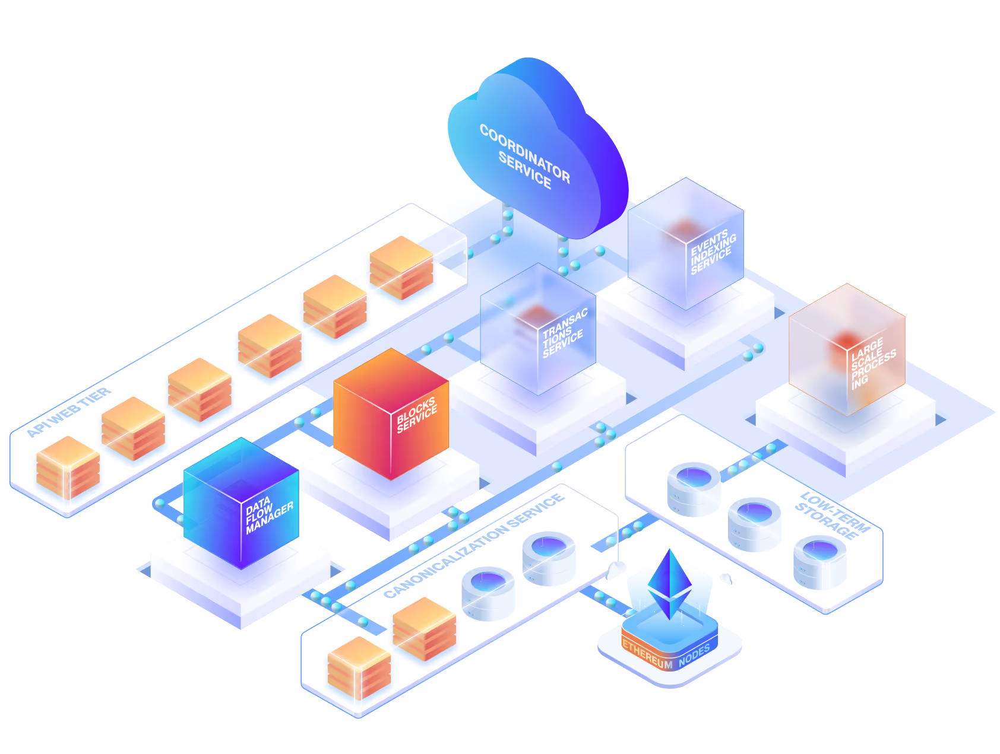

  

    

      

    

    <h1>Alchemy Documentation</h1>
    <h4 class="t-muted ">All the resources you need to build onchain apps.</h4>

    <a class="get-started-anchor" href="/reference/api-overview">
      <button id="get-started-button" class="fern-button filled">
        Get started
      </button>
    </a>

    

      

        <SearchBar />
      

      

        
Popular searches

        <a href="/reference/transfers-api-quickstart">
          Transfers API
        </a>
        <a href="/docs/sending-transactions">
          How to send transactions
        </a>
        <a href="/docs/how-to-create-an-nft">
          NFT smart contract
        </a>
      

    

  

  

    {/* <h2>What are you building?</h2>

        

          <CardGroup cols={2}>
            

              <Card
                title="Build an onchain app"
                href="/"
              >
                Jump into building an app on our supported chains.
                
              </Card>
            

            

              <Card
                title="Build your own chain"
                href="/"
              >
                Deploy and get access to millions of developers.

                
              </Card>
            

          </CardGroup>
        
 */}

    <h2>Use cases for every builder</h2>

    

      <CardGroup cols={1}>
        <Card title="JSON RPC" icon={} href="/reference/chain-apis-overview" className="flex-1 min-w-[200px] p-5 h-full flex flex-col text-left md:w-1/3 before:content-['🕐_5_min'] before:absolute before:top-4 before:right-4 before:bg-[#eff4f9] before:text-[#475569] before:px-2 before:py-1 before:rounded before:text-sm before:font-normal">
          Use our Node API to start reading and writing to the blockchain—scale infinitely.
        </Card>

        <Card title="Onboard users" icon={} href="/wallets">
          Bring everyone onchain with seamless email/social login or their existing web3 wallets.
        </Card>

        <Card title="Stream events" icon={} href="/reference/notify-api-quickstart">
          Get consistent push notifications and subscribe to ongoing onchain data.
        </Card>

        <Card title="Index data" icon={} href="/reference/subgraphs-quickstart/">
          Ship faster with an onchain data API. Reduce data lag by 50%. Backfill data up to 5x faster.
        </Card>

        <Card title="Cheaper, faster, safer transactions" icon={} href="/wallets/react/sponsor-gas">
          Power wallets with gasless, batched transactions and endless account programmability.
        </Card>
      </CardGroup>
    

  

