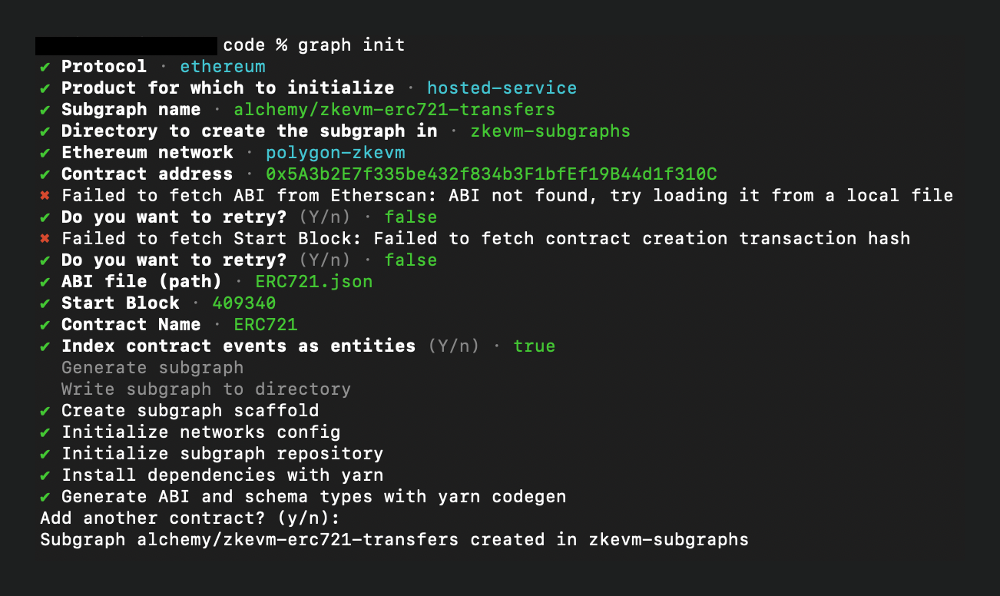

## Introduction

In this guide, we will walk you through the process of creating a simple subgraph hosted on the Alchemy Subgraphs platform and deployed for Polygon zkEVM. The subgraph will be a simple one that indexes an ERC-721 contract's [Transfer](https://docs.openzeppelin.com/contracts/2.x/api/token/erc721#IERC721-Transfer-address-address-uint256-) events - feel free to copy this same exact flow with a contract of your choice.

## Developer Environment

Before proceeding with the guide, ensure you meet the following requirements:

* **Node.js**: You must have Node.js version 18 or higher installed on your system. If you do not have Node.js installed, or if your version is lower than 18, you can download the latest version from the official website.
* Run `node -v` to verify.
* Install the [Graph CLI (graph-cli) NPM package](https://www.npmjs.com/package/@graphprotocol/graph-cli) globally by running `npm i -g @graphprotocol/[email protected]`.

## Step 1: Run the Subgraph CLI Wizard

Let's set up a local project to put together all the files that will be used to build and deploy our subgraph:

1. Navigate to a directory where you want to initialize your project

2. Make sure you have the [Graph CLI (graph-cli) NPM package](https://www.npmjs.com/package/@graphprotocol/graph-cli) installed globally. Run `npm i -g @graphprotocol/[email protected]`

   1. Run `graph` to verify you have this package installed

3. Create an `abis` folder in your project directory

4. Copy the contract ABI on [Etherscan](https://zkevm.polygonscan.com/address/0x5a3b2e7f335be432f834b3f1bfef19b44d1f310c) for the CrossChain NFT contract. Paste the ABI into a file called `cross-chain.json` within the `abis` folder

5. Run `graph init --from-contract 0x5A3b2E7f335be432f834b3F1bfEf19B44d1f310C --abi 'abis/cross-chain.json'` to initialize the package's CLI wizard and select the following options:

   1. **Protocol**: `ethereum`
   2. **Product for which to initialize**: `hosted-service`
   3. **Subgraph name**: `alchemy/zkevm-erc721-transfers`
   4. **Directory to create the subgraph in**: `zkevm-subgraphs`
   5. **Ethereum network**: `polygon-zkevm`
   6. **Contract address**: [0x5A3b2E7f335be432f834b3F1bfEf19B44d1f310C](https://zkevm.polygonscan.com/address/0x5a3b2e7f335be432f834b3f1bfef19b44d1f310c)
   7. **Start Block**: `409341` (manually fetched the block number from Polygonscan in which this contract was deployed)
   8. **Contract name**: `ERC721`
   9. **Index contract events as entities (Y/n)**: `y` (press Enter)
   10. Once the wizard process begins, you will be asked if you want to add another contract: `n`

The wizard will now finish the local subgraph build process. Once done, your terminal should look like this:



## Step 2: Set Up Your Local Files

> If you don't want to create a simplified version of this subgraph below, you are ready to deploy your subgraph to the Alchemy Subgraphs platform. Go to Step #4 if you want to skip the deep dive into the files of the project below.

First of all, make sure to navigate to the newly created project you just set up with Step #1:

1. Run `cd zkevm-subgraphs`
2. Open the folder in your preferred IDE and get familiar with the project files:


When building subgraphs, there are **three main files** you want to focus on before everything works properly:

1. **`schema.graphql` **: This file defines the GraphQL schema for your subgraph. The GraphQL schema is basically the data blueprint of what you want to index from the blockchain and in what format. The schema is used to define **entities**, which are used to generate the database and the GraphQL API, enabling developers to perform queries on the indexed data. **In blockchain subgraph land, typically entities are just what contract Events you want to index and how.**

> Entities are simply interfaces for the data you want to index. For example, if you are indexing NFT transfers, you can have an entity named `Transfer` with fields such as id, fromAddress, toAddress, tokenId, and timestamp.

2. **`subgraph.yaml`**(also referred to as the *subgraph manifest*): This file contains all of the key data regarding how the subgraph should be built. It references the entities defined in the `schema.graphql`. If you open the file in your local project, you'll notice it contains a lot of what you filled in during the wizard process like the contract `address` and `startBlock`. The manifest basically aggregates all of of your subgraph's most important data into one file.
3. **the `.ts` file inside `/src` that was auto-generated by the wizard process** (if you are following this guide, it is called `pudgy-penguins.ts`): This file contains the function handlers for your entities. When your subgraph indexes a new event, it will run the function, defined in this file, (and mapped to the entity in the `subgraph.yaml` file) to that entity.

<Info>
  Notice: the wizard process creates a `/abis` folder and automatically
  populates the contract `abi`, which you'll need. The file is called
  `PudgyPenguins.json` in this guide project.
</Info>

Ok, now that we've defined what the most important files in our project are, let's continue with the steps from above...

The wizard process, by default, sets you up with a fully loaded project correspondent to the smart contract you loaded. This means it will read the contract's ABI and create an entity for each of the contract's defined events. If you open the project's `schema.graphql` file, you'll notice all of the Pudgy Penguin NFT contract events defined as entities. This is great if you're building a wide-range app specific to Pudgy Penguins, but for our purposes let's keep things simple and only work with one entity: the `Transfer` entity.

3. Open the `schema.graphql` file and remove every entity except the `Transfer` entity. You can overwrite the file and copy-paste the following:

<CodeGroup>
  ```typescript Typescript
  type Transfer @entity(immutable: true) {
    id: Bytes!
    from: Bytes! # address
    to: Bytes! # address
    tokenId: BigInt! # uint256
    blockNumber: BigInt!
    blockTimestamp: BigInt!
    transactionHash: Bytes!
  }
  ```
</CodeGroup>

4. Save and close the file.
5. Now, open the `subgraph.yaml` file.

We want to remove everything that is not specific to the `Transfer` event of the Pudgy Penguins smart contract.

6. Remove any mentions of entities that aren't Transfer or overwrite the file and copy-paste the following:

<CodeGroup>
  ````typescript yaml specVersion: 0.0.5 schema: file: ./schema.graphql
  dataSources: - kind: ethereum name: ERC721 network: polygon-zkevm source:
  address: "0x5A3b2E7f335be432f834b3F1bfEf19B44d1f310C" abi: ERC721 startBlock:
  409340 mapping: kind: ethereum/events apiVersion: 0.0.7 language:
  wasm/assemblyscript entities: - Transfer abis: - name: ERC721 file:
  ./abis/ERC721.json eventHandlers: - event: Transfer(indexed address,indexed
  address,indexed uint256) handler: handleTransfer file: ./src/erc-721.ts
  ````
</CodeGroup>

> Notice, these are the same exact file contents as the boilerplate but we are just removing anything not specific to the `Transfer` entity.

7. Save and close the file.
8. Now, open the `erc-721.ts` file in the `/src` folder. Remove any function handlers non-specific to the `Transfer` event or overwrite the file and copy-paste the following:

<CodeGroup>
````Text Typescript
import { Transfer as TransferEvent } from "../generated/ERC721/ERC721";
import { Transfer } from "../generated/schema";

export function handleTransfer(event: TransferEvent): void {
let entity = new Transfer(
event.transaction.hash.concatI32(event.logIndex.toI32())
);
entity.from = event.params.from;
entity.to = event.params.to;
entity.tokenId = event.params.tokenId;

  entity.blockNumber = event.block.number;
  entity.blockTimestamp = event.block.timestamp;
  entity.transactionHash = event.transaction.hash;

  entity.save();
}
  ````
</CodeGroup>

9. Save and close the file. If you manually removed the function handlers, make sure to also remove any of the unused imports.

## Step 3: Build Your Subgraph

Now that we've got all of the important files sorted out, let's build our subgraph artifacts in order to get them ready to be deployed to the Alchemy Subgraphs platform! 🕺

1. In your project's root folder, run `graph codegen` (this will re-build and overwrite all of the boilerplate build files with our more refined and efficient subgraph specs specific to our NFT Transfers)

Your terminal should output the following:


When you run the command `graph codegen` and see the message `Types generated successfully` in your terminal, it means that The Graph CLI has successfully generated the necessary code based on your subgraph's GraphQL schema (defined in the `schema.graphql` file) and the ABIs of the smart contracts specified in your subgraph manifest (defined in the `subgraph.yaml` file). Overall, the command ensures that your mapping functions (defined in `src/erc-721.ts`) can interact with entity types in a type-safe manner.

2. Finally, run `graph build`

Your terminal should now output the following:


When you run the command `graph build`, your subgraph files are compiled, essentially acting as a final build check making sure that your schemas, manifest, and mappings are all correct and compatible. Without this final step, you will not be able to deploy your subgraph to the Alchemy Subgraphs platform.

## Step 4: Deploy Your Subgraph to Alchemy Subgraphs

This step is the easiest. 🥞 You'll now deploy the subgraph you built and compiled locally to be hosted on the [Alchemy Subgraphs](https://dashboard.alchemy.com/redirect/subgraphs) platform:

1. Acquire your unique `deploy-key` from the [Alchemy Subgraphs Dashboard](https://subgraphs.alchemy.com/dashboard) (you will need to log in with your Alchemy account)
2. You can use the `default` key provided to you or hit `+ Create Query Key` to create a new one.
3. Plug in your `deploy-key` where it says `COPY_PASTE_YOUR_DEPLOY_KEY_HERE` and then run the following in your terminal (paste it all as one command!):

<CodeGroup>
  ```shell Bash
  graph deploy zkevm-erc721-transfers \
    --version-label v0.0.1-new-version \
    --node https://subgraphs.alchemy.com/api/subgraphs/deploy \
    --deploy-key COPY_PASTE_YOUR_DEPLOY_KEY_HERE \
    --ipfs https://ipfs.satsuma.xyz
  ```
</CodeGroup>

<Info>
  Note: If you followed this guide exactly, you might get an output that
  indicates this subgraph has already been deployed!
</Info>

Your terminal should output the following: 👀


The key line you want to see in your terminal is: **[Deployed to link](https://subgraphs.alchemy.com/subgraphs/2695/versions/8572)**.

> You will need to sign in using your Alchemy account to view the subgraph dashboard!

When you visit the link (which you can share with your community or team of developers), you will get a dashboard loaded with all of the details you'll need about your newly-deployed subgraph:


<Info>
  If you get a "Network not supported" error please [reach out to us](/cdn-cgi/l/email-protection#2b585e5b5b44595f6b4a4748434e465205484446) to get Polygon zkEVM enabled for your account.

  
</Info>

Congrats! 🎉 You've just fully built a customized subgraph project and used it to deploy a live subgraph onto the Alchemy Subgraphs platform! ✅
