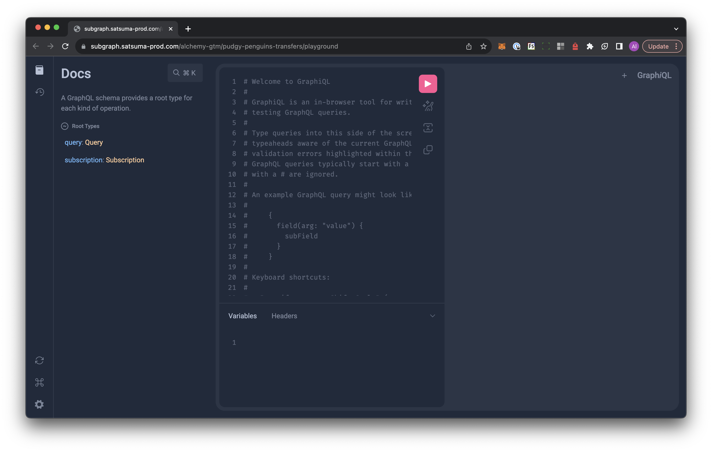

## Introduction

In this guide, we will walk you through the process of querying an already-deployed subgraph on the Alchemy Subgraphs platform. We will include a couple of simple queries to help you get an idea on the type of data you can get using subgraphs.

There are a couple of ways you can query a subgraph, we will cover using:

1. [Alchemy Subgraphs](https://subgraphs.alchemy.com/dashboard) GraphQL Playground
2. [Postman](https://www.postman.com/)

## 1. Using the Alchemy Subgraphs GraphQL Playground

1. Go to one of your deployed subgraphs in the [Alchemy Subgraphs Dashboard](https://subgraphs.alchemy.com/dashboard) and go to the `Playground` URL at the center-top of the page
2. Check out the GraphiQL interface. This playground let's you type in GraphQL-formatted queries and send them as a data request to the loaded subgraph.



3. Delete all of the comments so you have a clean input space to play with.
4. Copy-paste one of the following queries into the playground, then hit the Play button or press Ctrl + Enter (or Cmd + Enter on Mac) to execute the query:

## Sample Queries

If you are using the Pudgy Penguins Transfers subgraph you built in the previous guides, here are some queries you can make:

## Query to get the first 100 Pudgy Penguin transfers:

<CodeGroup>
  ```Text GraphQL
  {
    transfers(first: 100) {
      id
      from
      to
      tokenId
      blockNumber
      blockTimestamp
      transactionHash
    }
  }
  ```
</CodeGroup>

## Query to get all transfers from a specific address

<CodeGroup>
  ```Text GraphQL
  {
    transfers(where: { from: "0xSpecificAddress" }) {
      id
      from
      to
      tokenId
      blockNumber
      blockTimestamp
      transactionHash
    }
  }
  ```
</CodeGroup>

> You can try `0x29469395eAf6f95920E59F858042f0e28D98a20B` for the above query.

## Query to get all transfers related to a specific tokenId

<CodeGroup>
  ```Text GraphQL
  {
    transfers(where: { tokenId: "SPECIFIC_TOKEN_ID" }) {
      id
      from
      to
      tokenId
      blockNumber
      blockTimestamp
      transactionHash
    }
  }
  ```
</CodeGroup>

> You can try tokenId `3389` for the above query.

## 2. Using Postman

Postman is a great way to quickly test your subgraph and how a simple query looks like when the subgraph responds.

1. [Download](https://www.postman.com/downloads/) and open the Postman application
2. Select 'New' and select 'HTTP' from the query options.
3. Enter your subgraph's URL endpoint into the URL field.
4. In the 'Headers' tab, set the `Key` to `Content-Type` and the `Value` to `application/json`
5. In the 'Body' tab, select the `raw` radio button
6. Finally, enter your query as a JSON object in the `query`, you can use this one, for example, to get all the transfers on Pudgy Penguin 100:

<CodeGroup>
  ```Text JSON
  {
    "query": "query { transfers(where: { tokenId: \"100\" }) { id from to tokenId blockNumber blockTimestamp transactionHash } }"
  }
  ```
</CodeGroup>

7. Hit 'Send'

You should now see the data print in the Postman console! ✅
