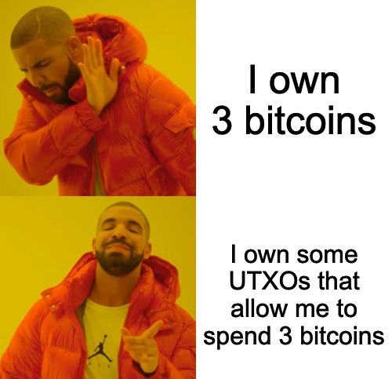

**Previous Section Recap**

In the previous section, we looked at \[peer-to-peer network architecture]\(), one of the main functional pillars of a decentralized distributed network like Bitcoin and \[Ethereum]\(). The traditional "web2" model, typically relies on server-based network architecture.

| Server-based                                                                                                                                                           | Peer-to-peer (p2p)                                                                                               |                                                     |
| ---------------------------------------------------------------------------------------------------------------------------------------------------------------------- | ---------------------------------------------------------------------------------------------------------------- | --------------------------------------------------- |
| Centralized, clients send a request, central server responds back                                                                                                      | Every node holds a copy of ledger, any node can read/write it under the right conditions (meets consensus rules) |                                                     |
| Developers and applications can be de-platformed (look up what happened to Zynga at Facebook!). Data integrity is vulnerable since server owner can manipulate at whim | Data integrity is protected by consensus rules. Everyone keeps copy of ledger, no central location.              | Very good privacy if user uses a new address per tx |
| Limits innovation                                                                                                                                                      | Permissionless innovation                                                                                        |                                                     |

Nodes in a blockchain peer-to-peer network, like Bitcoin, can leave and re-enter the network at will. Bitcoin has nodes including [full nodes](https://www.alchemy.com/overviews/what-is-an-ethereum-node) and [light nodes](https://www.alchemy.com/overviews/light-node).

* **full node**: contains [entire blockchain file](https://ycharts.com/indicators/bitcoin_blockchain_size).

* **light node**: does not require full blockchain file download, communicates with a full node to allow for lightweight clients to work (ie. wallets)

With traditional web2 server-based platforms, keeping track of user data and information is actually a lot easier than it is on the blockchain. This is because there is a single centralized server that stores the state of user accounts. There's no need for [consensus](/docs/what-are-blockchain-consensus-mechanisms) or resolving discrepancies since there's only one central place that stores information.

However, when you move to a decentralized system, [the problem of storing user balances becomes tricky](/docs/proof-of-work). Decentralized networks like Bitcoin and Ethereum need specific models for keeping track of the state of users. Bitcoin uses the **UTXO model** to keep track of user balances. Ethereum and other EVM chains use the **account model** to keep track of user balances. Let's dig in further...

<Info>
  UTXO stands for **Unspent Transaction Output**. You will see the term UTXO used a bit in this lesson! Bitcoin uses the UTXO model, so we like to include it because it helps us understand tradeoffs in blockchain storage models as well as it will help us compare and contrast to Ethereum and its use of the Account model.
</Info>

You thought we would already be learning [Solidity](/docs/solidity-syntax), huh? Ah well, we are starting from scratch and digging into the fundamentals of what makes blockchains tick. It is important to understand these concepts as they will make you a better-rounded [smart contract engineer](https://university.alchemy.com/ethereum). Let's dig in...

### Transactions

The best place to start, before looking at how blockchains keep track of user balances, is the place where user balances begin: the transaction. Let's explore with the following questions:

#### What do we need in a transaction?

Three main things:

1. **amount**: the amount to send to someone
2. **payer**: the person sending the transfer amount
3. **payee**: the person receiving the transfer amount

Since we are working in systems based on really secure [cryptography](/docs/public-key-cryptography), we need *ONE* more thing to complete everything required for a successful blockchain transaction:

4. **payer authorization**: some sort of unfakeable authorization given by the initiator of the transaction

This fourth item would just end up being the **digital signature** which is basically a hash that is extremely hard to replicate if you do not have the correct inputs - in this case, a user's private keys. Without the private keys, a payment authorization cannot occur. The only way to do it would be to "hack" basic cryptography which is practically impossible.

#### What is the purpose of a transaction?

To change some user state! If Alice sends Bob 5 $DAI, Alice's $DAI balance should go -5, Bob's should go +5. Alice's transaction is responsible for changing the state of their balances. Changing state is extremely important in blockchains (which are typically transaction-based networks!), so keep this in mind!

Bitcoin, Ethereum, and regular banks rely on transaction-based models to keep track of user balances. Let's take a further look below\...

### Account-based Model

If you have a bank account, you are very familiar with this model of keeping track of user balances. The account model follows just that: accounts. It tracks the balances of users based on their overall account state, without any tracking on what constitutes the actual balance itself. In other words, an account-based ledger would mark an entry like this:

```
Acct #12345 -> Name: Rick Sanchez -> Balance: $142.62
```

Notice how the state of the account is kept very high level? Rick's account balance is a dollar and cent amount and that's it. There is no further information tracked on what the breakdown of the balance is, for example: $142.62 is one $100 bill, one $20 bill, two $10 bills, eight quarters, five dimes, two nickels, two pennies. When Rick goes to an ATM and withdraws from his balance, he gets it in whatever bills + change the bank has at hand - not in the exact change it took to make up that balance in the first place.

#### What does a transaction look like in an account-based model?

1. Alice has $60 total balance.
2. Bob has $20 total balance.
3. Bob sends Alice $5.
4. Bob's balance is subtracted $5, if the remaining balance is greater than 0, proceed, else revert
5. Alice balance is summed at $5
6. The ledger is marked on both ends to update total balances and that is the end of the transaction in an account-based model.

This might seem weird. Why would we want to keep track of these details for something as simple as a total balance? We'll look at a model for keeping user balances that **does** include this feature: **the UTXO model**.

### UTXO-based Model

Ethereum uses the account-based model, while Bitcoin uses UTXOs (short for `Unspent Transaction Outputs`) to keep track of user state/balances.

The UTXO model differs *pretty drastically* from the account model. It's a little bit more complex - mainly because it is not a familiar interface like the account model is! Yet it does set up some interesting features...

### What is a UTXO? 🤔

Alice sends Bob 5 BTC in the form of a transaction relayed to the Bitcoin network. At this point, if the transaction is valid (Alice has > 5 BTC, Alice owns the relevant private keys and can produce a signature, etc), Alice is signaling an intent to change user state. When the Bitcoin network mines Alice's transaction, Bob is credited with a UTXO worth 5 BTC.

This is how the Bitcoin network keeps track of user balances - it keeps a really big long set of UTXOs - outputs out-of-state-changing transactions that credit users with a certain amount of BTC. So when people say: "I own 3 bitcoins", they should really be saying: "I own some UTXOs that allow me to spend 3 bitcoins." - or using the Drake meme:



Important notes on UTXOs:

1. All UTXOs are non-fungible (fun fact: the first NFT collection ever was... Bitcoin!)
2. To spend a UTXO, you must refer back to that *specific* UTXO.

> [A user's UTXOs are scattered across blocks](https://www.horizen.io/blockchain-academy/assets/post_files/technology/expert/4.1-utxo-vs-account/dag-vs-database_M.jpg).

3. Once a UTXO is "consumed", any leftover change from the transaction creates new UTXOs representing the change amounts
4. A UTXO, often referred to as a "coin", can only be spent ONCE. **No double-spending!**
5. In Bitcoin, each UTXO has a script associated with it

<Info>
  Scripts are basically hard-programmed code that each UTXO stores. They usually contain the conditions under which to unlock the UTXO for further spending. More resources on [Bitcoin Script](https://en.bitcoin.it/wiki/Script).
</Info>

### Account vs UTXO model

|                   | Accounts                                      | UTXOs                                                           |
| ----------------- | --------------------------------------------- | --------------------------------------------------------------- |
| **User Balances** | Overall Account State (ie. Alice has 4.2 ETH) | Specific UTXOs (ie. Alice has 29 UTXOs that amount to 2.65 BTC) |
| **Pros**          | More intuitive, easier to quickly understand  | Very good privacy if the user uses a new address per tx         |
| **Cons**          | Replay Attacks (someone could re-)            | UTXOs are stateless, which complicates state-heavy designs      |

### Conclusion

Deciding what model to go with is a game of design tradeoffs. [Ethereum's account-based transactions](/docs/how-ethereum-transactions-work) must be more flexible to account for the many moving pieces of state in the system. Bitcoin uses UTXOs as it is a network purposefully designed to be as simple and stateless as possible.

## Learn More About Blockchain Accounts

Alchemy University offers [free web3 development bootcamps that explain more about blockchain accounts](https://university.alchemy.com/ethereum) and help developers master the fundamentals of web3 technology. Sign up for free, and start building today!
