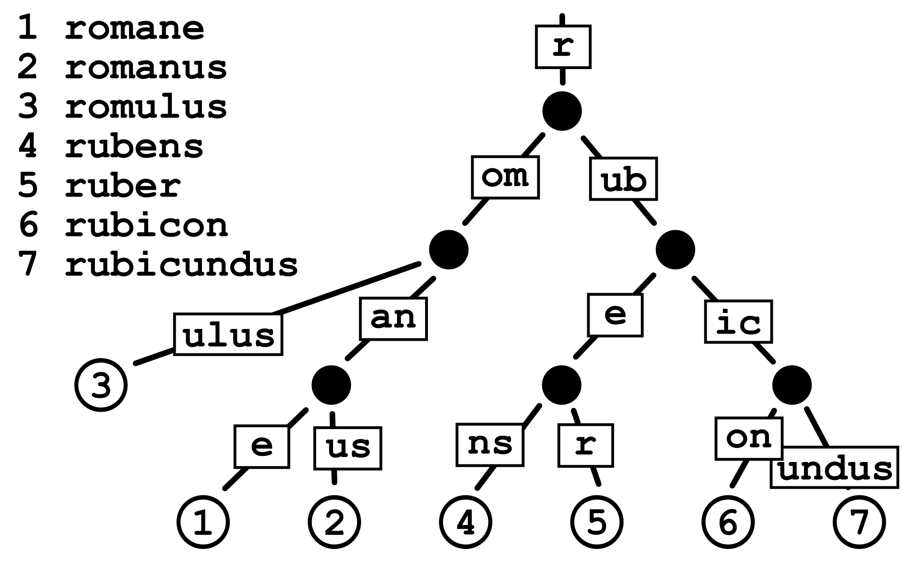
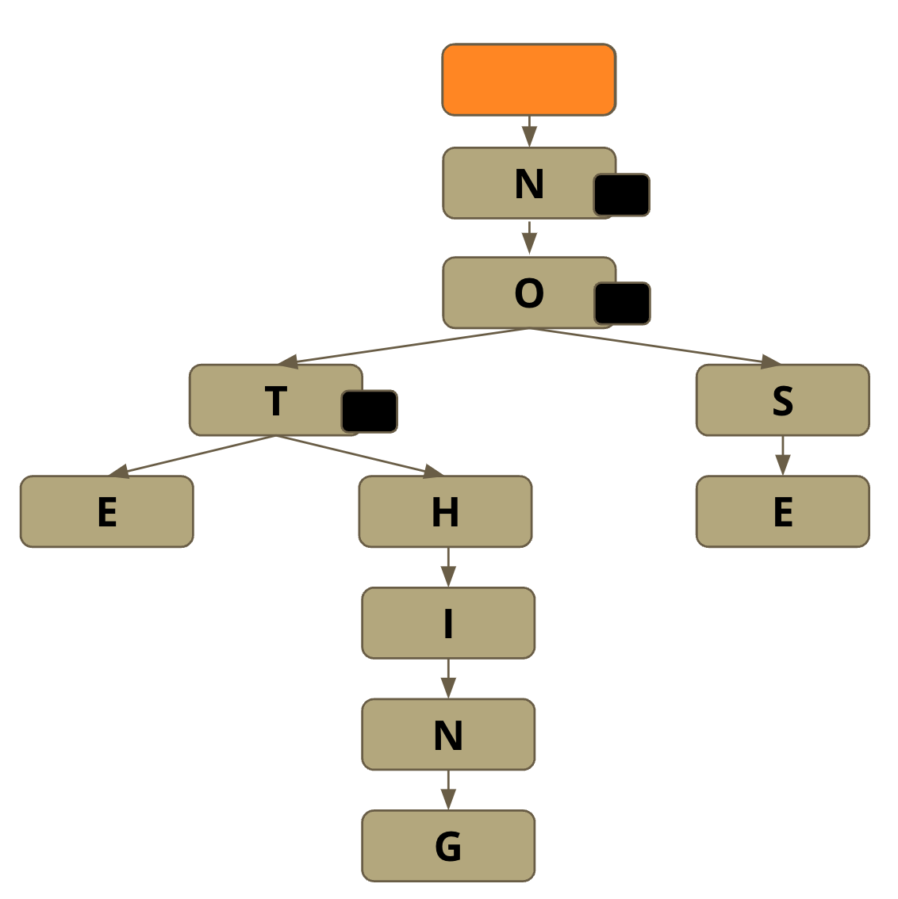
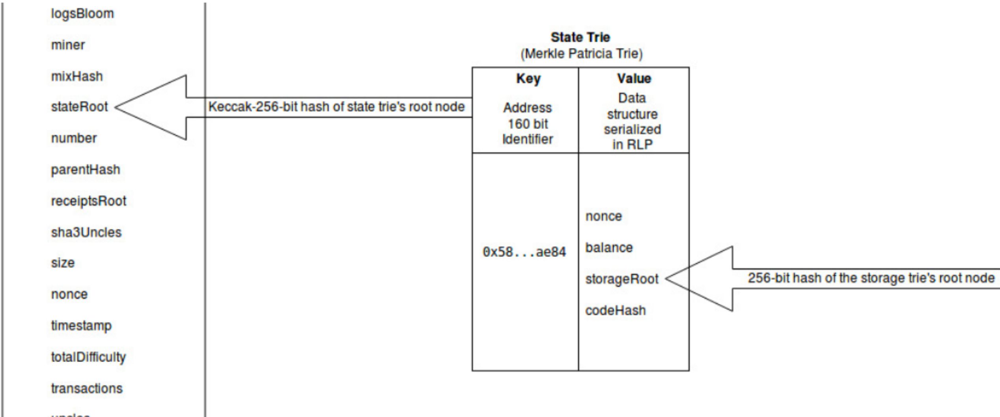
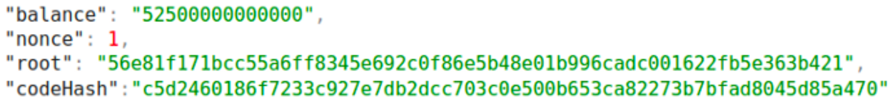
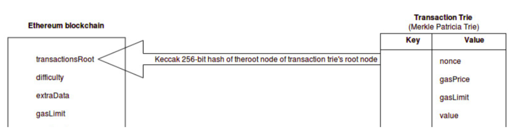
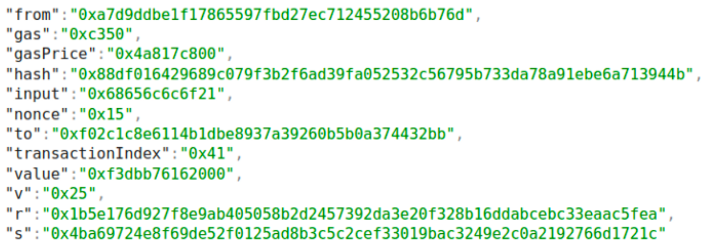
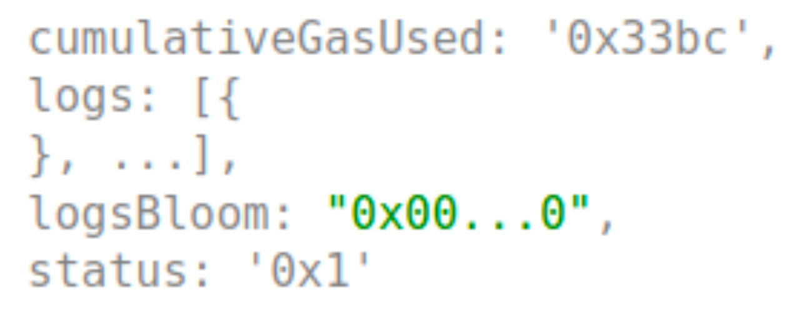
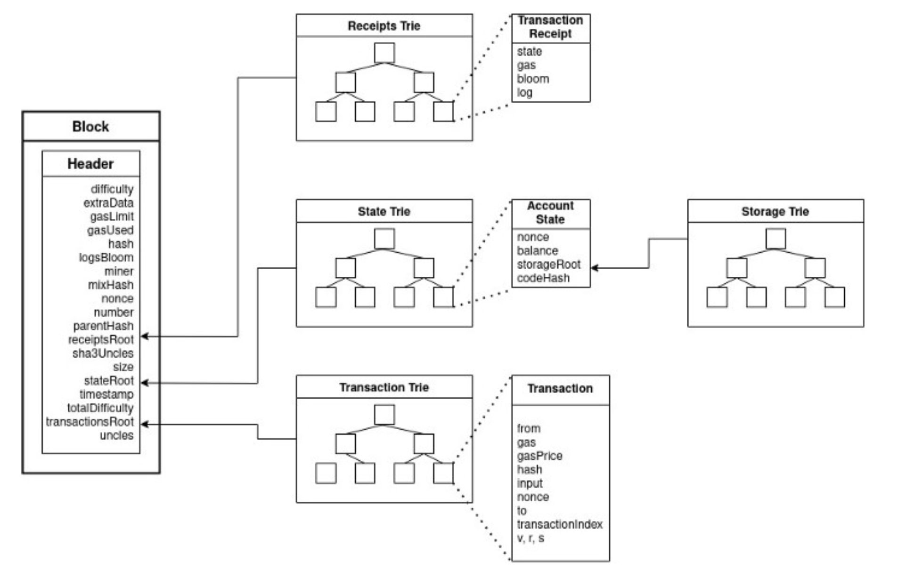

**Previous Section Recap**

In the previous section, we looked at Merkle trees, a tree data structure that provides an efficient way to verify that n exists in m.

Since Merkle trees are hash-based data structures, they inherit the [cryptographic properties](/docs/hashing-algorithm) of the hash functions themselves! Data integrity is strong because proofs are either right or wrong. You can't fool the cryptography!

Merkle trees are good for [blockchain](/docs/what-is-a-blockchain) scalability and decentralization. The less heavy in size a blockchain is, the easier it is for more people to run a node. Even then, a full node is not necessary all the time. Wallets are lightweight clients that use schemes like [SPV](https://en.bitcoinwiki.org/wiki/Simplified_Payment_Verification) to communicate with the blockchain via a [full node](/docs/what-are-blockchain-networks).

## Intro

Bitcoin was the first blockchain-based decentralized network ever. It popularized the use of Merkle trees for scalable transaction inclusion. Ethereum also uses Merkle trees but since Ethereum is a completely different design, it also uses one other important tree data structure for some of its data storage needs: **Patricia Merkle Tries**.

This is the last data structure-heavy day. If you've made it this far, you are doing fantastic! Patricia Merkle Tries are the first introduction to Ethereum-specific fundamentals, let's dive in...

### Review; Bitcoin: Block Architecture

{/*  */}

In the previous section, we covered how Merkle trees are used to efficiently record a large amount of transactions into blocks, without needing to actually include them all - the merkleRootHash is all that is needed to commit those transactions.

### First Look: Ethereum Block Architecture

Bitcoin's architecture is simple: it's a ledger that [keeps track of transactions using a UTXO model](/docs/utxo-vs-account-model). Since Ethereum keeps track of a larger amount of state data, the block architecture is completely different:

#### Why are you showing me block architectures, aren't we covering trees?

Well, because these blocks contain references to the tree data structures we are focusing on. The main goal here of showing the block architecture first is: by the end of this lesson, you should be familiar with three of the staple Ethereum block properties included in the diagram above: `State Root`, `Transaction Root`, `Receipt Root` - just like in the last section we covered what the `merkleRootHash` was in the context of a Bitcoin block, we will now look at three new similar tree uses in Ethereum.

> Woah, that's a lot of properties in an Ethereum block! Don't worry, we will cover these further in the bootcamp. We have to tackle the low-level ones first. ;)

### Review: Merkle Trees in Bitcoin

Merkle trees are fantastic for transactions. They are the perfect data structure. Transactions are static and should never change after being committed. They are "set in stone" via the Merkle hash root construction. Merkle trees are not a data structure fit for editing, so edit time -- how efficient it is to change a record -- does not matter here.

The main goal behind their usage is to prove the consistency of data as the blockchain grows. Thanks to Merkle trees, we can rest assured that a transaction existed at one point in time in a block. How? Just by constructing the Merkle proof! Not only this, Merkle proof construction is extremely efficient at scale since they are computationally fast to compute and require only small chunks of data to be communicated over the network.

### Trees in Ethereum

Ethereum makes use of a data structure called a [radix trie, also referred to as a Patricia trie or a radix tree](https://www.cs.usfca.edu/~galles/visualization/RadixTree.html) and combines this data structure with a Merkle tree to create a **Patricia Merkle Trie**.

<Info>
  Patricia Trie + Merkle Tree = Patricia Merkle Trie (pronounced either "tree"
  or "try")
</Info>

### Radix Trie

"Trie" comes from the word "retrieval", to give you a hint as to what Patricia Merkle Tries (also referred to as Patricia Merkle Trees 🎄) optimize for.

**A radix trie is a tree-like data structure that is used to retrieve a string value by traversing down a branch of nodes that store associated references (keys) that together lead to the end value that can be returned**:

<Info>
  In grouping associated keys together, our search for the end value is
  optimized and more efficient{" "}
</Info>

### Patricia Merkle Trees

A **Merkle Patricia trie** is a data structure that stores key-value pairs, just like a [hash table](https://en.wikipedia.org/wiki/Hash_table). In addition to that, it also allows us to verify data integrity and the inclusion of a key-value pair.

<Info>
  PMTs groups similar-value nodes together in the tree. That way, searching for
  "HELP" leads you along the same path as searching for "HELLO" - the first
  three letters are shared entries of different words. Good for space efficiency
  and read/write efficiency.
</Info>

Patricia Merkle Trees are basically Merkle trees on steroids! Efficient for data verification needs, but also efficient for editing that data.

#### Patricia??

* P = Practical
* A = Algorithm
* T = To
* R = Retrieve
* I = Information
* C = Coded
* I = In
* A = Alphanumeric

The root node of this PMT is empty so we can store other words not starting with ‘n’, like "apple" or "hello".

## Why Does Ethereum Use a Merkle Patricia Trie?

There are typically two different types of data:

* **Permanent**

  * Once a transaction occurs, that record is sealed forever
    * This means that once you locate a transaction in a block’s transaction trie, you can return to the same path over and over to retrieve the same result

* **Ephemeral**

  * In the case of Ethereum, account states change all the time! (ie. A user receives some ether, interacts with a contract, etc)
  * `nonce`, `balance`, `storageRoot`, `codeHash`

It makes sense that permanent data, like mined transactions, and ephemeral data, like Ethereum accounts (balance, nonce, etc), should be stored *separately*. Merkle trees, again, are perfect for permanent data. PMTs are perfect for ephemeral data, which Ethereum is in plenty supply of.

Unlike transaction history, Ethereum account state needs to be frequently updated. The balance and nonce of accounts is often changed, and what’s more, new accounts are frequently inserted, and keys in storage are frequently inserted and deleted.

## Ethereum Block Header

The block header contains many pieces of data. Remember back to [PoW Mining](/docs/proof-of-work)? The block header is the hash result of all of the data elements contained in a block. It's kind of like the gift-wrap of all the block data.

If you look at the Ethereum architecture diagram at the beginning of this lesson, the block header ends up hashing all of the data properties of the block. It also includes:

* **State Root**: the root hash of the state trie
* **Transactions Root**: the root hash of the block's transactions
* **Receipts Root**: the root hash of the receipts trie

## Ethereum: State Trie

As shown in the above diagram, **the state trie acts as a mapping between addresses and account states.**

It can be seen as a global state that is constantly updated by transaction executions The Ethereum network is a decentralized computer and state trie is considered hard drive All the information about accounts are stored in the world state trie and you can retrieve information by querying it.

#### Account Example

As mentioned above, the state trie is just a mapping that uses an address as the key and the account state (nonce, balance, etc) as the value returned.

This is what you would get back from a JavaScript request to the [Ethereum world state](/docs/what-is-ethereum). Just an object containing some data! That is all the account state is... but this is too much data to store in each block, so a root hash of it commits the data per block.

## Ethereum: Transaction Trie

**The transaction trie records transactions in Ethereum**. Once the block is mined, the transaction trie is *never* updated.

Each transaction in Ethereum records multiple pieces specific to each transaction such as `gasPrice` and `value`.

#### Transaction Example

You've probably seen this via services like Etherscan! All these services do is query the Ethereum blockchain for transaction data and then index it into an organized transaction viewer.

You can even try [querying the transactions](/docs/how-to-read-data-with-json-rpc) trie directly using [Alchemy Composer](https://composer.alchemy.com/). Just take a random tx hash and use the `eth_getTransactionByHash` method - you'll get a response looking much like the object in the picture above.

## Ethereum: Transaction Receipt Trie

**The transaction receipt trie records receipts (outcomes) of transactions.** Data including `gasUsed` and `logs` (events emitted are contained here!).

Once the block is mined, the transaction receipt trie is never updated.

#### Transaction Receipt Example

Try it out on the [Alchemy Composer](https://composer.alchemy.com/) - just make sure to change the method to `eth_getTransactionReceipt`.

## Conclusion

The above diagram is an excellent visualization of how the tries all end up being committed in every block via their root hash. The raw data is stored elsewhere in Ethereum, particularly [archive nodes](https://www.alchemy.com/overviews/archive-nodes).

Take a look back over the various architectures included in this lesson! Does the Ethereum block architecture diagram look less threatening? If so, good! We are learning as we go and we've just covered some of the lowest-level aspects of Ethereum data storage. Very few people learn these fundamentals. These are super important! Not only does learning them give you a more holistic understanding of Ethereum, this is knowledge applicable in all of computer science and even physics 🤯.

The important takeaway of this lesson is to understand why the low-level data structures used by Ethereum are used: to optimize data space and read/write efficiency.

## Learn More About Ethereum

Alchemy University offers [free web3 development bootcamps that explain Ethereum's block composition](https://university.alchemy.com/ethereum) and help developers master the fundamentals of web3 technology. Sign up for free, and start building today!
