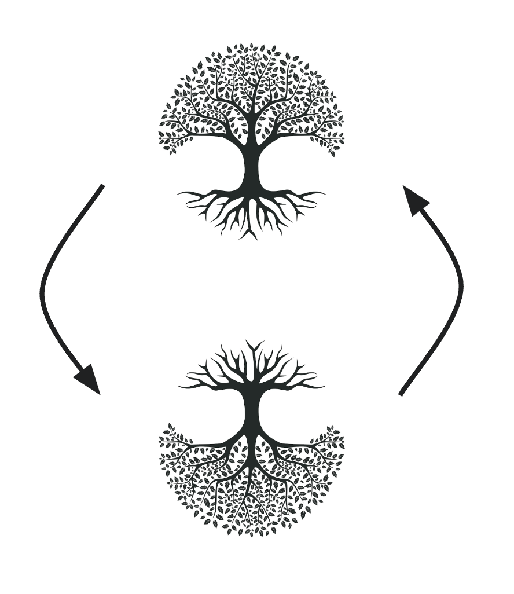
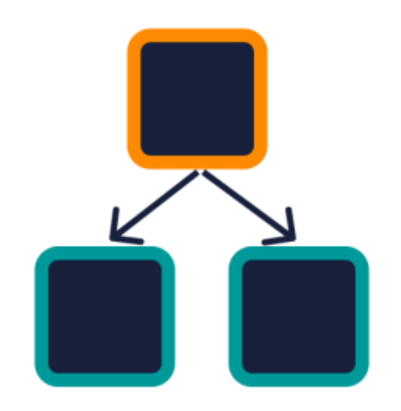
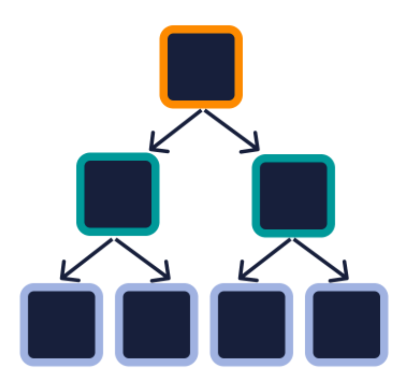
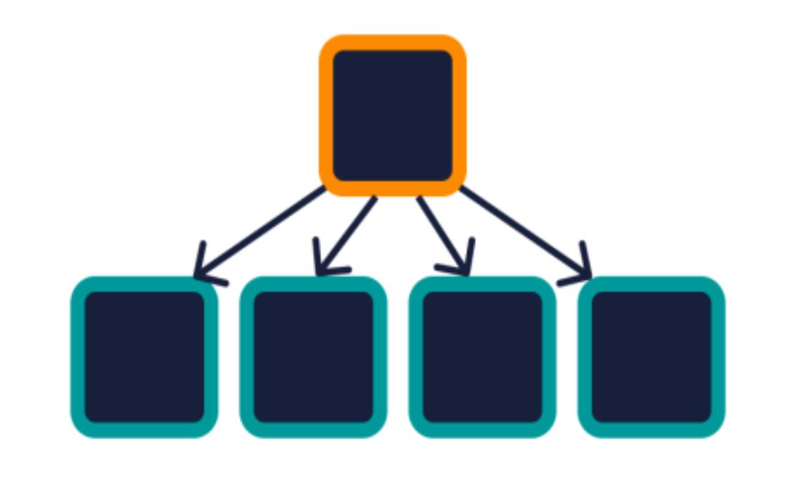
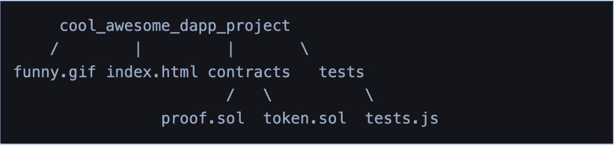
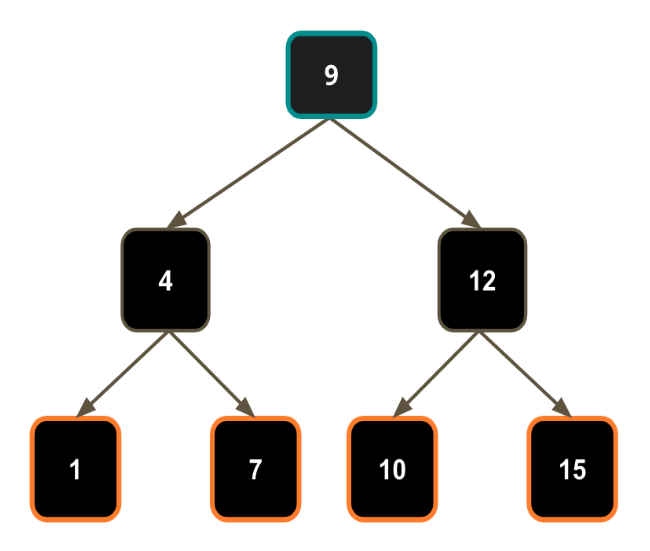
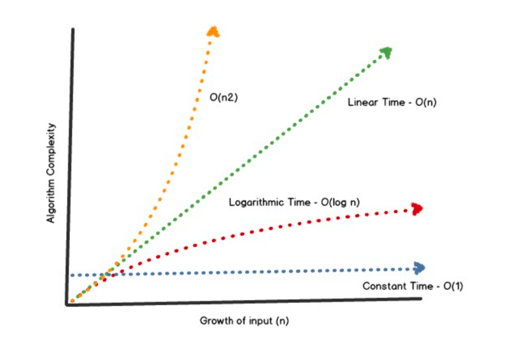

**Previous Section Recap**

In the previous section, we looked at how Bitcoin and Ethereum keep \[track of user balances]\():

* **Account-based Model**:

  * Used by [Ethereum](/docs/what-is-ethereum); we are familiar with this model since traditional banks also use it
  * Keeps track of an overall user state which includes balance (ie. Alice has $17.76)

* **UTXO** (Unspent Transaction Outputs): - Cash-like system of balance tracking used by Bitcoin - All the UTXOs are stored in a [global UTXO set](https://www.blockchain.com/explorer/charts/utxo-count)

### Intro

[Blockchain networks](/docs/what-are-blockchain-networks) use transactions to change state and keep track of user balances, as we saw in the previous section. Let's dig even further into the complexity of these systems and start looking at what data structures they use to store all this changing state data.

### An Orientation to Trees

First things first, computer scientists are weird. They like to draw trees **upside down**.



Just like in real life, there are many kinds of trees, there are many tree-like data structures in computer science. Let's familiarize ourselves with a few of these trees.

> Make sure to take a close look at the **bolded terms**, as they are very important vocabulary to learn for blockchains in general!

The first term you will see widely used in data structures: nodes. A **node** is a basic unit of a data structure.

<Info>
  In computer systems, "node" can also refer to network nodes communicating data
  on a peer-to-peer network (which Bitcoin and Ethereum are!). Context is
  important!
</Info>

### Simple Tree



The top, orange node is referred to as the **parent** while the bottom green nodes would be referred to as the **children** (relative to the parent node)

### Binary Tree



It is typical to see some enforcement property before "tree" to distinguish different types of tree data structures. A tree is considered **binary** when each parent has *at most* two children. The key word in this tree is **binary** - it, like other preceding terms to "tree", sets some type of rule for the tree - in this case, that each parent node can have at most two children.

> Notice the tree in the diagram above now has four new gray *nodes*. These would now be referred to as the **leaves** since they are the last level of the tree and have no further children.

### Tree



The tree above shows that a tree can be any parent with any number of children. There doesn't have to be any enforcement on the tree, it just is a tree of data.

> You will see a pattern emerge where the word "tree" is usually preceded by some term that tells you what types of rules that tree will enforce. A binary tree enforces the rule that parents can have at most two children. A tree... is just a tree! Trees don't necessarily have to come

Enforcement allows people to more efficiently work with data since they know a tree will have certain rules enforced - but, the point is, a tree can just be... a tree!

### Tree vs. Linked List

A linked list is also a tree - just a really long one that only has one child per parent in a long continuous chain. A tree is not necessarily a linked list. Here are the two code implementations for a `LinkedListNode` and a`TreeNode` to help distinguish:

<CodeGroup>
  ```js js
  class LinkedListNode {
          constructor(data) {
              this.data = data;
              this.next = null;
          }
  }

  class TreeNode {
  constructor(data) {
  this.data = data;
  this.children = [];
  }
  }

  ```
</CodeGroup>

Notice the `TreeNode` holds the typical `data` and an array to contain references to any children of that (parent) node.

The `LinkedListNode` just keeps track of a `next` node.

### Tree Vocabulary Summary


Take note of all of the relativity that happens as a tree grows in size. A node that was a `leaf node` becomes a `parent node` once a new child is added under it.

Final vocabulary for trees:

* **key**: actual data held inside `node`
* **root**: the parent node in a tree
* **siblings**: nodes under the same parent and on the same level
* **subtree**: once you isolate a part of a broader tree, you can form a brand new tree with new relationships

### When To Use a Tree 🌲

Sometimes trees occur quite naturally! Take a file system for example:



<Info>A file system can be a tree with an arbitrary amount of children in each directory </Info>

Tree usage:

* If your data can be stored hierarchically, using a tree can be a good data structure to go with.
* A tree is also a very efficient data structure for the searching and sorting of data
* Recursive algorithms are often used in conjunction with trees

Trees can be very efficient data structures for searching/sorting data precisely because of the rules it sets, like being a binary tree or an even stricter rule set, a **binary search tree**.

### Binary Search Tree



A **binary search tree**, like the one above has the following properties:

* it is a **binary tree**
* the **left subtree** of a node contains only nodes with keys **lesser than** the node's key
* the **right subtree** of a node contains only nodes with keys **greater than** the node's key
* each node’s left and right subtrees must also be a **binary search tree**

These types of enforcements make a binary search tree a highly in-demand data structure, since algorithms can now account for these rules and storing/searching is made much more efficient!

### Binary Search Tree Trivia

#### Knowing that each left child is less than the parent and each right child is greater than the parent, how many attempts does it take you to find a number (key) at most?

Adding a whole new layer of elements adds **only 1 more search attempt at worst**. Because of the BST (short for **Binary Search Tree**) enforcement properties, the search time always remains O(log n) where `n` is the number of nodes in the tree.

The tree in the diagram above is a BST of a **height**, how many levels a tree has, of three, with nodes held at each level that increase in number by a power of two each level down. The last level contains 4 nodes which means the next level under that will contain 8 nodes (at most). Here is the real magic of enforced-property trees like BSTs: even though we add a whole new level of new data, the search time only increases by *one*. In other words, as the size of the tree grows at an exponential, the search time always remains O(log n).

Here is a chart to visualize how much algorithm search time is affected by the growth of input (n).



Since blockchains are basically databases, Big O analysis is very important to help choose the most efficient data structure (low storage costs, easy search, and retrieval). When designing a system with data needs, you want your data structure to be as close to **Constant Time** (the blue line on the chart) as possible.

Big O Notation gives us a rough indicator of how well an algorithm will perform in terms of N (# of input elements). We want our algorithms to be efficient.

## Conclusion

We covered basic tree data structures, different types of enforcements on trees, and general tree data structure vocabulary. This is all important information as we dive even deeper into more specific trees with more specific enforcements on them. In the next section, we'll look at **Merkle Trees**.

As a heads up for the next **two** sections, blockchains use tree data structures quite heavily... buckle up... it's TREE TIME.

## Learn More About Blockchain Data Structures

Alchemy University offers [free web3 development bootcamps that explain blockchain data structures](https://university.alchemy.com/ethereum) and help developers master the fundamentals of web3 technology. Sign up for free, and start building today!
